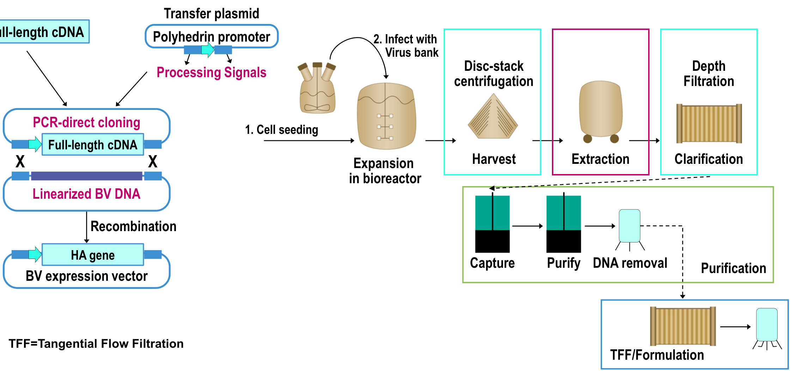
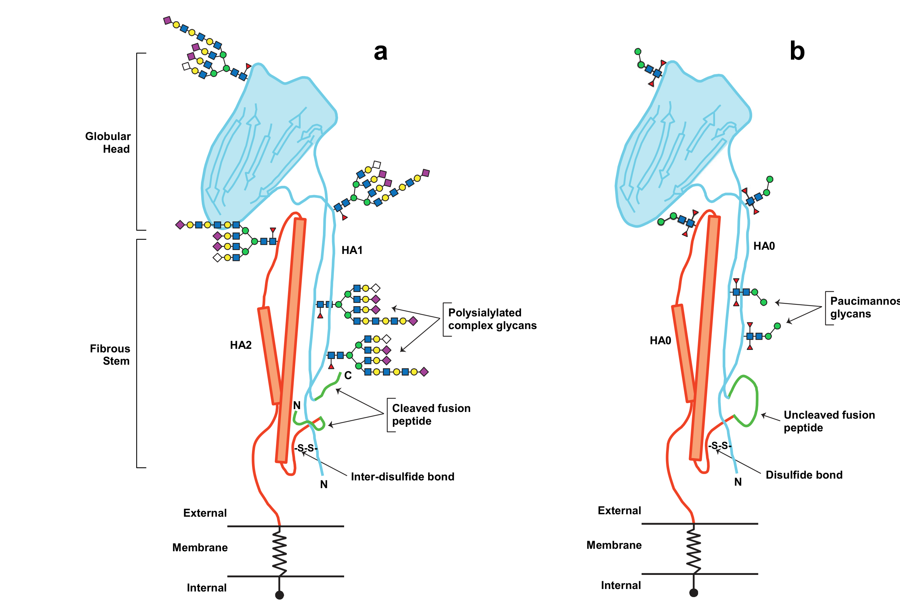

# Extracted Document

**Source:** data/clinical_files/Arunachalam et al. (2021).pdf

**Pages:** 8

---

## Page 1

### ,
g
host cell entry and mediates the fusion of the viral envelope to the
late endosomal membrane. Neutralising antibodies that block HA
effectively prevent viral entry into target cells and have been
shown to protect the host from infection10,11. Another viral surface
t i
i id
(NA)
l
i li
id
d
l
g
p
The annual production of influenza vaccine through conv
tional, mostly egg-based platforms, is arduous and a ra
against-time21. The production process, from the selection
influenza
strains
to
vaccine
manufacture
and
release
di t ib ti
t k
i ht t
i
th
h
A il
li

p
p
g
thus a key vaccine target. Expressed as trimeric glycoproteins

oung children and adults aged 65 and older1,2,4. Extra-pulmonary
omplications of influenza infection constitute a further under-
ecognised disease burden4,5. Overall, such a high disease burden
arries substantial social and economic cost6,7. Prevention of
easonal influenza epidemics, as well as preparedness for future
andemics, is thus a global priority.
Influenza A subtypes H1N1 and H3N2, and influenza B lineages
/Yamagata and B/Victoria circulate routinely in humans and are
ncluded in seasonal influenza vaccines8. Influenza A subtypes can
so give rise to highly pathogenic viruses through cross-over from
nimal reservoirs to humans9. In the past century, four novel
nfluenza A virus strains have emerged in this way, each leading to
global pandemic (H1N1 in 1918; H2N2 in 1957; H3N2 in 1968;
nd H1N1 in 2009). Vaccines against such strains are prepared and
tockpiled as government initiatives for emergency use in
otential future pandemics.
H
l ti i
(HA) i th
i
ti
i
th
i d
ti
f
the identification of the influenza strains and their like str
most likely to spread during the upcoming season, for inclusio
the vaccine. Identification of the target influenza strains is b
on surveillance data collected by World Health Organiza
(WHO) collaborating centres at six locations in the UK,
(including the Centers for Disease Control and Prevention [C
Japan, China and Australia as part of the WHO Global Influ
Surveillance and Response System (GISRS)15. The final decisio
resulting vaccine targets is made by individual regulatory bo
Influenza vaccines can afford significant protection aga
influenza illness, even when there is an antigenic mism
against the predominant circulating virus strains16,17. Such c
protection can occur through the priming of the immune sys
by vaccination or natural infection and is primarily due
antibodies specific to conserved regions on the HA head
stem18. Vaccines that can induce immunity specific to circula
ild t
t
i
d
t
ti
t
l t d t
i
l

019–2020 season. These numbers are significantly higher in
h ld
d d l
d
d
ld
1 2 4
l
T
th

### INTRODUCTION
Seasonal influenz

antibodies with rare specificities observed with RIV4. Furthermo
egg proteins, viral RNA or process impurities, typically found in
reactions to these components in susceptible individuals with
recombinant HA vaccine thus provide a number of benefits in
such as for COVID-19.
npj Vaccines  (2021) 6:144 ; https://doi.org/10.1038/s41541-021-0
INTRODUCTION

The influenza vaccine field has been constantly evolving to imp
improve the breadth and longevity of the protective immune re
vaccines in development. Among these, the recombinant influe
system to express recombinant haemagglutinin (rHA) in insect
studied extensively. We describe how the unique structural featu
to conventional influenza vaccines made from propagated influ
recombinant proteins, unique post-translational processing of t
structural features. The absence of protease-driven cleavage an
certain conserved epitopes on HA molecules, which are likely res

REVIEW ARTICLE
OPEN
Unique features of a recombin
vaccine that influence vaccine
Arun B. Arunachalam
1✉, Penny Post2 and Deborah Rudin3

budding virus from the infected cells, thus serving as another
important vaccine target Although the presence of NA is not

HA in insect cells instills favourable tertiary and quaternary
ddition of simple N-linked glycans help to preserve and expose
nsible for the high levels of broadly cross-reactive and protective
the presence of uniform compact HA oligomers and absence of
ventional vaccines, are expected to eliminate potential adverse
use of RIV4. These distinct structural features and purity of the
cine performance which can be extended to other viral targets,
3-7

e the speed, scalability, and flexibility of manufacturing, and to
nse across age groups, giving rise to an array of next generation
vaccine tetravalent (RIV4), using a baculovirus expression vector
s, is the only one to have reached the market and has been
of rHA in RIV4 improve protective immune responses compared
a virus. In addition to the sequence integrity, characteristic of

nt haemagglutinin influenza
erformance

## Page 2

POTENTIAL ANTIGENIC MISMATCH OF INFLUENZA VACCINE
VIRUS GROWN IN EGG OR CELLS DUE TO ADAPTIVE
MUTATIONS IN THE HA PRIMARY STRUCTURE
A known risk of traditional split or subunit vaccines is the potential
for the candidate vaccine virus or working virus seeds to acquire
adaptive mutations as they grow in embryonated chicken egg or
mammalian host cells during vaccine manufacture. Such adaptive
mutations in HA peptides may reduce the effectiveness of the
resultant vaccine24–26. Raymond et al.24 showed that an egg-
adapted A/California/07/2009 (H1N1) vaccine strain acquired a
mutation resulting in the substitution of glutamine with arginine
at position 226 which in turn induced antibodies specific to
receptor binding site that bound to vaccine-derived HA preferen-
tially over the circulating wild-type virus24. During the 2012–2013
northern hemisphere influenza vaccination campaign, HA from an
egg-adapted A/Victoria/361/2011 (H3N2) virus used for vaccine
manufacturing differed from the WHO-recommended prototype
and several other wild-type influenza viruses in three positions,
H156Q, G186V, and S219Y25. The low vaccine effectiveness (41%)
observed for H3N2 in the 2012–2013 season was attributed to
these
three
mutations
during
vaccine
production25.
Other
antigenic mutations introduced by egg-adaptation of the vaccine
strain
during
vaccine
manufacturing
are
thought
to
have
contributed to low vaccine effectiveness estimates for H3N2 in
other influenza seasons26,27.
Lower vaccine effectiveness estimates have been observed for
H3N2 than for other strains since 2009, even during seasons when
the selected vaccine strain appeared to be well matched to
circulating strains27. Differences in HA glycosylation between the

This review focuses on the structural features of BEVS derived
rHA that make RIV4 unique from conventional vaccines, and how
these features help to maximise vaccine performance. Notably,
the benefits of this manufacturing process can be extended to
other viral targets, such as COVID-19, where the preservation of
conserved epitopes is critical for imparting cross-protection
against a constantly evolving and mutating virus.

### filtration for storage and formulation22. RIV4 has undergon
extensive clinical assessment23, and was first approved by FDA
2013. It is now licensed in the USA, Canada, Europe, Australi

p
,
gg
pp y
y
p
adoption
of
alternative
vaccine
development
approaches
(including mRNA, vector, and recombinant protein strategies)
in
the
urgent
response
to
the
COVID-19
pandemic
has
demonstrated the feasibility of using more efficient methods to
produce new, effective vaccines within accelerated development
timelines. The recombinant quadrivalent influenza vaccine (RIV4,
Flublok®, Supemtek® [EU, Canada], SanofiPasteur) was the first
licensed influenza vaccine to be produced using recombinant
viral proteins instead of antigens derived from live influenza virus
(as for inactivated split-virion and subunit vaccines). RIV4 is an
unadjuvanted vaccine containing 45 µg of HA/dose from each of
the four strains. The production of RIV4 is based on a novel
production platform in which recombinant HA (rHA) is expressed
in insect cells using a baculovirus expression vector system
(BEVS)22. In brief, expresSF+ insect cells are infected with
recombinant baculovirus carrying the relevant influenza HA
genes, which are expressed under the control of a baculovirus
polyhedrin promotor. rHA molecules from the infected cells are
extracted using detergent and purified from the clarified cell
extract using column chromatographies followed by Q mem-
brane filtration. Purified rHA is suspended in relevant buffer
using tangential flow filtration and passed through sterile

and egg-free technologies allowing for guaranteed and faster
manufacture of influenza vaccines are needed to ensure timely
delivery for upcoming epidemic seasons and during potential
avian flu pandemics, when egg supply may be impacted. The

E. coli expression system has been shown to generate a high
yields of rHA (200 mg/L of purified HA protein) using a minimal
number of bioreactors31. The authors projected that the strategy
could yield up to half a billion doses of vaccine per month in a
medium-scale pharmaceutical production facility31. This approach
will likely shorten the entire vaccine manufacturing process32.
However, E. coli-expressed rHA proteins can be subject to mis-
folding, contain impurities (e.g., host-cell proteins), and do not
undergo glycosylation33. They therefore need extensive proces-
sing to attain desired purity and to fold to their native
conformation31.
The
resulting
processed
proteins
are
less
immunogenic than egg-derived antigens, with around a 10-fold
greater quantity needed to generate protective immunity in
animal models31. These inherent complications have prevented
large scale manufacturing and eventual commercialisation of
E. coli-expressed influenza vaccines.
Vaccines containing plant-derived rHA either in soluble form or
in virus-like particles (VLPs) have been shown to be safe and
immunogenic
in
humans34–37.
A
plant-derived
recombinant
quadrivalent VLP (QVLP) at 30 µg dose per strain was found to
be non-inferior in terms of vaccine efficacy against respiratory

RECOMBINANT HA EXPRESSION SYSTEMS
Both prokaryotic and eukaryotic expression systems have been
used for the manufacture of rHA vaccine antigens. The first
candidate recombinant influenza vaccines to be successfully
manufactured using an Escherichia coli fermentation system
involved expression of the globular head domain of the HA
protein genetically fused with the Toll-like receptor 5 agonist,
Salmonella typhimurium flagellin type 229. The resultant vaccines
elicited strong and protective antibody responses in mouse
models29. In Phase 1 clinical evaluation, a prototypic quadrivalent
vaccine developed using this E. coli platform elicited immune
responses in healthy adults with favourable tolerability30. The

### influenza strain selected for vaccines is elimin

,
p
a clade 3 C.2a H3N2 strain (A/Colorado/15/2014) containing
the new glycosylation site26. However, this particular glycosylation
site was absent in the egg-adapted virus. Consequently, anti-
bodies induced in humans, and in ferrets, poorly neutralised the
glycosylated clade 3 C.2a H3N2 strain26. Contrary to the egg-
derived vaccines and as expected, rHA containing the new
glycosylation site induced optimal levels of antibodies that
efficiently recognised the glycosylated clade 3 C.2a H3N2 virus26.
The chances of introducing deleterious mutations through the
adaptation of seed virus during vaccine manufacturing today are
low due to the stringent quality control of the working seed virus.
Indeed, as per current regulatory requirements, seed viruses must
be confirmed for both genetic and antigenic match with their
originating wild-type virus before they can be used for vaccine
production. Nonetheless, the time it takes to generate appropriate
seeds could hinder the timely availability of the vaccines.
Recombinant DNA technology avoids the risk of the virus
acquiring egg- or cell-adapted mutations during the manufactur-
ing process as it does not use ‘live’ influenza virus. Instead, DNA
coding for HA is cloned from a reference virus published in the
Global Initiative on Sharing All Influenza Data (GISAID) database
and is confirmed for fidelity at the working virus bank level28. As
such, the primary amino-acid sequence of the rHA produced using
baculovirus or other recombinant expression system is identical to
the HA from the wild-type virus isolate selected for seasonal
influenza vaccine production. Thus, the risk of antigenic mismatch
of RIV4, or other rHA vaccines in development, with the wildtype

vaccine strains and circulating strains are thought to have
contributed to this reduced vaccine effectiveness26. During the
2014–2015 influenza season, a clade 3 C.2a H3N2 strain possessing
a new predicted HA glycosylation site emerged26. For the
2016–2017 season the influenza vaccine was updated to include

## Page 3

**[FIGURE]**

primarily as a replication defective vector, for gene delivery and
transgene expression of rHA in the host cells. AdV vectors induce
both cell-mediated and humoral immunity against the expressed
protein
providing
robust
protection
against
the
targeted
terms of specific structural features, the nature of the source
material and the manufacturing process, which have an impact on
certain aspects of vaccine safety and efficacy (Fig. 2). Based on
these unique features RIV4 received ‘product exclusivity’ protec

q
influenza vaccine (QIV; Fluarix Quadrivalent, GlaxoSmithKline)
given at 15 µg dose/strain in adults aged 18 to 64 years37.
However, inconsistency in the expression levels of target proteins,
due to nonspecific integration of transgene(s) into the host
genome, has been a major challenge with plant-based expression
systems34. The unpredictable yield could adversely impact timely
vaccine production, which typically involves updating at least one
HA component of the vaccine to reflect antigenic change in
the circulating influenza viruses each season. A unique positive
attribute of plant-derived rHA is that it can stimulate innate
immunity that predominantly facilitates Type 1 pro-inflammatory
cellular immune responses, potentially as a direct effect of the
plant-origin lipids/glycolipids in the vaccine formulation38. These
stimulatory components in a plant-derived vaccine may need to
be controlled and kept at a constant level, for commercialisation,
to avoid potential severe adverse events caused by enhanced
immune responses in vaccinees.
Several groups have explored the use of adenovirus (AdV),

illness and influenza like illness to a quadrivalent inactivated
BV expression vector
HA gene
TFF=Tangential Flow Filtration
Fig. 1
Generation of rHA using the baculovirus-insect cell express
from Cox, M. M. & Hashimoto, Y (2011). A fast track influenza virus va
Elsevier Inc, with permission from Elsevier23.

Full-length cDNA
Polyhedrin promoter
Transfer plasmid
Processing Signals
PCR-direct cloning
Full-length cDNA
Linearized BV DNA
X
X
Recombination
1. Cell seeding
2
Exp
in bio

g
y
p
purity of the vaccines considerably, as VLP structures also
integrated both baculovirus and Sf9 cell proteins. Elimination of
these unwanted proteins from the vaccine required extensive
disassembly and reassembly processing of purified VLPs, which is
a constraint for the commercial scale manufacturing of vaccines
annually. It also raises the cost and the time it takes to bring the
vaccines to the market. The yield and the cost of various
manufacturing processes and technologies are critical elements
to ensure adequate supply of vaccine at an affordable cost,
especially in a pandemic situation. This aspect of the vaccine
manufacturing has been discussed exhaustively in a report
published by the Program for Appropriate Technology in Health
(PATH) and is not covered here47.
Insect cell-derived rHA (RIV4) has been studied extensively by
various groups in both pre-clinical models and humans. The rHA
contained in RIV4 differs from that expressed in other systems in

by integrating HA, capsid protein (M1) and neuraminidase (NA)
expressed in insect cells44–46. Although presenting proteins in VLP
structures enhanced their immunogenicity it compromised the
Capture
Purify
DNA removal
TFF/Formulation
Purification
ystem for the manufacture of RIV4. BV baculovirus. Figure adapted
e produced in insect cells. J Invertebr Pathol 107 Suppl, S31-41 © 2011

### ctor

t with 
bank
n 
or
Disc-stack
centrifugation
Harvest
Extraction
Depth
Filtration
Clarification

## Page 4

**[FIGURE]**

C
C
Fig. 2
Structural features of native HA expressed on influenza virus and rHA produced in insect cells using the baculovirus expression
vector system. a HA protein (shown as monomer) extracted from influenza virus is a heterodimer comprising HA1 (turquoise) and HA2
(orange) linked though an inter-disulfide (S–S) bond and contains complex-type sialylated N-linked glycans. Cleaved fusion peptides (green)
and complex glycans74 eliminate and mask unique epitopes on HA respectively. b Recombinant HA protein (shown as monomer) expressed in
insect cells as a single precursor polypeptide (HA0) with amino acid sequence identical to wildtype HA sequence and contains unsialylated

Fibrous
Stem
Polysi
compl
Inter-disulfide bond
HA1
HA2
External
Internal
Membrane
N
-S-S-
N
C
Cleaved fusion
peptide

Globular
Head
a

ed
cans
External
I t
l
Membrane
N
-S-S-
Uncleaved fusion
peptide
Paucimannose
glycans
Disulfide bond
HA0
HA0
b

## Page 5

induced a Type-2 polarised immune response resulting in ORS
based on study results from a mouse model70. Although
extremely rare, this is unlikely to occur with RIV4 that contains
HA rosettes of small and uniform size.

g
p
q
g p y
for the release and the stability of RIV4.
Further
characterisation
by
cryo-electron
microscopy
has
revealed that the HA rosette clusters in RIV4 are uniformly
starfish-shaped; whereas in the split vaccine they are mostly non-
symmetrical and agglomerated into huge structures, resulting in
both starfish- and peanut-shaped heterogeneous particles55.
Additional electron microscopy analysis of split vaccine clusters
showed a highly heterogeneous mixture containing different
types of viral particles containing HA and NA as well as split viral
membrane folded in various shapes, slightly disrupted virions, and
whole virions66.
In Canada between 2000 and 2004, an unusual number of
cases of a syndrome termed as oculo-respiratory syndrome (ORS)
were reported following immunisation with the inactivated
influenza split-virus vaccine68. Detailed analysis revealed that
ORS, induced within 2 to 24 h of vaccination, was suspected to
be due to the presence of micro-aggregates of unsplit virions in
the conventional egg-derived influenza vaccines69. High levels of
aggregate content in the split vaccine are believed to have

### cluster have been observed; the majority have an average diameter
of 150 nm, while the remainder are larger (average diameter
5500 nm)66. However, the rosette clusters in RIV4 are uniform in size
and presentation containing around six to eight HA trimers per

vaccine efficacy and long-term immunity65.
THE HOMOGENEITY OF RECOMBINANT HA ANTIGENS IN RIV4
MAY IMPROVE THE SAFETY PROFILE OVER CONVENTIONAL
INFLUENZA VACCINES
As described above, HA is expressed on the viral surface as a HA
trimer (rosette). When these are extracted from influenza viruses,
they form clusters of varying sizes. This has been observed in
conventional influenza virus-derived vaccines, with estimates of 18
to 1100 trimers per cluster55,66,67. Two distinct populations of
cluster have been observed; the majority have an average diameter

domains than egg-derived split vaccines64. Recently Richards
et al.65 examined CD4 T-cell and antibody responses in healthy
adults who received egg-derived split vaccine, cell-derived split
vaccine or RIV4 for three successive influenza seasons (2015–2016,
2016–2017, and 2017–2018)65. RIV4 elicited the most robust
responses, with significantly higher T-cell and antibody levels than
the other two vaccines. Authors postulated that simpler glycosyla-
tion of rHA and absence of other influenza viral proteins in RIV4
contributed to the observed robust immune response for RIV4 and
emphasised the relevance of these features in determining

clearly demonstrate structural differences between HA pre-fusion
and post-fusion states, and the presence of unique neutralising
epitopes in the pre-fusion HA0 molecules, which are present in
RIV4 (Fig. 2).
Structural differences in the HA polypeptides and rosettes
between recombinant and split vaccines have been shown to
result in differences, both qualitative and quantitative, in the
immune response to vaccines in humans and animals. Portnoff
et al.64 demonstrated that recombinant HA antigens (specifically
for the H3 strain) produced using BEVS (as used for RIV4), induced
significantly higher levels of broadly cross-reactive antibodies
against highly conserved regions of the HA head and stem

### the circulating A/H3N2 viruses were antigenically similar to th
cell-grown vaccine reference virus, egg propagation of th
vaccine strains had led to loss of a glycosylation site an

g
p
y
RIV4 has a unique ability to induce broadly cross-reactive
antibody responses to antigenically drifted A/H3N2 viruses in
humans. In a small study by Belongia et al.82, participants aged
65–74 years were immunised with RIV4, a high-dose split-virion
inactivated trivalent influenza vaccine (Fluzone® High Dose,
SanofiPasteur; HD-IIV3) or adjuvanted-IIV3 (aIIV3)82. Participant
sera were tested against four A/H3N2 viruses including a cell-
propagated reference vaccine strain, two circulating viruses and
an antigenically advanced virus with evidence of antigenic drift.
The post-vaccination geometric mean fold rise against the two
circulating viruses was twice as high for RIV4 as for HD-IIV3 or
aIIV3. Post-vaccination titre against the antigenically drifted
H3N2 were generally low and similar across all groups, however,
receipt of RIV4 was strongly associated with seroconversion to
this strain (p = 0.003). The investigators suggested that although

g
y
with broader protection12,71,76–80.
In a study by Nachbagauer et al.78, RIV4 induced HA stem-
specific neutralising antibodies directed against influenza subtypes
H1, H3 and B haemagglutinin in an age-dependent manner in
humans, with the highest titres observed in the elderly78. RIV4 also
induces antibodies, in both humans and mice, that are specific to
epitopes in the HA head region, at greater proportions than a
traditional mammalian cell-derived subunit vaccine (Flucelvax®
[Trivalent])77. Higher magnitudes of haemagglutination inhibitory
antibody response against HA1 have also been observed with RIV4
compared to egg- or mammalian cell-derived split vaccines
(Flucelvax® Tetra, Seqirus, and Fluzone® quadrivalent SD, Sanofi
Pasteur)60. These data warrant additional studies to verify whether
rHA elicits a broader antibody repertoire than conventiona
vaccines and whether this underlies the cross-protection against
antigenic drift variants previously observed in clinical trials12,81.

The peptide sequences around glycosylation sites are highly
conserved and, as such, antibodies directed against these regions
could provide broader specificity. Antisera raised against simple
monoglycosylated HA in mice were shown to improve the breadth
and capacity of HA-neutralising antibodies to protect against
lethal challenge with H5N1 compared to antisera raised against
fully glycosylated HA75. Thus, elimination of parts of glycans that
are not essential for HA structure may improve vaccine-induced
protection. Subsequent studies showed that HA with simple
glycans induce more broadly protective antibodies with superio
cross-clade protection compared to HA with more complex
glycans76–79. The presence of simpler glycans appears to be
equally efficient to that of chicken or mammalian cell-derived
glycosylation in ensuring the proper folding of HA, and exposes
conserved regions of the molecule for the induction of immunity

THE N-LINKED GLYCAN STRUCTURE OF RECOMBINANT HA
PRODUCED IN INSECT CELLS DIFFERS SIGNIFICANTLY FROM
HA IN OTHER INFLUENZA VACCINES
Influenza HA has a variable number of N-linked glycosylation sites
(depending on the virus strain and subtype) in the globular head
region and the conserved stem region71. The glycosylation of HA
has various functions, including regulation of the virus life-cycle
and a role in disease pathogenesis71. During vaccine manufacture,
the host cells used for the production of HA play a major role in
determining
HA
N-glycan
composition72,73.
Glycoproteins
expressed in mammalian cells typically have sialylated complex-
type N-linked glycans, while those expressed in insect cells
typically have simple unsialylated glycans (either truncated,
paucimannosidic
or oligomannosidic
glycans)74. An et al.72
showed that egg-derived and mammalian (Madin-Darby canine
kidney) cell-derived HA predominantly contained highly-branched
complex or high-mannose glycans, whereas HA expressed in Sf9
insect cells had relatively small paucimannose glycans (Fig. 2)72.

## Page 6

### The evidence reviewed here demonstrates several advantages of
the BEVS used in the manufacture of RIV4 over conventional

350 ng/mL89. Moreover, another study of commercial influenza
vaccine preparations detected other viral proteins such as
nucleoprotein and matrix protein (confirmed by a chromato-
graphic separation) that are not shown to be relevant for vaccine
effectiveness, and viral RNA fragments (confirmed by activity
assay)90,91. Such egg-derived or other influenza virus-derived
proteins (as described above) and influenza viral RNA fragments
are not present in recombinant vaccines.
Although uncommon, some individuals may be at increased
risk of hypersensitivity reactions to component proteins such as
ovalbumin and those who are sensitised may be at higher risk of
clinical manifestations of allergic disease upon exposure92. Egg
protein, viral RNA, and process impurities such as inactivating
agents or hydrocortisone that are typically present in conven-
tional vaccines are absent in RIV4 would eliminate potential
adverse reactions, although rare, to these components in
vulnerable individuals93.
CONCLUSIONS

### viruses that are grown in embryonated chicken eggs, they c
egg proteins. Testing of 58 vaccine lots covering six dif

g
p
g
p
folding, conformation, and stability88. Unlike conventional vac-
cines, RIV4 does not go through an inactivation step, thus
preserving the native HA conformation of the wild-type virus,
required for optimal protective immune response.
ABSENCE OF EGG OR OTHER INFLUENZA VIRAL COMPONENTS
IN RECOMBINANT HA VACCINE IS LIKELY TO FAVOUR ITS
SAFETY PROFILE
As most split and subunit vaccines are prepared from influenza

### or mammalian cells, the antigens are exposed to inactivation
agents such as formaldehyde or β-propiolactone (BPL). These
inactivating agents cause numerous modifications to the antigenic

g
pp
yp
vaccine results in increased titre of broadly neutralising HA stem-
reactive antibodies and that these immune responses increase
with age78. This increase with age is possibly due to repeated
exposure to divergent influenza viruses similar to the multiple A/
H3N2 virus strains evaluated by Belongia et al.82. Therefore,
vaccine constructs that preserve the highly conserved HA stem
can protect against drifted viruses and thus may confer a greater
breadth of protection against influenza.
RECOMBINANT HA ANTIGENS ARE NOT SUBJECTED TO
CHEMICAL MODIFICATIONS
In all conventional influenza vaccines, whether derived from eggs

p
p
g
g
A/H3N2 strains, including in older adults who are at a higher
risk for influenza and associated medical complications83,84. This
unique characteristic of the recombinant vaccine is likely related
to glycosylation of rHA in the insect cell line, leaving it uncleaved.
The higher quantity and greater accessibility of the genetically
conserved stem region of rHA produced in insect cells (resulting
in smaller N-linked glycans) may contribute to cross-protection
against mismatched influenza strains12,75. The study by Nachba-
gaeur et al.78 supports the hypothesis that a recombinant

### In addition to

impaired antibody response to circulating viruses, consistent
with previous reports26.

with influenza A2 and B viruses. Epidemiol. Infect. 70, 767–777 (1972).
11. Ohmit, S. E. et al. Influenza hemagglutination-inhibition antibody titer as a cor-
relate of vaccine-induced protection. J. Infect. Dis. 204, 1879–1885 (2011).
12. Dunkle, L. M. et al. Efficacy of recombinant influenza vaccine in adults 50 years of
age or older. N. Engl. J. Med. 376, 2427–2436 (2017).
13. Wohlbold, T. J. & Krammer, F. In the shadow of hemagglutinin: a growing interest
in influenza viral neuraminidase and its role as a vaccine antigen. Viruses 6,
2465–2494 (2014).
14. Giurgea, L. T., Morens, D. M., Taubenberger, J. K. & Memoli, M. J. Influenza
neuraminidase: a neglected protein and its potential for a better influenza vac-
cine. Vaccines 8, 409 (2020).
15. World Health Organization. Global Influenza Surveillance and Response System
(GISRS). Available at https://www.who.int/influenza/gisrs_laboratory/en/. Acces-
sed 17 February 2021. (2021).
16. Camilloni, B., Neri, M., Lepri, E. & Iorio, A. M. Cross-reactive antibodies in middle-
aged and elderly volunteers after MF59-adjuvanted subunit trivalent influenza
vaccine against B viruses of the B/Victoria or B/Yamagata lineages. Vaccine 27,
4099–4103 (2009).
17. Tricco, A. C. et al. Comparing influenza vaccine efficacy against mismatched and
matched strains: a systematic review and meta-analysis. BMC Med. 11, 153 (2013).

### ,
9. Paules, C. & Subbarao, K

### Suppl B, 11 15 (1999).
8 Krammer F et al Influenza Nat Rev Dis

review of the social and economic burden of influenza in low
income countries. Vaccine 33, 6537–6544 (2015).
7 Szucs T The socio economic burden of influenza J Antimicrob C

### 5. Sellers, S. A.,

influenza vaccines that rely on influenza virions propagated in egg
or mammalian cells, split with detergents with or without further HA
enrichment. The use of recombinant protein technology eliminates
the risk of antigenic mismatch due to potential changes in primary
HA structure through egg- or cell-adaptation. We also describe
features of the rHA tertiary structure that are likely to be responsible
for the generation of broad cross-reactive and protective antibodies,
together with the direct or indirect evidence supporting this. The
homogeneity of rHA rosettes and
negligible
process-related
impurities are the hallmarks of RIV4. As rHA production bypasses
the need for a viral inactivation step and avoids the use of eggs,
related process-impurities such as inactivating agents or residual
egg-protein,
and
thus
potential
adverse
reactions
to
these
impurities in vulnerable individuals are eliminated. This well-
established and validated platform for vaccine manufacture could
be extended to address other emerging infectious diseases where
cross-protection against constantly evolving variants is critical, such
as pandemic influenza and/or COVID-19.
DATA AVAILABILITY
No data were generated for the review article.
Received: 24 May 2021; Accepted: 3 November 2021;
REFERENCES
1. Iuliano, A. D. et al. Estimates of global seasonal influenza-associated respiratory
mortality: a modelling study. Lancet 391, 1285–1300 (2018).
2. World Health Organization. Fact-sheet. Influenza (Seasonal). Available at https://
www.who.int/en/news-room/fact-sheets/detail/influenza-(seasonal). Accessed 12
March 2021. (2018).
3. Lafond, K. E. et al. Global burden of influenza-associated lower respiratory tract
infections and hospitalizations among adults: a systematic review and meta-
analysis. PLoS Med. 18, e1003550 (2021).
4. US Centers for Disease Control and Prevention (CDC). Weekly U.S. Influenza
Surveillance Report. https://www.cdc.gov/flu/weekly/index.htm. Accessed 16

## Page 7

18. Raymond, D. D. et al. Conserved epitope on influenza-virus hemagglutinin head
defined by a vaccine-induced antibody. Proc. Natl Acad. Sci. USA 115, 168–173
(2018).
19. Sautto, G. A., Kirchenbaum, G. A. & Ross, T. M. Towards a universal influenza
vaccine: different approaches for one goal. Virol. J. 15, 17 (2018).
20. Nachbagauer, R. et al. A chimeric hemagglutinin-based universal influenza virus
vaccine approach induces broad and long-lasting immunity in a randomized,
placebo-controlled phase I trial. Nat. Med. 27, 106–114 (2021).
21. Orenstein, W. A. & Schaffner, W. Lessons learned: role of influenza vaccine pro-
duction, distribution, supply, and demand–what it means for the provider. Am. J.
Med. 121, S22–S27 (2008).
22. Felberbaum, R. S. The baculovirus expression vector system: a commercial
manufacturing platform for viral vaccines and gene therapy vectors. Biotechnol. J.
10, 702–714 (2015).
23. Cox, M. M. & Hashimoto, Y. A fast track influenza virus vaccine produced in insect
cells. J. Invertebr. Pathol. 107, S31–S41 (2011).
24. Raymond, D. D. et al. Influenza immunization elicits antibodies specific for an
egg-adapted vaccine strain. Nat. Med. 22, 1465–1469 (2016).
25. Skowronski, D. M. et al. Low 2012-13 influenza vaccine effectiveness associated
with mutation in the egg-adapted H3N2 vaccine strain not antigenic drift in
circulating viruses. PLoS ONE 9, e92153 (2014).
26. Zost, S. J. et al. Contemporary H3N2 influenza viruses have a glycosylation site
that alters binding of antibodies elicited by egg-adapted vaccine strains. Proc.
Natl Acad. Sci. USA 114, 12578–12583 (2017).
27. Flannery, B. et al. Interim estimates of 2016-17 seasonal influenza vaccine
effectiveness - United States, February 2017. MMWR Morb. Mortal. Wkly Rep. 66,
167–171 (2017).
28. Shu, Y. & McCauley, J. GISAID: Global initiative on sharing all influenza data - from
vision to reality. Euro surveillance: bulletin Europeen sur les maladies transmis-
sibles = European communicable disease bulletin 22, https://doi.org/10.2807/
1560-7917.Es.2017.22.13.30494 (2017).
29. Song, L. et al. Efficacious recombinant influenza vaccines produced by high yield
bacterial expression: a solution to global pandemic and seasonal needs. PLoS
ONE 3, e2257 (2008).
30. Tussey, L. et al. Phase 1 safety and immunogenicity study of a quadrivalent
seasonal flu vaccine comprising recombinant hemagglutinin-flagellin fusion
proteins. Open Forum Infect. Dis. 3, ofw015 (2016).
31. Aguilar-Yanez, J. M. et al. An influenza A/H1N1/2009 hemagglutinin vaccine
produced in Escherichia coli. PLoS ONE 5, e11694 (2010).
32. Saczynska, V. Influenza virus hemagglutinin as a vaccine antigen produced in
bacteria. Acta Biochim Pol. 61, 561–572 (2014).
33. Davis, A. R. et al. Immune response to human influenza virus hemagglutinin
expressed in Escherichia coli. Gene 21, 273–284 (1983).
34. Rosales-Mendoza, S. et al. What does plant-based vaccine technology offer to the
fight against COVID-19? Vaccines 8, 183 (2020).
35. Pillet, S. et al. A plant-derived quadrivalent virus like particle influenza vaccine
induces cross-reactive antibody and T cell response in healthy adults. Clin.
Immunol. 168, 72–87 (2016).
36. Pillet, S. et al. Immunogenicity and safety of a quadrivalent plant-derived virus
like particle influenza vaccine candidate-two randomized Phase II clinical trials in
18 to 49 and >/=50 years old adults. PLoS ONE 14, e0216533 (2019).
37. Ward, B. J. et al. Efficacy, immunogenicity, and safety of a plant-derived, quad-
rivalent, virus-like particle influenza vaccine in adults (18-64 years) and older
adults (>/=65 years): two multicentre, randomised phase 3 trials. Lancet 396,
1491–1503 (2020).
38. Won, S. Y. et al. Characterization of the innate stimulatory capacity of plant-
derived
virus-like
particles
bearing
influenza
hemagglutinin.
Vaccine
36,
8028–8038 (2018).
39. Pandey, A. et al. Impact of preexisting adenovirus vector immunity on immu-
nogenicity and protection conferred with an adenovirus-based H5N1 influenza
vaccine. PLoS ONE 7, e33428–e33428 (2012).
40. Sayedahmed, E. E. et al. Adenoviral vector-based vaccine platforms for devel-
oping the next generation of influenza vaccines. Vaccines 8, 574 (2020).
41. Xiang, K. et al. Progress on adenovirus-vectored universal influenza vaccines.
Hum. Vaccin Immunother. 11, 1209–1222 (2015).
42. Chen, J. R. et al. Better influenza vaccines: an industry perspective. J. Biomed. Sci.
27, 33 (2020).
43. Report to the president on reengeneering the influenza vaccine production
enterprise to meet the challenges of pandemic influenza. Available at https://
obamawhitehouse.archives.gov/sites/default/files/microsites/ostp/PCAST-
Influenza-Vaccinology-Report.pdf. Accessed August 2021.
44. López-Macías, C. et al. Safety and immunogenicity of a virus-like particle pan-
demic influenza A (H1N1) 2009 vaccine in a blinded, randomized, placebo-
controlled trial of adults in Mexico. Vaccine 29, 7826–7834 (2011).

on platform of complex virus-like
13).
access. Available at https://path.
l_rpt_10-07.pdf. Accessed August
eport. Supemtek. Procedure No.
ww.ema.europa.eu/en/documents/
ment-report_en.pdf. Accessed 17
Updated 15 April 2021]. Available
da/services/drugs-health-products/
er-innovative-drugs.html.
Acces-
tinin cleavage into HA1, HA2: no
9713–9715 (1998).
gglutinin with multibasic cleavage
oprotease. EMBO J. 11, 2407–2414
precursor cleavage site, a deter-
gin of the labile conformation. Cell
H5 highly pathogenic avian influ-
ge site motif. Rev. Med Virol. 25,
membrane fusion: a biophysical
2018).
aracterization of influenza vaccine
microscopy and image analyses
Immunol. 23, 483–495 (2016).
loviruses as expression vectors for
hnol. 10, 428–433 (1999).
Changes in the antigenicity of the
at acidic pH. Virology 126, 587–599
on of viral epitopes recognized by
Microbiol. Immunol. 386, 323–341
man monoclonal antibody induces
g head domains. PLoS Biol. 17,
ntibody affinity maturation across
ns. Nat. Commun. 10, 3338 (2019).
highly conserved influenza virus
nalysis of an antibody recognizing
016).
of a transient intermediate in the
virions. Sci. Adv. 6, eaaz8822 (2020).
anoparticle vaccine elicits broadly
inct domains of H3N2 HA. Vaccines
accine outperforms split and sub-
ific CD4 T cells and CD4 T cell-
PJ Vaccines 5, 77 (2020).
ng methodologies for characteriza-
mmunother. 11, 1673–1684 (2015).
magglutinin antigens on influenza
croscopy. Vaccines https://doi.org/
tory syndrome following influenza
ance through four influenza sea-
17–225 (2005).
sociated adverse events: results of
Commun. Dis. Rep. 28, 189–196
the Th1/Th2 immune response to
el. J. Med. Virol. 72, 138–142 (2004).
nd 2009 influenza viruses: role of
Sci. Transl. Med. 2, 24ra21 (2010).
nfluenza vaccine hemagglutinins:
processing. J Virol. https://doi.org/

## Page 8

2176 2185 (2006).
81. Treanor, J. J. et al. Protective efficacy of a trivalent recombinant hemagglutinin
protein vaccine (FluBlok(R)) against influenza in healthy adults: a randomized,
placebo-controlled trial. Vaccine 29, 7733–7739 (2011).
82. Belongia, E. A. et al. Clinical trial to assess immunogenicity of high-dose, adju-
vanted, and recombinant influenza vaccines against cell-grown A(H3N2) viruses
in adults 65 to 74 years, 2017-2018. Vaccine 38, 3121–3128 (2020).
83. Shinde, V. et al. Induction of cross-reactive hemagglutination inhibiting antibody
and
polyfunctional
CD4+
T-cell
responses
by
a
recombinant
matrix-M-
adjuvanted hemagglutinin nanoparticle influenza vaccine. Clin. Infect. Dis.
https://doi.org/10.1093/cid/ciaa1673 (2020).
84. Centers for Disease Control Prevention. Estimates of deaths associated with
seasonal influenza — United States, 1976-2007. MMWR Morb. Mortal. Wkly Rep.
59, 1057–1062 (2010).
85. Goldstein, M. A. & Tauraso, N. M. Effect of formalin, beta-propiolactone, mer-
thiolate, and ultraviolet light upon influenza virus infectivity chicken cell agglu-
tination, hemagglutination, and antigenicity. Appl. Microbiol. 19, 290–294 (1970).
86. Uittenbogaard, J. P., Zomer, B., Hoogerhout, P. & Metz, B. Reactions of beta-
propiolactone with nucleobase analogues, nucleosides, and peptides: implica-
tions for the inactivation of viruses. J. Biol. Chem. 286, 36198–36214 (2011).
87. She, Y. M. et al. Surface modifications of influenza proteins upon virus inactiva-
tion by β-propiolactone. Proteomics 13, 3537–3547 (2013).
88. Herrera-Rodriguez, J. et al. Inactivated or damaged? Comparing the effect of
inactivation methods on influenza virions to optimize. Vaccin. Prod. Vaccin. 37,
1630–1637 (2019).
89. Li, J. T., Rank, M. A., Squillace, D. L. & Kita, H. Ovalbumin content of influenza
vaccines. J. Allergy Clin. Immunol. 125, 1412–1413 (2010). author reply 1413-1414.
90. Garcia-Canas, V. et al. Selective and quantitative detection of influenza virus
proteins in commercial vaccines using two-dimensional high-performance liquid
chromatography and fluorescence detection. Anal. Chem. 79, 3164–3172 (2007).
91. Garcia-Canas, V., Lorbetskie, B. & Girard, M. Rapid and selective characterization of
influenza virus constituents in monovalent and multivalent preparations using
non-porous reversed-phase high performance liquid chromatography columns. J.
Chromatogr. A 1123, 225–232 (2006).
npj Vaccines (2021)  144

### None

### None

### g
y

regulation or exceeds the permitted use, you will need to obtain permission directly
from the copyright holder. To view a copy of this license, visit http://creativecommons
org/licenses/by/4 0/

### material in this article are included in t
indicated otherwise in a credit line to t

appropriate credit to the original author(s) and the source, provide a link to the Creative
Commons license, and indicate if changes were made. The images or other third party

Open Access This article is licensed under a Creative Commons
Attribution 4.0 International License, which permits use, sharing,

All authors are employees of SanofiPasteur and may hold shares and/or stock
options in the company.
ADDITIONAL INFORMATION
Correspondence and requests for materials should be addressed to Arun B.
Arunachalam.
Reprints and permission information is available at http://www.nature.com/
reprints

### None

---

## Extraction Metadata

- Text blocks: 69

- Figures/Tables: 2
