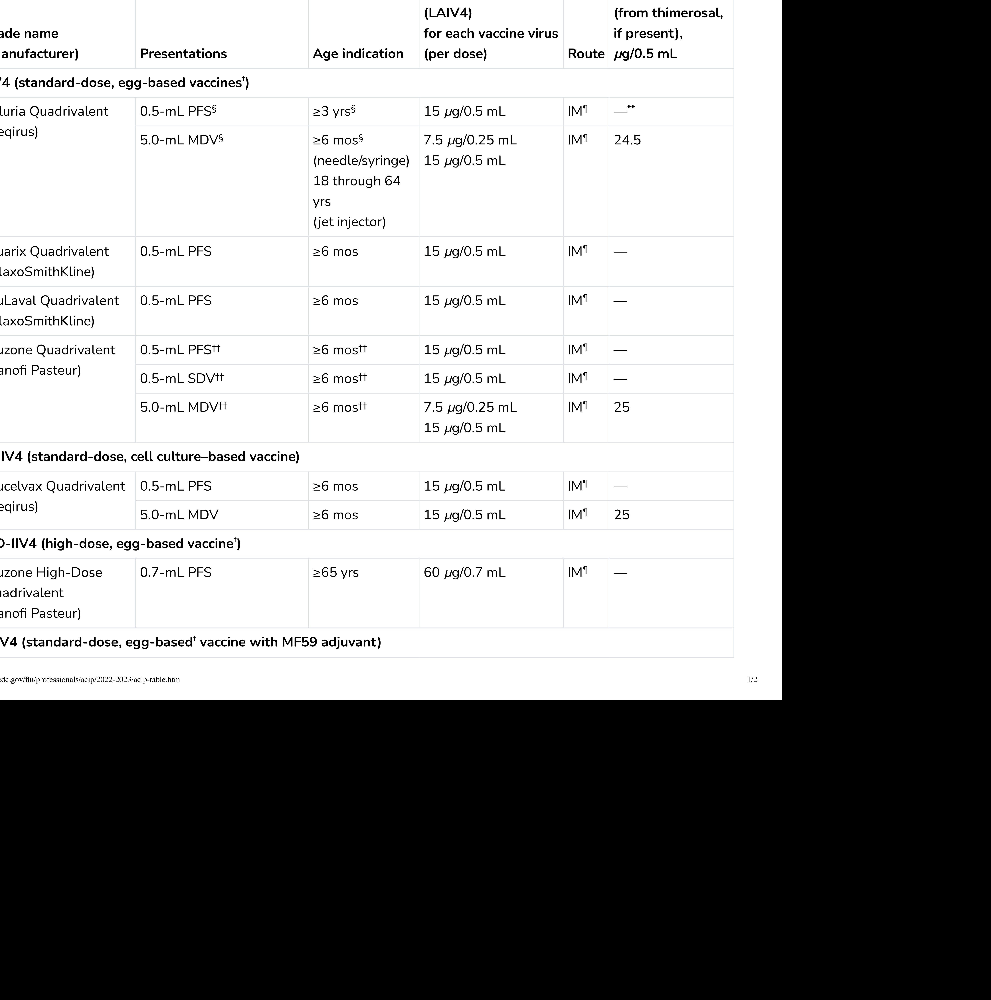
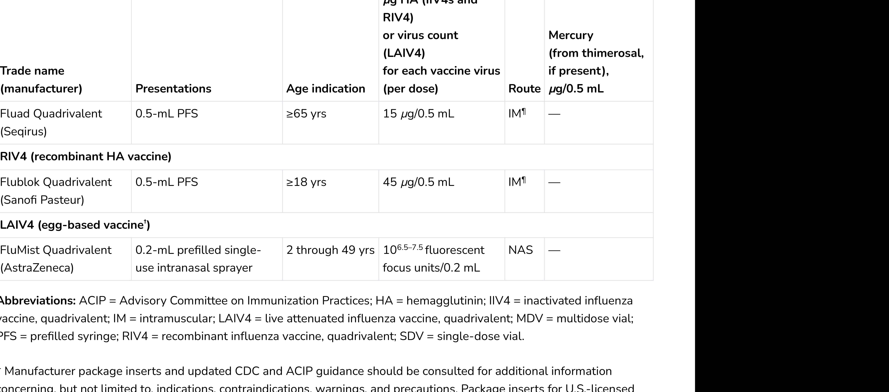

# Extracted Document

**Source:** data/clinical_files/CDC Influenza vaccines.pdf

**Pages:** 2

---

## Page 1

### Flu zone Quad rival ent (San of i Pasteur) 0.5-mL PFS†† ≥6 mos†† 15 µg/0.5 mL IM 0.5-mL SDV†† ≥6 mos†† 15 µg/0.5 mL IM 5 0-mL MDV†† ≥6 mos†† 7 5 µg/0 25 mL IM 25 ¶ ¶ ¶

**[FIGURE]**

### ( ) FluLaval Quad rival ent 0 5 mL PFS ≥6 mos 15 µg/0 5 mL

### (Seqirus)

Afluria Quad rival ent 0.5-mL PFS§

nfluenza (Flu)

### 

### 

**[FIGURE]**

## Page 2

**[FIGURE]**

Flu zone Quad rival ent is approved 0 25 L fill d i

Guidelines for Immunization a

IM-administered influenza vaccines should be administered by needle and syringe only, with the exception of the MDV presentation of Afluria Quad rival ent, which may alternatively be given by the PharmaJet Strat is jet injector for persons age ¶

that any influenza vaccine (egg based or non egg based) that is otherwise appropriate for the recipient sage and health status can be used (see Persons with a History of Egg Allergy). The approved dose volume for Afluria Quad rival ent is 0.25 mL for children aged 6 through 35 months and 0.5 mL for persons aged ≥3 years. However, 0.25-mL pre filled syringes are no longer available. For children aged 6 through 35 §

Availability and characteristics of specific products and presentations might change or differ from what is described in this table and in the text of this report. Although a history of severe allergic reaction (e.g., anaphylaxis) to egg is a labeled contra indication to the use of egg based †

* Manufacturer package inserts and updated CDC and ACIP guidance should be consulted for additional information concerning, but not limited to, indications, contra indications, warnings, and precautions. Package inserts for U.S.-licensed

LAIV4 (egg based vaccine ) FluMist Quad rival ent (AstraZeneca) 0.2-mL pre filled single use intra nasal sprayer 2 through 49 yrs 10 fluorescent focus units 0 2 mL NAS Abbreviations: ACIP = Advisory Committee on Immunization Practices; HA = hemagglutinin; IIV4 = in activated influenza vaccine, quad rival ent; IM = intramuscular; LAIV4 = live attenuated influenza vaccine, quad rival ent; MDV = multi dose vial; PFS fill d RIV4 bfl d l SDV l d l 6 5 7 5

### (San of i Pasteur)

### Fluad Quad rival ent (Seqirus) 0.5-mL PFS ≥65 yrs 15 µg/0.5 mL IM RIV4 (recombinant HA vaccine) ¶

---

## Extraction Metadata

- Text blocks: 14

- Figures/Tables: 3
