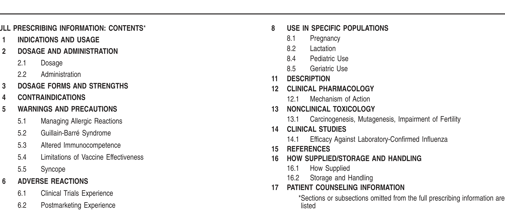
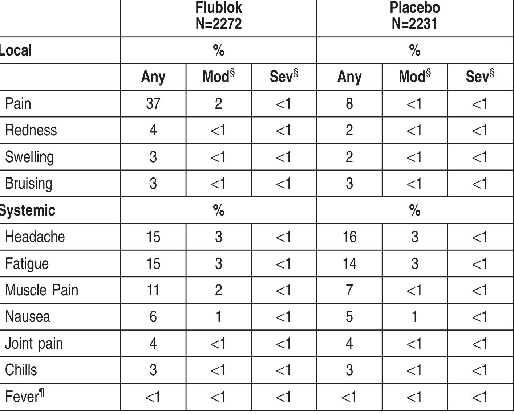
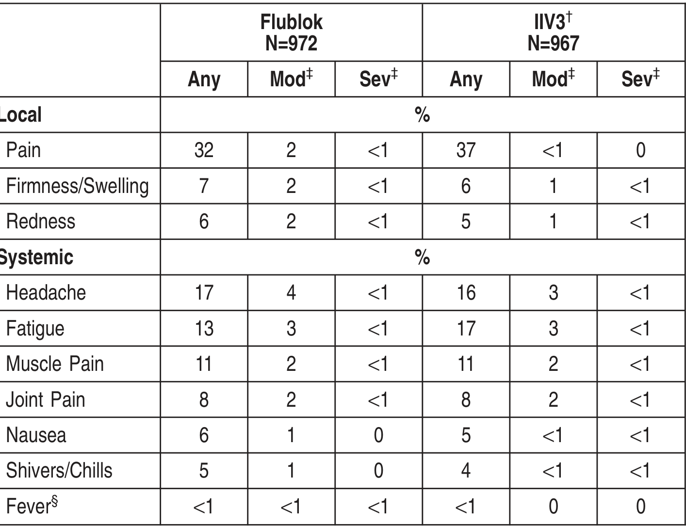
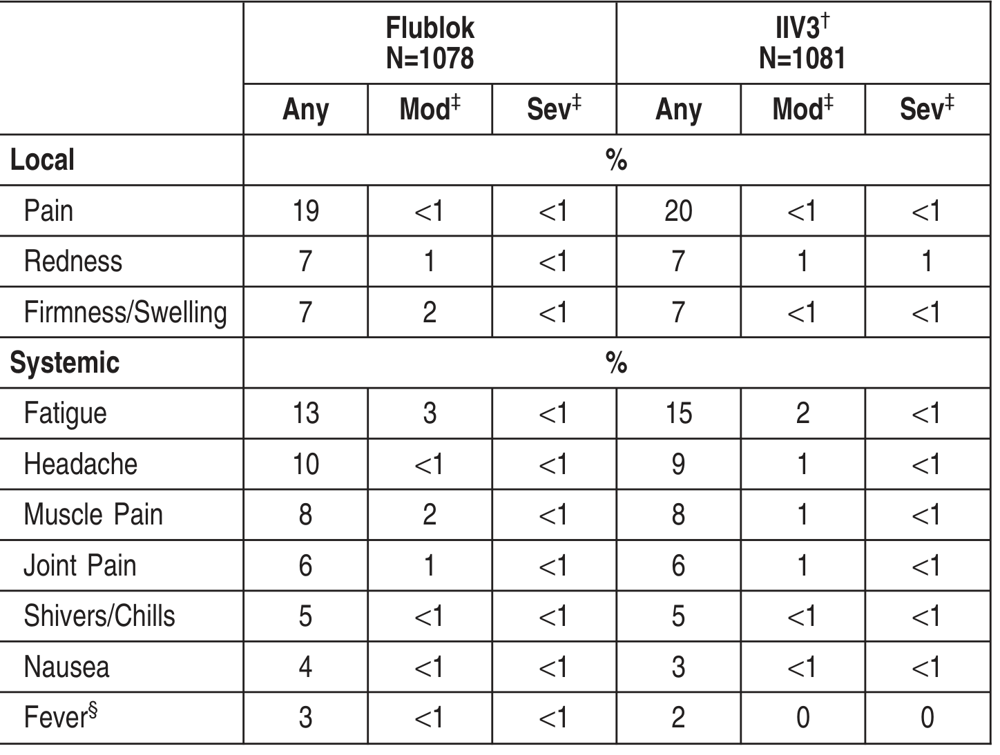
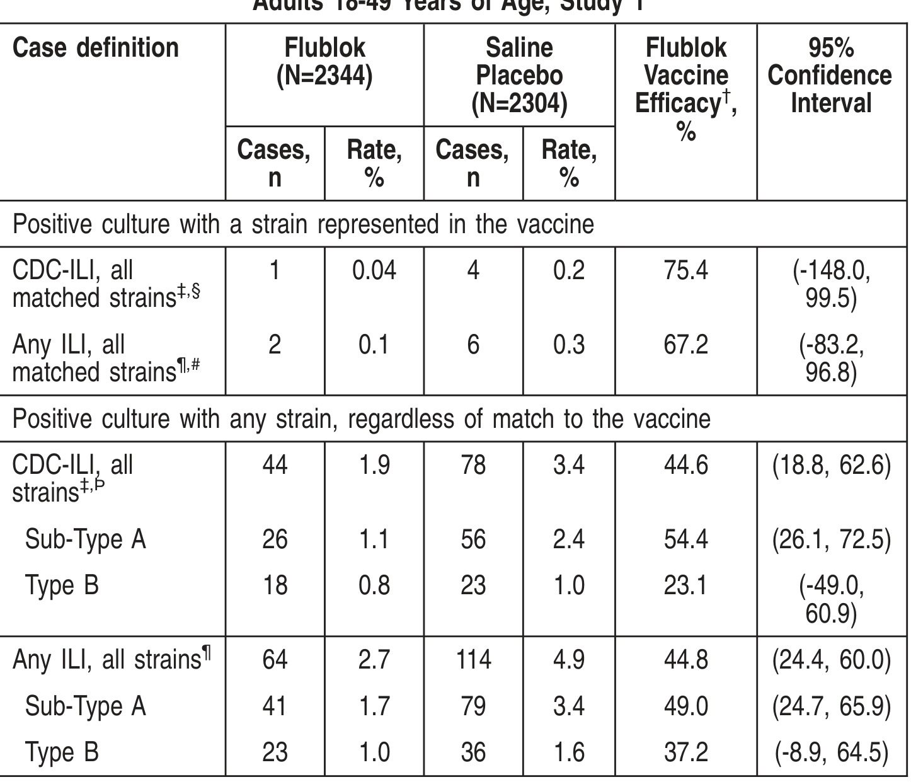
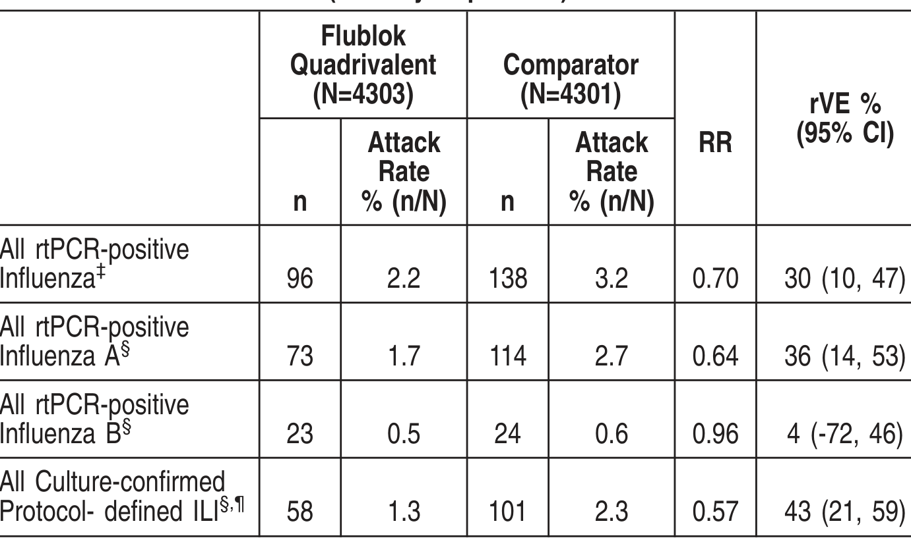
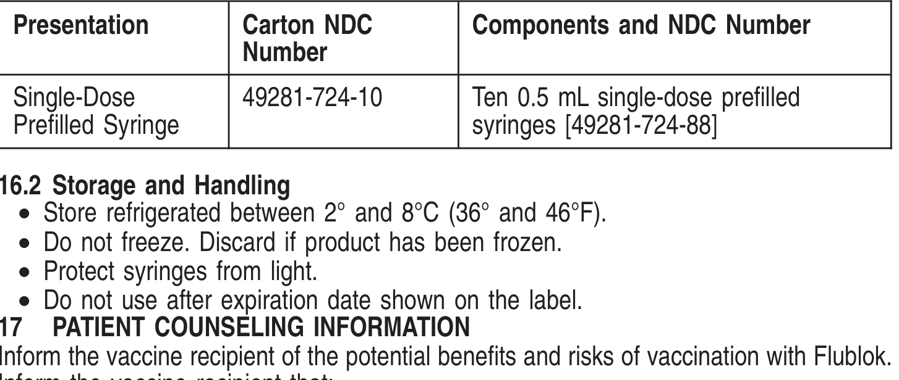

# Extracted Document

**Source:** data/clinical_files/FlublokPI.pdf

**Pages:** 5

---

## Page 1

5.2 Guillain Barré Syndrome
If GBS has occurred within 6 weeks of receipt of a prior influenza vaccine, the deci
togiveFlublokshouldbebasedoncareful considerationof thepotential benefitsandr
The 1976 swine influenza vaccine was associated with an increased frequenc
Guillain-BarréSyndrome(GBS). Evidenceforacausal relationof GBSwithotherinflue
vaccines is inconclusive; if an excess risk exists, it is probably slightly more than

Description (11)].
5
WARNINGS AND PRECAUTIONS
5.1 Managing Allergic Reactions
Appropriate medical treatment must be immediately available to manage potentia

g
dminister Flublok as a single 0.5 mL dose.
2 Administration

**[TABLE]**

### 2
DOSAGE AND ADMINISTRA
2.1
Dosage

FULL PRESCRIBING INFORMATION: CONTENTS*
1
INDICATIONS AND USAGE
DOSAGE AND ADMINISTRATION

————————————
CONTRAINDICATIONS
————————————
• Do not administer Flublok to anyone with a history of severe allergic reactions
(e.g., anaphylaxis) to any component of the vaccine. (4, 6.2, 11)
——————————
WARNINGS AND PRECAUTIONS
——————————

or intramuscular use (0.5 mL). (2)
—————————
DOSAGE FORMS AND
ublok is an injection a single dose is 05mL

vaccine. Flublok is approved for use in persons 18 years of age and older. (1)
——————————
DOSAGE AND ADMINISTRATION
——————————
For intramuscular use (05 mL) (2)

Initial U.S. Approval: 2013
———————————
INDICATIONS AND USAGE
———————————
Flublok is a vaccine indicated for active immunization for the prevention of disease

HIGHLIGHTS OF PRESCRIBING INFORMATION
Thesehighlightsdonot includeall theinformationneededtouseFlublok®safely
and effectively. See full prescribing information for Flublok.
Flublok (Influenza Vaccine)
njection for Intramuscular Use 2024-2025 Formula

data for Flublok are presented fromfour clinical trials (Studies 1, 2, 3, and 4). Data
a placebo-controlled trial in adults 18 through 49 years of age (Study 1) are
nted, followed by data pooled according to age group fromStudies 2 and 4 (adults
ough 64 years of age) and Studies 3 and 4 (adults aged 65 years and older).

### y
hrough 64 years of age, a
i
d
l
b
ti

ults 65 years of age and older, the most common (≥10%) injection site adverse
on was pain (19%); the most common (≥10%) solicited systemic adverse reactions
fatigue (13%) and headache (10%). (6.1)
Clinical Trials Experience
use clinical studies are conducted under widely varying conditions, adverse reaction
observed in the clinical studies of a vaccine cannot be directly compared to rates
e clinical studies of another vaccine and may not reflect the rates observed in clinica
ce.
safety experience with Flublok Quadrivalent is relevant to Flublok because both
nes are manufactured using the same process and have overlapping compositions.
ok
ok has been administered to and safety data collected from2497 adults 18 through

re headache (15%), fatigue (15%) and muscle pain (11%). (6.1)
adults 50 through 64 years of age, the most common (≥10%) injection site adverse
ction was pain (32%); the most common (≥10%) solicited systemic adverse reactions
re headache (17%), fatigue (13%), and muscle pain (11%). (6.1)

adults 18 through 49 years of age, the most commo
ction was pain (37%); the most common (≥10%) solic

ection-site adverse

• If Guillain-Barré syndrome has occurred within 6 weeks of receipt of a prior
influenza vaccine, the decision to give Flublok should be based on careful
consideration of potential benefits and risks. (5.2)
————————————
ADVERSE REACTIONS
————————————
• In adults 18 through 49 years of age, the most common (≥10%) injection-site
adverse reaction was pain (37%); the most common (≥10%) solicited systemic
adverse reactions were headache (15%), fatigue (15%) and muscle pain (11%).
(6.1)
• In adults 50 through 64 years of age, the most common (≥10%) injection site
adverse reaction was pain (32%); the most common (≥10%) solicited systemic
adverse reactions were headache (17%), fatigue (13%), and muscle pain (11%).
(6.1)
• In adults 65 years of age and older, the most common (≥10%) injection site
adverse reaction was pain (19%); the most common (≥10%) solicited systemic
adverse reactions were fatigue (13%) and headache (10%). (6.1)
To report SUSPECTED ADVERSE REACTIONS, contact SanofiPasteur Inc., at
(1-800-822-2463
(1-800-Vaccine)
or
VAERS
at
1-800-822-7967
or
www.vaers.hhs.gov.
See 17 for PATIENT COUNSELING INFORMATION
Revised: 07/2024
8
USE IN SPECIFIC POPULATIONS
8.1
Pregnancy
8.2
Lactation
8.4
Pediatric Use

## Page 2

Nausea
6
1
<1
5
1
<1
Joint pain
4
<1
<1
4
<1
<1
Chills
3
<1
<1
3
<1
<1
Fever¶
<1
<1
<1
<1
<1
<1
NOTE: Data based on the most severe response reported by subjects. Results ≥1%
reported to nearest whole percent; results >0 but <1% reported as <1%.
*Total VaccinatedCohort isdefinedasall randomizedsubjectswhoreceivedstudyvaccine
according to the treatment actually received and who provided data.
†Study 1 is registered as NCT00539981 under the National Clinical Trials registry.
‡Denominators for Study 1: The total number of enrolled, randomized, and vaccinated
subjectswas2344intheFlublokgroupand2304intheplacebogroup. For all categories
except fever, the number of subjects with missing values was 72 in the Flublok group
and73inthePlacebogroupsothat thesedenominatorsare2272and2231respectively.
For fever, 89 Flublok recipients and 104 Placebo recipients were missing data, making
these denominators 2255 and 2200 respectively.
§Moderate=hadit, andit was badenoughtoprevent asignificant part of usual activities;
Severe = had it, and it prevented most or all of normal activities, or had to see a doctor
for prescription medicine.
¶Fever defined as ≥100.4°F (38°C). Mild (≥100.4° to <101.1°F); Moderate (≥101.2°F to
<102.2°F); Severe (≥102.2°F)
Across three clinical trials (Studies 2 – 4, Tables 2 and 3) a total of 2050 adults age 50
years and older received Flublok and 2048 received a U.S.-licensed trivalent inactivated
influenza vaccine (IIV3) comparator. The mean age of Flublok study participants was 65
years; 56% were female and 80% were Caucasian.
The incidence of solicited reactogenicity differed between adults 50 through 64 years of
age and adults aged 65 years and older. Therefore, data from Studies 2, 3, and 4 were
pooled according to age group and are presented separately (Tables 2 and 3).
M t d
ti
i b th
ild i
it

Fatigue
15
3
<1
14
3
<1
Muscle Pain
11
2
<1
7
<1
<1

**[TABLE]**

endpoint.
Study 1 (NCT00539981) included 4648 subjects 18 through 49 years of age for safety
analysis, randomized to receive Flublok (n=2344) or placebo (n=2304) (1) (see Clinical
Studies [14.1]).
Study 2 (NCT00539864) included 602 subjects 50 through 64 years of age for safety
analysis, randomized to receive Flublok (n=300) or another U.S.-licensed trivalent
influenza vaccine (Fluzone, manufactured by SanofiPasteur, Inc.) as an active control
(n=302) (2).
Study 3 (NCT00395174) included 869 subjects aged 65 years and older for safety
analysis, randomized to receive Flublok (n=436) or another U.S.-licensed trivalent
influenza vaccine (Fluzone) as an active control (n=433) (3).
Study 4 (NCT01825200) included 2627 subjects aged 50 years and older for safety
analysis, randomized to receive Flublok (n=1314) or another U.S.-licensed trivalent
influenzavaccine(Afluria, manufacturedbybioCSLPtyLtd.)asanactivecontrol (n=1313).

ays following receipt of vaccine. Study 4 also actively solicited pre specified common
iti it t
ti
th
h 30 d
f ll
i
i t f
i
i

of a memory aid for 7 days following vaccination, and unsolicited adverse reactions were
collected for 28-30 days post-vaccination. In Studies 1- 3 and 5, SAEs were collected for
6 months post-vaccination via clinic visit or telephone follow up on Day 28, telephone
ollow up on Day 180 or by spontaneous reporting Study 4 collected SAEs through 30

Reactogenicity data froma small Phase 2 trial (Study 5) in adults 18 through 49 years of
age, 153 of whom received Flublok 135mcg, are not presented. However, subjects from
Study 5 are included in the description of deaths and serious adverse events (SAEs). In
all st dies local (injectionsite) ands stemic ad ersereactions eresolicited iththe se

r prescription medicine.
ever defined as ≥100.4°F (38°C). Mild (≥100.4° to <101.1°F); Moderate (≥101.2°
102.2°F); Severe (≥102.2°F)

**[TABLE]**

Table 3: Frequency of Solicited Local Injection Site Adverse Reactions and
Systemic Adverse Reactions within 7 Days of Administration of Flublok or
Comparator in Adults ≥65 Years of Age, Studies 3 and 4, Total Vaccinated
Cohort *,†
Flublok
N=1078
IIV3†
N=1081
Any
Mod‡
Sev‡
Any
Mod‡
Sev‡
Local
%
Pain
19
<1
<1
20
<1
<1
Redness
7
1
<1
7
1
1
Firmness/Swelling
7
2
<1
7
<1
<1

r prescription medicine.
ever defined as ≥100.4°F (38°C). Mild (≥100.4° to <101.1°F); Moderate (≥101.2°F
102.2°F); Severe(≥102.2°F) For fever, 12Flublokrecipientsand5IIV3recipientsw
issing data, making these denominators 964 and 962, respectively.

**[TABLE]**

Flublok
N=972
IIV3†
N=967
Any
Mod‡
Sev‡
Any
Mod‡
Sev‡
Local
%
Pain
32
2
<1
37
<1
0
Firmness/Swelling
7
2
<1
6
1
<1
Redness
6
2
<1
5
1
<1

## Page 3

y
g
,
q
y
p
(Flublok 1.3%, IIV3 0.8%) over the 30 day follow-up period.
Flublok Quadrivalent
FlublokQuadrivalent hasbeenadministeredtoandsafetydatacollectedfrom4328adults
50 years of age and older (Study 61) and 998 adults 18-49 years of age (Study 72).
SAEs were collected for 6 months post-vaccination via clinic visit or remote contact.
Study 6 (NCT02285998) enrolled subjects 50 years of age and older, randomized to
receive Flublok Quadrivalent or Comparator (Fluarix Quadrivalent, manufactured by
GlaxoSmithKline) as an active control [see Clinical Studies (14.1)]. The safety analysis
population included 4328 Flublok Quadrivalent recipients and 4344 Comparator vaccine
recipients. The mean age of participants was 62.7 years. Overall, 58%of subjects were
female, 80% white/Caucasian, 18% black/African American, 0.9% American Indian/
Alaskan Native, 0.4% Asian, 0.2% Native Hawaiian/Pacific Islander, 0.7% other racial
groups, and 5% of Hispanic/Latino ethnicity.
Amongadults50yearsof ageandolder (Study6), therewerenoSAEsconsideredrelated
to study vaccine.
Study 7 (NCT02290509) enrolled subjects 18 through 49 years of age randomized to
receive Flublok Quadrivalent or a Comparator inactivated influenza vaccine (Fluarix®
Quadrivalent, manufacturedby GlaxoSmithKline). Thesafety analysis populationincluded
998recipients of Flublok Quadrivalent and332Comparator vaccinerecipients. Themean
age of participants was 33.5 years. Overall, 65% of subjects were female, 59%
white/Caucasian, 37% black/African American, 1.0% Native Hawaiian/Pacific Islander,
0.8%American Indian/Alaskan Native, 0.5%Asian, 1.4%other racial groups, and 16%of
Hispanic/Latino ethnicity.
Amongadults18-49yearsof age(Study7), through6monthspost-vaccination, therewere
no SAEs considered related to study vaccine.
1NCT02285998
2NCT02290509
6.2 Postmarketing Experience
The following events have been spontaneously reported during post approval use of
Flublok or Flublok Quadrivalent. They aredescribedbecauseof thetemporal relationship,
the biologic plausibility for a causal relationship to Flublok or Flublok Quadrivalent, and
their potential seriousness. Because these events are reported voluntarily from a
population of uncertain size, it is not always possible to reliably estimate their frequency
or establish a causal relationship to vaccine exposure.
Immune system disorders: anaphylaxis, allergic reactions, and other forms of hypersen-
sitivity (including urticaria).
Nervous system disorders: facial palsy (Bell’s palsy), Guillain-Barré syndrome, syncope.
8
USE IN SPECIFIC POPULATIONS
8.1 Pregnancy
Pregnancy Exposure
There is a pregnancy exposure registry that monitors pregnancy outcomes in women
exposed to Flublok.
Healthcare providers are encouraged to enroll women who receive Flublok during
pregnancy in SanofiPasteur Inc.’s vaccination pregnancy registry by calling 1-800-822-
2463.
Risk Summary
All pregnancies have a risk of birth defect, loss, or other adverse outcomes. In the U.S.
general population, theestimatedbackgroundrisks of major birthdefects andmiscarriage
inclinicallyrecognizedpregnanciesare2%to4%and15%to20%, respectively.Available
dataonFlublokandFlublokQuadrivalent administeredtopregnant womenarelimitedand
insufficient to inform vaccine-associated risks in pregnant women.
A developmental study of Flublok has been performed in rats administered 05 mL

### 1.9%and 0.9%
7d
f ll
i

### activelysolicited
1.6%of IIV3 rec

occurring in 1%-2% of subjects, were nasopharyngitis, upper respiratory infection,
headache, cough, nasal congestion, pharyngolaryngeal pain, and rhinorrhea.
Among adults 50-64 years of age (Studies 2 and 4 pooled), the most frequent unsolicited
adverseevents, occurringin1%of subjects, werediarrheaandcough.Amongadults≥65
years of age (Studies 3 and 4 pooled), the most frequent unsolicited adverse events,
occurring in 1% of subjects, were nasopharyngitis and cough.
Among adults 50 years of age and older (Study 4) for whom the incidence of rash,
urticaria, swelling, non- pitting edema, or other potential hypersensitivity reactions were

p
j
,
p
,
p
onsidered related to the study vaccines.
n Study 1 (adults 18-49 years of age), the most frequent unsolicited adverse events
i
i
1%2%
f
bj
h
i i
i
i f
i

subjects, 6 Flublok recipients and 4 IIV3 recipients. One of the SAEs, vasovagal syncope
following injection of Flublok, was considered related to administration of study vaccine.
A
d lt 65
f
d ld
(St di
3
d4
l d) th
h
t 6
th

p
y
g
either was consideredvaccine-related. SAEs werereportedby 32Flublok recipients and
5 placebo recipients. One SAE in a Flublok recipient was assessed as possibly related
o the vaccine: pleuropericarditis with effusions requiring hospitalization and drainage. No
pecific cause was identified. The patient recovered.
Among adults 50 64 years of age (Studies 2 and 4 pooled) through up to 6 months or

mong adults 18-49 years of age (Studies 1 and 5 pooled), through 6 months
ost-vaccination, two deaths were reported, one in a Flublok recipient and one in a
acebo recipient Both deaths occurred more than 28 days following vaccination and

### headache, chills/sweats
and throat swab sampl

was assessed by active and passive surveillance for influenza like illness (ILI) beginning
2 weeks post-vaccination until the end of the influenza season, approximately 7 months
post- vaccination. ILI was defined as having at least 2 of 3 symptoms (no specified
duration) in the following categories: 1) fever ≥100°F; 2) respiratory symptoms (cough,
sore throat, or runny nose/stuffy nose); or 3) systemic symptoms (myalgias, arthralgias,
headache chills/sweats or tiredness/malaise) For subjects with an episode of ILI nasal

n the U.S. during the 2007 2008 influenza season in adults 18 49 years of age (Study
1). (1)
Study 1 enrolled and vaccinated 4648 healthy adults (mean age 32.5 years) randomized
n a 1:1 ratio to receive a single dose of Flublok (n=2344) or saline placebo (n=2304)
Among enrolled subjects, 59%were female, 67%were white, 19%African-American, 2%
Asian, < 1%otherraces, and11%of Latino/Hispanicethnicity. Culture-confirmedinfluenza

13
NONCLINICAL TOXICOLOGY
13.1 Carcinogenesis, Mutagenesis, Impairment of Fertility
Flublok has not been evaluated for carcinogenic or mutagenic potential, or for impairment
of male fertility in animals.
14
CLINICAL STUDIES
14.1 Efficacy Against Laboratory-Confirmed Influenza
The efficacy of Flublok in protecting against culture-confirmed influenza illness was

( )
y)
Antibodies against one influenza virus type or subtype confer limited or no protection
against another. Furthermore, antibodies to one antigenic variant of influenza virus might
not protect against a new antigenic variant of the same type or subtype. Frequent
development of antigenicvariantsthroughantigenicdrift isthevirologicbasisfor seasonal
epidemicsandthereasonfor theusual replacement of oneor moreinfluenzavirusstrains
in each year’s influenza vaccine.
G

syringes contain no natural rubber latex.
12
CLINICAL PHARMACOLOGY
12.1 Mechanism of Action
Flublok contains recombinant HAproteins of the three strains of influenza virus specified
by health authorities for inclusion in the annual seasonal vaccine. These proteins function
as antigens which induce a humoral immune response, measured by hemagglutination
hibiti
(HI)
tib d )

requirements. For the2024-2025influenzaseasonit is formulatedtocontain135mcgHA
per 0.5mLdose, with45mcgHAof eachof thefollowing3influenzavirusstrains:A/West
Virginia/30/2022 (A/Wisconsin/67/2022 pdm09-like virus) (H1N1), A/Massachusetts/18/
2022 (H3N2) and B/Austria/1359417/2021.
A single 0.5 mL dose of Flublok contains sodium chloride (4.4 mg), monobasic sodium
phosphate (0.2 mg), dibasic sodiumphosphate (0.5 mg), and polysorbate 20 (Tween®20)
(27.5mcg). Each0.5mLdoseof Flublokmayalsocontainresidual amountsof baculovirus
andSpodopterafrugiperdacell proteins (≤14.3mcg), baculovirus andcellular DNA(≤10
ng), and Triton X-100 (≤100 mcg).
Flublok contains no egg proteins, antibiotics, or preservatives. The single-dose, prefilled
i
t i
t
l
bb
l t

xpressed in this cell line using a baculovirus vector (Autographa californica nuclear
olyhedrosis virus), extracted from the cells with Triton X-100 and further purified by
olumn chromatography. The purified HAs are then blended and filled into single-dose
yringes.
Flublok is standardized according to United States Public Health Service (USPHS)

[
]
j
g
hemagglutinin(HA) proteinsfromthreeinfluenzavirusesfor intramuscular use. It contains
purifiedHAproteins producedinacontinuous insect cell line(expresSF+®) that is derived
rom Sf9 cells of the fall armyworm, Spodoptera frugiperda (which is related to moths,
caterpillars and butterflies), and grown in serum-free medium composed of chemically-
defined lipids, vitamins, amino acids, and mineral salts. Each of the three HAs is

manufactured using the same process and have overlapping compositions.
1
DESCRIPTION
Flublok [Influenza Vaccine] is a sterile, clear, colorless injection containing recombina

8.5 Geriatric Use
Data froman efficacy study (Study 6), which included 1759 subjects ≥65 years and 525
subjects ≥75 years who received Flublok Quadrivalent, are insufficient to determine
whether elderly subjects respond differently from younger subjects (See Clinical Studies

Data froma randomized, controlled trial demonstrated that children 6 months to less than
years of age had diminished hemagglutinin inhibition (HI) responses to Flublok
omparedtoaU.S.-licensedinfluenzavaccineapprovedforuseinthispopulation, strongly
uggestingthat Flublok wouldnot beeffectiveinchildrenyounger than3years of age(6).
Safety and effectiveness of Flublok have not been established in children 3 years to less
han 18 years of age.

The developmental and health benefits of breastfeeding should be considered along wit
the mother’s clinical need for Flublok and any potential adverse effects on the breastfe
child fromFlublok or fromthe underlying maternal condition. For preventive vaccines, th
underlying condition is susceptibility to disease prevented by the vaccine

### the effects of Flublok on the breastfed infant or on milk pr

evelopment or female fertility were observed in the study.
.2 Lactation
isk Summary
isnot knownwhether Flublokisexcretedinhumanmilk Dataarenot availabletoassess

Clinical Considerations
Disease-associated Maternal and/or Embryo/Fetal Risk
Pregnant womenareat increasedriskof complicationsassociatedwithinfluenzainfection
compared to non-pregnant women. Pregnant women with influenza may be at increased
risk for adverse pregnancy outcomes, including preterm labor and delivery.
Data
Animal
In a developmental toxicity study, female rats were administered Flublok by intramuscular
injectiontwiceprior tomating(35days and14days prior tomating) andongestationDay
6. The total dose was 0.5 mL (divided) on each occasion (a human dose is 0.5 mL). No
vaccine-related fetal malformations or variations and no adverse effects on pre-weaning

## Page 4

The primary efficacy endpoint of Study 6 was rtPCR-positive, protocol-defined ILI due to
any strain of influenza. Attack rates and relative vaccine efficacy (rVE), defined as 1 –
[Attack rate Flublok Quadrivalent/ Attack Rate Comparator], were calculated for the total
efficacy population (n=8604) for the primary efficacy endpoint and for several alternative
efficacy endpoints (Table 5). Antigenic and phylogenetic evaluations of the similarity
(″matching″) of clinical isolates to vaccine antigens were not performed. CDC epidemio-
logical data for the 2014-2015 influenza season indicated that InfluenzaA(H3N2) viruses

reaction(rtPCR) -confirmedinfluenzawasassessedbyactiveandpassivesurveillancefo
nfluenza-likeillness(ILI)beginning2weekspost-vaccinationuntil theendof theinfluenza
season, approximately 6months post- vaccination. ILI was definedas havingat least one
symptom (no specified duration) in each of two categories of respiratory and systemic
symptoms. Respiratory symptoms included sore throat, cough, sputum production
wheezinganddifficultybreathing. Systemicsymptomsincludedfever > 99°F(>37°C) oral
chills, fatigue, headache and myalgia. For subjects with an episode of ILI, a nasopha
ryngeal swab sample was collected for rtPCR testing and reflex viral culture of rtPCR
positive samples.

**[FIGURE]**

atc ed st a s
995)
Any ILI, all
matched strains¶,#
2
0.1
6
0.3
67.2
(-83.2,
96.8)
Positive culture with any strain, regardless of match to the vaccine
CDC-ILI, all
strains‡,Þ
44
1.9
78
3.4
44.6
(18.8, 62.6)
Sub-Type A
26
1.1
56
2.4
54.4
(26.1, 72.5)
Type B
18
0.8
23
1.0
23.1
(-49.0,
60.9)
Any ILI all strains¶
64
27
114
49
448
(244 600)

Positive culture with a strain represented in the vaccine
CDCILI all
1
004
4
02
754
( 1480

Case definition
Flublok
(N=2344)
Saline
Placebo
(N=2304)
Flublok
Vaccine
Efficacy†,
%
95%
Confidence
Interval
Cases,
n
Rate,
%
Cases,
n
Rate,
%

6 8)
The pre-defined success criterion for the primary efficacy analysis was that the lowe
bound of the 95%confidence interval (CI) of VEshould be at least 40%. Vaccine efficacy
against antigenically matched culture-confirmed CDC-ILI could not be determined reliably
because 96% of the influenza isolates obtained from subjects in Study 1 were not
antigenically matched to the strains represented in the vaccine. An exploratory analysis
of VE of Flublok against all strains, regardless of antigenic match, isolated from any
ubject with an ILI, not necessarily meeting CDC- ILI criteria, demonstrated an efficacy
estimate of 44.8% (95% CI 24.4, 60.0). See Table 4 for a presentation of VE by case
definition and antigenic similarity.
Table 4: Vaccine Efficacy Against Culture-Confirmed Influenza in Healthy
Adults 18-49 Years of Age, Study 1*

The primary efficacy endpoint of Study 1 was Centers for Disease Control-defined
nfluenza-like illness (CDC-ILI) with a positive culture for an influenza virus strain
antigenically resembling a strain represented in Flublok. CDC-ILI is defined as fever of
≥100°F oral accompanied by cough, sore throat, or both on the same day or on
consecutive days. Attack rates and vaccine efficacy (VE), defined as the reduction in the
nfluenzarateforFlublokrelativetoplacebo,werecalculatedforthetotal vaccinatedcohort
n=4648)

17
PATIENT COUNSELING INFORMATION
Informthe vaccine recipient of the potential benefits and risks of vaccination with Flublok
Inform the vaccine recipient that:

• Store refrigerated between 2° and 8°C (36° and 46°F).
• Do not freeze. Discard if product has been frozen.
• Protect syringes from light.
• Do not use after expiration date shown on the label.

**[FIGURE]**

§
y
distinguished by lineage.
¶Culture of rtPCR-positive samples was performed in MDCK cells.
15
REFERENCES
1. Treanor JJ, El Sahly HM, King J, et. al. Protective efficacy of a trivalent recombinant
hemagglutininproteinvaccine(FluBlok) against influenzainhealthyadults: arandomized,
placebo-controlled trial. Vaccine. 2011, Vol. 29, pp. 7733-7739.
2. Baxter R, Patriarca PA, Ensor K, et al. Evaluation of the safety, reactogenicity and
mmunogenicity of FluBlok trivalent recombinant baculovirus-expressed hemagglutinin
nfluenza vaccine administered intramuscularly to healthy adults 50-64 years of age.
Vaccine. 2011, Vol. 29, pp. 2272-2278.
3. Keitel WA, Treanor JJ, El Sahly HM, et.al. Comparative immunogenicity of recom-
binant influenza hemagglutinin (rHA) and trivalent inactivated vaccines (TIVs) among
persons ≥65 years old. Vaccine. 2009, Vol. 28, pp. 379-385.
4. Izikson R, Leffell DJ, Bock SA, et. al. Randomized comparison of the safety of
Flublok®versus licensed inactivated influenza vaccine in healthy, medically stable adults
≥50years of age. Vaccine. 2015, Vol. 33, pp. 6622–6628.
5. TreanorJJ, Schiff GM, HaydenFG, et.al. Safetyandimmunogenicityof abaculovirus-
expressed hemagglutinin influenza vaccine: a randomized controlled trial. JAMA. 2007,
Vol. 297, pp. 1577-1582.

Influenza
96
2.2
138
3.2
0.70
30 (10, 47)
All rtPCR-positive
Influenza A§
73
1.7
114
2.7
0.64
36 (14, 53)
All rtPCR-positive
Influenza B§
23
0.5
24
0.6
0.96
4 (-72, 46)
All Culture-confirmed
Protocol- defined ILI§,¶
58
1.3
101
2.3
0.57
43 (21, 59)
Abbreviations: rtPCR=reversetranscriptasepolymerasechainreaction; Comparator=U.S.-
icensedquadrivalent inactivatedinfluenzavaccine, FluarixQuadrivalent, manufacturedby
GlaxoSmithKline; n=number of influenzacases; N=number of subjectsintreatment group;
RR=relative risk (Attack Rate Flublok/Attack Rate IIV4); rVE = [(1-RR) × 100].
*Study 6 is registered as NCT02285998.
†Efficacy Population included all randomized subjects who received study vaccine and
providedanyfollow-updocumentationfor influenza-likeillnessbeginningat least 14days
post-vaccination. Excluded subjects with protocol deviations that could adversely affect
efficacy.
‡Primary Analysis. All cases of rtPCR-confirmed influenza are included. Antigenic char-
acterizationandgeneticsequencingtodeterminesimilarityof isolatestovaccineantigens
were not performed. CDC surveillance data indicated that the majority of influenza
A/H3N2 wild type viruses were antigenically distinct whereas influenzaA/H1N1 and type
B viruses were antigenically similar to vaccine antigens during the 2014-2015 season.
Study 6 met the pre-specified success criterion for the primary endpoint (lower limit of
the 2-sided 95% CI of vaccine efficacy for Flublok Quadrivalent relative to Comparator
should be not less than - 20%)

**[TABLE]**

## Page 5

---

## Extraction Metadata

- Text blocks: 62

- Figures/Tables: 7
