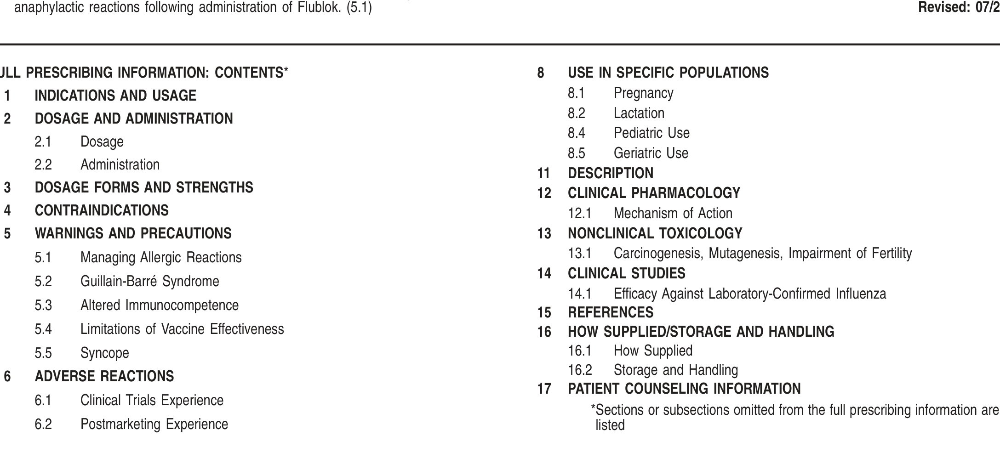
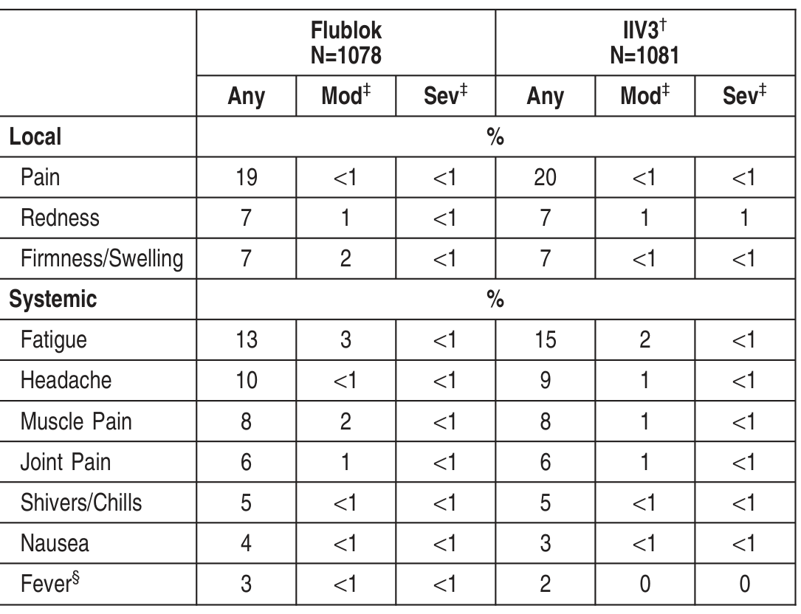
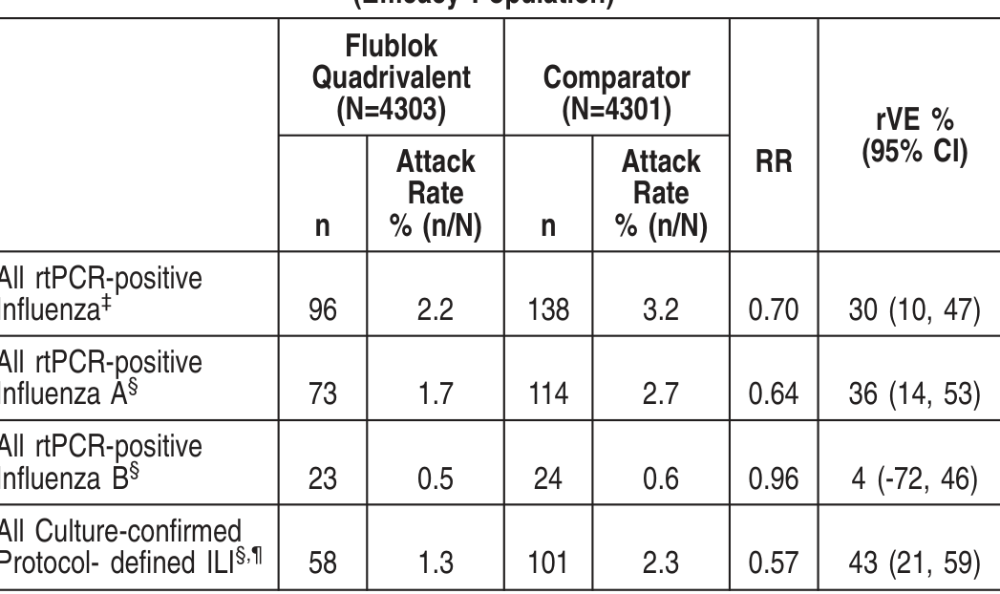
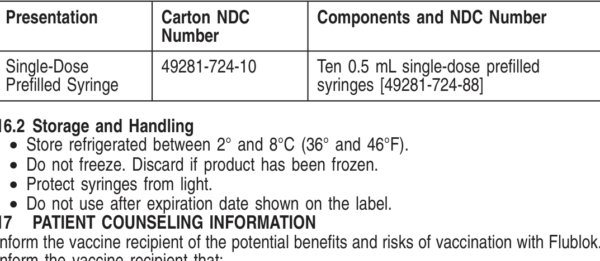

# Extracted Document

**Source:** data/clinical_files/FlublokPI.pdf

**Pages:** 5

---

## Page 1

Thesehighlightsdonot includeall theinformationneededtouseFlublok®safel
and effectively. See full prescribing information for Flublok.
Flublok (Influenza Vaccine)
Injection for Intramuscular Use 2024-2025 Formula
I iti l US A
l 2013

INDICATIONS AND USAGE
Flublok is a vaccine indicated for active immunization for the prevention of disease
caused by influenza A virus subtypes and influenza type B virus contained in the
vaccine. Flublok is approved for use in persons 18 years of age and older. (1)

**[TABLE]**

FULL PRESCRIBING INFORMATION
1
INDICATIONS AND USAGE
Flublokisavaccineindicatedfor activeimmunizationfor thepreventionof diseasecaused
by influenzaAvirus subtypes and influenza type Bvirus contained in the vaccine. Flublok
is approved for use in persons 18 years of age and older.
2
DOSAGE AND ADMINISTRATION
For intramuscular use.

Parenteral drug products should be inspected visually for particulate matter and discol-
oration prior to administration whenever solution and container permit. If either of these
conditions exists, the vaccine should not be administered.
Gently invert the prefilled syringe prior to affixing a sterile needle.

DOSAGE FORMS AND STRENGTHS
lublok is an injection. A single dose is 0.5 mL.
CONTRAINDICATIONS

Do not administer Flublok to anyone with a history of severe allergic reactions (e.g.,
anaphylaxis) to any component of the vaccine. [see Postmarketing Experience [6.2] and
Description (11)]

g g
g
Appropriate medical treatment must be immediately available to manage potentia
anaphylactic reactions following administration of Flublok.
5.2 Guillain-Barré Syndrome
If GBS has occurred within 6 weeks of receipt of a prior influenza vaccine, the decision
togiveFlublokshouldbebasedoncareful considerationof thepotential benefitsandrisks
The 1976 swine influenza vaccine was associated with an increased frequency of
Guillain-BarréSyndrome(GBS). Evidenceforacausal relationof GBSwithotherinfluenza
vaccines is inconclusive; if an excess risk exists, it is probably slightly more than one
additional case per 1 million persons vaccinated.

If Guillain-Barré syndrome has occurred within 6 weeks of receipt of a prior
influenza vaccine, the decision to give Flublok should be based on careful
consideration of potential benefits and risks. (5.2)

### ADVERSE REACTIONS

• In adults 18 through 49 years of age, the most common (≥10%) injection-site
adverse reaction was pain (37%); the most common (≥10%) solicited systemic
adverse reactions were headache (15%), fatigue (15%) and muscle pain (11%).
(6.1)
• In adults 50 through 64 years of age, the most common (≥10%) injection site
adverse reaction was pain (32%); the most common (≥10%) solicited systemic
adverse reactions were headache (17%), fatigue (13%), and muscle pain (11%).
(6.1)
• In adults 65 years of age and older, the most common (≥10%) injection site
adverse reaction was pain (19%); the most common (≥10%) solicited systemic
adverse reactions were fatigue (13%) and headache (10%). (6.1)

To report SUSPECTED ADVERSE REACTIONS, contact SanofiPasteur Inc., at
(1-800-822-2463
(1-800-Vaccine)
or
VAERS
at
1-800-822-7967
or
www.vaers.hhs.gov.

See 17 for PATIENT COUNSELING INFORMATION

5.3 Altered Immunocompetence
If Flublok is administeredtoimmunocompromisedindividuals, includingpersons receiving
immunosuppressive therapy, the immune response may be diminished.
5.4 Limitations of Vaccine Effectiveness
Vaccination with Flublok may not protect all vaccine recipients.
5.5 Syncope
Syncope (fainting) has been reported following vaccination with Flublok. Procedures
should be in place to avoid injury from fainting.
6
ADVERSE REACTIONS
In adults 18 through 49 years of age, the most common (≥10%) injection-site adverse
reaction was pain (37%); the most common (≥10%) solicited systemic adverse reactions
were headache (15%), fatigue (15%) and muscle pain (11%). (6.1)
In adults 50 through 64 years of age, the most common (≥10%) injection site adverse
reaction was pain (32%); the most common (≥10%) solicited systemic adverse reactions
were headache (17%), fatigue (13%), and muscle pain (11%). (6.1)
In adults 65 years of age and older, the most common (≥10%) injection site adverse
reaction was pain (19%); the most common (≥10%) solicited systemic adverse reactions
were fatigue (13%) and headache (10%). (6.1)
6.1 Clinical Trials Experience
Because clinical studies are conducted under widely varying conditions, adverse reaction
rates observed in the clinical studies of a vaccine cannot be directly compared to rates
in the clinical studies of another vaccine and may not reflect the rates observed in clinical
practice.
The safety experience with Flublok Quadrivalent is relevant to Flublok because both
vaccines are manufactured using the same process and have overlapping compositions.
Flublok
Flublok has been administered to and safety data collected from2497 adults 18 through
49 years of age, 972 adults 50 through 64 years of age, and 1078 adults aged 65 years
and older enrolled in five randomized, placebo- or active-controlled clinical trials. Clinical
safety data for Flublok are presented fromfour clinical trials (Studies 1, 2, 3, and 4). Data
from a placebo-controlled trial in adults 18 through 49 years of age (Study 1) are
presented, followed by data pooled according to age group fromStudies 2 and 4 (adults
50 through 64 years of age) and Studies 3 and 4 (adults aged 65 years and older).

## Page 2

Reactogenicity data froma small Phase 2 trial (Study 5) in adults 18 through 49 years of
age, 153 of whom received Flublok 135mcg, are not presented. However, subjects from
Study 5 are included in the description of deaths and serious adverse events (SAEs). In
all studies local (injectionsite) andsystemic adversereactions weresolicitedwiththeuse
of a memory aid for 7 days following vaccination, and unsolicited adverse reactions were
collected for 28-30 days post-vaccination. In Studies 1- 3 and 5, SAEs were collected for
6 months post-vaccination via clinic visit or telephone follow up on Day 28, telephone
follow up on Day 180, or by spontaneous reporting. Study 4 collected SAEs through 30
days following receipt of vaccine. Study 4 also actively solicited pre-specified common
hypersensitivity-type reactions through 30 days following receipt of vaccine as a primary
endpoint.
Study 1 (NCT00539981) included 4648 subjects 18 through 49 years of age for safety
analysis, randomized to receive Flublok (n=2344) or placebo (n=2304) (1) (see Clinical
Studies [14.1]).
Study 2 (NCT00539864) included 602 subjects 50 through 64 years of age for safety
analysis, randomized to receive Flublok (n=300) or another U.S.-licensed trivalent
influenza vaccine (Fluzone, manufactured by SanofiPasteur, Inc.) as an active control
(n=302) (2).
Study 3 (NCT00395174) included 869 subjects aged 65 years and older for safety
analysis, randomized to receive Flublok (n=436) or another U.S.-licensed trivalent
influenza vaccine (Fluzone) as an active control (n=433) (3).
Study 4 (NCT01825200) included 2627 subjects aged 50 years and older for safety
analysis, randomized to receive Flublok (n=1314) or another U.S.-licensed trivalent
influenzavaccine(Afluria, manufacturedbybioCSLPtyLtd.)asanactivecontrol (n=1313).
Among subjects 50 through 64 years of age, 672 received Flublok and 665 received
Afluria. Among subjects aged 65 years and older, 642 received Flublok and 648 received
Afluria.
In a clinical trial of adults 18-49 years of age (Study 1, Table 1) the mean age of
participants was 32.5 years, 59% were female, and 67% were Caucasian (see Clinical
Studies [14.1]).

Table 1: Frequency of Solicited Local Injection Site Adverse Reactions and
Systemic Adverse Reactions within 7 Days of Administration of Flublok or
Placebo in Adults 18-49 Years of Age, Study 1, Total Vaccinated Cohort*,†,‡

**[TABLE]**

NOTE: Data based on the most severe response reported by subjects. Results ≥1%
reported to nearest whole percent; results >0 but <1% reported as <1%.
*Total VaccinatedCohort isdefinedasall randomizedsubjectswhoreceivedstudyvaccine
according to the treatment actually received and who provided data.
†Study 1 is registered as NCT00539981 under the National Clinical Trials registry.
‡Denominators for Study 1: The total number of enrolled, randomized, and vaccinated
subjectswas2344intheFlublokgroupand2304intheplacebogroup. For all categories
except fever, the number of subjects with missing values was 72 in the Flublok group
and73inthePlacebogroupsothat thesedenominatorsare2272and2231respectively.
For fever, 89 Flublok recipients and 104 Placebo recipients were missing data, making
these denominators 2255 and 2200 respectively.
§Moderate=hadit, andit was badenoughtoprevent asignificant part of usual activities;
Severe = had it, and it prevented most or all of normal activities, or had to see a doctor
for prescription medicine.
¶Fever defined as ≥100.4°F (38°C). Mild (≥100.4° to <101.1°F); Moderate (≥101.2°F to
<102.2°F); Severe (≥102.2°F)

Across three clinical trials (Studies 2 – 4, Tables 2 and 3) a total of 2050 adults age 50
years and older received Flublok and 2048 received a U.S.-licensed trivalent inactivated
influenza vaccine (IIV3) comparator. The mean age of Flublok study participants was 65
years; 56% were female and 80% were Caucasian.
The incidence of solicited reactogenicity differed between adults 50 through 64 years of
age and adults aged 65 years and older. Therefore, data from Studies 2, 3, and 4 were
pooled according to age group and are presented separately (Tables 2 and 3).
Most adverse reactions in both age groups were mild in severity.

Table 2: Frequency of Solicited Local Injection Site Adverse Reactions and
Systemic Adverse Reactions within 7 Days of Administration of Flublok or
Comparator in Adults 50-64 Years of Age, Studies 2 and 4, Total Vaccinated
Cohort*,†

**[TABLE]**

NOTE: Data based on the most severe response reported by subjects. Results ≥1%
reported to nearest whole percent; results >0 but <1% reported as <1%.
*Total VaccinatedCohort isdefinedasall randomizedsubjectswhoreceivedstudyvaccine
according to the treatment actually received and who provided data.
†Pooled Data from Studies 2 and 4. For Studies 2 and 4, the U.S.-licensed IIV3
comparators were Fluzone and Afluria, respectively. Studies 2 and 4 are registered as
NCT00539864 and NCT01825200, respectively, under the National Clinical Trials
registry.
‡Moderate=hadit, andit was badenoughtoprevent asignificant part of usual activities;
Severe = had it, and it prevented most or all of normal activities, or had to see a doctor
for prescription medicine.
§Fever defined as ≥100.4°F (38°C). Mild (≥100.4° to <101.1°F); Moderate (≥101.2°F to
<102.2°F); Severe(≥102.2°F) For fever, 12Flublokrecipientsand5IIV3recipientswere
missing data, making these denominators 964 and 962, respectively.

Table 3: Frequency of Solicited Local Injection Site Adverse Reactions and
Systemic Adverse Reactions within 7 Days of Administration of Flublok or
Comparator in Adults ≥65 Years of Age, Studies 3 and 4, Total Vaccinated
Cohort *,†

**[TABLE]**

NOTE: Data based on the most severe response reported by subjects. Results ≥1%
reported to nearest whole percent; results >0 but <1% reported as <1%.
*Total VaccinatedCohort isdefinedasall randomizedsubjectswhoreceivedstudyvaccine
according to the treatment actually received and who provided data.
†Pooled Data from Studies 3 and 4. For Studies 3 and 4, the U.S.-licensed IIV3
comparators were Fluzone and Afluria, respectively. Studies 3 and 4 are registered as
NCT00395174 and NCT01825200, respectively, under the National Clinical Trials
registry.
‡Moderate=hadit, andit was badenoughtoprevent asignificant part of usual activities;
S
h d i
d i
d
ll f
l
i i i
h d
d

ver defined as ≥100.4°F (38°C). Mild (≥100.4° to <101.1°F); Moderate (≥101.2°F
02.2°F); Severe (≥102.2°F)

## Page 3

placebo recipient. Both deaths occurred more than 28 days following vaccination and
neither was consideredvaccine-related. SAEs werereportedby 32Flublok recipients and
35 placebo recipients. One SAE in a Flublok recipient was assessed as possibly related
to the vaccine: pleuropericarditis with effusions requiring hospitalization and drainage. No
specific cause was identified. The patient recovered.
Among adults 50-64 years of age (Studies 2 and 4 pooled), through up to 6 months or
30days, post- vaccination, respectively, therewerenodeaths; SAEs werereportedby 10
subjects, 6 Flublok recipients and 4 IIV3 recipients. One of the SAEs, vasovagal syncope
following injection of Flublok, was considered related to administration of study vaccine.
Amongadults65yearsof ageandolder (Studies3and4pooled), throughupto6months
or 30days post-vaccination, respectively, therewere4deaths, 2inFlublok recipients and
2 in IIV3 recipients. None were considered related to the study vaccines. SAEs were
reported from 80 subjects, 37 Flublok recipients, 43 in IIV3 recipients. No SAEs were
considered related to the study vaccines.
In Study 1 (adults 18-49 years of age), the most frequent unsolicited adverse events,
occurring in 1%-2% of subjects, were nasopharyngitis, upper respiratory infection,
headache, cough, nasal congestion, pharyngolaryngeal pain, and rhinorrhea.
Among adults 50-64 years of age (Studies 2 and 4 pooled), the most frequent unsolicited
adverseevents, occurringin1%of subjects, werediarrheaandcough.Amongadults≥65
years of age (Studies 3 and 4 pooled), the most frequent unsolicited adverse events,
occurring in 1% of subjects, were nasopharyngitis and cough.
Among adults 50 years of age and older (Study 4) for whom the incidence of rash,
urticaria, swelling, non- pitting edema, or other potential hypersensitivity reactions were
activelysolicitedfor 30daysfollowingvaccination, atotal of 2.4%of Flublokrecipientsand
1.6%of IIV3 recipients reported such events over the 30 day follow-up period. Atotal of
1.9%and 0.9%of Flublok and IIV3 recipients, respectively, reported these events in the
7days followingvaccination. Of thesesolicitedevents, rashwas most frequently reported
(Flublok 1.3%, IIV3 0.8%) over the 30 day follow-up period.
Flublok Quadrivalent
FlublokQuadrivalent hasbeenadministeredtoandsafetydatacollectedfrom4328adults
50 years of age and older (Study 61) and 998 adults 18-49 years of age (Study 72).
SAEs were collected for 6 months post-vaccination via clinic visit or remote contact.
Study 6 (NCT02285998) enrolled subjects 50 years of age and older, randomized to
receive Flublok Quadrivalent or Comparator (Fluarix Quadrivalent, manufactured by
GlaxoSmithKline) as an active control [see Clinical Studies (14.1)]. The safety analysis
population included 4328 Flublok Quadrivalent recipients and 4344 Comparator vaccine
recipients. The mean age of participants was 62.7 years. Overall, 58%of subjects were
female, 80% white/Caucasian, 18% black/African American, 0.9% American Indian/
Alaskan Native, 0.4% Asian, 0.2% Native Hawaiian/Pacific Islander, 0.7% other racial
groups, and 5% of Hispanic/Latino ethnicity.
Amongadults50yearsof ageandolder (Study6), therewerenoSAEsconsideredrelated
to study vaccine.
Study 7 (NCT02290509) enrolled subjects 18 through 49 years of age randomized to
receive Flublok Quadrivalent or a Comparator inactivated influenza vaccine (Fluarix®
Quadrivalent, manufacturedby GlaxoSmithKline). Thesafety analysis populationincluded
998recipients of Flublok Quadrivalent and332Comparator vaccinerecipients. Themean
age of participants was 33.5 years. Overall, 65% of subjects were female, 59%
white/Caucasian, 37% black/African American, 1.0% Native Hawaiian/Pacific Islander,
0.8%American Indian/Alaskan Native, 0.5%Asian, 1.4%other racial groups, and 16%of
Hispanic/Latino ethnicity.
Amongadults18-49yearsof age(Study7), through6monthspost-vaccination, therewere
no SAEs considered related to study vaccine.

### NCT02285998

### 2NCT02290509

6.2 Postmarketing Experience
The following events have been spontaneously reported during post approval use of
Flublok or Flublok Quadrivalent. They aredescribedbecauseof thetemporal relationship,
the biologic plausibility for a causal relationship to Flublok or Flublok Quadrivalent, and
their potential seriousness. Because these events are reported voluntarily from a
population of uncertain size, it is not always possible to reliably estimate their frequency
or establish a causal relationship to vaccine exposure.
Immune system disorders: anaphylaxis, allergic reactions, and other forms of hypersen-
sitivity (including urticaria).

Nervous system disorders: facial palsy (Bell’s palsy), Guillain-Barré syndrome, syncope
USE IN SPECIFIC POPULATIONS
1 Pregnancy

Healthcare providers are encouraged to enroll women who receive Flublok during
pregnancy in SanofiPasteur Inc.’s vaccination pregnancy registry by calling 1-800-822-
2463

All pregnancies have a risk of birth defect, loss, or other adverse outcomes. In the U.S.
general population, theestimatedbackgroundrisks of major birthdefects andmiscarriage
nclinicallyrecognizedpregnanciesare2%to4%and15%to20%, respectively.Available
dataonFlublokandFlublokQuadrivalent administeredtopregnant womenarelimitedand
nsufficient to inform vaccine-associated risks in pregnant women.
A developmental study of Flublok has been performed in rats administered 0.5 mL
divided, a single human dose is 0.5 mL) of Flublok prior to mating and during gestation.
This study revealed no evidence of harm to the fetus due to Flublok (see Data).

### Clinical Considerations
Di
i
d M

Disease-associated Maternal and/or Embryo/Fetal Risk
Pregnant womenareat increasedriskof complicationsassociatedwithinfluenzainfection
compared to non-pregnant women. Pregnant women with influenza may be at increased
risk for adverse pregnancy outcomes, including preterm labor and delivery.
Data

Animal
n a developmental toxicity study, female rats were administered Flublok by intramuscular
njectiontwiceprior tomating(35days and14days prior tomating) andongestationDay
6. The total dose was 0.5 mL (divided) on each occasion (a human dose is 0.5 mL). No
vaccine-related fetal malformations or variations and no adverse effects on pre-weaning
development or female fertility were observed in the study.
82 L
t ti

y
It isnot knownwhether Flublokisexcretedinhumanmilk. Dataarenot availabletoassess
the effects of Flublok on the breastfed infant or on milk production/excretion.
The developmental and health benefits of breastfeeding should be considered along with
the mother’s clinical need for Flublok and any potential adverse effects on the breastfed
child fromFlublok or fromthe underlying maternal condition. For preventive vaccines, the
underlying condition is susceptibility to disease prevented by the vaccine.
84 Pediatric Use

Data froma randomized, controlled trial demonstrated that children 6 months to less than
3 years of age had diminished hemagglutinin inhibition (HI) responses to Flublok
comparedtoaU.S.-licensedinfluenzavaccineapprovedforuseinthispopulation, strongly
suggestingthat Flublok wouldnot beeffectiveinchildrenyounger than3years of age(6).
Safety and effectiveness of Flublok have not been established in children 3 years to less
than 18 years of age.
G

Data froman efficacy study (Study 6), which included 1759 subjects ≥65 years and 525
subjects ≥75 years who received Flublok Quadrivalent, are insufficient to determine
whether elderly subjects respond differently from younger subjects (See Clinical Studies
[14]). Data for Flublok Quadrivalent are relevant to Flublok because both vaccines are
manufactured using the same process and have overlapping compositions.
11
DESCRIPTION

SC
O
Flublok [Influenza Vaccine] is a sterile, clear, colorless injection containing recombinant
hemagglutinin(HA) proteinsfromthreeinfluenzavirusesfor intramuscular use. It contains
purifiedHAproteins producedinacontinuous insect cell line(expresSF+®) that is derived
from Sf9 cells of the fall armyworm, Spodoptera frugiperda (which is related to moths,
caterpillars and butterflies), and grown in serum-free medium composed of chemically-
defined lipids, vitamins, amino acids, and mineral salts. Each of the three HAs is
expressed in this cell line using a baculovirus vector (Autographa californica nuclear
polyhedrosis virus), extracted from the cells with Triton X-100 and further purified by
column chromatography. The purified HAs are then blended and filled into single-dose
syringes

Flublok is standardized according to United States Public Health Service (USPHS)
equirements. For the2024-2025influenzaseasonit is formulatedtocontain135mcgHA
er 0.5mLdose, with45mcgHAof eachof thefollowing3influenzavirusstrains:A/West
Virginia/30/2022 (A/Wisconsin/67/2022 pdm09-like virus) (H1N1), A/Massachusetts/18/
022 (H3N2) and B/Austria/1359417/2021

A single 0.5 mL dose of Flublok contains sodium chloride (4.4 mg), monobasic sodium
phosphate (0.2 mg), dibasic sodiumphosphate (0.5 mg), and polysorbate 20 (Tween®20)
27.5mcg). Each0.5mLdoseof Flublokmayalsocontainresidual amountsof baculovirus
andSpodopterafrugiperdacell proteins (≤14.3mcg), baculovirus andcellular DNA(≤10
ng), and Triton X-100 (≤100 mcg).
Flublok contains no egg proteins, antibiotics, or preservatives. The single-dose, prefilled
syringes contain no natural rubber latex.
2
CLINICAL PHARMACOLOGY

Flublok contains recombinant HAproteins of the three strains of influenza virus specified
by health authorities for inclusion in the annual seasonal vaccine. These proteins function
as antigens which induce a humoral immune response, measured by hemagglutination
inhibition (HI) antibody).
Antibodies against one influenza virus type or subtype confer limited or no protection
against another. Furthermore, antibodies to one antigenic variant of influenza virus might
not protect against a new antigenic variant of the same type or subtype. Frequent
development of antigenicvariantsthroughantigenicdrift isthevirologicbasisfor seasonal
epidemicsandthereasonfor theusual replacement of oneor moreinfluenzavirusstrains
in each year’s influenza vaccine

13
NONCLINICAL TOXICOLOGY
13.1 Carcinogenesis, Mutagenesis, Impairment of Fertility
Flublok has not been evaluated for carcinogenic or mutagenic potential, or for impairm
of male fertility in animals.
14
CLINICAL STUDIES

### 14.1 Efficacy Against Laboratory-Confirmed Influenza

he efficacy of Flublok in protecting against culture-confirmed influenza illness was
valuated in a randomized, observer-blind, placebo-controlled multicenter trial conducted
n the U.S. during the 2007-2008 influenza season in adults 18-49 years of age (Study
) (1)

) ( )
Study 1 enrolled and vaccinated 4648 healthy adults (mean age 32.5 years) randomized
n a 1:1 ratio to receive a single dose of Flublok (n=2344) or saline placebo (n=2304).
Among enrolled subjects, 59%were female, 67%were white, 19%African-American, 2%
Asian, < 1%otherraces, and11%of Latino/Hispanicethnicity. Culture-confirmedinfluenza
was assessed by active and passive surveillance for influenza-like illness (ILI) beginning
2 weeks post-vaccination until the end of the influenza season, approximately 7 months
post- vaccination. ILI was defined as having at least 2 of 3 symptoms (no specified
duration) in the following categories: 1) fever ≥100°F; 2) respiratory symptoms (cough,
sore throat, or runny nose/stuffy nose); or 3) systemic symptoms (myalgias, arthralgias,
headache, chills/sweats, or tiredness/malaise). For subjects with an episode of ILI, nasa
and throat swab samples were collected for viral culture.

## Page 4

The primary efficacy endpoint of Study 1 was Centers for Disease Control-defined
influenza-like illness (CDC-ILI) with a positive culture for an influenza virus strain
antigenically resembling a strain represented in Flublok. CDC-ILI is defined as fever of
≥100°F oral accompanied by cough, sore throat, or both on the same day or on
consecutive days. Attack rates and vaccine efficacy (VE), defined as the reduction in the
influenzarateforFlublokrelativetoplacebo,werecalculatedforthetotal vaccinatedcohort
(n=4648)

(
)
The pre-defined success criterion for the primary efficacy analysis was that the lowe
bound of the 95%confidence interval (CI) of VEshould be at least 40%. Vaccine efficacy
against antigenically matched culture-confirmed CDC-ILI could not be determined reliably
because 96% of the influenza isolates obtained from subjects in Study 1 were no
antigenically matched to the strains represented in the vaccine. An exploratory analysis
of VE of Flublok against all strains, regardless of antigenic match, isolated from any
subject with an ILI, not necessarily meeting CDC- ILI criteria, demonstrated an efficacy
estimate of 44.8% (95% CI 24.4, 60.0). See Table 4 for a presentation of VE by case
definition and antigenic similarity

Table 4: Vaccine Efficacy Against Culture-Confirmed Influenza in Healthy
Adults 18-49 Years of Age, Study 1*

In Study 1 (NCT00539981) vaccine efficacy analyses were conducted on the Total
VaccinatedCohort (all randomizedsubjects whoreceivedstudy vaccineaccordingtothe
treatment actually received and who provided data). Vaccine efficacy (VE) = 1 minus the
ratio of Flublok/placebo infection rates.
†Determinedunder theassumptionof Poissonevent rates, accordingtoBreslowandDay,
1987.
‡MeetsCDCinfluenza-likeillness(CDC-ILI) definedasfever of ≥100°Foral accompanied
by cough and/or sore throat, on the same day or on consecutive days.
§Primary endpoint of trial.
¶All culture-confirmed cases are considered, regardless of whether they qualified as
CDC-ILI.
#Secondary endpoint of trial.
ÞExploratory (prespecified) endpoint of trial

The efficacy of Flublok Quadrivalent is relevant to Flublok because both vaccines are
manufactured using the same process and have overlapping compositions (see Descrip-
tion [11])

[
])
Study 6 evaluated the efficacy of Flublok Quadrivalent in a randomized, observer-blind,
ctive-controlled, multi-center trial conducted during the 2014-2015 influenza season in
dults 50 years of age and older. Atotal of 8963 healthy, medically stable adults (mean
ge 62.5 years) were randomized in a 1:1 ratio to receive a single dose of Flublok
Quadrivalent (n=4474) or a U.S.-licensed quadrivalent inactivated influenza vaccine
Comparator, Fluarix Quadrivalent, manufactured by Glaxo SmithKline) (n=4489).
Among randomized subjects, 58%were female, 80%white, 18%black/African-American,
%other races, and 5%of Hispanic/Latino ethnicity. Atotal of 5186 (60%) subjects were
0-64 years of age and 3486 (40%) were ≥65 years of age. Real-time polymerase chain
eaction(rtPCR) -confirmedinfluenzawasassessedbyactiveandpassivesurveillancefor
nfluenza-likeillness(ILI)beginning2weekspost-vaccinationuntil theendof theinfluenza
eason, approximately 6months post- vaccination. ILI was definedas havingat least one
ymptom (no specified duration) in each of two categories of respiratory and systemic
ymptoms. Respiratory symptoms included sore throat, cough, sputum production,
wheezinganddifficultybreathing. Systemicsymptomsincludedfever > 99°F(>37°C) oral,
hills, fatigue, headache and myalgia. For subjects with an episode of ILI, a nasopha-
yngeal swab sample was collected for rtPCR testing and reflex viral culture of rtPCR-
ositive samples.

The primary efficacy endpoint of Study 6 was rtPCR-positive, protocol-defined ILI due to
any strain of influenza. Attack rates and relative vaccine efficacy (rVE), defined as 1 –
Attack rate Flublok Quadrivalent/ Attack Rate Comparator], were calculated for the total
efficacy population (n=8604) for the primary efficacy endpoint and for several alternative
efficacy endpoints (Table 5). Antigenic and phylogenetic evaluations of the similarity
″matching″) of clinical isolates to vaccine antigens were not performed. CDC epidemio-
ogical data for the 2014-2015 influenza season indicated that InfluenzaA(H3N2) viruses

predominated and that most influenzaA/H3N2 viruses were antigenically dissimilar whil
A/H1N1 and B viruses were antigenically similar to vaccine antigens.

Table 5: Relative Vaccine Efficacy (rVE) of Flublok Quadrivalent versus
Comparator against Laboratory-Confirmed Influenza, Regardless of Antigenic
Similarity to Vaccine Antigens, Adults 50 Years of Age and Older, Study 6
(Efficacy Population)*,†

**[FIGURE]**

Abbreviations: rtPCR=reversetranscriptasepolymerasechainreaction; Comparator=U.S.-
icensedquadrivalent inactivatedinfluenzavaccine, FluarixQuadrivalent, manufacturedby
GlaxoSmithKline; n=number of influenzacases; N=number of subjectsintreatment group;
RR=relative risk (Attack Rate Flublok/Attack Rate IIV4); rVE = [(1-RR) × 100].
*Study 6 is registered as NCT02285998.
†Efficacy Population included all randomized subjects who received study vaccine and
providedanyfollow-updocumentationfor influenza-likeillnessbeginningat least 14days
post-vaccination. Excluded subjects with protocol deviations that could adversely affect
ffi

e of rtPCR-positive samples was performed in MDCK cells

15
REFERENCES
1. Treanor JJ, El Sahly HM, King J, et. al. Protective efficacy of a trivalent recombinant
hemagglutininproteinvaccine(FluBlok) against influenzainhealthyadults: arandomized,
placebo-controlled trial. Vaccine. 2011, Vol. 29, pp. 7733-7739.
2. Baxter R, Patriarca PA, Ensor K, et al. Evaluation of the safety, reactogenicity and
mmunogenicity of FluBlok trivalent recombinant baculovirus-expressed hemagglutinin
nfluenza vaccine administered intramuscularly to healthy adults 50-64 years of age.
Vaccine. 2011, Vol. 29, pp. 2272-2278.
3. Keitel WA, Treanor JJ, El Sahly HM, et.al. Comparative immunogenicity of recom-
binant influenza hemagglutinin (rHA) and trivalent inactivated vaccines (TIVs) among
persons ≥65 years old. Vaccine. 2009, Vol. 28, pp. 379-385.
4. Izikson R, Leffell DJ, Bock SA, et. al. Randomized comparison of the safety of
Flublok®versus licensed inactivated influenza vaccine in healthy, medically stable adults
≥50years of age. Vaccine. 2015, Vol. 33, pp. 6622–6628.
5. TreanorJJ, Schiff GM, HaydenFG, et.al. Safetyandimmunogenicityof abaculovirus-
expressed hemagglutinin influenza vaccine: a randomized controlled trial. JAMA. 2007,
Vol. 297, pp. 1577-1582.
6. King JC, Cox MMJ, Reisinger K, et. al. Evaluation of the safety, reactogenicity and
mmunogenicity of FluBlok trivalent recombinant baculovirus-expressed hemagglutinin
nfluenza vaccine administered intramuscularly to healthy children aged 6-59 months.
Vaccine. 2009, Vol. 27, pp. 6589-6594.
7. CBER/FDA. Guidance for Industry: Clinical Data Needed to Support the Licensure of
Seasonal Inactivated Influenza Vaccines. s.l. : DHHS/CBER/FDA, 2007.
16
HOW SUPPLIED/STORAGE AND HANDLING
16.1 How Supplied
Flublok is supplied as a single-dose, 0.5 mL prefilled syringe in a 10 syringe carton.

**[TABLE]**

## Page 5

• Flublok contains non-infectious proteins that cannot cause influenza.
• Flublokstimulatestheimmunesystemtoproduceantibodiesthat helpprotect against
influenza viruses contained in the vaccine but does not prevent other respiratory
infections

Instruct the vaccine recipient to report any adverse events to their healthcare provider
and/or to the Vaccine Adverse Event Reporting System (VAERS).
Provide the vaccine recipient with the Vaccine Information Statements which are required
by the National Childhood Vaccine Injury Act of 1986 to be given prior to vaccination.
These materials are available free of charge at the Centers for Disease Control (CDC)
website (www.cdc.gov/vaccines).
Encourage women who receive Flublok while pregnant to notify SanofiPasteur Inc.
sanofipasteurpregnancyregistry.com or by calling 1-800-822-2463 (1-800-VACCINE).
Instruct thevaccinerecipient that annual vaccinationtoprevent influenzaisrecommended.

Manufactured by Protein Sciences Corporation (Meriden, CT) U.S. license No. 1795

Distributed by SanofiPasteur Inc.

Flublok is a registered trademark of Protein Sciences Corporation.

INFB4-FPLR-SL-JUL24

---

## Extraction Metadata

- Text blocks: 61

- Figures/Tables: 6
