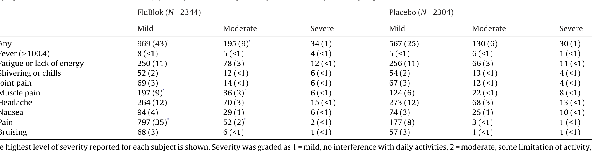
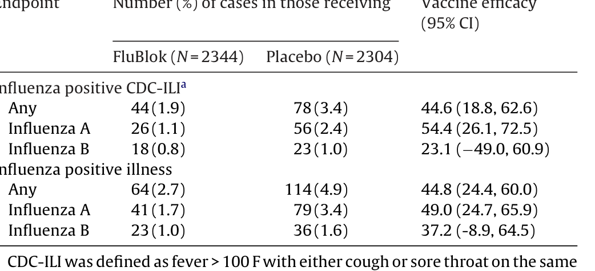

# Extracted Document

**Source:** data/clinical_files/Treanor et al. (2011).pdf

**Pages:** 7

---

## Page 1

**[FIGURE]**

### Protective
 efficacy
 of
 a
 trivalent
 recombinant
 hemagglutinin
 protein
 vaccine
(FluBlok®)
 against
 influenza
 in
 healthy
 adults:
 A
 randomized,
 placebo-controlled
trial

n
 J.
 Treanor
,  Hana
 El  Sahly , James
 King ,  Irene
 Graham ,  Ruvim
 Izikson ,  Robert
 Kohberger ,
er  Patriarca g, Manon
 Cox e

University
 of
 Rochester,
 Rochester,
 NY,
 United
 States
aylor
 College
 of
 Medicine,
 Houston,
 TX,
 United
 States
University
 of
 Maryland,
 Baltimore,
 MD,
 United
 States
t.
 Louis
 University,
 St.
 Louis,
 MO,
 United
 States
rotein
 Sciences
 Corporation,
 Meriden,
 CT,
 United
 States
lair
 &
 Co,
 Greenwich,
 CT,
 United
 States
iologics
 Consulting
 Group,
 Inc.,
 Bethesda,
 MD,
 United
 States

### None

g
p
y
gg
cine
 production
 is  a high  priority.
 We  conducted
 this  study
 to determine
 the  protective
 efficacy
 a
ombinant,
 baculovirus-expressed
 seasonal
 trivalent
 influenza
 virus  hemagglutinin
 (rHA0)
 vaccine
uBlok®).
thods:
 Healthy
 adult  subjects
 at 24  centers
 across
 the  US
 were  randomly
 assigned
 to  receive  a single
ection
 of saline  placebo
 (2304  subjects),
 or trivalent
 FluBlok
 containing
 45  mcg  of  each
 rHA0  component
44
 subjects).
 Serum  samples
 for  assessment
 of  immune
 responses
 by  hemagglutination-inhibition
AI)
 were  taken  from  a subset  of subjects
 before
 and 28  days  after  immunization.
 Subjects  were
 followed
ing
 the  2007–2008
 influenza
 season
 and  combined
 nasal  and  throat  swabs
 for  virus  isolation
 were
ained
 from  subjects
 reporting
 influenza-like
 illness.
ults: Rates of local and systemic side effects were low and the rates of systemic side effects were

sults:
 Rates  of local  and  systemic
 side  effects  were  low,  and  the  rates  of systemic
 side  effects
 were
milar
 in the  vaccine
 and  placebo
 groups.
 HAI  antibody
 responses
 were  seen
 in  78%,  81%,  and  52%  of
Blok
 recipients
 to  the  H1,  H3,  and  B  components,
 respectively.
 FluBlok
 was
 44.6%  (95% CI, 18.8%,
6%)
 effective  in  preventing
 culture-confirmed
 influenza
 meeting
 the  CDC  influenza-like  illness  case
finition
 despite
 significant
 antigenic
 mismatch
 between
 the  vaccine
 antigens
 and
 circulating
 viruses.
nclusions:
 Trivalent
 rHA0
 vaccine
 was  safe,  immunogenic
 and  effective  in  the  prevention
 of  culture
nfirmed
 influenza
 illness,
 including
 protection
 against  drift  variants.
© 2011 Elsevier Ltd All rights reserved

### None

Although
 embryonated
 hen s
 eggs
 have
 been
 used
 to
 generate
fective
 influenza
 vaccines
 for
 many
 years,
 this
 system
 does
 have
veral
 important
 drawbacks.
 Vaccine
 manufacturing
 using
 eggs
quires
 specialized
 facilities,
 and
 the
 ability
 to
 scale
 up
 egg
 pro-
uction
 rapidly
 in
 response
 to
 an
 emergency
 is
 limited.
 In
 addition,
oultry
 are
 potentially
 vulnerable
 to
 the
 same
 subtypes
 of
 influenza

∗Corresponding
 author
 at:
 University
 of
 Rochester
 Medical
 Center,
 Room
 3-6308,
1
 Elmwood
 Avenue,
 Rochester,
 NY
 14642,
 United
 States.
 Tel.:
 +1
 585
 275
 5871;
x:
 +1
 585
 442
 9328.
E-mail
 address:
 John Treanor@urmc.rochester.edu
 (J.J.
 Treanor).

i:10.1016/j.vaccine.2011.07.128

ruses
 that
 might
 also
 be
 responsible
 for
 pandemic
 influenza.
 It
 is
sually
 necessary
 to
 adapt
 candidate
 vaccine
 viruses
 for
 high
 yield
rowth
 in
 eggs,
 a
 process
 that
 can
 be
 time
 consuming,
 is
 not
 always
uccessful,
 and
 which
 can
 select
 receptor
 variants
 that
 may
 not
 be
ptimally
 representative
 of
 circulating
 influenza
 strains
 [1,2].
Expression
 of
 proteins
 in
 insect
 cells
 using
 recombinant
 bac-
ovirus
 has
 emerged
 as
 a
 promising
 technology
 for
 vaccine
roduction.
 New
 recombinant
 baculoviruses
 can
 be
 generated
uickly
 from
 sequence
 data,
 protein
 expression
 is
 very
 efficient
nder
 the
 control
 of
 the
 baculovirus
 polyhedrin
 promoter,
 and
 post
anslational
 modifications
 of
 the
 protein
 are
 generally
 similar
 to
ther
 eukaryotic
 systems.
 In
 previous
 studies,
 we
 have
 evaluated
aculovirus-expressed
 recombinant
 influenza
 virus
 hemagglu-
nins
 (rHA0s)
 as
 influenza
 vaccines
 in
 humans.
 Monovalent
 and
valent
 rHA0s
 have
 been
 well
 tolerated
 and
 immunogenic
 in

## Page 2

oung
 adults
 and
 adults
 65
 and
 older
 [3 5].
 More
 recent
 stud
s
 have
 evaluated
 rHA0
 vaccine
 formulations
 in
 healthy
 adults,
ubjects
 aged
 50–64
 years
 of
 age
 [6]
 and
 subjects
 65
 and
 older
7,8].
 These
 studies
 have
 consistently
 shown
 excellent
 tolerabil-
y
 and
 antibody
 responses
 similar
 to
 those
 seen
 with
 egg-derived
nfluenza
 vaccines.
 Finally,
 in
 a
 preliminary
 field
 efficacy
 eval-
ation,
 recipients
 of
 the
 rHA0
 vaccine
 had
 reduced
 rates
 of
ulture-positive
 CDC-defined
 influenza-like
 illness
 compared
 with
lacebo
 recipients,
 although
 the
 study
 was
 small
 [9].
In
 the
 present
 study,
 we
 performed
 a
 much
 larger
 assessment
f
 the
 immunogenicity,
 safety,
 and
 protective
 efficacy
 of
 the
 final
ormulation
 of
 trivalent
 rHA0
 vaccine
 in
 a
 population
 of
 healthy
oung
 adults.

### None

### None

The
 vaccine
 (FluBlok)
 used
 in
 this
 study
 consisted
 of
 puri
ed
 hemagglutinin
 (HA)
 proteins
 produced
 in
 insect
 cells
 using
baculovirus
 expression
 system
 as
 previously
 described
 [9].  The
combinant
 HA
 protein
 is
 not
 cleaved
 in
 insect
 cells
 and
 is
ferred
 to
 as
 rHA0.
 The
 trivalent
 vaccine
 contained
 45
 mcg
s
 measured
 by
 the
 single
 radial
 immunodiffusion
 assay)
 of
ach
 purified
 rHA0
 derived
 from
 the
 A/Solomon
 Islands/3/2006
H1N1),
 A/Wisconsin/67/2005
 (H3N2),
 and
 B/Malaysia/2506/2004
fluenza
 viruses
 recommended
 for
 the
 2007–2008
 influenza
ason
 formulated
 with
 0.005%
 Tween®-20
 in
 10
 mM sodium
hosphate
 buffer
 pH
 7.0
 ±
 0.4
 without
 a
 preservative.
 Genes
ere
 cloned
 into
 baculovirus
 using
 RT-PCR
 from
 the
 same
 CDC-
erived
 vaccine
 seed
 viruses
 used
 for
 the
 production
 of
 licensed
activated
 influenza
 vaccine
 for
 that
 year.
 Sodium
 dodecyl
 sulfate-
olyacrylamide
 gel
 electrophoresis
 of
 the
 purified
 monovalent
aterials
 indicated
 that
 hemagglutinin
 constitutes
 at
 least
 90%
 of
e
 total
 protein.
 Placebo
 consisted
 of
 normal
 saline
 for
 injection,
SP.

### y
g

The
 study
 was
 conducted
 at
 24
 centers
 located
 across
 the
 United
ates
 (Appendix)
 during
 the
 2007–2008
 influenza
 season.
 Subjects
ere
 healthy
 adults
 aged
 18–49
 years
 inclusive,
 who
 did
 not
 belong
 high
 priority
 target
 groups
 for
 influenza
 vaccination
 as
 defined
y
 the
 Advisory
 Committee
 on
 Immunization
 Practice
 [10]. Women
 child-bearing
 potential
 had
 a
 negative
 urine
 pregnancy
 test
 at
he
 time
 of
 randomization
 and
 were
 instructed
 to
 use
 contracep-
on
 during
 the
 course
 of
 the
 study.
 After
 screening
 medical
 history
nd
 physical
 exam
 to
 determine
 eligibility,
 subjects
 were
 randomly
signed
 to
 receive
 either
 a
 single
 dose
 of
 FluBlok,
 or
 saline
 placebo
sing
 a
 permuted
 block
 randomization
 scheme
 stratified
 for
 each
udy
 site.
 Vaccine
 was
 administered
 as
 a
 single
 intramuscular
jection
 in
 the
 upper
 deltoid.
Subjects
 measured
 their
 oral
 temperature
 daily
 and
 maintained
memory
 aid
 for
 7
 days
 after
 vaccination
 on
 which
 they
 recorded
cal
 and
 systemic
 reactions
 graded
 as
 “mild”
 (noticeable
 but
 not
terfering
 with
 normal
 activities),
 “moderate”
 (some
 interference
ith
 normal
 activities),
 and
 “severe”
 (symptom
 prevented
 nor-
al
 daily
 activities).
 Subjects
 received
 a
 phone
 call
 at
 day
 7
 for
view
 of
 the
 memory
 aid,
 concomitant
 medications
 and
 medical
story.
In addition
subjects from five sites (total
N = 870) partici-

In
 addition,
 subjects
 from
 five
 sites
 (total,
 N
 
 870)
 partici
ted
 in
 a
 serological
 substudy.
 At
 these
 sites,
 subjects
 had
 serum
tained
 prior
 to
 vaccination,
 and
 returned
 approximately
 28
 days
ter
 vaccination
 for
 assessment
 of
 serum
 antibody
 to
 influenza
rus.
 All
 other
 subjects
 received
 a
 phone
 call
 from
 their
 medical

y
y
p
ccurred
 at
 the
 end
 of
 the
 influenza
 season.

### f
fl

During
 the
 influenza
 season,
 subjects
 completed
 a
 weekly
 diary
o
 record
 influenza
 symptoms,
 and
 after
 influenza
 was
 recognized
 the
 community,
 subjects
 received
 weekly
 phone
 calls
 to
 review
he
 diary
 and
 ascertain
 the
 presence
 or
 absence
 of
 respiratory
 ill-
ess
 symptoms.
 Subjects
 were
 instructed
 to
 return
 to
 the
 clinic
 for
ness
 evaluations
 if
 they
 observed
 any
 acute
 respiratory
 symp-
oms
 or
 fever.
 During
 these
 illness
 visits,
 symptoms
 were
 reviewed,
brief
 physical
 exam
 was
 conducted,
 and
 combined
 nasal
 and
hroat
 swabs
 for
 virus
 culture
 were
 obtained.

### y
y

Sera
 from
 the
 immunogenicity
 subset
 were
 assessed
 for
ntibody
 to
 each
 of
 the
 three
 components
 of
 the
 vaccine
 by
emagglutination-inhibition
 (HAI)
 at
 the
 Cincinnati
 Children’s
ospital
 using
 a
 validated
 assay
 based
 on
 standard
 methods.
 All
vailable
 sera
 from
 vaccine
 recipients,
 and
 a
 randomly
 selected
ubset
 of
 approximately
 33%
 of
 placebo
 specimens
 were
 selected
r
 testing.
 The
 antigens
 used
 in
 the
 assays
 were
 baculovirus
erived
 rHAs
 representing
 the
 A/Solomon
 Islands/03/2006
 (H1N1),
/Wisconsin/67/2005
 (H3N2),
 and
 B/Malaysia/2506/2004
 viruses,
rovided
 by
 Protein
 Sciences
 Corporation.
 Sera
 were
 treated
 with
euraminidase
 (RDE,
 Denka-Seiken,
 Japan)
 to
 remove
 non-specific
hibitors
 of
 hemagglutination
 prior
 to
 testing,
 and
 were
 tested
 in
rial
 two-fold
 dilutions
 at
 an
 initial
 dilution
 of
 1:10.
 Sera
 with
o
 reactivity
 at
 1:10
 were
 assigned
 a
 value
 of
 1:5.
 Assays
 were
erformed
 using
 turkey
 red
 blood
 cells
 (Viromed
 Laboratories,
 Min-
etonka,
 MN).
Swabs
 for
 virus
 culture
 were
 stored
 at
 −70 ◦C
 and
 shipped
 on
ry
 ice
 to
 a
 central
 laboratory
 (Cincinnati
 Children’s
 Hospital
 Med-
al
 Center,
 Cincinnati,
 OH)
 where
 virus
 isolation
 was
 performed
 in
rimary
 rhesus
 monkey
 kidney
 (RhMK)
 cells
 (Diagnostic
 Hybrids
c
 (DHI),
 Athens,
 Ohio).
 The
 presence
 of
 influenza
 A
 or
 B
 viruses
the
 culture
 was
 determined
 by
 immunofluorescence
 using
 type-
pecific
 monoclonal
 antibodies
 (DHI).
 All
 influenza
 isolates
 were
ubsequently
 subtyped
 and
 antigenically
 characterized
 based
 on
activity
 to
 ferret
 antiserum
 raised
 against
 WHO
 reference
 strains.

### y

The
 primary
 safety
 endpoints
 for
 this
 study
 were
 the
 rates
nd
 severity
 of
 solicited
 and
 unsolicited
 adverse
 events.
 The
 pri-
ary
 immunogenicity
 endpoints
 were
 the
 rates
 of
 4-fold
 or
 greater
creases
 in
 serum
 HAI
 antibody
 to
 each
 of
 the
 three
 vaccine
rains
 comparing
 pre-
 and
 28-day
 post-vaccination
 samples.
 The
rimary
 efficacy
 endpoint
 was
 culture-documented
 influenza
 ill-
ess,
 defined
 as
 development
 of
 a
 CDC-defined
 influenza-like
ness
 (CDC-ILI)
 associated
 with
 recovery
 of
 influenza
 virus
 from
nasopharyngeal
 swab.
 CDC-ILI
 was
 defined
 as
 the
 presence
 of
ocumented
 fever
 ≥100
 F
 plus
 either
 sore
 throat
 or
 cough.
Safety
 of
 the
 rHA0
 vaccine
 was
 evaluated
 via
 the
 frequencies
nd
 percentages
 of
 subjects
 experiencing
 adverse
 events,
 and
 a
hi-squared
 test
 at
 a
 nominal
 0.05
 level
 was
 performed
 to
 find
ny
 differences
 in
 incidence
 rates
 between
 groups.
 Differences
etween
 groups
 in
 the
 proportions
 of
 subjects
 with
 at
 least
 a
 four-
ld
 increase
 in
 HAI
 antibody
 were
 also
 tested
 using
 a
 Chi-Square
st.
 Protective
 efficacy
 (PE)
 was
 calculated
 as
 (1-RR),
 where
 RR
 is
e
 relative
 risk
 of
 having
 an
 event
 compared
 to
 the
 placebo
 group.
pper
 and
 lower
 confidence
 limits
 for
 the
 RR
 were
 calculated
 using
e
 exact
 conditional
 binomial
 procedure.

## Page 3

### tes
 of
 lo

mptoms
No (%) of subjects
ith complaints b
le el of se eri

**[TABLE]**

nd
 3
 =
 severe,
 prevents
 normal
 daily
 activity.
* P
 <
 .05
 compared
 to
 placebo.

p
y
p
on
 that
 FluBlok
 would
 be
 at
 least
 70%
 efficacious
 in
 prevention
 of
mptomatic,
 culture-proven
 influenza,
 and
 that
 the
 placebo
 attack
te
 would
 be
 3%
 or
 greater.
 The
 sample
 size
 was
 then
 chosen
 to
ve
 80%
 power
 to
 determine
 that
 the
 lower
 bound
 of
 the
 95%
nfidence
 interval
 for
 protective
 efficacy
 was
 greater
 than
 40%,
suming
 a
 5%
 attrition
 rate.

### f

j
e
 study,
 and
 the
 study
 was
 approved
 by
 the
 institutional
 review
ards
 at
 each
 study
 site
 prior
 to
 initiation
 of
 the
 study
 and
 enroll-
ent
 of
 subjects.

### None

tota o
6 8 e g b e subjects
e e a do
ed
:
to ece
e
her
 FluBlok
 or
 Placebo,
 and
 4071
 (87.5%)
 completed
 all
 study
ocedures.
 The
 disposition
 of
 the
 study
 subjects
 is
 shown
 in
g.
 1.
 Of
 the
 4648
 enrolled
 subjects,
 2344
 were
 randomized
 to

**[FIGURE]**

ceive
 FluBlok
 and
 2304
 were
 randomized
 to
 placebo.
 The
 major
y
 of
 subjects
 were
 white
 (66%)
 and
 female
 (59%).
 The
 mean
 age
as
 32.5
 years.
 Three
 subjects
 were
 over
 the
 enrollment
 criteria
 of
9
 years
 or
 less,
 so
 that
 the
 age
 range
 enrolled
 was
 18–55
 years;
ese
 three
 subjects
 are
 included
 in
 both
 the
 safety
 and
 efficacy
nalyses.
 There
 were
 no
 differences
 with
 respect
 to
 age,
 sex
 or
 race
etween
 the
 groups.
There
 were
 577
 subjects
 who
 did
 not
 complete
 the
 study,
 the
ajority
 of
 whom
 were
 lost
 to
 follow-up
 (260
 (11%)
 in
 the
 FluBlok
nd
 251
 (11%)
 in
 the
 placebo
 group).
 In
 addition,
 36
 subjects
ithdrew
 consent
 (22
 (1%)
 and
 14
 (0.6%)
 in
 FluBlok
 and
 placebo,
spectively),
 3
 in
 each
 group
 withdrew
 due
 to
 an
 adverse
 event
AE),
 there
 was
 1
 death
 in
 each
 group,
 and
 9
 and
 13
 subjects
 in
e
 FluBlok
 and
 placebo
 groups,
 respectively
 were
 discontinued
 for
her
 reasons.

### f
f
y

ported
 by
 subjects
 in
 the
 7
 days
 following
 administration
 of
uBlok
 or
 placebo
 are
 shown
 in
 Table
 1.
 FluBlok
 was
 associated
ith
 local
 injection
 site
 pain
 and
 muscle
 aches
 that
 were
 signif-
antly
 more
 frequent
 than
 after
 saline
 placebo
 (P
 < .03
 for
 pain).
owever,
 94%
 of
 all
 complaints
 of
 pain
 after
 FluBlok
 were
 rated
mild.
 Systemic
 symptoms
 following
 vaccination
 did
 not
 occur
significantly
 different
 rates
 in
 vaccine
 and
 placebo
 recipients
>
 .05
 for
 all
 comparisons).
 The
 most
 frequently
 reported
 sys-
mic
 symptoms
 following
 vaccination
 were
 headache
 (15%
 in
 both
oups)
 and
 fatigue
 or
 lack
 of
 energy
 (14.5%
 in
 both
 groups).
 The
ajority
 (76%)
 of
 complaints
 of
 headache
 were
 also
 mild.
 There
ere
 17
 reports
 of
 fever
 (oral
 temperature
 >100.4
 F)
 among
 FluBlok
cipients
 and
 12
 among
 placebo
 recipients
 following
 vaccination.
There
 were
 85
 severe
 adverse
 events
 (SAEs)
 reported
 during
 the
udy
 in
 64
 subjects.
 Of
 these,
 41
 SAEs
 were
 reported
 in
 30
 subjects
.28%)
 in
 the
 FluBlok
 group,
 and
 44
 SAEs
 in
 34
 subjects
 (1.48%)
the
 placebo
 group.
 Two
 subjects
 died
 during
 the
 study;
 one
 in
ach
 group.
 A
 subject
 in
 the
 FluBlok-treatment
 group
 experienced
 a
tal
 pulmonary
 embolism
 approximately
 three
 months
 post
 vacci-
ation,
 and
 a
 subject
 in
 the
 placebo
 group
 had
 a
 fatal
 motor
 vehicle
cident.
 Both
 deaths
 were
 considered
 to
 be
 unrelated
 to
 the
 study
y
 the
 site
 investigator.
 All
 but
 two
 SAEs
 (a
 liposarcoma
 in
 a
 FluBlok
cipient
 and
 breast
 cancer
 in
 a
 placebo
 recipient)
 had
 resolved
y
 the
 end
 of
 the
 study
 period.
 None
 of
 the
 85
 SAEs
 in
 the
 study
ere
 considered
 to
 be
 definitely
 or
 probably
 related
 to
 vaccine.
 One
vent,
 a
 pericardial
 effusion
 in
 a
 FluBlok
 recipient
 was
 judged
 to
 be
ossibly
 related
 to
 vaccine.
 This
 event
 occurred
 in
 a
 47
 year-old
ale
 with
 a
 prior
 history
 of
 hypertension,
 who
 began
 experiencing

## Page 4

### None

### rum
 hem

Group
N
Pre (day 0) and post vaccination (day 28) geometric mean antibody titer (95% CI) and response rates (95% CI) to the following vaccine antigens

**[TABLE]**

PV
 =
 previously
 vaccinated.
NPV
 =
 not
 previously
 vaccinated.

ever
 and
 cough
 7
 days
 after
 vaccination
 and
 was
 hospitalized
 11
ays
 after
 vaccination
 with
 a
 diagnosis
 of
 pericardial
 effusion
 and
ardiac
 tamponade.
 Pericardiocentesis
 showed
 one
 colony
 of
 Propi-
nibacterium
 spp.;
 and
 culture
 of
 pleural
 fluid
 grew
 Staphylococcus
pidermidis
 only.
 Viral
 cultures
 and
 a
 panel
 of
 serum
 antibody
 tests
or
 viruses
 causing
 pericarditis
 were
 negative.
 The
 subject
 was
 dis-
harged
 home
 on
 Day
 24
 following
 vaccination
 and
 the
 event
 was
onsidered
 resolved
 by
 the
 end
 of
 the
 study
 period.
There were a total of 37 pregnancies reported during the study;

e e
e e a tota o 3
p eg a c es epo ted du
g t e study;
0
 in
 the
 FluBlok
 group
 and
 17
 in
 the
 placebo
 group.
 Complete
llow-up
 information
 was
 available
 for
 30
 for
 them
 (15
 in
 FluBlok
nd
 15
 in
 placebo).
 Ten
 of
 the
 pregnancies
 among
 FluBlok
 and
 8
mong
 placebo
 recipients
 were
 uneventful
 and
 resulted
 in
 the
 birth
a
 normal
 infant
 at
 36
 weeks
 gestation
 or
 later.
 Two
 women
 in
 the
uBlok
 and
 three
 in
 the
 placebo
 group
 had
 associated
 AEs
 during
eir
 pregnancy
 which
 all
 resolved.
 Elective
 or
 spontaneous
 abor-
on
 occurred
 in
 three
 and
 four
 subjects
 in
 the
 FluBlok
 and
 placebo
oups,
 respectively.

### g
y

Serum
 HAI
 antibody
 titers
 before
 and
 after
 immunization
 in
uBlok
 and
 placebo
 recipients
 are
 shown
 in
 Table
 2.
 FluBlok
duced
 serum
 antibody
 responses
 to
 all
 three
 components
 of
 the
ccine
 in
 the
 majority
 of
 recipients,
 although
 lower
 response
 rates
ere
 seen
 for
 the
 influenza
 B
 component.
 As
 expected,
 post
 vac-
nation
 geometric
 mean
 titers
 were
 substantially
 higher
 for
 all
ree
 components
 in
 FluBlok
 than
 in
 placebo
 recipients
 (P
 <
 .001
r
 all
 comparisons).
 The
 proportion
 of
 FluBlok
 recipients
 with
post-vaccination
 HAI
 titer
 of
 1:40
 or
 greater
 was
 99%
 for
 the
1
 component
 (95%
 CI,
 97.1%,
 99.5%),
 97%
 for
 the
 H3
 component
4.8%,
 98.3%),
 and
 96%
 for
 the
 B
 component
 (94.0%,
 97.8%).
Among
 FluBlok
 recipients,
 subjects
 with
 a
 self-reported
 history
seasonal
 influenza
 vaccine
 in
 the
 year
 prior
 to
 the
 study
 had
gher
 baseline
 titers
 of
 antibody
 against
 all
 three
 components,
 and
d
 significantly
 lower
 frequencies
 of
 HAI
 response
 than
 did
 those
ho
 reported
 that
 they
 had
 not
 received
 vaccine
 in
 the
 previous
ar.
 Subjects
 who
 reported
 prior
 vaccine
 receipt
 also
 had
 lower
ost
 vaccination
 GMTs
 for
 all
 three
 components
 than
 did
 those
ithout
 this
 history,
 and
 this
 difference
 was
 statistically
 significant
r
 both
 influenza
 A
 components.

### ffi
y

Subjects
 in
 this
 study
 were
 followed
 throughout
 the
 subsequent
fluenza
 season
 (mid
 December
 2007
 to
 end
 April
 2008)
 with
eekly
 phone
 calls
 and
 instructed
 to
 return
 to
 the
 study
 clinics
r
 any
 acute
 respiratory
 illness,
 at
 which
 time
 a
 combined
 nasal
d
 throat
 swab
 for
 viral
 culture
 was
 obtained.
 The
 primary
 efficacy

p
y
p
DC-ILI,
 and
 we
 also
 assessed
 the
 effect
 of
 vaccination
 on
 rates
 of
ny
 influenza
 culture
 positive
 illness.
A total
 of
 582
 subjects
 were
 cultured
 for
 respiratory
 illness,
 and
nfluenza
 virus
 was
 isolated
 from
 178
 subjects.
 There
 were
 a
 total
f
 120
 subjects
 from
 whom
 influenza
 A
 was
 isolated,
 the
 majority
f
 whom
 (82/120,
 68%)
 met
 the
 CDC-ILI
 case
 definition.
 There
 were
total
 of
 59
 subjects
 with
 positive
 cultures
 for
 influenza
 B,
 and
 the
majority
 of
 these
 subjects
 (41/59,
 69%)
 also
 met
 the
 CDC-ILI
 case
efinition.
Only
 8
 isolates
 in
 the
 study
 (<5%
 of
 the
 total)
 were
 antigeni-
ally
 identical
 to
 the
 strains
 contained
 in
 the
 vaccine.
 All
 of
 these
iruses
 were
 A/Wisconsin/67/2005-like
 H3N2
 viruses.
 Two
 of
 these
ccurred
 in
 FluBlok
 recipients
 and
 6
 occurred
 in
 placebo
 recipi-
nts,
 and
 among
 these
 subjects
 one
 FluBlok
 recipient
 and
 5
 placebo
ecipients
 met
 the
 CDC-ILI
 definition.
 Therefore,
 we
 were
 unable
o
 obtain
 a
 meaningful
 estimate
 of
 the
 efficacy
 of
 FluBlok
 against
DC-ILI
 due
 to
 strains
 represented
 in
 the
 vaccine.
The
 remaining
 111
 influenza
 A
 viruses
 were
 characterized
 as
ntigenic
 variants,
 i.e.,
 they
 exhibited
 a
 4-fold
 or
 greater
 decrease
n
 reactivity
 with
 post
 infection
 ferret
 antisera
 in
 reciprocal
 HAI
esting.
 These
 viruses
 included
 12
 H1N1
 viruses
 antigenically
esembling
 H1
 drift
 variant
 A/Brisbane/59/2007,
 41
 H3N2
 viruses
ntigenically
 resembling
 the
 H3
 drift
 variant
 A/Brisbane/10/2007,
2
 H3N2
 viruses
 that
 could
 not
 be
 identified
 as
 either
 A/Wisconsin-
ke
 or
 A/Brisbane-like,
 and
 16
 influenza
 viruses
 for
 which
 the
ubtype
 was
 not
 determined.
 Fifty-eight
 of
 the
 59
 influenza
 B
iruses
 (98%)
 were
 antigenically
 similar
 to
 B/Florida/04/2006,
epresenting
 a
 different
 clade
 from
 the
 vaccine
 strain,
 and
 one
nfluenza
 B
 virus
 could
 not
 be
 antigenically
 characterized.
The
 cumulative
 rates
 of
 culture
 confirmed
 influenza
 illness
ccurring
 in
 the
 study
 population
 over
 time
 are
 shown
 in
 Fig.
 2,
which
 shows
 that
 the
 relative
 difference
 between
 the
 two
 study
roups
 remained
 constant
 throughout
 the
 influenza
 season.
 The
ncidence
 of
 this
 and
 of
 other
 related
 endpoints
 in
 the
 study
 by
roup
 are
 shown
 in
 Table
 3.
 The
 overall
 protective
 efficacy
 of
luBlok
 against
 culture
 positive
 CDC-ILI
 regardless
 of
 strain
 was
4.6%
 (95%
 CI
 18.8%,
 62.6%).
 As
 expected
 given
 the
 more
 extreme
egree
 of
 antigenic
 mismatch
 for
 the
 influenza
 B
 component,
 the
fficacy
 of
 FluBlok
 was
 greater
 against
 CDC-ILI
 due
 to
 influenza
 A
iruses
 (54.4%)
 than
 influenza
 B
 viruses
 (23.1%),
 although
 the
 differ-
nce
 was
 not
 statistically
 significant
 (P
 =
 .20
 by
 logistic
 regression).
owever,
 we  were
 not
 able
 to
 demonstrate
 a
 statistically
 significant
ffect
 for
 influenza
 B.
 As
 shown
 in
 Table
 3,
 there
 were
 no
 sub-
tantial
 differences
 between
 the
 point
 estimates
 of
 efficacy
 against
ulture
 positive
 CDC-ILI
 or
 against
 any
 culture
 positive
 illness.
 Cul-
ure
 positive
 CDC-ILI
 associated
 with
 isolation
 of
 H1N1
 viruses
ccurred
 in
 9/2304
 placebo
 recipients
 and
 3/2344
 FluBlok
 recip-
ents
 (PE
 =
 67%),
 while
 culture
 positive
 CDC-ILI
 due
 to
 H3N2
 viruses

## Page 5

**[FIGURE]**

e
 to
 influenza
 A
 (A)
 and
 influenza
 B
 (B)
 in
 the
 placebo
 (solid
 line)
 and
 FluBlok
otted
 line)
 groups
 by
 date
 during
 the
 surveillance
 period.

curred
 in
 58/2304
 placebo
 and
 in
 33/2344
 FluBlok
 recipients
E
 =
 44%).
 Overall
 CDC-ILI
 regardless
 of
 culture
 results
 occurred
 in
62
 (7.0%)
 of
 placebo
 recipients
 and
 127
 (5.4%)
 of
 FluBlok
 recipients
r
 an
 efficacy
 of
 22.9%
 (95%
 CI,
 2.2%,
 39.4%)
 against
 this
 outcome.

### None

In this
 prospective,
 randomized
 clinical
 trial,
 we  evaluated
 the
fety,
 immunogenicity
 and
 efficacy
 of
 FluBlok,
 a
 trivalent
 recombi-
ant
 hemagglutinin
 (rHA0)
 vaccine.
 The
 vaccine
 was
 well
 tolerated
healthy
 adults,
 immunogenic,
 and
 protective
 against
 culture
 con-
rmed
 influenza
 illness.
 The
 safety
 data
 generated
 in
 this
 study
e
 consistent
 with
 the
 safety
 profile
 observed
 in
 other
 studies
 of

### tes
 of
 st

ipients.
ndpoint
Number (%) of cases in those receiving
Vaccine efficacy

**[TABLE]**

consecutive
 days.

HA0
 vaccine
 produced
 using
 the
 baculovirus
 expression
 system
n
 healthy
 adults
 [9].  These
 vaccines
 have
 been
 well
 tolerated
 at
 all
oses
 administered,
 and
 are
 associated
 with
 low
 rates
 of
 local
 reac-
ons.
 One
 case
 of
 pericarditis
 was
 detected
 in
 a
 FluBlok
 recipient.
ericarditis
 has
 also
 been
 reported
 previously
 following
 vaccina-
on
 with
 licensed,
 egg-derived
 influenza
 vaccine
 with
 a
 similar
me
 course
 [11].
 The
 mechanism
 and
 clinical
 significance
 of
 such
n
 association
 is
 unclear.
FluBlok
 induced
 serum
 HAI
 antibody
 responses
 to
 all
 three
 vac-
ne
 components
 in
 the
 majority
 of
 recipients,
 and
 the
 lower
 limit
f
 the
 95%
 confidence
 interval
 for
 response
 rate
 exceeded
 the
 US
DA
 criteria
 for
 licensure
 for
 all
 three
 components
 (lower
 limit
 of
he
 95%
 confidence
 interval
 for
 response
 rate
 >40%
 and
 lower
 limit
f
 the
 95%
 confidence
 interval
 for
 HAI
 titer
 of
 1:40
 or
 greater
 >70%)
2].
Although
 we
 did
 not
 attempt
 to
 verify
 vaccine
 histories
 by
eview
 of
 medical
 records,
 significant
 differences
 in
 both
 the
 fre-
uency
 and
 the
 magnitude
 of
 the
 HAI
 response
 were
 shown
 when
omparing
 the
 immune
 response
 between
 subjects
 with
 self-
eported
 previous
 vaccination.
 Reduced
 antibody
 response
 rates,
ecreased
 post
 vaccination
 titers,
 and
 decreased
 antibody
 secret-
ng
 cell
 responses
 have
 all
 been
 observed
 previously
 in
 adults
 with
rior
 influenza
 vaccine
 compared
 to
 those
 without
 [13–16].
 The
xact
 mechanism
 of
 this
 effect
 remains
 uncertain,
 although
 it
 may
epresent
 interference
 with
 antigen
 presentation
 by
 pre-existing
ntibody
 [16].
Consistent
 with
 the
 results
 of
 national
 surveillance
 in
 the
 US
uring
 the
 2007–2008
 season
 [17], the
 majority
 of
 influenza
 A
ruses
 detected
 in
 this
 study
 were
 H3N2
 viruses
 that
 represented
substantial
 antigenic
 mismatch
 with
 the
 vaccine.
 However,
 even
nder
 these
 circumstances,
 FluBlok
 had
 significant
 protective
 effi-
acy
 against
 culture-confirmed
 influenza
 illness,
 including
 those
meeting
 the
 CDC-ILI
 case
 definition.
 Influenza
 B
 viruses
 isolated
 in
his
 study
 and
 elsewhere
 in
 North
 America
 during
 the
 2007–2008
eason
 belonged
 to
 the
 Yamagata
 lineage
 of
 influenza
 B
 viruses,
gainst
 which
 vaccines
 representing
 the
 Victoria
 lineage
 would
 be
xpected
 to
 have
 little
 or
 no
 efficacy.
 We  also
 found
 that
 the
 effi-
acy
 of
 FluBlok
 against
 CDC-ILI
 associated
 with
 influenza
 B
 was
ubstantially
 lower
 than
 that
 against
 influenza
 A.
Comparisons
 
of
 
these
 
results
 
with
 
the
 
results
 
of
 
other
ssessments
 of
 the
 protective
 efficacy
 of
 influenza
 vaccines
 are
omplicated
 by
 differences
 in
 methodologies,
 populations,
 and
ntigenic
 match
 between
 vaccine
 and
 circulating
 strains
 in
 the
pecific
 year
 that
 studies
 are
 carried
 out.
 Two
 recently
 published
udies
 have
 evaluated
 egg-grown
 inactivated
 vaccines
 in
 healthy
dults
 using
 a
 placebo-controlled
 design
 during
 the
 2007–2008
nfluenza
 season.
 In
 one
 study,
 conducted
 primarily
 in
 Europe,
 the
verall
 efficacy
 of
 egg-grown
 inactivated
 vaccine
 against
 culture
onfirmed
 illness
 was
 63%,
 and
 the
 lower
 95%
 CI
 was
 46.7%
 [18].
 The
redominant
 influenza
 A
 isolates
 in
 that
 study
 were
 H1N1
 viruses,
which
 were
 mostly
 vaccine-like.
 In
 another
 smaller
 study
 done
 on
ollege
 campuses
 in
 Michigan
 [19], the
 protective
 efficacy
 of
 TIV
gainst
 culture
 confirmed
 illness
 was
 73%
 (95%
 CI,
 51%,
 85%).
 In
hat
 study,
 90%
 of
 influenza
 isolates
 were
 influenza
 A
 (H3N2),
 but
he
 antigenic
 characterization
 of
 isolates
 was
 not
 reported.
 In
 other
ecent
 randomized
 trials,
 the
 protective
 efficacy
 of
 TIV
 was
 22.3%
n
 the
 2005–2006
 influenza
 season
 predominated
 by
 influenza
 B
ruses
 and
 with
 overall
 low
 attack
 rates
 [20], and
 49.3%
 over
 two
easons,
 2005–2007
 with
 most
 cases
 due
 to
 antigenically
 variant
ruses
 [21].
Because
 of
 the
 difficulty
 in
 conducting
 placebo-controlled
udies
 of
 influenza
 vaccine
 especially
 as
 the
 target
 groups
 for
 vac-
nation
 have
 expanded,
 several
 recent
 assessments
 of
 influenza
accine
 effectiveness
 have
 utilized
 a
 test-negative,
 case–control
esign.
 Estimates
 of
 overall
 inactivated
 vaccine
 protective
 effec-
veness
 in
 these
 studies
 have
 ranged
 from
 10%
 to
 70%
 [22–25]
 and

## Page 6

y
p
y
g
irculating
 viruses,
 with
 highest
 levels
 of
 effectiveness
 reported
 for
H1
 viruses
 [25]
 and
 lowest
 levels
 for
 influenza
 B.
The
 current
 study
 provides
 evidence
 of
 protective
 efficacy
 of
baculovirus-derived
 HA
 vaccine
 in
 adults
 for
 prevention
 of
 sea-
onal
 influenza
 and
 supports
 that
 significant
 protection
 in
 a
 primed
opulation
 can
 be
 obtained
 against
 influenza
 with
 a
 pure
 hemag-
lutinin
 vaccine.
 The
 efficacy
 results
 also
 demonstrate
 that
 in
dults,
 the
 minor
 differences
 in
 HA
 glycosylation
 seen
 in
 insect
 cells
ompared
 to
 mammalian
 cells
 and
 the
 synthesis
 of
 the
 HA
 as
 an
ncleaved
 precursor
 do
 not
 preclude
 the
 generation
 of
 an
 effective
mmune
 response
 in
 adults.
The
 use
 of
 recombinant
 DNA
 techniques
 to
 express
 proteins
n
 cell
 culture
 has
 been
 a
 successful
 approach
 for
 generation
 of
ighly
 effective
 vaccines
 for
 the
 prevention
 of
 hepatitis
 B
 (HBV)
nd
 human
 papillomavirus
 (HPV),
 and
 baculovirus
 expression
 tech-
ology
 is
 currently
 used
 for
 a
 licensed
 HPV
 vaccine
 [26].
 Among
he
 available
 expression
 technologies,
 recombinant
 baculovirus
 is
specially
 well
 suited
 for
 production
 of
 influenza
 vaccine
 because
he
 rapidity
 with
 which
 genes
 can
 be
 cloned
 and
 inserted
 into
 this
ector
 facilitates
 updating
 the
 vaccine
 at
 regular
 intervals.
 Expres-
ion
 of
 the
 HA
 protein
 in
 insect
 cells
 using
 recombinant
 baculovirus
lso
 avoids
 the
 need
 to
 work
 with
 potentially
 pathogenic,
 live
nfluenza
 viruses,
 and
 the
 attendant
 biocontainment
 issues
 that
would
 be
 a
 particular
 concern
 for
 production
 of
 pandemic
 vaccines
27].
 The
 results
 of
 the
 current
 study
 support
 the
 utility
 of
 insect
ells
 for
 the
 production
 of
 well
 tolerated
 and
 effective
 vaccines
 for
easonal
 influenza.

### g

g
y
g
,
Fleur,
 Anthony
 Meyer
 and
 Adam
 Gilbert,
 and
 the
 effort
 of
 inves-
gators
 at
 the
 study
 sites
 listed
 below.
St d
it
Th f ll
i
i
ti
t
d t d
it
ll d

Study
 sites:
 The
 following
 investigators
 and
 study
 sites
 enrolled
bjects
 in
 this
 study:
 Mhorag
 Hay
 M.D.,
 University
 of
 Rochester
hool
 of
 Medicine,
 Rochester,
 NY;
 Mark
 Blatter
 M.D.,
 Primary
hysicians
 Research,
 Pittsburgh,
 PA;
 Stanley
 Block
 M.D.,
 Kentucky
diatric/Adult
 Research,
 Bardstown,
 KY;
 Bruce
 Bowling
 M.D.,
egional
 Clinical
 Research,
 Endwell,
 NY;
 Teresa
 Coats
 M.D.,
 Bench-
ark
 Research,
 Austin,
 TX;
 Hana
 El
 Sahly
 M.D.,
 Baylor
 College
 of
edicine,
 Houston,
 TX;
 Ivor
 Emanuel
 M.D.,
 Benchmark
 Research,
n
 Francisco,
 CA;
 Brandon
 Essink
 M.D.,
 Meridian
 Clinical
 Research,
maha,
 NB;
 Larry
 Gilderman
 D.O.,
 University
 Clinical
 Research
mbroke,
 Pines,
 FL;
 Irene
 Graham
 M.D.,
 St.
 Louis
 University,
 St.
uis,
 MO;
 Matt
 Hall
 M.D.,
 Marshfield
 Clinic,
 Marshfield,
 WI;
 Lydie
azan
 M.D.,
 Impact
 Clinical
 Trials,
 Beverly
 Hills,
 CA;
 Darrell
 Her-
ngton
 D.O.,
 Benchmark
 Research,
 San
 Angelo,
 TX;
 Steven
 Hull
.D.,
 Vince
 and
 Associates
 Clinical
 Research,
 Overland
 Park,
 KS;
obert
 Jeanfreau
 M.D.,
 Benchmark
 Research
 Metairie,
 LA;
 James
ng
 M.D.,
 University
 of
 Maryland,
 Baltimore,
 MD;
 Ivan
 Rarick
.D.,
 Benchmark
 Research,
 Sacramento,
 CA;
 Keith
 Reisinger
 M.D.,
imary
 Physicians
 Research,
 Pittsburgh,
 PA;
 Robert
 Rosen
 M.D.,
arolina
 Medical
 Trials,
 Winston-Salem,
 NC;
 Gilbert
 Schiff
 M.D.,
erling
 Research,
 Cincinnati,
 OH;
 William
 Seger
 M.D.,
 Benchmark
esearch
 Fort,
 Worth,
 TX;
 Helen
 Keipp
 Talbot
 M.D.,
 Vanderbilt
 Uni-
rsity,
 Nashville,
 TN;
 Gilbert
 Podolsky
 M.D.,
 Jean
 Brown
 Research
lt,
 Lake
 City,
 UT;
 Birgit
 Winther
 M.D.,
 University
 of
 Virginia,
 Char-
ttesville,
 VA.
Conflict
 of
 interest
 statement:
 J.T.
 has
 received
 grant
 support
 for
nical
 trials
 from
 Protein
 Sciences
 Corporation,
 Wyeth,
 Sanofi,
axoSmithKline,
 PaxVax,
 Ligocyte,
 and
 Vaxinnate,
 and
 is
 a
 paid
nsultant
 to
 ITS
 incorporated
 and
 Novartis.
 H.E.-S.
 has
 received
ant
 support
 from
 GlaxoSmithKline
 for
 clinical
 trials.
 I.G.,
 and
K.
 report
 no
 conflicts
 of
 interest.
 P.P.
 and
 R.K.
 are
 paid
 consul-

nts
 to
 Protein
 Sciences
 and
 multiple
 other
 entities.
 R.I.
 and
 M.C.
e
 employees
 of
 Protein
 Sciences.
 Financial
 support: The
 study
as
 funded
 by
 Protein
 Sciences
 Corporation,
 the
 manufacturers
the
 vaccine.
 Protein
 Sciences
 Corporation
 also
 funded
 ICON
 as
e
 CRO
 for
 the
 study
 and
 Ockham
 which
 performed
 the
 data
nalysis.

### None

grown
 in
 mammalian
 cells
 or
 embryonated
 eggs.
 J Infect
 Dis
 1989;160:191–8.
2]
 Wood
 JM,
 Oxford
 JS,
 Dunleavy
 U,
 Newman
 RW,
 Major
 D,
 Robertson
 JS.
 Influenza
A(H1N1)
 vaccine
 efficacy
 in
 animal
 models
 is
 influenced
 by
 two
 amino
 acid
substitutions
 in
 the
 hemagglutinin
 molecule.
 Virology
 1989;171:214–21.
3]  Powers
 DC,
 Smith
 GE,
 Anderson
 EL,
 Kennedy
 DJ,
 Hackett
 CS,
 Wilkinson
 BE,
 et
 al.
Influenza
 A
 virus
 vaccines
 containing
 purified
 recombinant
 H3
 hemagglutinin
are
 well-tolerated
 and
 induce
 protective
 immune
 responses
 in
 healthy
 adults.
J
 Infect
 Dis
 1995;171:1595–8.
4] Lakey
 DL,
 Treanor
 JJ,
 Betts
 RF,
 Smith
 GE,
 Thompson
 J,
 Sannella
 E,
 et
 al.
 Recom-
binant
 baculovirus
 influenza
 A
 hemagglutinin
 vaccines
 are
 well
 tolerated
 and
immunogenic
 in
 healthy
 adults.
 J Infect
 Dis
 1996;174:838–41.
5] Treanor
 JJ,
 Betts
 RF,
 Smith
 GE,
 Anderson
 EL,
 Hackett
 CS,
 Wilkinson
 BE,
 et
 al.
 Eval-
uation
 of
 a
 recombinant
 hemagglutinin
 expressed
 in
 insect
 cells
 as
 an
 influenza
vaccine
 in
 young
 and
 elderly
 adults.
 J Infect
 Dis
 1996;173:1467–70.
6] Baxter
 R,
 Patriarca
 PA,
 Ensor
 K,
 Izikson
 R,
 Goldenthal
 KL,
 Cox
 MM.
 Reacto-
genicity
 and
 immunogenicity
 of
 FluBlok
 trivalent
 recombinant
 baculovirus-
expressed
 hemagglutinin
 vaccine
 administered
 intramuscularly
 to
 healthy
adults
 50–64
 years
 of
 age.
 Vaccine
 2011;29:2272–8.
7]
 Treanor
 JJ,
 Schiff
 GM,
 Couch
 RB,
 Cate
 TR,
 Brady
 RC,
 Hay
 CM,
 et
 al.
 Dose-related
safety
 and
 immunogenicity
 of
 a
 trivalent
 baculovirus-expressed
 influenza-
virus
 hemagglutinin
 vaccine
 in
 elderly
 adults.
 J Infect
 Dis
 2006;193:1223–8.
8]
 Keitel
 WA,
 Treanor
 J,
 El
 Sahly
 HM,
 Gilbert
 A,
 Maeyer
 AL,
 Patricarca
 PA,
 et
 al.
Comparative
 immunogenicity
 of
 recombinant
 influenza
 hemagglutinin
 (rHA)
and  trivalent
 inactivated
 vaccines
 (TIV)
 among
 persons
 >
 65
 years
 old.
 Vaccine
2009;28:379–85.
9] Treanor
 JJ,
 Schiff
 GM,
 Hayden
 FG,
 Brady
 RC,
 Hay
 CM,
 Meyer
 AL,
 et
 al.
 Safety
 and
immunogenicity
 of
 a
 baculovirus-expressed
 hemagglutinin
 influenza
 vaccine:
a  randomized
 controlled
 trial.
 JAMA
 2007;297:1577–82.
0] CDC.
 Prevention
 and
 control
 of
 influenza:
 recommendations
 of
 the
 Advisory
Committee
 on
 Immunization
 Practice
 (ACIP),
 2007.
 MMWR
 Morb
 Mortal
 Wkly
Rep  2007;56:1–40.
1]
 Meester
 A,
 Luwaert
 R,
 Chaudron
 JM.
 Symptomatic
 pericarditis
 after
 influenza
vaccination:
 report
 of
 two
 cases.
 Chest
 2000;117:1803–5.
2] FDA.
 Guidance
 for
 industry:
 clinical
 data
 needed
 to
 support
 the
 licensure
 of
seasonal
 inactivated
 influenza
 vaccines;
 2007.
3]
 Beyer
 WEP,
 Palache
 AM,
 Sprenger
 MJW,
 Hendriksen
 E,
 Tukker
 JJ,
 Darioli
 R,
 et
 al.
Effects
 of
 repeated
 annual
 influenza
 vaccination
 on
 vaccine
 sero-response
 in
young and
 elderly
 adults.
 Vaccine
 1996;14:1331–9.
4]
 Goodwin
 K,
 Viboud
 C,
 Simonsen
 L.
 Antibody
 response
 to
 influenza
 vaccination
in
 the
 elderly:
 a
 quantitative
 review.
 Vaccine
 2006;24:1159–69.
5] Engler
 RJ,
 Nelson
 MR,
 Klote
 MM,
 Van
 Raden
 MJ,
 Huang
 CY,
 Cox
 NY,
 et
 al.
 Half-
 vs
full-dose
 trivalent
 inactivated
 influenza
 vaccine
 (2004–2005):
 age,
 dose,
 and
sex effects
 on
 immune
 responses.
 Arch
 Intern
 Med
 2008;168:2405–14.
6]
 Sasaki
 S,
 He
 X-S,
 Holmes
 TH,
 Dekker
 CL,
 Kemble
 GW,
 Arvin
 AM,
 et
 al.
 Influ-
ence
 of
 prior
 influenza
 vaccination
 on
 antibody
 and
 B-Cell
 responses.
 PLoS
 One
2008;3:e2975.
7] CDC.
 Influenza
 activity—United
 States
 and
 worldwide,
 2007–08
 season.
 MMWR
Morb
 Mortal
 Wkly
 Rep
 2008:57.
8]
 Frey
 S,
 Vesikari
 T,
 Szymczakiewicz-Multanowska
 A,
 Lattanzi
 M,  Izu
 A,
 Groth
N,
 et
 al.
 Clinical
 efficacy
 of
 cell
 culture-derived
 and
 egg-derived
 inactivated
subunit
 influenza
 vaccines
 in
 healthy
 adults.
 Clin
 Infect
 Dis
 2010;51:997–1004.
9]
 Monto
 AS,
 Ohmit
 SE,
 Petrie
 JG,
 Johnson
 E,
 Truscon
 R,
 Teich
 E,
 et
 al.
 Comparative
efficacy
 of
 inactivated
 and
 live
 attenuated
 influenza
 vaccines.
 N
 Engl
 J Med
2009;361:1260–7.
0] Beran
 J,
 Wertzova
 V,
 Honegr
 K,
 Kaliskova
 E,
 Havlickova
 M,
 Havlik
 J, et
 al.
Challenge
 of
 conducting
 a
 placebo-controlled
 randomized
 efficacy
 study
 for
influenza
 vaccine
 in
 a
 season
 with
 low
 attack
 rate
 and
 a mismatched
 vaccine
 B
strain:
 a
 concrete
 example.
 BMC
 Infect
 Dis
 2009;9:2.
1]
 Jackson
 L,
 Gaglani
 M,  Keyserling
 H,
 Balser
 J, Bouveret
 N,
 Fries
 L,
 et
 al.
 Safety,
efficacy,
 and
 immunogenicity
 of
 an
 inactivated
 influenza
 vaccine
 in
 healthy
adults:
 a
 randomized,
 placebo-controlled
 trial
 over
 two
 influenza
 seasons.
 BMC
Infect
 Dis
 2010;10:71–7.
2]
 Belongia
 EA,
 Kieke
 BA,
 Donahue
 JG,
 Greenlee
 RT,
 Balish
 A,
 Foust
 A,
 et
 al.
Effectiveness
 of
 inactivated
 influenza
 vaccines
 varied
 substantially
 with
 anti-
genic
 match
 from
 the
 2004–2005
 season
 to
 the
 2006–2007
 season.
 J
 Infect
 Dis
2009:199.
3]
 Skowronski
 DM,
 Masaro
 C,
 Kwindt
 TL,
 Mak
 A,
 Petric
 M,  Li
 Y,
 et
 al.
 Estimating
vaccine
 effectiveness
 against
 laboratory-confirmed
 influenza
 using
 a sentinel
physician
 network:
 Results
 from
 the
 2005–2006
 season
 of
 dual
 A
 and
 B
 vaccine
mismatch
 in
 Canada.
 Vaccine
 2007;25:2842–51.
4]
 Belongia
 E,
 Kieke
 B,
 Coleman
 L,
 Donahue
 J,
 Irving
 S,
 Meece
 J, et
 al.
 Interim
within-season
 estimate
 of
 the
 effectiveness
 of
 trivalent
 inactivated
 influenza

## Page 7

Mortal
 Wkly
 Rep
 2008;57:393–8.
Skowronski
 DM,
 De
 Serres
 G,
 Dickinson
 J,
 Petric
 M,
 Mak
 A,
 Fonseca
 K,
 et
 al.
Component-specific
 effectiveness
 of
 trivalent
 influenza
 vaccine
 as
 monitored
through
 a
 sentinel
 surveillance
 network
 in
 Canada,
 2006–2007.
 J
 Infect
 Dis
2009;199:160–79.

]
p
J
Efficacy
 of
 a
 bivalent
 L1
 virus-like
 particle
 vaccine
 in
 prevention
 of
 infection
with human
 papillomavirus
 types
 16
 and
 18
 in
 young
 women:
 a
 randomised
controlled
 trial.
 Lancet
 2004;364:1757–65.
]
 Treanor
 JJ.
 Recombinant
 proteins
 produced
 in
 insect
 cells.
 Curr
 Top
 Microbiol
Immunol
 2009;333:211–25.

---

## Extraction Metadata

- Text blocks: 56

- Figures/Tables: 6
