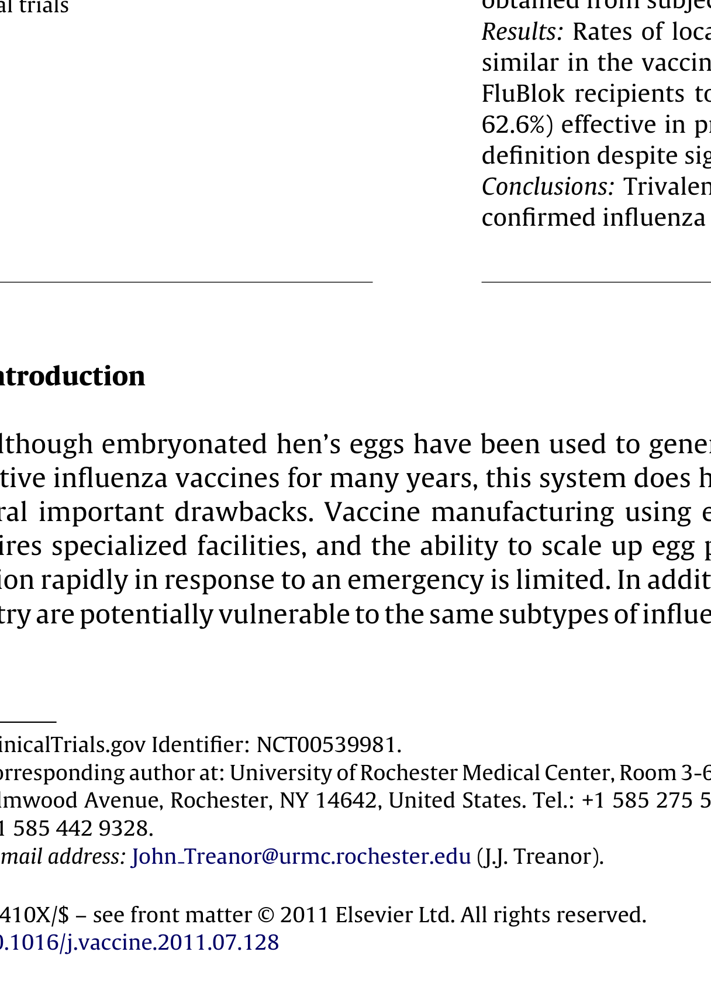
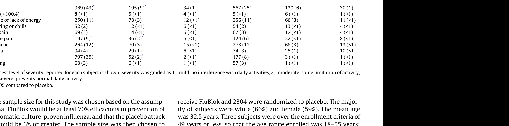
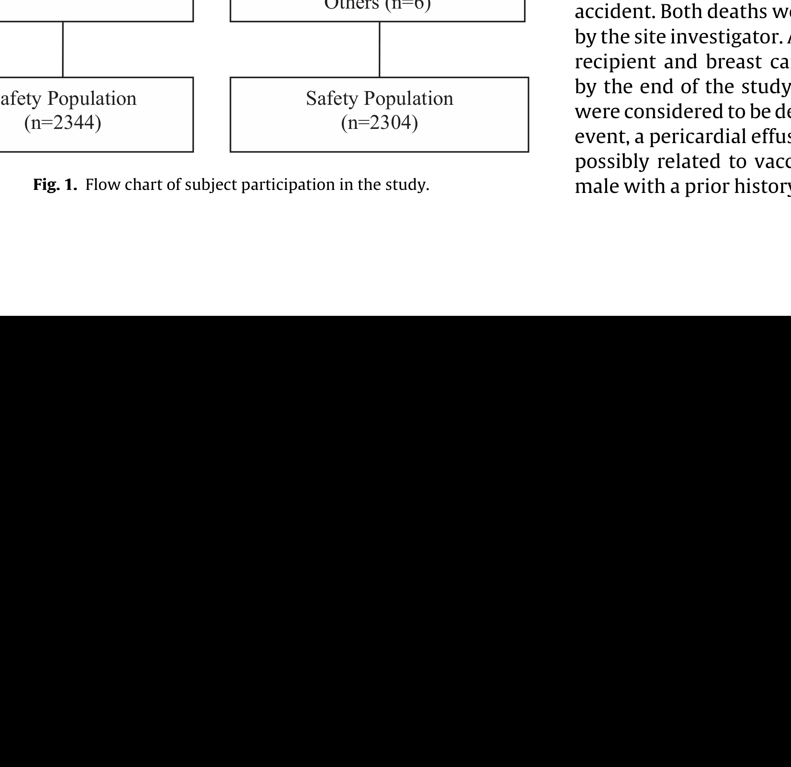
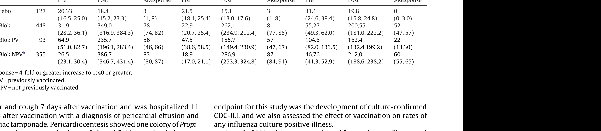
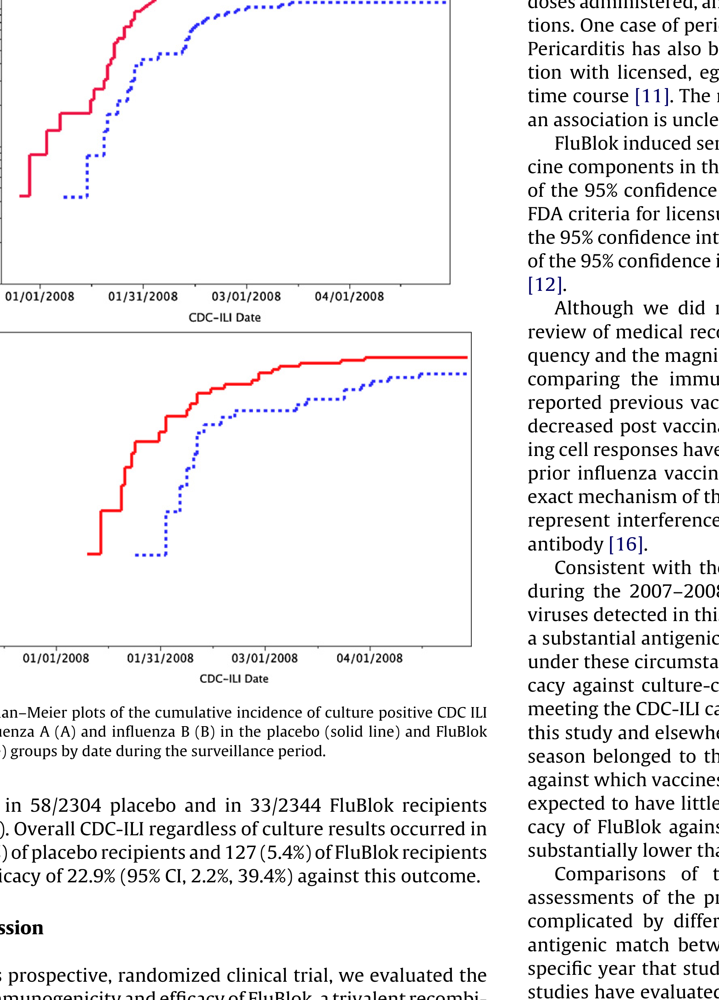

# Extracted Document

**Source:** data/clinical_files/Treanor et al. (2011).pdf

**Pages:** 7

---

## Page 1

**[FIGURE]**

under the control of the baculovir l i ldifi i f h

### Although embryonated hen’seggs have been used to generate effective influenza vaccines for many years, this system does have several important drawbacks. Vaccine manufacturing using eggs requires specialized facilities, and the ability to scale up egg pro growth in eggs, a process that can be time consuming, is not always successful, and which can select receptor variants that may not be optimally representative of circulating influenza strains [1,2]. Expression of proteins in insect cells using recombinant bac-

similar Flublok 62 6 def in it Con clu confirm

**[FIGURE]**

### ) uring the 2007-2008

uBlok®). thods: Healthy adult subjects at 24 centers across the US were randomly assigned to receive a single ect ion of saline placebo (2304 subjects), or trivalent Flublok containing 45 mcg of each rHA0 component 344 subjects). Serum samples for assessment of immune responses by hemagglutination-inhibition

b s t r a c tckground: Development of influenza vaccines that do not use embryonated eggs as the substrate for ccine production is ahigh priority. We conducted this study to determine the protective efficacy acomb in ant baculo virus expressed seasonal trivalent influenza virus hemagglutinin (rHA0) vaccine

es

### 

rot ect ive efficacy of a trivalent recombin Flublok® against influenza in healthy ad rial

Vac

Con ten

Vacci

nt hemagglutinin protein vaccine lts: A randomized, placebo controlled h d R i I ik e R b t K hb f

at Science direct ne vier com locate vaccine nt hemagglutinin protein vaccine

## Page 2

y g ( nterfering with normal activities), “moderate” (some interference with normal activities), and “severe” (symptom prevented normal daily activities). Subjects received a phone call at day 7 for eview of the memory aid, concomitant medications and medical i story. In addition, subjects from five sites (total, N = 870) part ici a ted in a serological sub study. At these sites, subjects had serum btained prior to vaccination, and returned approximately 28 days fter vaccination for assessment of serum antibody to influenza

udy site. Vaccine was administered as a single intramuscular jection in the upper deltoid. Subjects measured their oral temperature daily and maintained memory aid for 7 days after vaccination on which they recorded cal and systemic reactions graded as “mild” (noticeable but not

### ssigned to rece i

### on during the

. hosp hate buffer pH 7.0 ± 0.4 without a preservative. Genes were cloned into baculo virus using RT-PCR from the same Cd ce rived vaccine seed viruses used for the production of licensed nactivated influenza vaccine for that year. Sodium do de cyl sulfa teoly acrylamide gel electrophoresis of the purified mono valent materials indicated that hemagglutinin constitutes at least 90% of he total protein. Placebo consisted of normal saline for injection, SP. 2. Clinical study design The study was conducted at 24 centers located across the United tates (Appendix) during the 2007-2008 influenza season. Subjects were healthy adults aged 18-49 years inclusive, who did not belong ohigh priority target groups for influenza vaccination as defined ythe Advisory Committee on Immunization Practice [10]. Women fchild-bearing potential had a negative urine pregnancy test at hti f d iti ...t

### H1 N1), A/Wisconsin/67/20

rmulation of trivalent rHA0 vaccine in a population of healthy oung adults. Methods 1. Vaccine The vaccine (Flublok used in this study consisted of puried hemagglutinin (HA) proteins produced in insect cells using baculo virus expression system as previously described [9]. The comb in ant HA protein is not cleaved in insect cells and is fer red to as rHA0. The trivalent vaccine contained 45 mcg smeasured by the single radial immuno diffusion as say of ch purified rHA0 derived from the A/Solomon Islands 3 2006

7,8]. These studies have consistently shown excellent to ler a bil yand antibody responses similar to those seen with egg derived nfluenza vaccines. Finally, in a preliminary field efficacy evalation, recipients of the rHA0 vaccine had reduced rates of ulture-positive CDC-defined influenza like illness compared with lacebo recipients, although the study was small [9]. In the present study, we performed amuch larger assessment fthe immunogen i city, safety, and protective efficacy of the final or mul ation of trivalent rHA0 vaccine in a population of healthy

34 J. J. Tre an or et al. / Vaccin oung adults and adults 65 and older [3-5]. More recent studs have evaluated rHA0 vaccine formulations in healthy adults, ubjects aged 50-64 years of age [6] and subjects 65 and older ,8]. These studies have consistently shown excellent to ler a bil

est. Protective efficacy (PE) was calculated as (1-RR), where RR is he relative risk of having an event compared to the placebo group. Upper and lower confidence limits for the RR were calculated using

### etween groups in the prop or tio old increase in HAI antibody w

trains comparing pre and 28 day post vaccination samples. The rimary efficacy endpoint was culture documented influenza illess, defined as development of a CDC-defined influenza like lness (CDC ILI associated with recovery of influenza virus from na so pharyngeal swab. CDC-ILI was defined as the presence of ocu men ted fever ≥100 F plus either sore throat or cough. Safety of the rHA0 vaccine was evaluated via the frequencies nd percentages of subjects experiencing adverse events, and ahi squared test at a nominal 0.05 level was performed to find ny differences in incidence rates between groups Differences

### ymary immunogen i city en

ore activity at 1:10 were assigned a value of 1:5. As says were er formed using turkey red blood cells (Viro med Laboratories, Mine ton ka, MN). Swabs for virus culture were stored at −70 ◦C and shipped on ry ice to a central laboratory (Cincinnati Children’s Hospital Medal Center, Cincinnati, OH) where virus isolation was performed in rimary rhesus monkey kidney (RhMK) cells (Diagnostic Hybrids c (DHI), Athens, Ohio). The presence of influenza A or B viruses the culture was determined by immu no fluorescence using type pec if ic monoclonal antibodies (DHI). All influenza isolates were ub sequently sub typed and antigenic ally characterized based on activity to ferret anti serum raised against WHO reference strains. 5. Statistical analyses The primary safety endpoints for this study were the rates d i fli i d dli i d d Th i

vail able sera from vaccine recipients, and a randomly selected ubset of approximately 33% of placebo specimens were selected or testing. The antigens used in the as says were baculo virus eri ved rHAs representing the A/Solomon Islands 03 2006 (H1 N1), /Wisconsin 67 2005 (H3 N2), and B/Malaysia/2506/2004 viruses, rovided by Protein Sciences Corporation. Sera were treated with eur am in ida se (RDE, Denka-Seiken, Japan) to remove non specific nhibi tors of hem agglutination prior to testing, and were tested in erial two fold dilutions at an initial dilution of 1:10. Sera with ore activity at 1:10 were assigned a value of 1:5 As says were

### yemagglutination-inhibit

he diary and ascertain the presence or absence of respiratory illess symptoms. Subjects were instructed to return to the clinic for lness evaluations if they observed any acute respiratory sympoms or fever. During these illness visits, symptoms were reviewed, brief physical exam was conducted, and combined nasal and hroat swabs for virus culture were obtained. 4. Laboratory as says Sera from the immunogen i city subset were assessed for ib...b

(2011) 77337739 enter for review of interim safety data at day 28. A final phone call ccurred at the end of the influenza season. 3. Surveillance for influenza During the influenza season, subjects completed a weekly diary orecord influenza symptoms, and after influenza was recognized nthe community, subjects received weekly phone calls to review he diary and ascertain the presence or absence of respiratory ill

## Page 3

### 

(n=2304) (n=2344) even

**[TABLE]**

groups) and fatigue or lack of energy (14.5% in both groups). The majority (76%) of complaints of headache were also mild. There were 17 reports of fever (oral temperature >100.4 F) among Flublok

p y j g. 1. Of the 4648 enrolled subjects, 2344 were randomized to Subjects enrolled (n=4648)

### tota o 6 8 e g bther Flublok or Placeb

ent of subjects. Results

### he study, and

p y g , sum ing a 5% attrition rate. 6. Informed consent

**[FIGURE]**

J. J. Tre a no

uBlok or placebo are shown in Table 1. Flublok was associated ith local injection site pain and muscle aches that were signifantly more frequent than after saline placebo (P <.03 for pain). owever, 94% of all complaints of pain after Flublok were rated smild. Systemic symptoms following vaccination did not occur significantly different rates in vaccine and placebo recipients P > .05 for all comparisons). The most frequently reported sysi fll ...(15% i b h

AE), there was 1 death in each group, and 9 and 13 subjects in he Flublok and placebo groups, respectively were discontinued for ther reasons. 1. Assessment of vaccine safety The rates and severities of local and systemic symptoms eported by subjects in the 7 days following administration of

### ithdrew consent (22 (1%) and 14

1 (<1) 57 (3) 1 (<1) 1 (<1) mild, no interference with daily activities, 2 = moderate, some limitation of activity, ceive Flublok and 2304 were randomized to placebo. The majoryof subjects were white (66%) and female (59%). The mean age as 32.5 years. Three subjects were over the enrollment criteria of 9 years or less, so that the age range enrolled was 18-55 years; hese three subjects are included in both the safety and efficacy nalyses. There were no differences with respect to age, sex or race etween the groups. There were 577 subjects who did not complete the study, the majority of whom were lost to follow up (260 (11%) in the Flublok

(2011) 77337739-7735 . verity in each group Placebo (N = 2304) Severe Mild Moderate Severe 34 (1) 567 (25) 130 (6) 30 (1) 4 (<1) 5 (<1) 6 (<1) 1 (<1) 12 (<1) 256 (11) 66 (3) 11 (<1) 6 (<1) 54 (2) 13 (<1) 4 (<1) 6 (<1) 67 (3) 12 (<1) 4 (<1) 6 (<1) 124 (6) 22 (<1) 8 (<1) 15 (<1) 273 (12) 68 (3) 13 (<1)

## Page 4

### nd thr

### rany a

( p ) weekly phone calls and instructed to return to the study clinics ture positive CDC-ILI associated with isolation of H1 N1 viruses

**[TABLE]**

Among Flublok recipients, subjects with ase seasonal influenza vaccine in the year prio h bli tit ftib d i tll th

luBlok and placebo recipients are shown in Table 2. Flublok nduced serum antibody responses to all three components of the accine in the majority of recipients, although lower response rates were seen for the influenza B component. As expected, post vac i nation geometric mean titers were substantially higher for all hree components in Flublok than in placebo recipients (P < .001 or all comparisons). The proportion of Flublok recipients with post vaccination HAI titer of 1:40 or greater was 99% for the H1 component (95% CI, 97.1%, 99 5, 97% for the H3 component

mong placebo recipients were uneventful and resulted in the birth a normal infant at 36 weeks gestation or later. Two women in the uBlok and three in the placebo group had associated AEs during heir pregnancy which all resolved. Elective or spontaneous a boron occurred in three and four subjects in the Flublok and placebo roups, respectively. 2. Immunogen i city Serum HAI antibody titers before and after immunization in uBlok and placebo recipients are shown in Table 2. Flublok

### ollow up information wnd 15 in placebo). Ten

ver and cough 7 days after vaccination and was hospitalized 11 ys after vaccination with a diagnosis of pericardial effusion and rdiac tampon a de. Peri car dio cent es is showed one colony of Prop ii bacterium spp.; and culture of pleural fluid grew Staphylococcus i der midis only. Viral cultures and a panel of serum antibody tests r viruses causing peri card it is were negative. The subject was dis arg ed home on Day 24 following vaccination and the event was nsidered resolved by the end of the study period. There were a total of 37 pregnancies reported during the study; in the Flublok group and 17 in the placebo group. Complete

Placebo 127 20.33 18.8 3 21.5 (16.5, 25.0) (15.2, 23.3) (1, 8) (18.1, 25.4 Flublok 448 31.9 349.0 78 22.9 (28.2, 36.1) (316.9, 384 3 (74, 82) (20.7, 25.4 Flublok PVa 93 64.9 235.7 56 47.5 (51.0, 82.7) (196.1, 283 4 (46, 66) (38.6, 58.5 Flublok NPVb 355 26.5 386.7 83 18.9 (23.1, 30.4) (346.7, 431 4 (80, 87) (17.0, 21.1 Response = 4 fold or greater increase to 1:40 or greater. PV = previously vaccinated. NPV = not previously vaccinated.

### Pre

36 J. J. Tre an or et al. / Vaccine ble 2 rum hemagglutination-inhibiting (HAI) antibody titers in all subjects, and in Flublok re Group N Pre (day 0) and post vaccination (day 28) geometric mean a A/Solomon Island 3 2006 (H1 N1) A/Wiscons

presenting a different clade from the vaccine strain, and one flu enz a B virus could not be antigenic ally characterized. The cumulative rates of culture confirmed influenza illness

y p pesting. These viruses included 12 H1 N1 viruses antigenic ally esembling H1 drift variant A/Brisbane/59/2007, 41 H3 N2 viruses ntigenically resembling the H3 drift variant A/Brisbane/10/2007, 2 H3 N2 viruses that could not be identified as either A/Wisconsinke or A/Brisbane-like, and 16 influenza viruses for which the ubtype was not determined. Fifty eight of the 59 influenza B iruses (98%) were antigenic ally similar to B/Florida/04/2006

ruses were A/Wisconsin/67/2005 like H3 N2 viruses. Two of these ccurred in Flublok recipients and 6 occurred in placebo rec i pints, and among these subjects one Flublok recipient and 5 placebo cipients met the CDC-ILI definition. Therefore, we were unable obtain a meaningful estimate of the efficacy of Flublok against DC-ILI due to strains represented in the vaccine. The remaining 111 influenza A viruses were characterized as ntigenic variants, i.e., they exhibited a 4 fold or greater decrease reactivity with post infection ferret anti sera in reciprocal HAI

nd point for this study was the development of culture confirmed DC-ILI, and we also assessed the effect of vaccination on rates of ny influenza culture positive illness. A total of 582 subjects were cultured for respiratory illness, and nfluenza virus was isolated from 178 subjects. There were a total f 120 subjects from whom influenza A was isolated, the majority fwhom (82 120, 68%) met the CDC-ILI case definition. There were total of 59 subjects with positive cultures for influenza B, and the majority of these subjects (41/59, 69%) also met the CDC-ILI case ef in it ion. Only 8 isolates in the study (<5% of the total) were anti genially identical to the strains contained in the vaccine. All of these ruses were A Wisconsin 67 2005 Like H3 N2 viruses. Two of these

(2011) 77337739 ients with or without self reported history of prior seasonal influenza vaccination. body titer (95% CI) and response rates (95% CI) to the following vaccine antigens 7 2005 (H3 N2) B/Malaysia/2506/2004 Post %Response Pre Post %Response 15.1 3 31.1 19.8 0 (13.0, 17.6) (1, 8) (24.6, 39.4) (15.8, 24.8) (0, 3.0) 262.1 81 55.27 200 55 52 (234.9, 292 4 (77, 85) (49.3, 62.0) (181.0, 222 2 (47, 57) 185.7 57 104.6 162.4 22 (149.4, 230 9 (47, 67) (82.0, 133 5 (132 4 199 2 (13 30 286.9 87 46.76 212.0 60 (253.3, 324 8 (84, 91) (41.3, 52.9) (188.6, 238 2 (55, 65) nd point for this study was the development of culture confirmed

## Page 5

**[FIGURE]**

g 2 Kaplan Meier plots of the cumulative incidence of culture positive CDC ILI

### 

### 

**[TABLE]**

J. J. Tre an or et al. / Vaccin

iruses and with overall low attack rates [20], and 49.3% over two easons, 2005-2007 with most cases due to antigenic ally variant iruses [21]. Because of the difficulty in conducting placebo controlled tudies of influenza vaccine especially as the target groups for vac i nation have expanded, several recent assessments of influenza accine effectiveness have utilized a test negative, case control esign. Estimates of overall in activated vaccine protective effec-

yhich were mostly vaccine like. In another smaller study done on ollege campuses in Michigan [19], the protective efficacy of TIV gainst culture confirmed illness was 73% (95% CI, 51%, 85%). In hat study, 90% of influenza isolates were influenza A (H3 N2), but he antigenic characterization of isolates was not reported. In other ecent randomized trials, the protective efficacy of TIV was 22.3% the 2005-2006 influenza season predominated by influenza B

ub st anti ally lower than that against influenza A. Comparisons of these results with the results of other ssess men ts of the protective efficacy of influenza vaccines are omplica ted by differences in methodologies, populations, and nti genic match between vaccine and circulating strains in the pec if ic year that studies are carried out. Two recently published udies have evaluated egg grown in activated vaccines in healthy dults using a placebo controlled design during the 2007-2008 nfluenza season. In one study, conducted primarily in Europe, the ver all efficacy of egg grown in activated vaccine against culture on firmed illness was 63%, and the lower 95% CI was 46.7% [18]. The re dominant influenza A isolates in that study were H1 N1 viruses,

nti body [16]. Consistent with the results of national surveillance in the US uring the 2007-2008 season [17], the majority of influenza A iruses detected in this study were H3 N2 viruses that represented substantial antigenic mismatch with the vaccine. However, even nder these circumstances, Flublok had significant protective eff iacy against culture confirmed influenza illness, including those meeting the CDC-ILI case definition. Influenza B viruses isolated in his study and elsewhere in North America during the 2007-2008 eason belonged to the Yamagata lineage of influenza B viruses, gainst which vaccines representing the Victoria lineage would be xpected to have little or no efficacy. We also found that the eff iacy of Flublok against CDC-ILI associated with influenza B was ub st anti ally lower than that against influenza A.

eric ard it is has also been reported previously following vaccina on with licensed, egg derived influenza vaccine with a similar me course [11]. The mechanism and clinical significance of such nassociation is unclear. Flublok induced serum HAI antibody responses to all three vacne components in the majority of recipients, and the lower limit the 95% confidence interval for response rate exceeded the US DA criteria for licensure for all three components (lower limit of e 95% confidence interval for response rate >40% and lower limit the 95% confidence interval for HAI titer of 1:40 or greater >70%) 2]. Although we did not attempt to verify vaccine histories by view of medical records, significant differences in both the freuency and the magnitude of the HAI response were shown when omparing the immune response between subjects with self ported previous vaccination. Reduced antibody response rates, ecreased post vaccination titers, and decreased antibody secretgcell responses have all been observed previously in adults with rior influenza vaccine compared to those without [13 16. The xact mechanism of this effect remains uncertain, although it may present interference with antigen presentation by pre existing nti body [16].

(2011) 77337739-7737 HA0 vaccine produced using the baculo virus expression system healthy adults [9]. These vaccines have been well tolerated at all oses administered, and are associated with low rates of local reacons. One case of peri card it is was detected in a Flublok recipient. eric ard it is has also been reported previously following vaccina-

## Page 6

GlaxoSmithKline, PaxVax, Ligocyte, and Vax innate, and is apaid onsultant to ITS incorporated and Novartis. H. E.-S. has received rant support from GlaxoSmithKline for clinical trials. I. G., and

rimary Physicians Research, Pittsburgh, PA; Robert Rosen M. D., arol in a Medical Trials, Winston-Salem, NC; Gilbert Schiff M. D., terling Research, Cincinnati, OH; William Seger M. D., Benchmark esearch Fort, Worth, TX; Helen Keipp Talbot M. D., Vanderbilt Uniersity, Nashville, TN; Gilbert Podolsky M. D., Jean Brown Research alt, Lake City, UT; Birgit Win ther M. D., University of Virginia, Charottesville, VA. Conflict of interest statement: J. T. has received grant support for in ical trials from Protein Sciences Corporation Wyeth San of i

ubjects in this study: Mhorag Hay M. D., University of Rochester chool of Medicine, Rochester, NY; Mark Blatter M. D., Primary hysicians Research, Pittsburgh, PA; Stanley Block M. D., Kentucky ediatric/Adult Research, Bardstown, KY; Bruce Bowling M. D., egional Clinical Research, End well, NY; Teresa Coats M. D., Benchmark Research, Austin, TX; Hana El Sahly M. D., Baylor College of Medicine, Houston, TX; Ivor Emanuel M. D., Benchmark Research, an Francisco, CA; Brandon Essink M. D., Meridian Clinical Research, maha, NB; Larry Gil der man D. O., University Clinical Research embroke, Pines, FL; Irene Graham M. D., St. Louis University, St. ouis, MO; Matt Hall M. D., Marshfield Clinic, Marshfield, WI; Lydie azan M. D., Impact Clinical Trials, Beverly Hills, CA; Darrell Her ngt on D. O., Benchmark Research, San Angelo, TX; Steven Hull M. D., Vince and Associates Clinical Research, Overland Park, KS; obert Jeanfreau M. D., Benchmark Research Meta i rie, LA; James ing M. D., University of Maryland, Baltimore, MD; Ivan Rarick M D Benchmark Research Sacramento CA; Keith Reisinger M D

### aFleur, Anthony Meyer gators at the study site

cknowledgements The authors acknowledge the efforts of Kerry Senger, Tam

baculo virus derived HA vaccine in adults for prevention of sea onal influenza and supports that significant protection in a primed opulation can be obtained against influenza with apure hemagutinin vaccine. The efficacy results also demonstrate that in dults, the minor differences in HA glycosylation seen in insect cells ompared to mammalian cells and the synthesis of the HA as an ncleaved precursor do not preclude the generation of an effective mmune response in adults. The use of recombinant DNA techniques to express proteins cell culture has been a successful approach for generation of ghly effective vaccines for the prevention of hepatitis B (HBV) nd human papilloma virus (HPV), and baculo virus expression techology is currently used for a licensed HPV vaccine [26]. Among he available expression technologies, recombinant baculo virus is specially well suited for production of influenza vaccine because he rapidity with which genes can be cloned and inserted into this ector facilitates updating the vaccine at regular intervals. Expreson of the HA protein in insect cells using recombinant baculo virus so avoids the need to work with potentially pathogenic, live flu enz a viruses, and the attendant bio containment issues that ould be a particular concern for production of pandemic vaccines 7]. The results of the current study support the utility of insect ells for the production of well tolerated and effective vaccines for easonal influenza.

38 J. J. Tre an or et al. / Vaccin eclearly impacted by antigenic differences between vaccine and rculating viruses, with highest levels of effectiveness reported for 1 viruses [25] and lowest levels for influenza B. The current study provides evidence of protective efficacy of

2] Belong i a EA, Kieke BA, Donahue JG, Green lee RT, Balish A, Foust A, et al. Effectiveness of in activated influenza vaccines varied substantially with antigenic match from the 2004-2005 season to the 2006-2007 season. J Infect Dis 2009 199. 3] Skowr on ski DM, Masaro C, Kwindt TL, Mak A, Petric M, Li Y, et al. Estimating vaccine effectiveness against laboratory confirmed influenza using a sentinel physician network: Results from the 2005-2006 season of dual A and B vaccine mismatch in Canada. Vaccine 2007 25 2842 51. 4] Belong i a E Kieke B Coleman L Donahue J Irving S Meece J et al Interim

### 1] Jackson L, Ga ffi d

influenza vaccine in a season with low attack rate and a mismatched vaccine B

ants to Protein Sciences and multiple other entities. R. I. and M. C. re employees of Protein Sciences. Financial support: The study was funded by Protein Sciences Corporation, the manufacturers fthe vaccine. Protein Sciences Corporation also funded ICON as he CRO for the study and Ockham which performed the data na lysis. eferences 1] Katz JM, Webster RG. Efficacy of in activated influenza A virus (H3 N2) vaccines grown in mammalian cells or embryonated eggs. J Infect Dis 1989 160 191 8. 2] Wood JM, Oxford JS, Dun lea vy U, Newman RW, Major D, Robertson JS. Influenza A (H1 N1) vaccine efficacy in animal models is influenced by two amino acid substitutions in the hemagglutinin molecule. Virology 1989 171 214 21. 3] Powers DC, Smith GE, Anderson EL, Kennedy DJ, Hack ett CS, Wilkinson BE, et al. Influenza A virus vaccines containing purified recombinant H3 hemagglutinin are well tolerated and induce protective immune responses in healthy adults. J Infect Dis 1995 171 1595 8. 4] Lakey DL, Tre an or JJ, Betts RF, Smith GE, Thompson J, San nell a E, et al. Recombinant baculo virus influenza A hemagglutinin vaccines are well tolerated and immunogenic in healthy adults. J Infect Dis 1996 174 838 41. 5] Tre an or JJ, Betts RF, Smith GE, Anderson EL, Hack ett CS, Wilkinson BE, et al. Evaluation of a recombinant hemagglutinin expressed in insect cells as an influenza vaccine in young and elderly adults. J Infect Dis 1996 173 1467 70. 6] Baxter R, Pat ria rca PA, Ensor K, Iziks on R, Golden th al KL, Cox MM. Reactogenicity and immunogen i city of Flublok trivalent recombinant baculo virus expressed hemagglutinin vaccine administered intramuscularly to healthy adults 50-64 years of age. Vaccine 2011 29 2272 8. 7] Tre an or JJ, Schiff GM, Couch RB, Cate TR, Brady RC, Hay CM, et al. Dose related safety and immunogen i city of a trivalent baculo virus expressed influenza virus hemagglutinin vaccine in elderly adults. J Infect Dis 2006 193 1223 8. 8] Keitel WA, Tre an or J, El Sahly HM, Gilbert A, Mae yer AL, Pat rica rca PA, et al. Comparative immunogen i city of recombinant influenza hemagglutinin (rHA) and trivalent in activated vaccines (TIV) among persons > 65 years old. Vaccine 2009 28 379 85. 9] Tre an or JJ, Schiff GM, Hayden FG, Brady RC, Hay CM, Meyer AL, et al. Safety and immunogen i city of aba culo virus expressed hemagglutinin influenza vaccine: a randomized controlled trial. JAMA 2007 297 1577 82. 0] CDC. Prevention and control of influenza: recommendations of the Advisory Committee on Immunization Practice (ACIP), 2007. MMWR Morb Mortal Wkly Rep 2007 56 1 40. 1] Me ester A, Luwaert R, Cha udr on JM. Symptomatic peri card it is after influenza vaccination: report of two cases. Chest 2000 117 1803 5. 2] FDA. Guidance for industry: clinical data needed to support the licensure of seasonal in activated influenza vaccines; 2007. 3] Beyer WEP, Pal ache AM, Spren ger MJW, Hen drik sen E, Tukker JJ, Dario li R, et al. Effects of repeated annual influenza vaccination on vaccine sero-response in young and elderly adults. Vaccine 1996 14 1331 9. 4] Goodwin K, Viboud C, Simon sen L. Antibody response to influenza vaccination in the elderly: a quantitative review. Vaccine 2006 24 1159 69. 5] Engler RJ, Nelson MR, Klote MM, Van Raden MJ, Huang CY, Cox NY, et al. Halfvs full dose trivalent in activated influenza vaccine (2004-2005: age, dose, and sex effects on immune responses. Arch Intern Med 2008 168 2405 14. 6] Sasaki S, He X-S, Holmes TH, Dek ker CL, Kemble GW, Arvin AM, et al. Influence of prior influenza vaccination on antibody and B-Cell responses. PLoS One 2008 3: e2975. 7] CDC. Influenza activity-United States and worldwide, 2007-08 season. MMWR Morb Mortal Wkly Rep 2008 57. 8] Frey S, Vesi kari T, Szymczakiewicz-Multanowska A, Lat tan zi M, Izu A, Groth N, et al. Clinical efficacy of cell culture derived and egg derived in activated subunit influenza vaccines in healthy adults. Clin Infect Dis 2010 51 997 1004. 9] Monto AS, Ohmit SE, Petrie JG, Johnson E, Tr us con R, Teich E, et al. Comparative efficacy of in activated and live attenuated influenza vaccines N Engl J Med

(2011) 77337739

## Page 7

---

## Extraction Metadata

- Text blocks: 80

- Figures/Tables: 7
