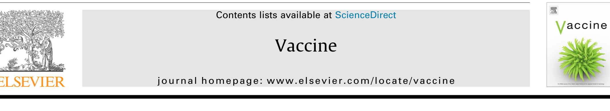
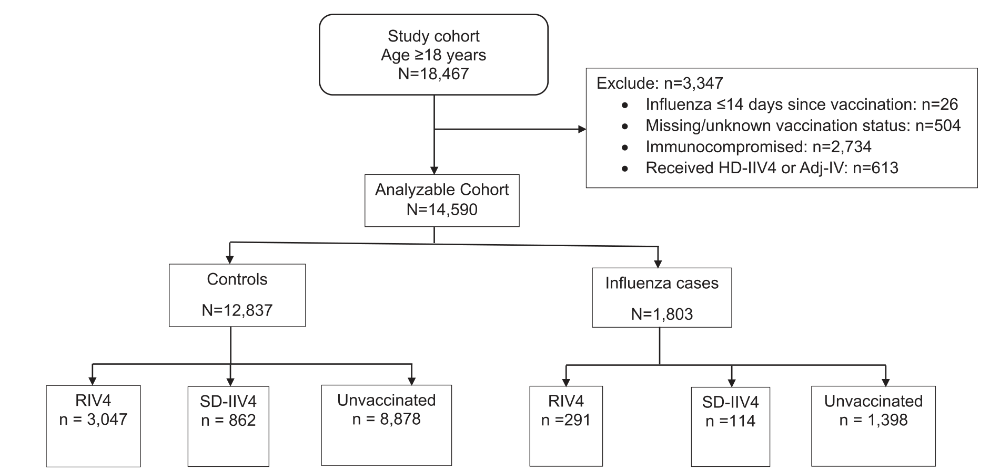
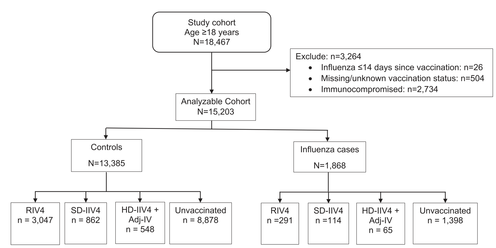
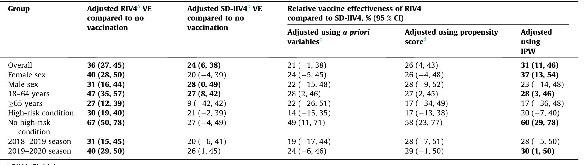
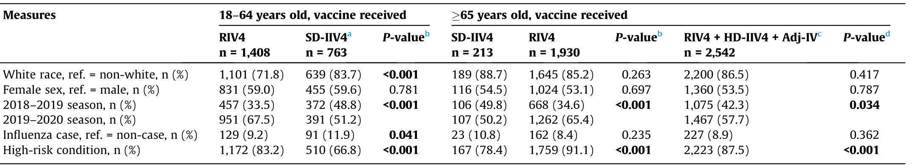
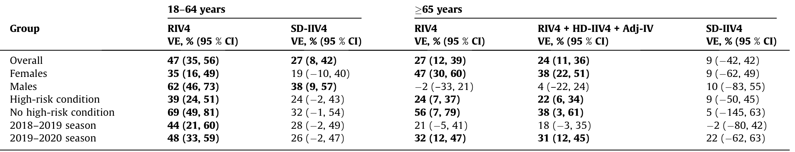
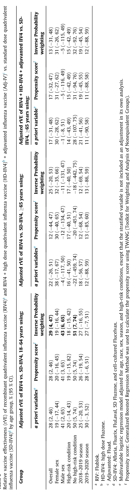

# Extracted Document

**Source:** data/clinical_files/Zimmerman et al. (2023).pdf

**Pages:** 7

---

## Page 1

**[FIGURE]**

### 1. Introduction
Despite the availability of an array of influenza vaccines and
recommendations for vaccination of individuals age 6 months
and over, influenza remains a major cause of
izations and mortality in the U.S. and world
1–2 decades, effectiveness of egg-based stand
vaccine has been modest [1–5]. New influenz

Conclusions: Over all adults, both RIV4 and SD-IIV4 were effective against influenza hospitalization,
RIV4 providing better protection compared with SD-IIV4 overall, for females, younger adults, and
with no high-risk conditions.
 2023 Elsevier Ltd. All rights rese

### were white (80 %),
65 years or older (

uite 600 Schenley Place, 4420 Bayard St., Pittsburgh, PA 15260, USA
n of Infectious Diseases/Pharmacy Department – AMP 5TH Floor Falk Medical Building, 3601 Fifth Ave, Pittsburgh, PA
a b s t r a c t
Background: Relative effectiveness of various vaccine formulations provide important input for vaccine
policy decisions and provider purchasing decisions. We used electronic databases to conduct a test-
negative case control study to determine relative vaccine effectiveness (rVE) of recombinant influenza
vaccine (RIV4) compared with standard dose vaccines (SD-IIV4) against influenza hospitalization.
Methods: Adults 18–64 and 65 years of age hospitalized in a large U.S. health system (19 hospitals) in
2018–2019 and 2019–2020 who were clinically tested for influenza using reverse transcription poly-
merase chain reaction (RT-PCR) assays were included. The hospital system electronic medical record
EMR) and the state immunization registry were used to confirm influenza vaccination. Propensity scores
with inverse probability weighting were used to adjust for potential confounders and determine rVE.
Results: Of the 14,590 individuals included in the primary analysis, 3,338 were vaccinated with RIV4 and
976 were vaccinated with SD-IIV4, with the balance of 10,276 being unvaccinated. Most participants

### acc
es a
test negat

Vaccine effectiveness of recombinant an
i
i
i fl
l
d h
i

Va
journal homepage: www

standard dose influenza
zation using a retrospective
ine
evier.com/locate/vaccine

## Page 2

2.1. Patients
Patients were individuals 18 years and older as of August 1 each
season who were hospitalized in one of nineteen UPMC hospitals
in central and southwestern Pennsylvania and had a test for influ-
enza at any time between 11/01/2018 and 04/30/2020. A Ther-
adoc database (an infection control software) was used to
identify those tested for influenza using reverse transcription poly-
merase chain reaction (RT-PCR) assays performed in a centralized
clinical lab for some hospitals and individual hospital labs for
others. Influenza cases were those who tested positive for influ-
enza and controls were those who tested negative for influenza,
regardless of any other identified viral infection. Both the EMR
and Pennsylvania Statewide Immunization Information System
(PA-SIIS) were queried for influenza vaccines given between
August 1 and the date of illness/PCR testing. Exclusion criteria were
testing within 2 weeks of vaccination, having 2 different types of

y
g
approved this retrospective study using EMR databases. A test-
negative case-control study estimates VE by comparing the odds
of vaccination among patients hospitalized with influenza like ill-
ness with confirmed influenza to the odds of vaccination among
controls, i.e., patients hospitalized with influenza like illness who
tested negative for influenza.

bidity and mortality. Additional rVE studies of new vaccine formu-
lations are needed to help determine vaccination best practices.
This study is a retrospective test-negative case-control study of
influenza VE against hospitalization using data from electronic
medical records (EMR) of a single large health system to determine
the rVE of RIV4 among adults 18–64 and 65 years of age in the
2018–2019 and 2019–2020 seasons.
2. Methods
The
University
of
Pittsburgh
Institutional
Review
Board

### influenza co
[12] there

Two large studies have explored rVE of recombinant quadriva
lent influenza vaccine (RIV4). The Medicare beneficiaries study
[10] using retrospective data as described above, reported signifi-
cant rVE of RIV4 vs. SD-IIV4) against influenza-related hospital
encounters. Secondly, a randomized controlled trial (RCT) found
significant
rVE
of
RIV4
compared
with
SD-IIV4
among
adults 50 years old, but not for adults 65 years old [11].
Given the higher cost of newer vaccines, and the high risk of

### laboratory-c
f
ll
l

Reasonably accurate VE and relative VE (rVE) estimates depend
upon having access to a sufficient number of recipients of any
given vaccine type. Research on high dose quadrivalent influenza
vaccine (HD-IIV4) has reported rVE for HD-IIV4 compared with
standard dose quadrivalent influenza vaccine (SD-IIV4) of 24 %
against laboratory-confirmed influenza [7] and 27 % against influ-
enza hospitalization [8]. Several studies of cell-cultured influenza
vaccine were conducted prior to the 2019–2020 season (when all
four vaccine strains were cell-cultured) and have not shown signif-
icant rVE against influenza illness compared with SD-IIV4 [9]. A
large retrospective study of Medicare beneficiaries (65 years of
age) in the 2019–2020 season demonstrated no significant rVE of
cell-cultured quadrivalent influenza vaccine (ccIIV4) compared
with SD-IIV4 against influenza-related hospital encounters [10]
However the study was limited by the fact that there were no
R.K. Zimmerman, M. Patricia Nowalk, K. Dauer et al.

### ditions and influenza s
i
d b l
f

marized across variables. We allow a maximum of three splits for
each tree in the model, allowing for three-way interactions among
all covariates to be considered. The shrinkage parameter was set to
0.0005 to ensure a smooth fit.
We also checked the balance of all the variables included in the
model to assess the quality of the propensity score and evaluate
common support, using a value under 0.25 as indicative of good
balance. We also used the balance plots to compare the propensity
score distributions and to evaluate the common support.
Using the propensity score, we calculated the inverse probabil-
ity of receiving SD-IIV4 weighting. In this approach, for an individ-
ual receiving SD-IIV4 t, the weight equals 1=ptðxÞ , where ptðxÞ is
the propensity score (probability that an individual with character-
istics x receives SD-IIV4 t). A propensity score weighted logistic
regression with influenza status as the dependent variable was fit-
ted to estimate the effect of vaccine (SD-IIV4 vs. RIV4) on outcome
and also used inverse probability weighting to estimate VE and its
95 % confidence intervals We added covariates like high risk con

Standard Dose Fluzone and FlucelVax. HD-IIV4 was High Dose Flu-
zone, RIV4 was Flublok and Adj-IV was FluAd. Other independent
variables were age, influenza season (2018–2019 and 2019–
2020), sex, race and presence of one or more high-risk conditions.
Adjusted VE was calculated for RIV4, SD-IIV4 and combined RIV4,
high dose, egg-based and adjuvanted vaccines. Relative VE (rVE)
was calculated as 1 minus the ratio of adjusted VE times 100 %.
We conducted propensity adjustment analyses to reduce the
potential impact of selection effects (i.e., confounding) on baseline
characteristics. We estimated the propensity scores using the Gen-
eralized Boosted Regression Models (GBM) approach, which is a
nonparametric model that allows for nonlinear relationships with
a maximum number of iterations set to the default (i.e.,10,000)
that minimized the balance statistics of interest. We used the bal-
ance statistic based on absolute standardized bias (also referred as
the effect size or absolute standardized mean difference) and sum-

and percentages for categorical data. Baseline characteristics
between the vaccination groups were compared using chi-square
or the Fisher’s exact tests for categorical variables and ages were
compared by using t-test.
Using adjusted odds ratios (aORs) obtained from multivariable
logistic regression models, adjusted VE estimates were calculated
as (1-aOR) X 100. The dependent variable of interest was influenza
status. The primary exposure of interest was vaccine type (recom-
binant, SD-IIV4s and in some analyses, enhanced vaccines such as
HD-IIV4 and adjuvanted influenza vaccine (Adj-IV)). The CDC has
recommended the use of ‘‘enhanced vaccines” for adults ages 65
and older beginning in 2022 [13]. Influenza vaccines were identi-
fied through the EMR; SD-IIV4 included Afluria, Fluarix, FluLaval,
S
d
d D
Fl
d Fl
lV
HD IIV4
Hi h D
Fl

respectively, thus these analyses were likely to be underpowered
to detect a significant rVE for RIV4 over SD-IIV4. Moreover, rVE
estimates by vaccine strain were also precluded by insufficient
sample sizes. Descriptions of variables for each group were sum-
marized as mean and standard deviation for age and frequencies
d
t
f
t
i
l d t
B
li
h
t
i ti

2.2. Statistical methods
For primary analysis, all adults 18 years were included, then
for
secondary
analyses,
they
were
stratified
into
age
groups 65 years, and 18–64 years. Sample size calculations deter-
mined that we had 48 % power to detect an effect size of 9.5 %
change from a baseline probability of 11.7 %. Post hoc sample size
calculations for age subgroup analyses resulted in 42 % and 20 %
power for ages 18–64 years and 65 years with effect sizes of
8.9 %, and 8.7 %, with the detectable difference of 3 % and 2.1 %
ti
l
th
th
l
lik l
t
b
d
d
Vaccine 41 (2023) 5134–5140

## Page 3

### analyses a
(80 %), jus

The total number of influenza test results among inpatients was
18,467 of which 530 were excluded because of missing vaccination
information or vaccination < 14 days before illness, and 3,264 were
excluded from the primary analyses because patients were
immunocompromised or received enhanced vaccines other than
RIV4 (n = 613), leaving 14,590 for the primary analysis (Fig. 1).
Of these, 3,338 were vaccinated with RIV4 and 976 were vacci-
nated with SD-IIV4, with the balance of 10,276 being unvaccinated.
For the secondary analyses, the analyzable cohort included the 613
HD-IIV4 and Adj-IV recipients bringing the total analyzable sample
to 15,203 (Fig. 2). The influenza positivity rate was 12.4 %
(1,803/14,590) overall, 14.4 % among younger adults 18–64 years
and 11.1 % (922/8306) among those 65 years, with the addition
of 613 patients who received enhanced vaccines that were not
included in the primary analysis.
Demographic characteristics of the population for the primary
l
h
i
bl
i i
hi

3. Results
The total number of influenza test results among inpatients was

**[FIGURE]**

### vaccine (RIV4), standard dose

adults 65 years. Again, having a high-risk condition was associ-
ated with receipt of one of these vaccines (87.5 % combined vs.
78.4 % SD-IIV4; P < 0.001).
Adjusted VEs for RIV4 for younger adults were significant across
all subgroups, whereas, VE for SD-IIV4 was significant for males
only. Among older adults, VE of RIV4 was significant for females
(47 %; 95 % CI = 30, 60) but not males (2 %; 95 % CI = –33, 21)
or for those with and without high-risk conditions. VEs for
those 65 years old receiving RIV4, HD-IV4 or Adj-IV showed sim-
ilar patterns of significance across subgroups (overall VE = 24 %;
95 % CI = 11, 36; females VE = 38 %; 95 % CI = 22, 51); high risk

white race (83.7 % RIV4 vs. 71.8 % SD-IIV4; P < 0.001), fewer cases
of influenza (9.2 % RIV4 vs. 11.9 % SD-IIV4; P < 0.041) and having a
high-risk condition (83.2 % RIV4 vs. 66.8 % SD-IIV4; P < 0.001).
Among older adults, receipt of RIV4 was significantly associated
with having a high-risk condition (91.1 % RIV4 vs. 78.4 % SD-IIV4
P < 0.001). In a second scenario older adults receiving SD-IIV4 were
compared with those receiving RIV4, HD-IIV4, or Adj-IV , because
these latter two ‘‘enhanced” vaccines are now recommended for
d l
65
A
i
h
i
hi h
i k
di i
i

R.K. Zimmerman, M. Patricia Nowalk, K. Dauer et al.
Vaccine 41 (2023) 5134–5140

## Page 4

**[FIGURE]**

RIV4: Flublok.
c SD-IIV4: Afluria, Fluarix, FluLaval, Standard Dose Fluzone and FlucelVax.

### High


y
,
(
)
,
(
)
(
)
Influenza case, ref. = non-case, n (%)
1,803 (12)
291 (9)
114 (12)
0.005

**[TABLE]**

quadrivalent influenza vaccine (SD-IIV4), high dose quadrivalent influenza vaccine (HD-IIV4), adjuvanted influenza v
otherwise excluded.

### None

,
,

## Page 5

### signifi
lt

g

y
firmed ILI nor culture positive ILI. For those 50–64 years, rVE was
significant against RT-PCR ILI (42 %; 95 % CI = 15 61) and against
y
p
y
10 codes and not specifically on laboratory confirmed influenza.
In a 2019 editorial Flannery and Fry stated ‘‘Evidence to inform

**[TABLE]**

ble 4
djusted vaccine effectiveness (VE) of recombinant quadrivalent influenza vaccine (RIV4), standard dose quadrivalent influenza vaccine (SD-IIV4), and RIV4 + high dose
adrivalent influenza vaccine (HD-IIV4) + adjuvanted influenza vaccine (Adj-IV), compared with no vaccination, by age group.
18–64 years
65 years
dj

### c RIV4
d F

a SD-IIV4: Afluria, Fluarix, FluLaval, SD Fluzone and FlucelVax.
b For difference between those receiving RIV4 and those receiving SD-IIV4.
c RIV4 Fl bl k HD IIV4 Hi h d
Fl
Adj IV Fl Ad

**[TABLE]**

able 3
haracteristics of participants by age group and vaccine received including recombinant
V4), high dose quadrivalent influenza vaccine (HD-IIV4) and adjuvanted influenza vac

### Groups)

u t
a ab e og st c eg ess o
ode adjusted o age, ace, se , seaso , a d
g
s
co d t o s, e cept t at t e st at
ed
a ab e s
ot
c uded as a
adjust
e t
ts own analysis.
d Propensity score: Generalized Boosted Regression Method was used to calculate the propensity score using TWANG (Toolkit for Weighting and Analysis of Nonequivalen

**[TABLE]**

Table 2
Vaccine effectiveness (VE) of recombinant quadrivalent influenza vaccine (RIV4) a
propensity scores and inverse probability weighting (IPW).
Group
Adjusted RIV4a VE
compared to no
vaccination
Adjusted SD-IIV4b VE
compared to no
vaccination
R.K. Zimmerman, M. Patricia Nowalk, K. Dauer et al.

lative vaccine effectiveness of RIV4
mpared to SD-IIV4, % (95 % CI)
justed using a priori
riablesc
Adjusted using propensity
scored
Adjusted
using
IPW

ndard dose quadrivalent influenza vaccine (SD-IIV4) and relative VE of RIV4 using
Vaccine 41 (2023) 5134–5140

## Page 6

**[TABLE]**

j
(
) g y
y
binding site that reduce the effectiveness of egg-based vaccines.
5. Conclusions

### wave precedes the influenza
circulation of A(H3N2) ma

ond, as an integrated healthcare system, its EMR is robust, with
regular uploads of vaccination data from the state immunization
registry. In addition, we verified vaccination status through the
state registry with a specific data request. In previous research,
we have demonstrated that registry data are a reasonable source
for influenza vaccination data [18]. As a result, we have confidence
that influenza vaccinations are captured accurately in the EMR. If
vaccinations were not captured in the EMR or state registry, they
were classified as unvaccinated. While this classification would
likely introduce bias into VE estimates [16], it would likely not bias
rVE estimates, as there is no reason to believe that any vaccine is
preferentially included or excluded from reporting to the state reg-
istry. This study excluded subjects with immunosuppressive con-
ditions or those receiving immunosuppressive therapy whose
response to vaccines is limited. Because data focused on hospital-
ized patients, there may have been milder cases that did not
require medical care and were not captured in the EMR, thus did
not contribute to these estimates. Adding measures of severity of
illness into the model would improve the accuracy of the VE esti-
mates, however, these measures were not available. The differ-
ences
in
severity
are
likely
narrower
given
that
all
were
sufficiently ill to require hospitalization, thus mitigating the need
for such an adjustment. It is possible that there may have been
selection bias among those who received influenza virus testing,
for example, clinicians may preferentially test those who are
unvaccinated against influenza thus increasing the proportion of
unvaccinated cases. Based on a previous study among patients in
this health system that found no increase in testing based on vac-
cination status [19], we feel confident that this is not a concern.
While a relatively large cohort of adults is included in this study,
the sample size of SD-IIV4 recipients may have been inadequate
to detect meaningful rVE estimates for specific subgroups.
These data should be viewed in the context of the seasons for
which data were collected. These seasons were ‘‘typical” in that
influenza began to increase in November, peaking in January and
February both seasons, and numbers of influenza-related deaths
were 28,000 in 2018–2019 and 25,000 in 2019–2020. These sea-
sons were atypical in that virtually no influenza B circulated in
2018–2019 but there were both A(H1N1) and A(H3N2) peaks
and in 2019–2020, influenza B circulated early followed by A
(H1N1) in contrast to typical seasons in which the influenza A

,
pp
p
adults 18–64 years of age.
4.1. Strengths and limitations
This study has several strengths and limitations. Firstly, the
demographics of the study population were similar to those of
the Allegheny County general population of adults in which 79 %
are white and 51 % are female [17], thus contributing to generaliz-
ability. Moreover, the health system includes urban tertiary and
quaternary care hospitals as well as suburban and rural commu-
nity hospitals. It has a 60 % market share of all hospital beds in
the county and accepts patients with all insurance products. Sec-

### ate potential im
dd
h
id

Vaccine 41 (2023) 5134–5140

## Page 7

### None

### None

Infect Dis 2014;58(3):319 27. https://doi.org/10.1093/Cid/Cit736.
[2] McLean HQ, Thompson MG, Sundaram ME, Kieke BA, Gaglani M, Murthy K,
et al. Influenza vaccine effectiveness in the United States during 2012–2013:
variable protection by age and virus type. J Infect Dis 2015;211(10):1529–40.
https://doi.org/10.1093/infdis/jiu647.

### [ ]
,
p
Influenza vaccine effe
h
i
l
i
i

the study, procure funding and edited the manuscript.
References

### manu
procu

d edited the manuscript. GKB oversaw the data preparat
alyses and edited the manuscript MPN drafted and edi

### RKZ
i
d h

views of the authors and not Sanofi.
Data
Deidentified data may be made available upon request.
Author contributions

### This work
initiated gr

eceived investigator-initiated grant funding from Sanofifor this
roject. Drs. Nowalk and Balasubramani, have grant funding from
Merck & Co., Inc. for an unrelated project. Ms. Dauer and Mr. Clarke
ave no conflicts to report.
Acknowledgements

### None

benefits of cell-culture isolation and manufacturing. Therap
Adv Vacc
Immunoth 2020;8:1–10. https://doi.org/10.1177/2515135520908121.
[10] Izurieta HS, Lu M, Kelman J, Lu Y, Lindaas A, Loc J, et al. Comparative
effectiveness of influenza vaccines among US Medicare beneficiaries ages 65
years and older during the 2019–2020 season. Clin Infect Dis 2021;73(11):
e4251–9.
[11] Dunkle LM, Izikson R, Patriarca P, Goldenthal KL, Muse D, Callahan J, et al.
Efficacy of recombinant influenza vaccine in adults 50 years of age or older. N
Engl J Med 2017;376(25):2427–36.
[12] Centers for Disease Control and Prevention. People at Higher Risk of Flu
Complications.
Updated
9/6/2022.
Accessed
12/19/2022,
https://www.
cdc.gov/flu/highrisk/index.htm.
[13] Grohskopf LA, Blanton LH, Ferdinands JM, Chung JR, Broder KR, Talbot HK,
Morgan RL, Fry AM. Recommendations of the Advisory Committee on
Immunization
Practices
—
United
States,
2022–23
Influenza
Season.
Morbidity and Mortality Weekly Report (MMWR). August 26, 2022;71
(1):1–28. https://doi.org/10.15585/mmwr.rr7101a1.
[14] Centers for Disease Control and Prevention. Archived: Estimated Influenza
Illnesses, Medical visits, Hospitalizations, and Deaths in the United States —
2018–2019 influenza season. Updated 9/30/2021. Accessed 2/7/2023, https://
www.cdc.gov/flu/about/burden/2018-2019/archive-09292021.html#::
text=The%20overall%20burden%20of%20influenza,hospitalizations%2C%20and
%2028%2C000%20flu%20deaths.
[15] Centers for Disease Control and Prevention. Estimated Flu-Related Illnesses,
Medical visits, Hospitalizations, and Deaths in the United States — 2019–2020
Flu Season. Updated 10/7/2022. Accessed 2/7/2023, https://www.cdc.gov/flu/
about/burden/2019-2020.html.
[16] Flannery B, Fry AM. Comparing influenza vaccine types: the path toward
improved influenza vaccine strategies. Oxford University Press US; 2019. p.
1237–9.
[17] United States CensusBureau. Quick Facts Allegheny County, Pennsylvania.
Accessed
2/7/2023,
https://www.census.gov/quickfacts/
alleghenycountypennsylvania.
[18] Nowalk MP, D’Agostino HEA, Zimmerman RK, Saul SG, Susick M, Raviotta JM,
et al. Agreement among sources of adult influenza vaccination in the age of
immunization information systems. Vaccine 2021;39(47):6829–36.
[19] Balasubramani GK, Saul S, Nowalk MP, Middleton DB, Ferdinands JM,
Zimmerman
RK.
Does
influenza
vaccination
status
change
physician
ordering patterns for respiratory viral panels? Inspection for selection bias.
Hum Vaccin Immunother 2019;15(1):91–6.

---

## Extraction Metadata

- Text blocks: 60

- Figures/Tables: 8
