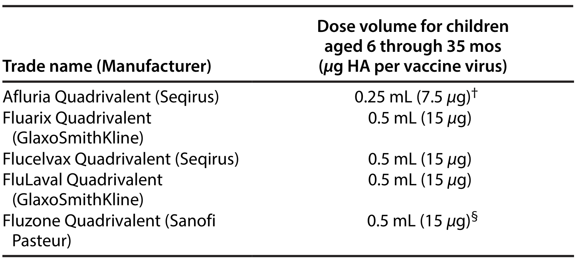

# Extracted Document

**Source:** data/clinical_files/Grohskopf et al. (2023).pdf

**Pages:** 32

---

## Page 1

**[FIGURE]**

### U.S. Department of Health and Human Services Centers for Disease Control and Prevention

### y Committee on Immunization Practices United States, 2022-23 Influenza Season

**[FIGURE]**

### 

## Page 2

**[FIGURE]**

### 

MMWR Editorial an Charlotte K. Kent, PhD, MPH, Editor in Chief Brian A. King, PhD, MPH, Executive Editor Christine G. Casey, MD, Editor Mary Dott, MD, MPH, Online Editor Ter is a F. Rut ledge, Managing Editor David C. Johnson, Lead Technical Writer-Editor Marella Meadows, Project Editor Martha F. Boyd, Lead Alexander J. Gott Julia C. Martin roe, St Visual Info Quang M. Doan, Terraye M. Information T MMWR Timothy F. J Matthew L. Boulton, MD, MPH Carolyn Brooks, ScD, MA Jay C. Butler, MD Virginia A. Caine, MD J h E Fi ldi MD MPH MBA David W William E. Halpe Jewel Mullen Jeff Nie C l Ph

Director become ag M bidit d M

vaccinations in adults are harm of AAFP, ACOG, and the A (ACP). ACIP recommend at Director become agenc guidel

(AAFP), and the American

.................................. 22 Pediatrics (AAP), t (AAFP) d h

22 with recommen P di i (AAP)

### MPA H Carlos Roig, MS, MA William Schaffner, MD Morgan Bobb Swanson, BS

MWR Recomm Rep 2022 71 no. RR-#):[inclusive page numbers]. rol and Prevention D, MPH, Director Principal Deputy Director for Public Health Science and Surveillance Director, Office of Science ty Director, Office of Science ance, Epidemiology, and Laboratory Services uction Staff (Serials) nformation Specialist ureen A. Leahy, Spriggs, Tong Yang, Specialists Phyllis H. King, oua Yang, y Specialists al Board D, Chairman g, MD , DrPH, MPH MPH MPA Patricia Quinlisk, MD, MPH Patrick L. Remington, MD, MPH C rl R i MS MA Ian Branam, MA, Acting Lead Health Communication Specialist Shelton Bartley, MPH, Symone Hairston, MPH Leslie Hamlin, Lowery Johnson, Health Communication Specialists Will Yang, MA, Visual Information Specialist

## Page 3

### quad rival ent adjuvant ed in activated influenza vaccine (aIIV4). If none of these three vaccines is available at an opportunity fo vaccine administration, then any other age appropriate influenza vaccine should be used. This report focuses on recommendations for the use of vaccine for the prevention and control of seasonal influenza during th or responding author: Lisa A. Grohskopf, Influenza Division, at ion al Center for Immunization and Respiratory Diseases, CDC. le phone: 404-639-2552; Email: lgrohskopf@cdc.gov.

mends that adults aged ≥65 years preferentially receive any one of the following higher dose or adjuvanted influenza vac valent high dose in activated influenza vaccine (HD-IIV4), quad rival ent recombinant influenza vaccine (RIV

f f (Victoria lineage like virus; and an influenza B/Phuket/3073/2013 (Yamagata lineage like virus. Second, the approved age indication for the cell culture based in activated influenza vaccine, Flu cel vax Quad rival ent (ccIIV4), was changed in October 2021 from ≥2 years to ≥6 months Third recommendations for vaccination of adults aged ≥65 years have been modified ACIP

### arwin/9/2021 d

through 8 years need 2 doses; these children should receive the first dose as soon as possible after vaccine is available, including during July and August. Vaccination during July and August can be considered for children of any age who need only 1 dose for the season and for pregnant persons who are in the third trimester if vaccine is available during those months. Updates described in this report reflect discussions during public meetings of ACIP that were held on October 20, 2021; January 12, 2022; February 23, 2022; and June 22, 2022. Primary updates to this report include the following three topics: 1) the composition of 2022-23 U.S. seasonal influenza vaccines; 2) updates to the description of influenza vaccines expected to be available for the 2022-23 season, including one influenza vaccine labeling change that occurred after the publication of the 2021-22 ACIP influenza recommendations; and 3) updates to the recommendations concerning vaccination of adults aged ≥65 years. First, the composition of 2022-23 U.S. influenza vaccines includes updates to the influenza A (H3 N2) and influenza B/Victoria lineage components. U.S.-licensed influenza vaccines will contain HA derived from an influenza A/Victoria/2570/2019 (H1 N1) pdm 09 like virus (for egg based vaccines) or an influenza A/Wisconsin/588/2019 (H1 N1) pdm 09 like virus (for cell

one influenza B/Victoria lineage virus, and one influenza B/Yamagata lineage virus. In activated influenza vaccines (IIV4 s) recombinant influenza vaccine (RIV4), and live attenuated influenza vaccine (LAIV4) are expected to be available. Tri valen influenza vaccines are no longer available, but data that involve these vaccines are included for reference. Influenza vaccines might be available as early as July or August, but for most persons who need only 1 dose of influenza vaccin for the season, vaccination should ideally be offered during September or October. However, vaccination should continue afte October and throughout the season as long as influenza viruses are circulating and unexpired vaccine is available. For most adul (particularly adults aged ≥65 years) and for pregnant persons in the first or second trimester, vaccination during July and Augus should be avoided unless there is concern that vaccination later in the season might not be possible. Certain children aged 6 month h h 8 d 2 d hhild hld i hfi dibl f i iil bl i ldi

y Practices - United States, 2022-23 Influenza Season Lisa A. Grohskopf, MD1; Lenee H. Bl anton, MPH1; Jill M. Ferdinands, PhD1; Jessie R. Chung, MPH1; Karen R. Broder, MD2; H. Keipp Talbot, MD3; Re be cca L. Morgan, PhD4; Alicia M. Fry, MD1 1 Influenza Division, National Center for Immunization and Respiratory Diseases, CDC; 2 Immunization Safety Office, National Center for Emerging and Zoo no tic Infectious Diseases, CDC; 3 Division of Infectious Diseases, Vanderbilt University Medical Center, Nashville, Tennessee; 4 Department of Health Researc Methods, Evidence, and Impact, Mc master University, Hamilton, Ontario, Canada Summary This report updates the 2021-22 recommendations of the Advisory Committee on Immunization Practices (ACIP) concerning the use of seasonal influenza vaccines in the United States (MMWR Recomm Rep 2021 70 no. RR-5]:1-24). Routine annual influenza vaccination is recommended for all persons aged ≥6 months who do not have contra indications. For each recipient, a licensed and age appropriate vaccine should be used. With the exception of vaccination for adults aged ≥65 years, ACIP makes no preferential recommendation for a specific vaccine when more than one licensed, recommended, and age appropriate vaccine is available. All seasonal influenza vaccines expected to be available in the United States for the 2022-23 season are quad rival ent, containing hemagglutinin (HA) derived from one influenza A (H1 N1) pdm09 virus, one influenza A (H3 N2) virus, one influenza B/Victoria lineage virus, and one influenza B/Yamagata lineage virus. In activated influenza vaccines (IIV4 s),

Prevention and Control of Se Recommendations of the Adv

easonal Influenza with Vaccines:

ory Committe

## Page 4

ates a d goba ydu g t e 0 0 ue a sea so 5). This was coincident with widespread implementation non pharmaceutical interventions (e.g., masking, social stan cing, and suspension of in person work and school) tended to prevent transmission of SARS-CoV-2 (the virus at causes COVID-19). Influenza activity increased during the vaccination coverage, program feasibility, cost effective ne and vaccine supply. Presentations are requested from invit experts, and published and unpublished data are discussed. The Background Document that supplements this report updated periodically to reflect recent additions to the liter atu

### viruses) (14). d hll l

the vaccine (12). During each of the six influenza seasons from 2010-11 through 2015-16, influenza vaccination prevented an estimated 1 6 6 7 million illnesses, 790 000 3 1 million outpatient medical visits, 39 000 87 000 hospitalizations, and 3 000 10 000 respiratory and circulatory deaths each season in the United States (13). During the severe 2017-18 season, notable for an unusually long duration of widespread high influenza activity throughout the United States and higher rates of outpatient visits and hospitalizations compared with recent seasons, vaccination prevented an estimated 7.1 million illnesses, 3.7 million medical visits, 109 000 hospitalizations, and 8,000 deaths (14), despite an overall estimated vaccine effectiveness of 38% (62% against influenza A[H1 N1]pdm09 viruses, 22% against influenza A[H3 N2] viruses, and 50%

Introduction Influenza viruses typically circulate annually in the United States, most commonly from the late fall through the early spring. Most persons who become ill after influenza virus infection recover without serious complications or sequelae. However, influenza can be associated with serious illnesses, hospitalizations, and deaths, particularly among older adults, very young children, pregnant persons, and persons of all ages with certain chronic medical conditions (1-7). Influenza also is an important cause of missed work and school (8-10). Routine annual influenza vaccination for all persons aged ≥6 months who do not have contra indications has been recommended by CDC and the Advisory Committee on Immunization Practices (ACIP) since 2010 (11). Vaccination provides important protection from influenza illness and its potential complications. The effectiveness of influenza vaccination varies depending on several factors, such as the age and health of the recipient; the type of vaccine administered; the types, subtypes (for influenza A), and lineages (for influenza B) of circulating influenza viruses; and the degree of similarity between circulating viruses and those included in the vaccine (12). During each of the six influenza seasons from

2022-23 influenza season in the United States. A brief sum mar Document containing additional information are available at These recommendations apply to U.S.-licensed influenza vac indications. Updates and other information are available from and health care providers should check this site periodically for I t dti

mend at ions and Reports

vacc specific flu html. Methods ACIP provides annual recommendations for the use of influenza vaccines for the prevention and control of seasonal influenza in the United States. The ACIP Influenza Work Group meets by teleconference once to twice per month throughout the year. Work group membership includes several voting members of ACIP, representatives of ACIP liaison organizations, and consultants. Discussions include topics

summarized (Tables 2 and 3). Abbreviations are used in this report to denote the various types of vaccines (Box). This report focuses on recommendations and guidance for the use of seasonal influenza vaccines for the prevention and control of influenza during the 2022-23 season in the United States. A summary of these recommendations and a Background Document containing additional information on influenza, influenza associated illness, and influenza vaccines are available at https://www.cdc.gov/vaccines/hcp/acip-recs/ vacc-specific/flu.html.

p g This report updates the 2021-22 ACIP recommendations regarding the use of seasonal influenza vaccines (17) and provides recommendations and guidance for vaccination providers regarding the use of influenza vaccines in the United States for the 2022-23 season. Various formulations of influenza vaccines are available (Table 1). Contra indications and precautions for the use of influenza vaccines are summarized (Tables 2 and 3). Abbreviations are used in this

### care system dur dance for vaccin

sused according to Food and Drug Administration licensed DC’sinfluenza website (https www cdc gov flu. Vaccination dit ion al information. 2021-22 season, although severity indicators (e.g., influenza associated hospitalizations and deaths) were overall lower than in recent previous seasons (16). Timing, intensity, and severity of the 2022-23 influenza season cannot be predicted. Influenza vaccination remains an important tool for the prevention of potentially severe respiratory illness, which might decrease stress on the U.S. health care system during ongoing circulation

the recommendations and alink to the most recent Background ps://www.cdc.gov/vaccines/hcp/acip-recs/vacc-specific/flu.html. ddi F d d D Ad i i ili d

## Page 5

already recommended for vaccination, and changes that

**[TABLE]**

Flublok Quad rival ent (San of i Pasteur) 0.5 mL PFS ≥18 yrs 45 µg/0.5 mL IM LAIV4 (egg based vaccine†) Fl Mi t Q d i l t 0 2 L fill d i l 2 th h 49 106 5 7 5 fl t NAS

ad Quad rival ent eqirus) 0.5-mL PFS ≥65 yrs 15 µg/0.5 mL IM¶ 4 (recombinant HA vaccine)

cel vax Quad rival ent Seqirus) 0.5 mL PFS ≥6 mos 15 µg/0.5 mL IM 5.0-mL MDV ≥6 mos 15 µg/0.5 mL IM¶ 25 D-IIV4 (high dose, egg based vaccine†) zone High-Dose Quad rival ent San of i Pasteur) 0.7-mL PFS ≥65 yrs 60 µg/0.7 mL IM¶ V4 (standard dose, egg based vaccine† with MF59 adjuvant)

15 µg/0.5 mL d-dose, cell culture based vaccine)

) uLaval Quad rival ent GlaxoSmithKline) 0.5-mL PFS ≥6 mos 15 µg/0.5 mL IM¶ uzone Quad rival ent San of i Pasteur) 0.5-mL PFS†† ≥6 mos†† 15 µg/0.5 mL IM¶ 0.5-mL SDV†† ≥6 mos†† 15 µg/0.5 mL IM¶ 5.0-mL MDV†† ≥6 mos†† 7.5 µg/0.25 mL IM¶ 25

TABLE 1. Influenza vaccines - United States, 2022-23 influenza seas Trade name (manufacturer) Presentations Age indicati IIV4 (standard dose, egg based vaccines†) Afluria Quad rival ent (Seqirus) 0.5-mL PFS§ ≥3 5.0-mL MDV§ ≥6 m

µg HA (IIV4 s and RIV4) or virus count (LAIV4) for each vaccine virus (per dose) Route Mercury (from thimerosal, if present), µg/0.5 mL 15 µg/0.5 mL IM¶ -** 7.5 µg/0.25 mL IM¶ 24.5

g y (jet injector) Fluarix Quad rival ent (Gl S i hKli ) 0.5-mL PFS ≥6 mos 15 µg/0.5 mL IM¶ -

## Page 6

**[TABLE]**

wheezing episode has occurred during the preceding 12 months • Children and adults who are immunocompromised due to any cause, including but not limited to immunosuppression caused by medications, congenital or acquired immunodeficiency states, HIV infection anatomic asp len i a or functional asp len i a (e gdue to sickle

dadolescents§ ildren aged 2 through 4 years who have received a diagnosis of hma or whose parents or caregivers report that a health care ovider has told them during the preceding 12 months that their ld had wheezing or asthma or whose medical record indicates a • Other underlying medical conditions that might predispose to complications after wild type influenza infection (e.g., chronic pulmonary, cardiovascular [except isolated hypertension], renal, hepatic, neurologic, he mato logic, or metabolic disorders [including diabetes mellitus])

influenza vaccine • History of severe allergic reaction to a previous dose of any other influenza vaccine (i.e., any egg based IIV, ccIIV, or LAIV)¶ V4 • History of severe allergic reaction (e.g., anaphylaxis) to any component of the vaccine† or to a previous dose of any influenza vaccine (i.e., any egg based IIV, ccIIV, RIV, or LAIV)§ • Concomitant aspirin- or salicylate-containing therapy in children and adolescents§ • Moderate or severe acute illness with or without fever • History of Guillain-Barré syndrome within 6 weeks of receipt of influenza vaccine • Asthma in persons aged ≥5 years Other underlying medical conditions that might predispose to

• History of severe allergic reaction to a previous dose of any other influenza vaccine (i.e., any egg based IIV, RIV, or LAIV)¶ 4 • History of severe allergic reaction (e.g., anaphylaxis) to a previous dose of any RIV or any component of RIV4§ • Moderate or severe acute illness with or without fever • History of Guillain-Barré syndrome within 6 weeks of receipt of influenza vaccine

g-based IIV4 s • History of severe allergic reaction (e.g., anaphylaxis) to any component of the vaccine† or to a previous dose of any influenza • Moderate or severe acute illness with or without fever • History of Guillain-Barré syndrome within 6 weeks of receipt of

## Page 7

adults aged ≥65 years. Information relevant to these changes includes the following: vaccines and related biological products advisory committee march 3 2022 meeting announcement.

**[TABLE]**

y Primary updates and changes to the recommendations described in this report include 1) the vaccine virus composition for 2022-23 U S seasonal influenza vaccines; g y Committee (VRBPAC). This committee considers the recommendations of WHO, reviews and discusses similar data, and makes a final decision regarding vaccine virus composition

gyears discussed in this document. y , of its Vaccines and Related Biological Products Advisor

anaphylaxis) to any RIV of any valency, the provider can consider administering ccIIV4. Providers can also consider consulting with an allergist to help determine which vaccine component is responsible for the allergic reaction. English language articles on influenza and influenza vaccines. Typically, systematic review and evaluation of evidence using the Grading of Recommendations Assessment, Development and Evaluation (GRADE) approach (18) are performed for new recommendations or substantial changes in the current recommendations (e.g., expansion of the recommendation for influenza vaccination to new populations not previously recommended for vaccination or potential preferential recommendations for specific vaccines). Systematic review, GRADE, and the ACIP Evidence to Recommendations Framework were used in the development of the updated • Recommendations for the composition of Northern Hemisphere influenza vaccines are made by the World Health Organization (WHO), which organizes a consultation, usually in February of each year. Surveillance data are reviewed, and candidate vaccine viruses are discussed. Information about the WHO meeting on February 25, 2022, for selection of the 2022-23 Northern Hemisphere vaccine viruses is available at https://www.who.int/news/item/25-02-2022recommendations-announced-for-influenza-vaccinecomposition-for-the-2022-2023-northern-hemisphereinfluenza-season Subsequently FDA which has regulatory

( y y); , q * Vaccination providers should check FDA-approved prescribing information for (but not limited to) indications, contra indications, warnings, and precautio vaccines blood biologics vaccines vaccines licensed use united states. † When a contra indication is present, a vaccine should not be administered, con Hunter P. General best practice guidelines for immunization: best practices gcdc.gov/vaccines/hcp/acip-recs/general-recs/index.html). In addition to the care noted in the table, each individual influenza vaccine is contra indicated for of that vaccine. Vaccine components can be found in package inserts. Although ato the use of egg based IIV4 s and LAIV4, ACIP recommends that persons wit that is otherwise appropriate for their age and health status. Those who report hor swelling, respiratory distress, lightheaded ness, or recurrent emesis) or who re in an inpatient or outpatient medical setting (including but not necessarily lim than ccIIV4 or RIV4 is used. Vaccine administration should be supervised by a § When a precaution is present, vaccination should generally be deferred but man adverse reaction, consistent with ACIP General Best Practice Guidelines immunization: best practices guidance of the Advisory Committee on Immu index html. Providers can consider using the following vaccines in these insta with supervision by a health care provider who is able to recognize and man (e.g., anaphylaxis) to any egg based IIV or LAIV of any valency, the provider ca

TABLE 3. Influenza vaccine contra indications and precautions for pe influenza vaccine* - United States, 2022-23 influenza season Vaccine (of any valency) associated with previous severe allergic reaction (e.g., anaphylaxis) Egg based IIV4 s and LA Any egg based IIV or LAIV Contra indication Any ccIIV Contra indication Any RIV Contra indication Unknown influenza vaccine Abbreviations: ACIP = Advisory Committee on Immunization Practices; ccIIV = cbased in activated influenza vaccine, quad rival ent; FDA = Food and Drug Admin is vaccine, quad rival ent; LAIV = live attenuated influenza vaccine (any valency); LA vaccine (any valency); RIV4 = recombinant influenza vaccine, quad rival ent.

Available 2022-23 influenza vaccines ccIIV4 RIV4 Precaution§ Precaution§ Contra indication Precaution§ Precaution§ Contra indication Allergist consultation recommended ulture-based in activated influenza vaccine (any valency); ccIIV4 = cell culture on; IIV = in activated influenza vaccine (any valency); IIV4 = in activated influenza = live attenuated influenza vaccine, quad rival ent; RIV = recombinant influenza 23 influenza vaccines for the most complete and updated information, including kage inserts for U.S.-licensed vaccines are available at https www fda gov with ACIP General Best Practice Guidelines for Immunization (Kroger A, Bahta L, ce of the Advisory Committee on Immunization Practices [ACIP]. https www. di cations based on history of severe allergic reaction to influenza vaccines that ns who have had a severe allergic reaction (e.g., anaphylaxis) to any component yof severe allergic reaction (e.g., anaphylaxis) to egg is a labeled contra indication tory of egg allergy may receive any licensed, recommended influenza vaccine had reactions to egg involving symptoms other than urticaria (e.g., an gi oedema depinephrine or another emergency medical intervention should be vaccinated hospitals, clinics, health departments, and physician offices), if a vaccine other care provider who is able to recognize and manage severe allergic reactions. eindicated if the benefit of protection from the vaccine outweighs the risk for mun iz at ion (Kroger A, Bahta L, Hunter P. General best practice guidelines for n Practices [ACIP]. https://www.cdc.gov/vaccines/hcp/acip-recs/general-recs/ owever, vaccination should occur in an inpatient or outpatient medical setting vere allergic reactions: 1) for persons with a history of severe allergic reaction der administering ccIIV4 or RIV4; 2) for persons with a history of severe allergic i i t i RIV4 d 3) fith hi t fll iti (

## Page 8

g p g A summary of the ACIP Evidence to Recommendations

BOX. Abbreviation conventions for influenza vaccines discussed in his report • Main influenza vaccine types: ű IIV = in activated influenza vaccine ű RIV = recombinant influenza vaccine ű LAIV = live attenuated influenza vaccine • Numerals following letter abbreviations indicate valency (the number of influenza virus hemagglutinin [HA] antigens represented in the vaccine): ű 4 for quad rival ent vaccines: one A (H1 N1), one A (H3 N2), and two B viruses (one from each lineage) ű 3 for trivalent vaccines: one A (H1 N1), one A (H3 N2), and one B virus (from one lineage) • All influenza vaccines expected to be available in the United States for the 2022-23 season are quad rival ent vaccines. However, abbreviations for trivalent vaccines (e.g., IIV3) might be used in this report when discussing information specific to trivalent vaccines. • Abbreviations for general vaccine categories (e.g., IIV) might be used when discussing information that is not specific to either trivalent or quad rival ent vaccines. • Prefixes are used when necessary to refer to certain specific IIVs: ű afor MF59-adjuvanted in activated influenza vaccine (e.g., aIIV3 and aIIV4) ű cc for cell culture based in activated influenza vaccine (e.g., ccIIV3 and ccIIV4) ű HD for high dose in activated influenza vaccine (e.g., HD-IIV3 and HD-IIV4) ű SD for standard dose in activated influenza vaccine (e.g. SD-IIV3 and SD-IIV4) • Regarding recommendations concerning newly licensed influenza vaccines and changes to the licensed indications for existing vaccines, ACIP relies on FDA for review of safety, immunogen i city, and efficacy and effectiveness data pertaining to licensure and la be ling of influenza vaccines. Vaccines that are expected to be available for the 2022-23 season are described (see Vaccines Available for the 2022-23 Season) (Table 1). Regulatory information pertinent to the change in age indication for Flu cel vax Quad rival ent discussed in this report is available at https:// www fda gov vaccines blood biologics vaccines flu cel vax quad rival ent. • Regarding updated recommendations for influenza vaccines for adults aged ≥65 years, a summary of the review of evidence on this topic is available at https www cdc. gov/vaccines/acip/recs/grade/influenza-older-adults.html.

influenza vaccine (RIV), and MF59-adjuvanted in activated influenza vaccine (aIIV), recommendations for influenza vaccination of persons aged ≥65 years

### ≥6 months. On the basis of review of evidence concerning high-

y Q comparator IIV4 among 2,402 children aged 6 through 47 months, of whom 894 were aged 6 through 23 months. Flu cel vax Quad rival ent is now approved for persons aged ≥6 mnth

Framework for this discussion is available at https www. cdc.gov/vaccines/acip/recs/grade/influenza-older-adultsetr.html. Primary Changes and Updates

## Page 9

nfluenza season, possible waning of vaccine induced unity over the course of a season, and programmatic derations. Influenza vaccines might be available as early yor August; however, vaccination during these months trecommended for most groups because of the possible ng of immunity over the course of the influenza season 32). For most persons who need only 1 dose of influenza ne for the season, vaccination should ideally be offered ng September or October. However, vaccination should nue after October and throughout the influenza season as as influenza viruses are circulating and unexpired vaccine ilable.

### Because timing of the onset, peak, and decline of influen vity varies, the ideal time to start vaccinating cannot dic ted each season. Decisions about timing nec ess it iid ti di thi di tbi lit

### Timing of Vaccination

persons aged ≥6 months who do not have contra indications. Recommendations regarding timing of vaccination, considerations for specific populations, the use of specific vaccines, and contra indications and precautions are summarized in the sections that follow.

### Recommended for Vacc

q g (HD-IIV4), quad rival ent recombinant influenza vaccine (RIV4), or quad rival ent adjuvanted in activated influenza vaccine (aIIV4). If none of these three vaccines is available at an opportunity for vaccine administration, then any other age appropriate influenza vaccine should be used Higher dose vaccines include HD-IIV4 and RIV4, both of which contain a higher dose of HA antigen per virus than standard dose vaccines (60 µg for HD-IIV4 and 45 µg for RIV4, compared with 15 µg for standard dose in activated vaccines). Adjuvanted in activated influenza vaccine (aIIV4) contains MF59 adjuvant. Recommendations for the Use of Influenza Vaccines, 2022-23 d d f

vaccine is available) to allow the second dose (which must be administered ≥4 weeks later) to be received, ideally, by the end of October. • Children who require only 1 dose: Vaccination during July and August can be considered for children of any age who need only 1 dose of influenza vaccine for the season. While waning of immunity after vaccination over the course of the season has been observed among all age groups (19 32, there are fewer published studies reporting results specifically among children (19 22. Moreover, children in this group might visit health care providers during the late summer months for medical examinations before the start of school. Vaccination can be considered at this time because it represents a vaccination opportunity. • Pregnant persons in the third trimester: Vaccination during July and August can be considered for pregnant persons who are in the third trimester because vaccination might reduce risk for influenza illness in their infants during the first months after birth, when they are too young to receive influenza vaccine (33 36. For pregnant persons in the first or second trimester during July and August, waiting to vaccinate until September or October is preferable, unless there is concern that later vaccination might not be possible. Community vaccination programs should balance maximizing the likelihood of persistence of vaccine induced protection through the season with avoiding missed opportunities to vaccinate or vaccinating after onset of influenza circulation occurs. Efforts should be structured to optimize vaccination coverage before influenza activity in the community begins. Vaccination should continue to be offered as long as influenza viruses are circulating and unexpired vaccine is available. To avoid missed opportunities for

p g ptrimester: Vaccination during July and August should be avoided unless there is concern that vaccination later in the season might not be possible. • Children who require 2 doses: Certain children aged 6 months through 8 years require 2 doses of influenza vaccine for the season (see Children Aged 6 Months Through 8 Years: Number of Influenza Vaccine Doses) (Figure). These children should receive their first dose as soon as possible (including during July and August, if i iil bl ) ll h d d ( hi h

## Page 10

more than one outbreak might occur in a community in a single year. In the United States, localized outbreaks indicating the start of seasonal influenza activity can occur as early as October.

**[FIGURE]**

acc i nation, providers should offer vaccination during routine health care visits and hospitalizations. No recommendation is made for re vaccination (i.e., providing a booster dose) later nthe season of persons who have been fully vaccinated for he season, regardless of when the current season vaccine was received.

* Children aged 6 months through 8 years who require 2 doses of influenza vaccine should receive their first dose as soon as possible (including during July and August, if vaccine is available) to allow the second dose (which must be administered ≥4 weeks later) to be received, ideally, by the end of October. For children aged 8 years who require 2 doses of vaccine, both doses should be administered even if the child turns age 9 years between receipt of dose 1 and dose 2. d hld ff d

during same or consecutive seasons.) Yes No or unknown 1 dose of 2022-23 influenza vaccine 2 doses of 2022-23 influenza vaccine (administered ≥4 weeks apart)

FIGURE. Influenza vaccine dosing algorithm for children aged 6 months through 8 years* - Advisory Committee on Immunization Practices, United States, 2022-23 influenza season Did the child receive ≥2 doses of ...fl i

of influenza vaccine effectiveness using the test negative design found a significant decline in effectiveness within 180 days after vaccination against influenza A (H3 N2) and influenza B but not against influenza A (H1 N1) (38). In addition to the factors observed to be associated with waning immunity across studies, observed decreases in protection might be at least in

Certain studies suggest waning occurs to a greater degree against influenza A (H3 N2) viruses than against influenza A (H1 N1) or influenza B viruses (26 27. This effect also might vary with recipient age; in certain studies, waning was more pronounced among older adults (19 23 26 30 32 and younger children (19). Relatively fewer reports include results specific to children (19 22; findings suggestive of waning have been reported in certain studies (19 21 but not others (22). Rates of decline in vaccine effectiveness also varied. A multi season (2011-12 through 2014 15 analysis from the U.S. Influenza Vaccine Effectiveness (U.S. Flu VE) Network found that vaccine effectiveness decreased by approximately 7% per month for influenza A (H3 N2) and influenza B and 6 11 per month for influenza A (H1 N1) pdm09 (25). Vaccine effectiveness remained greater than zero for at least 5-6 months after vaccination. In the Hospitalized Adult Influenza Vaccine Effectiveness Network (HAI VEN during the 2015-16 through 2018-19 seasons, vaccine effectiveness against influenza associated hospitalizations declined by approximately 8%-9% per month for all adults and approximately 10 11 per month for those aged ≥65 years (32). An analysis of the 2010-11 through 2013-14 seasons noted estimated effectiveness ranging from 54% to 67% during days 0-180 post vaccination; estimated vaccine effectiveness was not significant during the period between days 181 and 365 (20). A third multi season analysis (2010-11 through 2014 15 conducted in Europe noted a decline in vaccine effectiveness to 0% at 111 days post vaccination against influenza A (H3 N2) viruses. Vaccine effectiveness against influenza B viruses decreased more slowly, and vaccine effectiveness against influenza A (H1 N1) pdm09 viruses remained roughly stable at 50 55 throughout the influenza season (27). A meta analysis of 14 studies examining waning f ifl iff ...i

## Page 11

increased risk for severe illness and complications from influenza and for influenza related outpatient, emergency department, or hospital visits. When vaccine supply is limited, vaccination

vaccine routinely, and organized vaccination campaigns should continue throughout the influenza season, including after influenza activity has begun in the community. Although vaccination by the end of October is recommended, vaccine administered in December or later, even if influenza activity has already begun, might be beneficial in most influenza seasons. Providers should offer influenza vaccination to un vaccinated persons who have already become ill with influenza during the season because the vaccine might protect them against other circulating influenza viruses. Guidance for Influenza Vaccination in Specific Populations and Situations Populations at Higher Risk for Medical Complications Attributable to Severe Influenza All persons aged ≥6 months who do not have contra indications should be vaccinated annually. However, vaccination to prevent influenza is particularly important for persons who are at increased risk for severe illness and complications from influenza

simulated mathematical model examining various scenarios of vaccination timing, timing of onset of the influenza season, vaccine effectiveness, and rate of waning (39). In this model, during an influenza season beginning in October and peaking in January, delaying vaccination until October resulted in more hospitalizations if >14% of persons aged ≥65 years who would have been vaccinated in August or September failed to get vaccinated. However, these predictions varied considerably with assumed timing of season onset, rate of waning immunity, and vaccine effectiveness. Vaccination efforts should continue throughout the season because the duration of the influenza season varies, and influenza activity might not occur in certain communities until February, March, or later. Providers should offer influenza vaccine routinely and organized vaccination campaigns should

### might result in missed opportunities to vaccinate las difficulties in vaccinating a population within amo strained period. The potential contributions of these facto

### dete at o o aopt a t eto vacc ate. og a issues also are a consideration. Although delaying vaccinat might result in greater immunity later in the season, defe

part attributable to bias, unmeasured confounding, or the late season emergence of antigenic drift variants of influenza viruses that are less well matched to the vaccine viruses. Varying data concerning the presence and rate of waning immunity after influenza vaccination, coupled with the unpredictable timing of the influenza season each year, prevent determination of an optimal time to vaccinate Programmatic

personnel, dental personnel, pharmacists, laboratory personnel, autopsy personnel, students and trainees, contractual staff persons, and others not directly involved in patient care but who might be exposed to infectious

these listed groups. Contra indications and precautions for the use of LAIV4 are noted (Tables 2 and 3). Persons Who Live with or Care for Persons at Higher Risk for Influenza-Related Complications All persons aged ≥6 months without contra indications should be vaccinated annually. However, emphasis also should be placed on vaccination of persons who live with or care for those who are at increased risk for medical complications attributable to severe influenza. When vaccine supply is limited, vaccination efforts should focus on administering vaccination to persons at higher risk for influenza related complications as well as persons who live with or care for such persons, including the following: • Health care personnel, including all paid and unpaid persons working in health care settings who have the potential for exposure to patients or to infectious materials. These personnel might include but are not limited to physicians, nurses, nursing assistants, nurse practitioners, physician

for adults). An IIV4 or RIV4 (as appropriate for the recipient sage is suitable for persons in all risk groups. LAIV4 is not recommended for certain populations, including certain of these listed groups. Contra indications and precautions for the f LAIV4 d (T bl 2 d 3)

### facilities. • American Indian or Alaska Native persons. • Persons who are extremely obese (body mass index ≥

metabolic disorders (including diabetes mel lit us). • Persons who are immunocompromised due to any cause (including but not limited to immunosuppression caused by medications or HIV infection). • Persons who are or will be pregnant during the influenza season. • Children and adolescents (aged 6 months through 18 years) who are receiving aspirin- or salicylate-containing medications and who might be at risk for experiencing Reye syndrome after influenza virus infection. • Residents of nursing homes and other long term care f l

forts should focus on vaccination of persons at higher risk for medical complications attributable to severe influenza who do ot have contra indications. These persons include the following no hierarchy is implied by order of listing): • All children aged 6 through 59 months. • All persons aged ≥50 years. • Adults and children who have chronic pulmonary (including asthma), cardiovascular (excluding isolated hypertension), renal, hepatic, neurologic, hem a to logic, or metabolic disorders (including diabetes mel lit us). P h i i d d

## Page 12

ps://www.cdc.gov/vaccines/pandemic guidance index html up to date information.

p y ( ) However, such persons need not be restricted from caring for or visiting less severely immunocompromised persons. Influenza Vaccination of Persons with COVID-19 Vaccination of persons who have tested positive for COVID-19 or who are in quarantine after an exposure should include multiple considerations, such as whether bringing the person into a vaccination setting could expose others to COVID-19, whether the person is acutely ill and the severity of the illness, the presence of risk factors for severe influenza illness, the likelihood of being able to vaccinate at a later date, and the desire to avoid confusing post vaccination symptoms with those of COVID-19. Usually, persons who are in quarantine or isolation should not be brought to a vaccination setting if doing so could expose others to COVID-19. For those who have moderate or severe COVID-19, vaccination should usually be deferred until they have recovered, which is consistent with ACIP General Best Practice Guidelines for

### contact with such persons for 7 days after vaccination (41

volunteers). ACIP guidance for vaccination of health care personnel has been published previously (40). • Household contacts (including children aged ≥6 months) and caregivers of children aged ≤59 months (<5 years) and adults aged ≥50 years, particularly contacts of children aged <6 months. • Household contacts (including children aged ≥6 months) and caregivers of persons with medical conditions that put them at higher risk for severe complications from influenza. Health care personnel and persons who are contacts of persons in these groups (with the exception of contacts of severely immunocompromised persons who require a protected environment) may receive any influenza vaccine that is otherwise indicated. Persons who care for severely immunocompromised persons requiring a protected environment should not receive LAIV4. ACIP and the Healthcare Infection Control Practices Advisory Committee (HICPAC) have previously recommended that health care personnel who receive LAIV should avoid providing care for severely immunocompromised persons requiring a protected environment for 7 days after vaccination dth t hit l iit h h i d LAIV hld id

### 2022-23 influenza vaccine and 2) the number of doses influenza vaccine received in previous influenza seasons.

obtained or any remaining volume in the vial. Children Aged 6 Months Through 8 Years: Number of Influenza Vaccine Doses Children aged 6 months through 8 years require 2 doses of influenza vaccine administered a minimum of 4 weeks apart during their first season of vaccination for optimal protection (45 48. Determination of the number of doses needed is based on 1) the child sage at the time of the first dose of 2022 23 ifl i d 2) h b f d f

(aIIV4) are not approved for persons aged <65 years. Care should be taken to administer an age appropriate vaccine at h i l fhd F IIV4 h d d

should receive 0.5 mL per dose. Alternatively, healthy children aged ≥24 months (≥2 years) may receive LAIV4, 0.2 mL in tran a sally (0.1 mL in each nostril). LAIV4 is not recommended for certain populations and is not approved for children aged <2 years (see Contra indications and Precautions for the Use of LAIV4) (Table 2). RIV4 is not approved for children aged <18 years. High dose in activated influenza vaccine (HD-IIV4) and adjuvant ed in activated influenza vaccine ( IIV4) d f d 65

2022-23 season. For children aged 6 through 35 months, a 0.25-mL dose must be obtained from a multi dose vial (43). • Fluarix Quad rival ent: 0.5 mL per dose. • Flu cel vax Quad rival ent: 0.5 mL per dose. • FluLaval Quad rival ent: 0.5 mL per dose. • Flu zone Quad rival ent: either 0.25 mL or 0.5 mL per dose. Per the package insert, each dose may be given at either volume (44); however, the 0.25-mL pre filled syringes are no longer available. For all of these IIV4 s, persons aged ≥36 months (≥3 years) should receive 0 5 mL per dose

### for children aged 6 through 35 months are as follows • Afluria Quad rival ent: 0.25 mL per dose. However pre filled syringes are not expected to be availab

g g Vaccine Dose Volumes Five IIV4 s are approved for children aged ≥6 months (Table 1). Four of these vaccines are egg based (Afluria Quad rival ent, Fluarix Quad rival ent, Flu laval Quad rival ent, and Flu zone Quad rival ent, and one is cell culture based (Flu cel vax Quad rival ent. For these vaccines, the approved dose volumes fhild d 6 h h 35 h fll (T bl 4)

## Page 13

g y yinfluenza vaccine for the 2022-23 season.

**[TABLE]**

trivalent or quad rival ent influenza vaccine ≥4 weeks apart before July 1, 2022, or whose previous influenza vaccination history is unknown, require 2 doses for the 2022-23 season The interval between the 2 doses

of doses of influenza vaccine needed for the 2022-23 influenza season is determined as follows (Figure): ű Those who have previously received ≥2 total doses of trivalent or quad rival ent influenza vaccine ≥4 weeks apart before July 1, 2022, require only 1 dose for the 2022-23 season. The 2 previous doses of influenza vaccine do not ...ith

### or any remaining volume in the vial. Any vaccine remaining in avial after the maximum number of doses has been removed should be discarded. • For children aged 6 months through 8 years the number

ildren aged 6 through 35 months United States, 2022 23 nza season Dose volume for children

### receive any one of the

receipt of IIV containing influenza A (H1 N1) pdm09 and risk for miscarriage in the 28 days after receipt of IIV, when an H1 N1 pdm 09 containing vaccine also had been received the previous season (62). However, in a larger VSD follow up study, IIV was not associated with an increased risk for miscarriage during the 2012-13, 2013-14, and 2014-15 seasons, regardless of previous season vaccination (63). Substantially less experience exists with more recently licensed IIVs (e.g., quad rival ent and cell culture based vaccines) during pregnancy than with previously available products. For RIV (available as RIV3 from 2013-14 through 2017-18 and as RIV4 since 2017 18, data are limited to reports of pregnancies occurring incidentally during clinical trials, Vaccine Adverse Event Reporting System (VAERS) reports, and pregnancy registries. Pregnancy registries and surveillance studies exist for certain products, for which information can be found in package inserts. Older Adults ACIP recommends that adults aged ≥65 years preferentially receive any one of the following higher dose or adjuvanted

can be used postpartum. Influenza vaccine can be administered at any time during pregnancy (i.e., during any trimester), before and during the influenza season. Early vaccination (i.e., during July and August) can be considered for persons who are in the third trimester during these months if vaccine is available because this can provide protection for the infant during the first months of life when they are too young to be vaccinated. Although experience with the use of IIVs during pregnancy is substantial, data specifically reflecting administration of influenza vaccines during the first trimester are limited (see Safety of Influenza Vaccines in the supplementary Background Document). Most studies have not noted an association between influenza vaccination and adverse pregnancy outcomes, including spontaneous abortion (miscarriage) (51 61. One observational

vaccination during pregnancy is associated with reduced risk for respiratory illness and influenza among pregnant and postpartum persons as well as infants during the first several months of life (33 36 49. ACIP and the American College of Obstetricians and Gynecologists recommend that persons who are pregnant or who might be pregnant or postpartum during the influenza season receive influenza vaccine (50). Any licensed, recommended, and age appropriate IIV4 or RIV4 may be used. LAIV4 should not be used during pregnancy but can be used postpartum. Influenza vaccine can be administered

### higher risk for se particularly dur

Pregnant Persons Pregnant and postpartum persons have been observed to be at higher risk for severe illness and complications from influenza

## Page 14

g y, , y HD-IIV, RIV, and aIIV versus non adjuvant ed SD-IIVs and of each of these three vaccines with one another was reviewed, focusing on published studies performed during non pandemic influenza seasons. A description of the systematic review and GRADE is available at https://www.cdc.gov/vaccines/acip/recs/grade/influenzaolder-adults.html. An abbreviated summary follows.

the findings to all or most seasons. Studies directly comparing HD-IIV, RIV, and aIIV with one another are few and do not support a conclusion that any one of these vaccines is consistently superior to the others across seasons (70 72 79 81. Of note, for the 2020-21 season, quad rival ent formulations of high dose (HD-IIV4) and adjuvant ed (aIIV4) influenza vaccines were introduced. Trivalent formulations of these vaccines are no longer available. Data summarizing comparisons of these newer quad rival ent formulations relative to non adjuvant ed SD-IIV4 s against laboratory confirmed influenza outcomes are not yet available. Literature concerning the efficacy, effectiveness, and safety of HD IIV RIV d IIV d dSD IIV d f h

for HD-IIV4 and 45 µg for RIV4, compared with 15 µg for standard dose in activated vaccines). The adjuvant ed vaccine contains 15 µg of HA per virus, similarly to non adjuvant ed SD-IIVs, but contains the adjuvant MF59. HD-IIV, RIV, and aIIV have shown relative benefit compared with SD-IIVs in certain studies, with the most evidence available for HD-IIV3. Randomized efficacy studies comparing these vaccines with non adjuvant ed SD-IIVs against laboratory confirmed influenza outcomes are few in number (66 68 and cover few influenza seasons. Observational studies, predominantly retrospective cohort studies using diagnostic code defined (rather than laboratory confirmed outcomes, are more numerous and include more influenza seasons (69 79. Certain observational studies have reported relative benefit for HD-IIV, RIV, and aIIV in comparison with non adjuvant ed SD-IIVs, particularly in prevention of influenza associated hospitalizations. The size of this relative benefit has varied from season to season and is not seen in all studies in all seasons, making it difficult to generalize hfi di ll S di di l i

influenza associated illness, hospitalization, and death compared with younger persons (4 16 64. Influenza vaccines are often less effective in this population (65). HD-IIV, RIV, and aIIV have been evaluated in comparison with non adjuvant ed SD-IIVs in this age group. Two of these vaccines, HD-IIV and RIV, are higher dose vaccines, which contain an increased dose of HA antigen per virus compared with non adjuvant ed SD-IIVs (60 µg f HD IIV4 d 45 f RIV4 d i h 15 f

influenza vaccines: quad rival ent high dose in activated influenza vaccine (HD-IIV4), quad rival ent recombinant influenza vaccine (RIV4), or quad rival ent adjuvanted in activated influenza vaccine (aIIV4). If none of these three vaccines is available at an opportunity for vaccine administration, then any other age appropriate influenza vaccine should be administered. Older adults (aged ≥65 years) are at increased risk for severe

### 

(relative efficacy: 42%; 95% CI: 9% 65%) (68). No data are available from randomized trials of aIIV versus non adjuvant ed SD-IIVs against laboratory confirmed influenza outcomes during non pandemic influenza seasons. Randomized Studies Comparing HD-IIV, RIV, and aIIV with Non adjuvant ed SD-IIVs: Prevention of Influenza associated Hospitalizations and Other Serious Events. No data are available from randomized trials evaluating prevention of laboratory confirmed influenza associated hospitalizations as a primary outcome. In a secondary analysis from a two season randomized trial of HD-IIV3 versus non adjuvant ed SD-IIV3 assessing serious adverse events (SAEs) (including hospitalizations associated with laboratory confirmation of influenza performed outside of the study (82) and apost hoc analysis of pneumonia- and influenza related hospitalizations from a randomized study of HD-IIV3 versus non adjuvant ed SD-IIV4 (83), there was no difference in risk for these events between the two groups (certainty level: 2, moderate). However, additional data are available from two single season, cluster randomized studies conducted among U.S. nursing homes (in which nursing homes were randomized to vaccine groups rather than individual persons) that examined prevention of pneumonia and influenza diagnostic coded hospitalizations. One such study noted a benefit of HD-IIV3

Randomized Studies Comparing HD-IIV, RIV, and aIIV with Non adjuvant ed SD-IIVs: Prevention of Influenza Illnesses. Randomized studies comparing HD-IIV, RIV, and aIIV with non adjuvant ed SD-IIVs against laboratory confirmed influenza illness are few in number and were conducted over few influenza seasons. HD-IIV3 was more effective than SD-IIV3 in prevention of polymerase chain reaction (PCR)- or culture confirmed influenza like illness (ILI) in a two season randomized study conducted among 32 000 persons aged ≥65 years (relative efficacy: 24%; 95% CI: 10 36; certainty level: 1, high) (66). Two single season randomized trials of RIV versus non adjuvant ed SD-IIV, one a comparison of RIV3 versus non adjuvant ed SD-IIV3 that assessed culture confirmed ILI (67) and the other a comparison of RIV4 versus non adjuvant ed SD-IIV4 that examined PCRconfirmed ILI (68), did not demonstrate relative benefit of RIV among those aged ≥65 years (pooled relative efficacy: 18%; 95% CI: −17% to 43%; certainty level: 2, moderate). The larger of these two studies noted a relative benefit of RIV4 over non adjuvant ed SD-IIV4 in prevention of PCR-confirmed influenza among the full study population of persons aged ≥50 years (relative efficacy: 30%; 95% CI: 10 47 as well i lfi d ILI h d 65

## Page 15

### q jamong RIV4 recipients; frequency of fever was similar between the two vaccines. Frequencies of SAEs were similar between the two groups, and none was judged to be related to a study

### f i fli...iil l

retrospective cohort studies including three influenza seasons noted a relative benefit of HD-IIV3 compared with nonadjuvanted SD-IIV3 (69 78 diagnostic code defined deaths (pooled rate ratio: 0.69; 95% CI: 0 57 0 84; certainty level: 3, low). Observational Studies Comparing Effectiveness of HD-IIV, RIV, and aIIV with One Another. Data reflecting comparisons of HD-IIV, aIIV, and RIV with one another are more limited than comparisons with nonadjuvanted SD-IIVs. Observational studies have compared HD-IIV3 versus aIIV3 (70 72 79 81, HD-IIV3 versus RIV4 (72), and aIIV3 versus RIV4 (72). A retrospective cohort analysis noted relative effectiveness of RIV4 compared with HD-IIV3 (relative effectiveness: 11%; 95% CI: 3 18; certainty level: 3, low) and with aIIV3 (relative effectiveness: 11%; 95% CI: 3 17; certainty level: 3, low); these data covered only a single influenza season. Data do not point to a consistent relative benefit of one of these three influenza vaccines over another across multiple seasons. Safety. In comparative safety studies, certain injection site and systemic reactions were observed more frequently in older d h HD IIV d IIV d h

influenza seasons. Many of these studies assessed diagnostic code defined (rather than laboratory confirmed outcomes. In these studies, an overall modest relative benefit in prevention of diagnostic code defined influenza associated hospitalizations has been observed for HD-IIV3 (70 77 and aIIV3 (70 72 versus non adjuvant ed SD-IIV3 s. Relative benefit was not found in every study for all evaluated seasons for either HD-IIV3 or aIIV3. Published observational studies of RIV are fewer than for HD-IIV and aIIV. A retrospective analysis of relative effectiveness of RIV4 versus SD-IIV4 against influenza coded hospitalizations among Medicare beneficiaries during the 2019-20 season noted a relative effectiveness of 17% (95% CI: 9 24; certainty level: 3, low) (72). Observational studies that address relative benefit in protection against influenza associated deaths are limited. Two i hdi i ldi h ifl d

The second noted a benefit of aIIV3 relative to non adjuvant ed SD-IIV3 (adjusted hazard ratio: 0.79; 95% CI: 0 65 0 96; certainty level: 2, moderate) (85). Observational Studies Comparing HD-IIV, RIV, and aIIV with Non adjuvant ed SD-IIVs: Prevention of Influenza associated Hospitalizations and Deaths. Observational studies comparing HD-IIV and aIIV with non adjuvant ed SD-IIVs are more numerous than randomized studies and cover more influenza seasons Many of these studies assessed diagnostic

Persons with a History of Guill a in Barré Syndrome After Influenza Vaccination A history of Guillain-Barré syndrome (GBS) within 6 weeks of a previous dose of any type of influenza vaccine is considered a precaution for influenza vaccination (Table 2). Persons who are not at higher risk for severe influenza complications (see Populations at Higher Risk for Medical Complications Attributable to Severe Influenza) and who are known to have experienced GBS within 6 weeks of a previous influenza vaccination typically should not be vaccinated. As an alternative to vaccination, providers might consider using influenza

### immuno suppress ive medications.

g y g In many instances, limited data are available regarding the effectiveness of influenza vaccines in the setting of specific immunocompromised states (89). Timing of vaccination might be a consideration (e.g., vaccinating during a period either before or after an immu no compromising intervention). The Infectious Diseases Society of America has published detailed guidance for the selection and timing of vaccines for persons with specific immu no compromising conditions (90). Immune response to influenza vaccines might be blunted in persons with certain conditions, such as congenital immune deficiencies, and in persons receiving cancer chemotherapy or immuno suppress ive medications

Immunocompromised Persons ACIP recommends that persons with compromised immunity (including but not limited to persons with congenital and acquired immunodeficiency states, persons who are immunocompromised due to medications, and persons with anatomic and functional asp len i a) should receive an age appropriate IIV4 or RIV4. ACIP recommends that LAIV4 not be used for these groups because of the uncertain but biologically plausible risk for disease attributable to the live vaccine virus. Use of LAIV4 in persons with these and other conditions is discussed in more detail (see Dosage, Administration, Contra indications, and Precautions) (Table 2). Immunocompromised states comprise a heterogeneous range of conditions with varying risks for severe infections. In many instances, limited data are available regarding the

### SAE determined by study investigators to be related to vaccine within 43 days after vaccination.

vaccine (68). One postlicensure randomized clinical trial in the United States evaluated the comparative safety of aIIV3 compared with HD-IIV3 in 757 adults aged ≥65 years (88). For the primary outcome, the proportion of participants who reported moderate to severe injection site pain that limited or prevented activity after aIIV3 (12 participants [3 2 was non inferior compared with the proportion reporting this outcome after vaccination with HD-IIV3 (22 participants [5 8. No participant sought medical care for a solicited reaction symptom, and none had a SAE...iti...i

## Page 16

various components that might cause allergic and a nap hy lactic reactions. Most influenza vaccine package inserts list among contra indications to their use a history of previous severe allergic reaction (e.g., anaphylaxis) to any component of the vaccine or to a previous dose of any influenza vaccine. For

### As is the case for all vaccines influenza va

recommended specifically for egg allergic persons. However, ACIP recommends that vaccination providers consider observing patients (seated or supine) for 15 minutes after administration of any vaccine to decrease the risk for injury should syn cope occur (42). Persons with Previous Allergic Reactions to Influenza Vaccines

g y p p yus citation (42). No post vaccination observation period is d d fll fll

ypp pthe recipient sage and health status can be used. • Persons who report having had reactions to egg involving symptoms other than urticaria (e.g., angioedema or swelling, respiratory distress, lightheaded ness, or recurrent vomiting) or who required epinephrine or another emergency medical intervention can similarly receive any licensed, recommended influenza vaccine (i.e., any IIV4 RIV4, or LAIV4) that is otherwise appropriate for their age and health status. If a vaccine other than ccIIV4 or RIV4 is used, the selected vaccine should be administered in an inpatient or outpatient medical setting, including but not necessarily limited to hospitals, clinics, health departments, and physician offices. Vaccine administration hld...hid h ibl

≥18 years) and ccIIV4 (Flu cel vax Quad rival ent, licensed for those aged ≥6 months), are prepared by propagation of virus in embryonated eggs and might contain trace amounts of egg proteins, such as ovalbumin. For persons who report a history of egg allergy, ACIP recommends the following: • Persons with a history of egg allergy who have experienced only urticaria (hives) after exposure to egg should receive influenza vaccine. Any licensed, recommended influenza vaccine (i.e., any IIV4, RIV4, or LAIV4) that is otherwise appropriate for

### ygg gy Most available influenza vaccines, with the exc of RIV4 (Flublok Quad rival ent, licensed for tho

anti viral chemoprophylaxis for these persons (91). However, the benefits of influenza vaccination might outweigh the possible risks for certain persons who have a history of GBS within 6 weeks after receipt of influenza vaccine and who also are at higher risk for severe complications from influenza. Persons with a History of Egg Allergy

precaution for the use of ccIIV4. If ccIIV4 is administered in such instances, vaccination should occur in an inpatient or outpatient medical setting and should be supervised by a health care provider who is able to recognize and manage severe allergic reactions. Providers also can consider consultation with an allergist to help determine the vaccine component responsible for the allergic reaction. ű A history of a severe allergic reaction (e.g., anaphylaxis) to any ccIIV of any valency or to any component of ccIIV4 is a contra indication to future receipt of ccIIV4. • For RIV4: ű A history of a severe allergic reaction (e.g., anaphylaxis) to any egg based IIV, ccIIV, or LAIV of any valency is a precaution for the use of RIV4. If RIV4 is administered in such instances, vaccination should occur in an inpatient or outpatient medical setting and should be supervised by a health care provider who is able to recognize and manage severe allergic reactions. Providers

V4 and RIV4, a history of a severe allergic reaction to any cine component is listed as a contra indication; no labeled tra indication is specified for a history of allergic reaction to other influenza vaccine. However, severe allergic reactions, ough rare, can occur after influenza vaccination, even ong persons with no previous reactions or known allergies. hough vaccine components can be found in package inserts,

## Page 17

mul at ions are not licensed in the United States, and they ypically not commercially available. More information on enza vaccines and travel is available at https://wwwnc.cdc. travel diseases influenza seasonal zoonotic and pandemic.

### or unavailability of Southern Hemisph United States Most Southern Hemisp

influenza season’s vaccine is available should receive the current vaccine the following fall or winter. Influenza vaccine formulated for the Southern Hemisphere might differ in viral composition from the Northern Hemisphere vaccine. For persons traveling to the Southern Hemisphere during the Southern Hemisphere influenza season, receipt of a current U.S.-licensed Southern Hemisphere influenza vaccine formulation before departure might be reasonable but might not be feasible because of limited access to or unavailability of Southern Hemisphere formulations in the

(e.g., on cruise ships) that include persons from areas of the world where influenza viruses are circulating (95 98. Travel ers who want to reduce their risk for influenza should consider influenza vaccination, preferably at least 2 weeks before departure. In particular, persons who live in the United States and are at higher risk for influenza complications and who were not vaccinated with influenza vaccine during the previous Northern Hemisphere fall or winter should consider receiving influenza vaccination before departure if they plan to travel to the tropics, to the Southern Hemisphere during the Southern Hemisphere influenza season (April-September), or with organized tourist groups or on cruise ships to any location. Persons at higher risk who received the previous season’sinfluenza vaccine before travel should consult with their health care provider to discuss the risk for influenza and other travel related diseases before embarking on travel during the summer. All persons (regardless of risk status) who are vaccinated in preparation for travel before the upcoming influenza season’s vaccine is available should receive the current

p pallergic reaction. ű A history of a severe allergic reaction (e.g., anaphylaxis) to any RIV of any valency or to any component of RIV4 is a contra indication to future receipt of RIV4. Vaccination Issues for Travel ers In temperate climate regions of the Northern and Southern Hemispheres, influenza activity is seasonal, occurring during approximately October-May in the Northern Hemisphere and April-September in the Southern Hemisphere. In the tropics, influenza might occur throughout the year. Travel ers can be exposed to influenza when trave ling to an area where influenza is circulating or when trave ling as part of large tourist groups (e gon cruise ships) that include persons from areas of the

### and should consult updated CDC guida

Current guidance concerning administration of current U.S.approved or -authorized COVID-19 vaccines indicates that these vaccines may be given with influenza vaccines (https:// www.cdc.gov/vaccines/COVID-19/clinical-considerations/ interim considerations us html. Providers should be aware of the potential for increased reactogenicity with co administration and should consult updated CDC guidance as more

a reasonable assumption is that that peramivir might interfere with the mechanism of LAIV4 if administered from 5 days before through 2 weeks after vaccination and baloxavir might interfere if administered from 17 days before through 2 weeks after vaccination. The interval between influenza anti viral receipt and LAIV4 during which interference might occur could be further prolonged in the presence of medical conditions that delay medication clearance (e.g., renal insufficiency). Persons who receive these medications during these periods before or after receipt of LAIV4 should be revaccinated with another appropriate influenza vaccine (e.g., IIV4 or RIV4). Administration of Influenza Vaccines with Other Vaccines IIV4 s and RIV4 may be administered simultaneously or sequentially with other in activated vaccines or live vaccines. Inject able vaccines that are given concomitantly should be administered at separate anatomic sites. LAIV4 can be administered simultaneously with other live or in activated vaccines. However, if two live vaccines are not given simultaneously, at least 4 weeks should pass after administration of one live vaccine (such as LAIV4) before another live vaccine is administered (42). Current guidance concerning administration of current U.S.-

### been studied, and the ideal intervals between admin is these medications and LAIV4 are not known. As sum in of at least 5 half lives for substantial decrease in drug lev

The package insert for LAIV4 notes that anti viral agents might reduce the effectiveness of the vaccine if given within the interval from 48 hours before to 14 days after vaccination (99). However, the newer influenza anti virals peramivir and baloxavir have longer half lives than oseltamivir and zanamivir, approximately 20 hours for peramivir (100) and 79 hours for baloxavir (101), and could interfere with the replication of LAIV4 if administered >48 hours before vaccination. Potential interactions between influenza anti virals and LAIV4 have not been studied and the ideal intervals between administration of

Use of Influenza Anti viral Medications Administration of IIV4 or RIV4 to persons receiving influenza anti viral medications for treatment or chemoprophylaxis of influenza is acceptable. Data concerning vaccination with LAIV4 in the setting of influenza anti viral use are not available. However, influenza anti viral medications might interfere with the action of LAIV4 because this vaccine contains live influenza viruses. The package insert for LAIV4 notes that anti viral agents

## Page 18

PPSV23 (109 110; tetanus toxoid, reduced diphtheria toxoid, and a cellular pertussis (Tdap) vaccine among adults (108); and Tdap in pregnancy (111). Although increased prevalence of injection site or systemic adverse reactions has been noted with concurrent administration in certain studies, these symptoms have usually been reported to be mild or moderate. Among children aged 6 through 23 months, co administration of IIV3 and PCV13 was associated with increased risk for fever on the day of vaccination and the day after (i.e., days 0-1 post vaccination) in an observational study conducted during the 2011-12 season (112). A randomized clinical trial during the 2017-18 influenza season suggested that delaying IIV4 administration by 2 weeks in children receiving diphtheria and tetanus toxoids and a cellular pertussis (DTaP)

p g g ppostvaccination was similar between the co administration group and the group that received the mRNA COVID-19 vaccine alone; reactogenicity rates in the group receiving HD-IIV4 alone were lower. No SAEs were observed. Immune response was similar between the mRNA COVID-19 and co administration groups (103). Relatively limited data are available on the concomitant administration of influenza vaccines with other vaccines. Studies of live attenuated zoster vaccine and IIV3 (104) or IIV4 (105) among persons aged ≥50 years noted similar antibody responses whether the two vaccines were administered concomitantly or 4 weeks apart. In certain studies, reduced responses have been noted to 13 valent pneumococcal conjugate vaccine (PCV13) (106 107, tetanus antigens (108), and pertussis antigens (108) when co administered with IIV3 to adults; in most instances, the clinical significance of this is uncertain. Simultaneous administration of IIV4 and 23 valent pneumococcal polysaccharide vaccine (PPSV23) to persons aged ≥65 years was associated with lower seroprotection rates to one influenza B antigen at 4-6 weeks post vaccination compared with sequential administration 2 weeks apart. Seroprotection was not significantly different between the two groups for any of the four influenza antigens at 6 months post vaccination (109). Reassuring safety profiles have been noted for simultaneous administration of IIVs with live attenuated zoster vaccine (104 105; PCV13 (106 107; PPSV23 (109 110; tetanus toxoid, reduced diphtheria toxoid,

y, COVID-19 vaccines and influenza vaccines that might be more likely to cause an injection site reaction (e.g., aIIV4 or HD-IIV4) should be administered in different limbs, if possible. In an interim analysis of a study of concomitant administration of HD-IIV4 and a booster dose of an mRNA COVID-19 vaccine (administered in separate upper arm sites) compared with administration of either vaccine alone among 296 persons aged ≥65 years, overall reactogenicity up to 7 days

has been studied, and no evidence of decreased immunogen i city or safety concerns was noted (122). The immunogen i city and safety of simultaneous or sequential administration of two non alum in um adjuvant-containing vaccines have not been evaluated, and the ideal interval between such vaccines when given sequentially is not known. In the study of Shin grix and IIV4 (122), most reactogenicity symptoms resolved within 4 days. Because of the limited data on the safety of simultaneous administration of two or more vaccines containing non alum in um adjuvants and the availability of non adjuvant ed influenza vaccine options, selection of an on adjuvant ed influenza vaccine may be considered in situations in which influenza vaccine and another vaccine containing an on alum in um adjuvant are to be administered concomitantly. However, influenza vaccination should not be delayed if a specific vaccine is not available. As recommended for all vaccines, vaccines with non alum in um adjuvants should be administered at separate anatomic sites from other vaccines that are given concomitantly (42).

been noted within days 0-1 after co administration of IIV with PCV7, PCV13, or DTaP vaccines during the 2006-07 through 2010-11 seasons (114) and with PCV13 during the 2014-15 season (115). Although concerning to parents, most febrile seizures are brief and have agood prognosis (116). After considering the risks and benefits, no changes in the recommendations for administration of these vaccines were made. Surveillance of febrile seizures is ongoing through VAERS, and the VSD annual influenza safety surveillance includes monitoring for seizures after vaccinations. Studies of concomitant administration of LAIV with other vaccines are limited. Concurrent administration of LAIV3 with measles, mumps, and rubella (MMR) and varicella vaccine to children was not associated with diminished immunogen i city of antigens in any of the vaccines in one study (117); diminished response to rubella was observed in another study examining co administration of LAIV3 and MMR (118). No safety concerns were noted in these studies. In recent years, several vaccines containing non alum in um adjuvants have been licensed for use in the United States for the prevention of various infectious diseases. These include AS01 B (in Shin grix, recombinant zoster subunit vaccine) (119), MF59 (in Fluad Quad rival ent [aIIV4]) (120), and cytosine phosphoguanine oli god eoxy nucleotide (in Heplisav-B, a recombinant hepatitis B surface antigen vaccine) (121). Data are limited regarding co administration of these vaccines with other adjuvant ed or non adjuvant ed vaccines, including COVID-19 vaccines. Co administration of Shin grix with non adjuvant ed IIV4 ...dfd d

## Page 19

### censed influenza vaccines are summarized (Table 1). Cur ren re scribing information should be consulted for authoritative p-to-date information. Contra indications and precaution

### pluenza vaccine that is appropriate for the recipient’s a dhealth status should be used. Specific age indications f d ifl i i d (T bl 1) C

Availability of specific types and brands of licensed seasonal influenza vaccines in the United States is determined by the manufacturers of the vaccines. Information presented concerning vaccines expected to be available and their approved indications and usage reflects current knowledge and is subject to change. Various influenza vaccines will be available for the 2022-23 season (Table 1). For many vaccine recipients, more than one type or brand of vaccine might be appropriate within approved indications and ACIP recommendations. A licensed

### Vaccines Available for the 2022-23 Season

virus, • an influenza A/Darwin/6/2021 (H3 N2)-like virus, fl 4 ( l )

(ccIIV4) and recombinant (RIV4) influenza vaccines will contain HA derived from • an influenza A/Wisconsin/588/2019 (H1 N1) pdm 09 like

virus. For the 2022-23 season, U.S. cell culture based in activated 4) d b ( 4) fl l

• an influenza A/Darwin/9/2021 (H3 N2)-like virus, fl / / 4 / ( l )

### will contain HA derived from • an influenza A/Victoria/2570/2019 (H1 N1) pdm 09 like

advisory-committees/advisory-committee-calendar/vaccinesand-related-biological-products-advisory-committee-march-32022-meeting-announcement). All influenza vaccines expected to be available in the United States for the 2022-23 season will be quad rival ent vaccines. For the 2022-23 season, U.S. egg based influenza vaccines (i.e., vaccines other than ccIIV4 and RIV4) ill nt in HA dri dfr m

Influenza Vaccine Composition and Available Vaccines Influenza Vaccine Composition for the 2022-23 Season All influenza vaccines licensed in the United States will contain components derived from influenza viruses antigenic ally similar to those recommended by FDA (https www fda gov advisory committees advisory committee calendar vaccines

and Flu zone Quad rival ent (44), reference vaccine viruses are

Standard dose, nonadjuvanted IIV4 s contain 15 µg of HA per vaccine virus in a 0.5-mL dose (7.5 µg of HA per vaccine virus in a 0.25-mL dose). For 2022-23, this category is expected to include five different vaccines (Table 1). Four of these are egg based vaccines, and one is acell culture based vaccine. All are approved for persons aged ≥6 months. Egg based and cell culture based vaccines differ in the substrate in which reference vaccine viruses supplied to the manufacturer are propagated in quantities sufficient to produce the needed number of doses of vaccine. For the IIV4 s Afluria Quad rival ent (43) Fluarix Quad rival ent (123) FluLaval Quad rival ent (124)

2022 23 (Table 1); all are expected to be quad rival ent (IIV4 s). Standard dose, nonadjuvanted IIV4 s are licensed for persons aged as young as 6 months. However, for certain IIV4 s, the approved dose volume for children aged 6 through 35 months differs from that for older children and adults (Table 4). Two IIV4 s, the MF59-adjuvanted IIV4 (aIIV4) and the high dose IIV4 (HD-IIV4), are approved for persons aged ≥65 years. Care should be taken to administer the appropriate dose volume of an age appropriate vaccine to each recipient. Standard dose, nonadjuvanted IIV4 s contain 15 µg of HA

### drivalent In activated Influenza Vaccines (IIV ail able Vaccines. As in recent seasons, various inactiv (IIV ) d b lbl

### Contra indications, and Precautions

Since the publication of the previous season srecommendations, FDA has approved ala be ling change for Flu cel vax Quad rival ent (see Recent Influenza Vaccine La be ling Changes). Additional new lic ensures and changes to Fda approved la be ling might occur after publication of this report. As these changes occur and new vaccines become available, they will be reflected in the online version of Table 1, available at https://www.cdc.gov/flu/professionals/acip/2022-2023/ acip-table.htm. Dosage, Administration, C t idi ti d P ti

for the different types of influenza vaccines are summarized (Tables 2 and 3), as are dose volumes (Table 4). Not all influenza vaccines are likely to be uniformly available in any specific practice setting or geographic locality. Vaccination should not be delayed to obtain a specific product when an appropriate one is available. Within these guidelines and approved indications, ACIP makes no preferential recommendation for the use of any one influenza vaccine over another when more than one licensed, recommended, and age appropriate vaccine is available, with the exception of selection of influenza vaccines for persons aged ≥65 years (see Older Adults). Since the publication of the previous season’s

## Page 20

p g Q (HD-IIV4, licensed for persons aged ≥65 years), for which the correct volume is 0.7 mL per dose. If a smaller vaccine dose (e.g., 0.25 mL) is inadvertently administered to a person

of doses. Children in this age group who require 2 doses for 2022-23 need 2 separate doses administered ≥4 weeks apart, regardless of the specific IIV4 used and volume given for each dose (see Children Aged 6 Months Through 8 Years: Number of Influenza Vaccine Doses) (Figure). For children aged 36 months (3 years) through 17 years and adults aged ≥18 years, the dose volume for IIV4 s is 0.5 mL per dose, with the exception of Flu zone High-Dose Quad rival ent

0.5 mL per dose. Persons aged ≥36 months (≥3 years) should receive 0.5 mL per dose. If pre filled syringes are not available, the appropriate volume can be administered from a single dose or multi dose vial. If a 0.5-mL single dose vial is used for a 0.25-mL dose for a child aged 6 through 35 months, only half of the vial volume should be administered, and the remaining half should be discarded. Of note, dose volume is distinct from the number

• FluLaval Quad rival ent: The approved dose volume is 0.5 mL per dose for all persons aged ≥6 months. • Flu zone Quad rival ent: The approved dose volume for children aged 6 through 35 months is either 0.25 mL or

vaccine (Flu zone High-Dose Quad rival ent; HD-IIV4) contains 60 µg of HA per vaccine virus (240 µg total) in a 0.7-mL dose (126). Quad rival ent adjuvanted in activated influenza vaccine (Fluad Quad rival ent; aIIV4) contains 15 µg of HA per vaccine virus (60 µg total) and MF59 adjuvant (120). Dosage and Administration. Standard dose nonadjuvanted IIV4 s are approved for children aged as young as 6 months. Certain of these IIV4 s are approved at different dose volumes for very young children than for older children and adults. Care should be taken to administer an age appropriate vaccine at the approved dose volume for each needed dose (see Children A d 6 Th h 35 M h I fl V i D V l )

propagated in eggs. For Flu cel vax Quad rival ent, reference vaccine viruses are propagated in Madin-Darby canine kidney cells instead of eggs (125). Two additional IIV4 s that will be available for the 2022-23 season are approved for persons aged ≥65 years. These vaccines are egg based. Quad rival ent high dose in activated influenza i (Fl Hi h D Q d i l HD IIV4) i

IIV, RIV, or LAIV of any valency) is a precaution for the use of ccIIV4 (see Persons with Previous Allergic Reactions to Influenza Vaccines) (Tables 2 and 3). If ccIIV4 is administered in such an instance, vaccination should occur in an inpatient or outpatient medical setting and should be supervised by a health care provider who is able to recognize and manage severe allergic reactions. Providers can also consider consultation with an allergist to help identify the vaccine component responsible for the reaction. Information about vaccine components can

allergic reaction (e.g., anaphylaxis) to a previous dose of any influenza vaccine (any egg based IIV, ccIIV, RIV, or LAIV of any valency). Use of ccIIV4 is contra indicated in persons who have had a severe allergic reaction (e.g., anaphylaxis) to any ccIIV of any valency. A history of severe allergic reaction (e.g., anaphylaxis) to any other influenza vaccine (i.e., any egg based IIV RIV LAIV f l ) i i f h

vaccines. Each IIV, whether egg based or cell culture based, has a labeled contra indication for persons with a history of a severe allergic reaction to any component of that vaccine (Table 2). Although egg is a component of all IIV4 s other than ccIIV4, ACIP makes specific recommendations for the use of influenza vaccine for persons with egg allergy (see Persons with a History of Egg Allergy). All egg based IIV4 s are contra indicated in persons who have had a severe ll i i ( h l i ) i d f

### p

aged ≥36 months, the remaining volume needed to make afull dose should be administered during the same vaccination visit or, if measuring the needed remaining volume is a challenge, administering a repeat dose at the full volume is acceptable. If the error is discovered later (after the recipient has left the vaccination setting), afull dose should be administered as soon as the recipient can return. Vaccination with a formulation approved for adult use should be counted as a single dose if inadvertently administered to a child. IIV4 s are administered intramuscularly (IM). For adults and older children, the deltoid muscle is the preferred site. Infants and younger children should be vaccinated in the an ter ola ter al thigh. Additional specific guidance regarding site selection and needle length for IM injection is provided in the ACIP General Best Practice Guidelines for Immunization (42). One IIV4, A flu ria Quad rival ent, is licensed for IM injection via the PharmaJet Str at is jet injector for persons aged 18 through 64 years (43). Persons in this age group may receive A flu ria Quad rival ent via either needle and syringe or this specific jet injection device. Children aged 6 months through 17 years and adults aged ≥65 years should receive this vaccine by needle and syringe only. No other IIV4 s are licensed for administration by jet injector. Contra indications and Precautions for the Use of IIV4 s. Manufacturer package inserts and updated CDC and ACIP guidance should be consulted for information on

## Page 21

during the 2022-23 influenza season. LAIV4 is approved for persons aged 2 through 49 years. LAIV4 contains live attenuated influenza viruses that are propagated in eggs. These viruses are cold adapted (so that they replicate efficiently at 25°C) and temperature sensitive (so that their replication is

Quad rival ent Live Attenuated Influenza Vaccine (LAIV4) Available Vaccine. One live attenuated influenza vaccine, FluMist Quad rival ent (LAIV4), is expected to be available d i h 2022 23 ifl LAIV4 i d

### influenza vaccines (Table 2). RIV4 is not licensed for children aged <18 years

health care provider who is able to recognize and manage severe allergic reactions. Providers can also consider consulting with an allergist to help identify the vaccine component responsible for the reaction. Moderate or severe acute illness with or without fever is a general precaution for vaccination (42). A history of GBS within 6 weeks after receipt of a previous dose of influenza vaccine is considered a precaution for the use of all fl (T bl ) 4 l d f hld

is a precaution for the use of RIV4. If RIV4 is administered in such an instance, vaccination should occur in an inpatient or outpatient medical setting and should be supervised by a h l hid h ibl i d

( ygg y y) f h f RIV4 If RIV4 d d

Quad rival ent Recombinant Influenza Vaccine (RIV4) Available Vaccine. One recombinant influenza vaccine, Flublok Quad rival ent (RIV4), is expected to be available during the 2022-23 influenza season. RIV4 is approved for persons aged ≥18 years. This vaccine contains recombinant HA produced in an insect cell line using genetic sequences from cell derived influenza viruses and is manufactured without the use of influenza viruses or eggs (127). Dosage and Administration: RIV4 is administered by IM injection via needle and syringe. A 0.5-mL dose contains 45 µg of HA derived from each vaccine virus (180 µg total). Contra indications and Precautions for the Use of RIV4. RIV4 is contra indicated in persons who have had a severe allergic reaction (e.g., anaphylaxis) to a previous dose of any RIV of any valency or any component of RIV4. A history of a severe allergic reaction (e.g., anaphylaxis) to any other influenza i (i b d IIV IIV LAIV f l )

### within 6 weeks after receipt of a previous dose vaccine is considered a precaution for the use of vaccines (Table 2).

be found in the package inserts for each vaccine. Prophylactic use of anti viral agents is an option that can be considered for preventing influenza among persons who cannot receive vaccine, particularly for those who are at higher risk for medical complications attributable to severe influenza (91). Moderate or severe acute illness with or without fever is a general precaution for vaccination (42). A history of GBS ihi 6 ...ifl

caused by medications, congenital or acquired

However, ACIP makes an exception for allergy to egg (see Persons with a History of Egg Allergy). • Children and adolescents receiving concomitant aspirin- or salicylate-containing medications, because of the potential risk for Reye syndrome (a labeled contra indication noted in the package insert). • Children aged 2 through 4 years who have received a diagnosis of asthma or whose parents or caregivers report that a health care provider has told them during the preceding 12 months that their child had wheezing or asthma or whose medical record indicates a wheezing episode has occurred during the preceding 12 months. • Children and adults who are immunocompromised due to any cause, including but not limited to immunosuppression d b mdi ti n nnit l rir d

### p g )

is uncertain but biologically plausible potential risk associated with live viruses or limited data for use of LAIV. Contra indications to use of LAIV4 include the following: • Severe allergic reaction (e.g., anaphylaxis) to any component of the vaccine or to a previous dose of any influenza vaccine (i.e., any egg based IIV, ccIIV, RIV, or LAIV of any valency;

p ( ) p pother influenza vaccines used within specified indications. Dosage and Administration. LAIV4 is administered in tran a sally using the supplied pre filled, single use sprayer containing 0.2 mL of vaccine. Approximately 0.1 mL (i.e., half of the total sprayer contents) is sprayed into the first nostril while the recipient is in the upright position. An attached dose divider clip is removed from the sprayer to permit administration of the second half of the dose into the other nostril. If the recipient sneezes immediately after administration, the dose should not be repeated. However, if nasal congestion is present that might impede delivery of the vaccine to the na so pharyngeal mucosa, defer ral of administration should be considered until resolution of the illness, or another appropriate vaccine should be administered instead. Each total dose of 0.2 mL contains 106 5 7 5 fluorescent focus units of each vaccine virus (99). Contra indications and Precautions for the Use of LAIV4. Conditions considered by ACIP to be contra indications and precautions for the use of LAIV4 are summarized (Table 2). These include two labeled contra indications that appear in the package insert (99) and other conditions for which there i i bbi l ill libl ...d

## Page 22

ch had previously been licensed for persons aged ≥18 years he basis of data from a randomized clinical efficacy trial. roval for children aged 4 through 17 years also was based on

p p g gmetabolic disorders [including diabetes mellitus]). ecent Influenza Vaccine Labeling Changes ucelvax Quad rival ent Since the publication of the 2021-22 ACIP influenza vaccine ommendations, a labeling change for Flu cel vax Quad rival ent IIV4) h d Fl l Q ...ill

that delay medication clearance (e.g., renal insufficiency). Precautions for use of LAIV4 include the following: Moderate or severe acute illness with or without fever. History of GBS within 6 weeks after receipt of any influenza vaccine. Asthma in persons aged ≥5 years. Other underlying medical condition (other than those

### p , p 5 days for peramivir, and previous 17 days for baloxavir. The interval between influenza anti viral receipt and LAIV4 during which interference might potentially occur might

u d y , , p , or functional asp len i a (such as that due to sickle cell anemia). • Close contacts and caregivers of severely immu no suppressed persons who require a protected environment. • Pregnancy. • Persons with active communication between the cerebrospinal fluid (CSF) and the oro pharynx, nasopharynx, nose, or ear or any other cranial CSF leak. • Persons with cochlear implants, because of the potential for CSF leak that might exist for a period after implantation (providers might consider consultation with a specialist concerning the risk for persistent CSF leak if an age appropriate in activated or recombinant vaccine cannot be used). • Receipt of influenza anti viral medication within the previous 48 hours for osel tami vir and zanamivir, previous ...l

cdc.gov/vaccines/hcp/admin/storage/toolkit/index.html. Vaccines should not be used beyond the expiration date on the label. In addition to the expiration date, multi dose vials also might have a beyond use date (BUD), which specifies the number of days the vaccine can be kept once first accessed. After being accessed for the first dose, multi dose vials should not be used after the BUD. If no BUD is provided, then the listed expiration date is to be used. Multi dose vials should be returned to recommended storage conditions between uses. Package information might also specify a maximum number of doses contained in multi dose vials (regardless of remaining volume). No more than the specified number of doses should be removed, and any remainder should be discarded. Single dose vials should not be accessed for more than 1 dose. Providers should contact the manufacturer for information on permissible temperature excursions and other departures from recommended storage and handling conditions that are not discussed in the package la be ling.

### qerature monitoring. Vaccine that has frozen Specific recommendations for appropriate re era ture monitoring equipment can be fou

site and systemic reactions was similar between the two groups. Storage and Handling of Influenza Vaccines In all instances, approved manufacturer packaging information should be consulted for authoritative guidance concerning storage and handling of specific influenza vaccines. Typically, influenza vaccines should be protected from light and stored at temperatures that are recommended in the package insert. Recommended storage temperatures are typically 36°F-46°F (2°C-8°C) and should be maintained at all times with adequate refrigeration

efficacy trial conducted among 4,514 children aged ≥2 to <18 years over three influenza seasons (Southern Hemisphere 2017 and Northern Hemisphere 2017-18 and 2018 19 (129). Subsequently, in October 2021, FDA approved Flu cel vax Quad rival ent for persons aged ≥6 months. Approval was based on a randomized immunogen i city and safety study conducted among 2,402 children aged 6 through 47 months (of whom 894 were aged 6 through 23 months). Children were randomized n a 2:1 ratio to receive either Flu cel vax Quad rival ent (0.5 mL/dose containing 15 µg HA per virus for all ages) or aicensed comparator egg based IIV4 (0.25 mL/dose containing 7.5 µg HA per virus for those aged 6 through 35 months and 0.5 mL/dose containing 15 µg HA per virus for those aged 36 through 47 months) (130). Flu cel vax Quad rival ent met pre specified immunogen i city criteria for all four viruses. No new safety signals were noted, and prevalence of solicited injection site and systemic reactions was similar between the two groups.

## Page 23

### tps://www.hrsa.gov/sites/default/files/hrsa/vicp/vaccine-inju ble 01 03 2022 pdf lists the vaccines covered by VICP a eassociated injuries and conditions that might receive ale

### mended, is a mechanism through which compensation ovided to persons who might have been injured as a rce i ving a vaccine covered by VICP The Vaccine InjuryT

...dthe vaccine or any adverse event listed in the VAERS Table of Report able Events Following Vaccination (https://vaers.hhs. gov/docs/VAERS_Table_of_Reportable_Events_Following_ Vaccination pdf that occurs within the specified period after vaccination. In addition to mandated reporting, health care providers are encouraged to report any clinically significant adverse event after vaccination to VAERS. Information on how to report a vaccine adverse event is available at https:// vaers.hhs.gov/index.html. National Vaccine Injury Compensation Program The National Vaccine Injury Compensation Program (VICP), established by the National Childhood Vaccine Injury Act of 1986, ...h

### The National Childhood Vaccine Injury Act of 1986 require health care providers to report any adverse event listed by th

www cdc gov flu weekly flu view interactive htm. In addition, periodic updates regarding influenza are published in MMWR (https://www.cdc.gov/mmwr/index.html). Additional information regarding influenza and influenza vaccines can be obtained from CDCINFO by calling 1-800-232-4636. State and local health departments should be consulted about availability of influenza vaccines, access to vaccination programs, information related to state or local influenza activity, reporting of influenza outbreaks and influenza related ped i at ric deaths, and advice concerning outbreak control. Vaccine Adverse Event Reporting System The National Childhood Vaccine Injury Act of 1986 requires

### ww.cdc.gov/flu. U.S. surveillance data are updated week ough out the year on Flu view (https://www.cdc.gov/fekly) and can be viewed in Flu view Interactive (https

Additional Sources of Information Regarding Influenza and Influenza Vaccines Influenza Surveillance, Prevention, and Control Updated information regarding influenza surveillance, detection, prevention, and control is available at https://

Vaccine Information Sheets • IIV4 and RIV4: https://www.cdc.gov/vaccines/hcp/vis/ vis statements flu pdf • LAIV4: https://www.cdc.gov/vaccines/hcp/vis/visstatements/flulive.pdf

### y-preparedness-and-response 19-COVID-19/COVID-19-vaccines

### • FDA COVID-1

### p g vaccines/schedules/hcp/imz/adult.html

Additional Resources CIP Statements

### vaccine compensation or by calling 1

prove that the vaccine caused the injury or condition. Claims must be filed with specified time frames. Persons of all ages who ece ive a VICP-covered vaccine might be eligible to file a claim. Additional information is available at https www hrs a gov

## Page 24

### 

### analysis. Influenza Other Res pir Viruses 2018 12 https doi org 10 1111 irv 12504

PMID 7457471 https://doi.org/10.1093/oxfordjournals.aje.a113052 3. Coleman BL, Fadel SA, Fitzpatrick T, Thomas SM. Risk factors for serious outcomes associated with influenza illness in high- versus low and middle income countries: systematic literature review and metal I fl O h R V PMID 54

### Health 1986 76 761 5. PMID 3717461 https doi org 10 210 AJPH.76.7.761 2. Barker WH, Mullooly JP. Impact of epidemic type A influenza in defined adult population Am J Epidemiol 1980 112 798 81

clinical clinical guidance committee opinion/ articles 2018 04 influenza vaccination during pregnancy References 1. Barker WH. Excess pneumonia and influenza associated hospitalization during influenza epidemics in the United States, 1970-78. Am J Public Health 1986 76 761 5 PMID 3717461 https doi org 10 2105/

### Committee Opinion No. 732: https://www.ac l l/ l l d /

meri can College of Obstetricians and ynecologists • Influenza Vaccination During Pregnancy, ACOG

### • 2013 IDSA Clinical Practice Guideline for Vaccina tio of the Immunocompromised Host: https://academic.oup / id/ i l /58/3/ 44 336537

p g pfectious Diseases Society of America Guidance or Vaccination of Immunocompromised Hosts

### Prevention and Control of Influenza in C Book Online): https red book solutions aap ? lf id ifl

Management of Seasonal Influenza: https://academic.oup com/cid/article/68/6/e1/5251935 meri can Academy of Ped i at rics Guidance • American Academy of Ped i at rics Recommendations fo

### is, and In

effectivenessqa.htm 3. Rolfes MA, Foppa IM, Garg S, et al. Annual estimates of the burden of seasonal influenza in the United States: atool for strengthening influenza surveillance and preparedness. Influenza Other Res pir Viruses h d

p 010 59 no. RR-8):1-62. PMID 20689501 CDC. How flu vaccine effectiveness and efficacy are measured: questions nd answers. Atlanta, GA: US Department of Health and Human er vices, CDC; 2016. https www cdc gov flu vaccines work

y p ; PMID 30137663 https doi org 10 1111 irv 12604 1. Fiore AE, Uyeki TM, Broder K, et al.; CDC. Prevention and control of influenza with vaccines: recommendations of the Advisory Committee on Immunization Practices (ACIP), 2010. MMWR Recomm Rep

jama 2010 479 . Fragaszy EB, Warren-Gash C, White PJ, et al.; Flu Watch Group. Effects of seasonal and pandemic influenza on health related quality of life, ... E ... Fl W h h

Influenza in Pregnancy Working Group. Pandemic 2009 influenza A (H1 N1) virus illness among pregnant women in the United States. JAMA 2010 303 1517 25. PMID 20407061 https doi org 10 1001 j 2010 479

g j 5. Poehling KA, Edwards KM, Griffin MR, et al. The burden of influenza in young children, 2004-2009. Pediatrics 2013 131 207 16. PMID 23296444 https://doi.org/10.1542/peds.2012-1255 6 P hli KA Ed d KM W i b GA l N V i

## Page 25

Powell LN, Bégué RE. Influenza vaccine effectiveness among children for the 2017-2018 season. J Pediatric Infect Dis Soc 2020 9 468 73 PMID 31774120 https://doi.org/10.1093/jpids/piz077 Castilla J, Martínez-Baz I, Martínez-Artola V, et al.; Primary Health C S i l N k N k f I fl S ill i H i l

to 8 years of age, with 1 vs 2 doses. Pediatrics 2005 116 153 9 PMID 15995046 https://doi.org/10.1542/peds.2005-0049

y yon Immunization Practices (ACIP). MMWR Recomm Rep 2006 55 no. RR-2):1-16. PMID 16498385 2. Kroger A, Bahta L, Hunter P. General best practice guidelines for i i i b iid f h Ad i C i

placebo controlled trial. Lancet Infect Dis 2017 17 981 9. PMID 28522338 https://doi.org/10.1016/S1473-3099(17)30252-9

p Vaccine Effectiveness Network. Clin Infect Dis 2021 73 726 9. PMID 33462610 https://doi.org/10.1093/cid/ciab045 33. Madhi SA, Cut land CL, Ku wanda L, et al.; Maternal Flu Trial (Mat flu Team. Influenza vaccination of pregnant women and protection of their infants. N Engl J Med 2014 371 918 31. PMID 25184864 https doi. org/10.1056/NEJMoa1401480 34. Tapia MD, Sow SO, Tambour a B, et al. Maternal immunisation with trivalent in activated influenza vaccine for prevention of influenza in infants in Mali: a prospective, active controlled, observer blind, randomised phase 4 trial. Lancet Infect Dis 2016 16 1026 35. PMID 27261067 https://doi.org/10.1016/S1473-3099(16)30054-8 35. Stein hoff MC, Katz J, Eng lund JA, et al. Year round influenza

## Page 26

Group. Safety of the 2010-11, 2011-12, 2012-13, and 2013-14 seasonal influenza vaccines in pregnancy: birth defects, spontaneou abortion, preterm delivery, and small for gestational age infants, astud from the cohort arm of VAMPSS. Vaccine 2016 34 4443 9 44 6 h //d / 6/ 6 6 4

PMID 29452380 https://doi.org/10.1093/infdis/jiy088

older during the 2019-20 season. Clin Infect Dis 2021 73: e4251-9. https doi org 10 1093 cid ciaa 1727 3. Lu Y, Chillarige Y, I zur iet a HS, et al. Effect of age on relative effectiveness of high dose versus standard dose influenza vaccines among US Medicare

beneficiaries in preventing post influenza deaths during 2012-2013 and 2013-2014. J Infect Dis 2017 215 510 7. PMID 28329311 https:// doi.org/10.1093/infdis/jiw641 . I zur iet a HS, Chillarige Y, Kel man J, et al. Relative effectiveness of cell-

N Engl J Med 2017 376 2427 36. PMID 28636855 https doi. org/10.1056/NEJMoa1608862 9. Shay DK, Chillarige Y, Kel man J, et al. Comparative effectiveness of high dose versus standard dose influenza vaccines among US Medicare b ffl d h d d

2014 371 635 45. PMID 25119609 https doi org 10 1056 NEJMoa1315727 7. Keitel WA, Tre an or JJ, El Sahly HM, et al. Comparative immunogen i city of recombinant influenza hemagglutinin (rHA) and trivalent in activated (T ) 6 ld

pd 9 d 7;35 53 PMID 28917295 https://doi.org/10.1016/j.vaccine.2017.06.069 3. Donahue JG, Kieke BA, King JP, et al. In activated influenza vaccine and spontaneous abortion in the Vaccine Safety Data link in 2012-13, 2013-14, and 2014-15. Vaccine 2019 37 6673 81. PMID 31540812 h //d / 6/

## Page 27

Mc co neg hy KW, Davidson HE, Can a day DH, et al. Cluster randomized trial of adjuvant ed versus non adjuvant ed trivalent influenza vaccine in 823 US nursing homes. Clin Infect Dis 2021 73: e4237-43. PMID 32882710 https doi org 10 1093 cid ciaa 1233 Falsey AR, Tre an or JJ, Torn iep orth N, Cap ell an J, Gorse GJ. Randomized, dbl bli dll d h 3 ...i

high dose versus adjuvanted influenza vaccine: a retrospective cohort study. Vaccine 2020 38 372 9. PMID 31606249 https doi. org/10.1016/j.vaccine.2019.09.105 . Pelton SI, Divino V, Postma MJ, et al. A retrospective cohort study lff ...l

Young-Xu Y, Snider JT, van Aalst R, et al. Analysis of relative effective nes of high dose versus standard dose influenza vaccines using an nstrumental variable method. Vaccine 2019 37 1484 90 PMID 30745146 https://doi.org/10.1016/j.vaccine.2019.01.063 Young-Xu Y, Thornton Snider J, Mahmud SM, et al. High dose in flu enz iti d tlit d itl lhit i t

respiratory illnesses and influenza virus infections in Australian travellers to Asia. J Clin Virol 2013 57 54 8. PMID 23380660 https doi. org/10.1016/j.jcv.2013.01.008 98 M ll AJ K l D K L f d K G NM L ld SA

6. Mut sch M, Tavern in i M, Marx A, et al. Influenza virus infection in travelers to tropical and subtropical countries. Clin Infect Dis 2005 40 1282 7. PMID 15825030 https doi org 10 1086-429243 7. Ratnam I, Black J, Leder K, et al. Incidence and risk factors for acute iill d ifl ... A li ll

2. Woo EJ. Allergic reactions after egg free recombinant influenza vaccine: reports to the US Vaccine Adverse Event Reporting System. Clin Infect Dis 2015 60 777 80. PMID 25428412 https://doi.org/10.1093/cid/ciu948 3. Woo EJ, Moro PL, Cano M, Janko sky C. Post marketing safety ill f i lbi ifl i h

## Page 28

9. Nakashima K, A oshima M, Ohfuji S, et al. Immunogen i city of simultaneous versus sequential administration of a 23 valent pneumococcal polysaccharide vaccine and a quad rival ent influenza vaccine in older individuals: A randomized, open label, non inferiority tri l H m V in Imm nth r 2018 14 1923 30 PMID 29561248

130. Food and Drug Administration. Clinical review: Flu cel vax Quad rival ent. Silver Spring, MD: US Department of Health and H S i F d d D Ad i i i O b 2021

Quad rival ent. Silver Spring, MD: US Department of Health and Human Services, Food and Drug Administration; 2016. 9. Food and Drug Administration. Clinical review: Flu cel vax Quad rival ent. Silver Spring, MD: US Department of Health and Human Services Food and Drug Administration; March 2021

27. Flublok Quad rival ent [Package Insert]. Meriden, CT: Protein Sciences; 2022. 28. Food and Drug Administration. Clinical review: Flu cel vax Q d l S l S S f l h d

g g San of i Pasteur; 2022.

124. FluLaval Quad rival ent [Package Insert]. Quebec City, QC, Canada: ID Biomedical Corporation of Quebec; 2022. 125. Flu cel vax Quad rival ent [Package Insert]. Holly Springs, NC: Seqirus; 2022. 126 Flu zone High Dose Quad rival ent [Package Insert] Swift water PA:

infdis/jix481 23. Fluarix Quad rival ent [Package Insert]. Dresden, Germany: GlaxoSmithKline; 2022. 24 FluLaval Quad rival ent [Package Insert] Quebec City QC Canada:

## Page 29

### 

## Page 30

### 

Los Angeles, California; Susan Wollersheim, MD, Silver Spring, Maryland; Matthew Zahn, MD, Santa Ana, California.

p , ygg, , , ; , g , , , California; Association of Immunization Managers, Molly Howell, MPH, Bismarck, North Dakota; Association for Prevention Teaching and Research, Richard Zimmerman, MD, Pittsburgh, Pennsylvania; Association of State and Territorial Health Officials, Nirav Shah, MD, JD, Augusta, Maine; Biotechnology Industry Organization, Phyllis A. Arthur, MBA, Washington, DC; Council of State and Territorial Epidemiologists, Christine Hahn, MD, Boise, Idaho; Council of State and Territorial Epidemiologists, (alternate) Susan Lett, MD, Boston, Massachusetts; Canadian National Advisory Committee on Immunization, Shelley Deeks, MD, Halifax, Nova Scotia, Canada; Infectious Diseases Society of America, Carol J. Baker, MD, Houston, Texas; International Society for Travel Medicine, Elizabeth D. Barnett, MD, Boston, Massachusetts; National Association of County and City Health Officials, Matthew Zahn, MD, Santa Ana, California; National Association of County and City Health Officials, (alternate) Jeffrey Duch in, MD, Seattle, Washington; National Association of Pediatric Nurse Practitioners, Patricia A. Stinchfield, MS, St. Paul, Minnesota; National Foundation for Infectious Diseases, William Schaffner, MD, Nashville, Tennessee; National Foundation for Infectious Diseases, (alternate) Marla Dalton, Bethesda, Maryland; National Medical Association, Patricia Whitley-Williams, MD, New Brunswick, New Jersey; Pediatric Infectious Diseases Society, Sean O’Leary, MD, Aurora, Colorado; Pediatric Infectious Diseases Society, (alternate) Mark H. Sawyer, MD, San Diego, California; Pharmaceutical Research and Manufacturers of America, Corey Robertson, MD, Swift water, Pennsylvania; Society for Adolescent Health and Medicine, Amy B. Middleman, MD, Oklahoma City, Oklahoma; Society for Healthcare Epidemiology of America, Marci Drees, MD, Philadelphia, Pennsylvania. ACIP Influenza Vaccine Work Group Chair: H. Keipp Talbot, MD, Nashville, Tennessee. Members: Robert Atmar, MD, Houston, Texas; Kevin Ault, MD, Kansas City, Kansas; Edward Belong i a, MD, Marshfield, Wisconsin; Henry Bernstein, DO, Hempstead, New York; Kristina Angel Bryant, MD, Louisville, Kentucky; Sarah Coles, MD, Phoenix, Arizona; Michael Cooper, PhD, Bethesda, Maryland; Jeffrey Duch in, MD, Seattle, Washington; Sandra Adamson Fry hofer, MD, Atlanta, Georgia; Denise Jamie son, MD, Atlanta, Georgia; Krissy Moehling Geffel, PhD, Pittsburgh, Pennsylvania; Wendy Keitel, MD, Houston, Texas; Camille Kot ton, MD, Boston, Massachusetts; Marie-Michèle Léger, MPH, Alexandria, Virginia; Susan Lett, MD, Boston, Massachusetts; Jamie Loehr, MD, Ithaca, New York; Valerie Marshall, Washington, DC; Mark Mulligan, MD, New York, New York; Kathleen M. Neuzil, MD, Baltimore, Maryland; Cynthia Nolletti, MD, Silver Spring, Maryland; Jesse Papen burg, Montreal, Quebec, Canada; William Schaffner, MD, Nashville, Tennessee; Robert Schechter, MD, Richmond, California; Kenneth Schmader, MD, Durham, North Carolina; Tamara Sheffield MD Salt Lake City Utah; Angela Sinilaite MPH Ottawa Ontario Canada; Patricia Stinchfield MS St Paul Minnesota; Peter Szil a gyi MD

### Atlanta, Georgia; American Nurses Association, C DO, Tulsa, Oklahoma; American Pharmacists As

### Medical Association, Sandra Adamson Fry hofer, MD

Clark, MD, Durango, Colorado; Office of Infectious Disease and HIV AIDS Policy, David Kim, MD, Washington, DC; National Institutes of Health, John Beigel, MD, Bethesda, Maryland. Liaison Representatives: American Academy of Family Physicians, Pamela G. Rockwell, DO, Ann Arbor, Michigan; American Academy of Pediatrics, Committee on Infectious Diseases, Yvonne Maldonado, MD, Stanford, California; American Academy of Pediatrics, Red Book Editor, David Kim berlin, MD, Birmingham, Alabama; American Academy of Physician Associates, Marie-Michèle Léger, MPH, Alexandria, Virginia; American College Health Association, Thevy Chai, MD, Chapel Hill, North Carolina; American College Health Association, (alternate) Sharon McMullen, MPH, Ithaca, New York; American College of Nurse Midwives, Carol E. Hayes, MN, MPH, Atlanta, Georgia; American College of Nurse Midwives, (alternate) Pamela M. Me harry, PhD, Chicago, Illinois; American College of Obstetricians and Gynecologists, Linda O’Neal Eckert, MD, Seattle, Washington; American College of Physicians, Jason M. Goldman, MD, Boca Raton, Florida; American Geriatrics Society, Kenneth Schmader, MD, Durham, North Carolina; America’s Health Insurance Plans Robert A Gluck man MD Beaverton Oregon; American Immunization Registry Association Rebecca Coyle MSEd Washington DC; American

## Page 31

## Page 32

---

## Extraction Metadata

- Text blocks: 265

- Figures/Tables: 8
