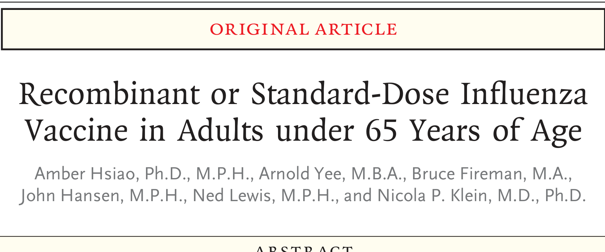

# Extracted Document

**Source:** data/clinical_files/Hsiao et al. (2023).pdf

**Pages:** 11

---

## Page 1

**[FIGURE]**

### an were the standard dose vaccines. NCLUSIONS ehigh-dose recombinant vaccine conferred more protection against PCR-co med influenza than an egg based standard dose vaccine among adults be twee

luenza A was 15.7% (95% CI, 6.0 to 24.5; P = 0 002. The recombinant vacci snot significantly more protective against influenza related hospitalizati th t d d d i

### group. Amon (2 00

RESULTS The study population included 1 630 328 vaccine es between the ages of 18 and 64 years (632 962 in the recombinant vaccine group and 997 366 in the standard dose group). During this study period, 1386 cases of PCR-confirmed influenza were diagnosed in the recombinant vaccine group and 2435 cases in the standard dose group Among the participants who were 50 to 64 years of age 559 participants

### outco e. ti

METHODS In this cluster randomized observational study, Kaiser Permanente Northern California facilities routinely administered either a high dose recombinant influenza vaccine (Flublok Quad rival ent or one of two standard dose influenza vaccines during the 2018-2019 and 2019-2020 influenza seasons to adults 50 to 64 years of age (primary age group) and 18 to 49 years of age. Each facility alternated weekly between the two vaccine formulations. The primary outcome was influenza (A or B) confirmed by polymerase chain reaction (PCR) testing. Secondary outcomes included influenza A, influenza B, and influenza related hospitalization outcomes. We used Cox regression analysis to estimate the hazard ratio of the recombinant vaccine as compared with the standard dose vaccines against each outcome We calculated the relative vaccine effectiveness as 1 minus the hazard

### standard f 65

BACKGROUND Quad rival ent recombinant influenza vaccines contain three times the amount of hemagglutinin protein as standard dose egg based vaccines, and the recombinant formulation is not susceptible to antigenic drift during manufacturing. Data are needed on the relative effectiveness of recombinant vaccines as compared with standard dose vaccines against influenza related outcomes in adults under the age ABSTR ACT g Amber Hsiao, Ph. D., M. P. H., Arnold Yee, M. B. A., Bruce Fireman, M. A., John Hansen, M. P. H., Ned Lewis, M. P. H., and Nicola P. Klein, M. D., Ph. D.

### Vaccin

Recombinant or Standard-Dose Influenza Original Article

### 

The new engl and jour nal of medicine

## Page 2

whom are adults between the ages of 18 and 64 years. Members receive nearly all their care at system owned facilities, which includes 259 medical clinics and 21 hospitals. The members’ electronic medical records capture all medical services, including inpatient and outpatient diagnoses, laboratory tests, and vaccinations. The KPNC members include approximately a third of the population in Northern California and

increased protective hemagglutinin antibodies 6 To estimate the relative effectiveness of the recombinant vaccine as compared with standard dose vaccines against laboratory confirmed influenza and influenza related outcomes, we compared the two formulations of vaccines among members of the Kaiser Permanente Northern California (KPNC) health care system who were between 18 and 64 years of age during the two influenza seasons of 2018-2019 and 2019-2020. Methods Study Population and Oversight KPNC is an integrated health care delivery system with 4.6 million members, nearly 65% of

vaccine strain 4 The Flublok Quad rival ent influenza vaccine (RIV4, San of i is manufactured without chicken eggs, resulting in a recombinant hemagglutinin protein that is genetically identical to that in the selected strain 5 The vaccine also contains three times the amount of hemagglutinin protein as standard dose vaccines, an increased level that has been correlated with increased protective hemagglutinin antibodies 6

### eggs are used to manufacture th

g pmillion).1 Influenza vaccination is the primary method for preventing influenza related illnesses 2 although the vaccine effectiveness ranges from 20% in years in which the vaccine is antigenic ally mismatched to the circulating viral strain to 40 to 60% in years in which the vaccine is antigenic ally well matched 2 3 This large variation in effectiveness between years suggests that more effective vaccines are needed. In traditional quad rival ent standard dose in activated influenza vaccines (SD-IIV4), chicken

### 

### 

The new engl and jour nal of medicine

(Fig. 1). We randomly assigned Block A to start with administration of a standard dose vaccine and Block B to start with administration of the recombinant vaccine. Thereafter, each facility alternated the administration of the two vaccines weekly. Key features of the study design were that

q yexcluded from the analyses because there were too few cases of influenza during the pandemic to be informative. During the study period, influenza vaccination coverage was similar to national coverage (Table S1). The study excluded unvaccinated patients. The KPNC system includes seven geographic regions, each containing 8 to 12 medical facilities. In each region, the facilities were assigned to either Block A or Block B to optimize the balance between blocks with respect to facility size (Fi 1) W d l i d Bl k A

### the coronavir

vaccines used during the study seasons were purchased by KPNC. The first author wrote the first draft of the manuscript. The authors vouch for the accuracy and completeness of the data presented and for the fidelity of the study to the protocol (available at NEJM.org). Study Design This was a cluster randomized observational study that was designed to include all KPNC members between the ages of 18 and 64 years who had received a licensed recombinant or standard dose vaccine as part of routine clinical care during the three influenza seasons from 2018 to 2021 9 The 2019-2020 season was truncated in March 2020 because of the outbreak of

in other U.S. regions (Table S1 in the Supplementary Appendix, available with the full text of this article at NEJM.org).7 Approximately 10% of the members are covered by Medicaid 8 The KPNC institutional review board approved the study with a waiver of informed consent. Representatives of the study sponsor, San of i, did not have arole in the design or conduct of the study or in the analyses of the data. The Flublok Quad rival ent influenza vaccine was donated by San of i, and the two standard dose

nd multiracial residents are higher than those

## Page 3

**[FIGURE]**

to Block A or Block B. Facility 1 Facility 8 Similarly sized

Facility 2 Facility 7 Facility 9 Facility 8

Facility Facility 5 Facility 6

### 

### 

Recombinant or Standard-Dose Influenza Vaccine

## Page 4

ness of the recombinant vaccine against secondary outcomes in patients in the primary age group and against secondary outcomes in five pre specified subgroups of patients with preex-

### age group

y yhad occurred within 14 days after vaccination. Objectives The primary objective was to estimate the relative vaccine effectiveness of the recombinant vaccine as compared with a standard dose vaccine against PCR-confirmed influenza in patients between the ages of 50 and 64 years, the primary

( ) ( ) Exploratory outcomes were an influenza diagnosis (PCR-confirmed or clinically diagnosed influenza on the basis of ICD-10 codes), non elective hospitalization for any cause, and death from any cause. For each outcome except death from any cause, we counted only the first event during each season that occurred more than 14 days after vaccination. All deaths after vaccination within the study period were considered to be a safety outcome and were counted even if they h d d ihi 14 d f i i

not performed. Secondary outcomes were PCR-confirmed influenza A, PCR-confirmed influenza B, and hospitalization for PCR-confirmed influenza, for community acquired pneumonia, and for car dio respiratory events including community acquired pneumonia. We identified community acquired pneumonia and other car dio respiratory events using primary discharge diagnosis codes as listed in the International Classification of Diseases, 10 th Revision (ICD 10 (Table S2).

### tests at the

..., facilities administered primarily high dose vaccines to adults who were 65 years of age or older, which made it infeasible to include those members in the study randomization. Outcomes The primary outcome was influenza as confirmed by polymerase chain reaction (PCR) testing (Cepheid Gen expert PCR assay, atest that also identifies respiratory sync yti al virus [RSV]). Physicians at each facility ordered influenza PCR

### 

### 

The new engl and jour nal of medicine

p y pcine rather than a standard dose vaccine with respect to sex, race, age, coexisting illnesses,

### derived by logistic r

occurred in either study group. Each risk set contained every participant in follow up on that calendar date. Most of the participants had been vaccinated before the beginning of the influenza season and were included in every risk set throughout the season. The Cox model also used stabilized weights that were based on propensity scores. The statistical analysis plan pre specified the use of propensity scores if imbalances were found in any study variables. We observed modest imbalances at some facilities in one or both seasons, although not overall (Tables S4 and S5). Thus, we created propensity scores that were specific for each facility and season. The propensity scores were

study with 86% power to detect a relative vaccine effectiveness of 10.0% against PCR-confirmed influenza. On the basis of previous data, we estimated the occurrence of 2.18 PCR-confirmed influenza cases per 1000 participants in the standard dose group. We used Cox regression analysis to estimate the adjusted hazard ratio and 95% confidence intervals for the recombinant vaccine as compared with a standard dose vaccine for each outcome. The model specified a calendar time scale and included adjustments for sex, race or ethnic group, and age and an age squared factor (in case age and risk had either a linear or curvilinear association). Risk sets were formed on each date on which at least one outcome event occurred in either study group Each risk set

p y g g pestimates of relative vaccine effectiveness were considered to be exploratory. Statistical Analysis We tested the null hypotheses that the recombinant vaccine would not be any more or any less effective than a standard dose vaccine against influenza, using a two sided test with a P value of less than 0.05 indicating statistical significance. We estimated that the administration of 400 000 doses each of the two vaccine formulations to patients between the ages of 18 and 64 years each influenza season would provide the

## Page 5

y jinfluenza A was 15.7% (95% CI, 6.0 to 24.5; P = 0.002; the P value was below Holm’smultiplicity-adjusted threshold of an alpha level of

and Table S6). In both seasons, delays in ship-

Results Study Participants The study population included 1 630 328 participants during influenza seasons in 2018-2019 and 2019-2020. Of these participants, 632 962 (38 8 received the recombinant vaccine and 997 366 (61 2 received a standard dose vaccine (Fig. 2

compared with 925 (2.34 per 1000) in the standard dose group (Table 2). For the primary objective, the relative vaccine effectiveness of the recombinant vaccine as compared with standard dose vaccines against all PCR-confirmed influenza was 15.3% (95% CI, 5.9 to 23.8; P = 0 002. The estimate of relative vaccine effectiveness for the secondary objective of PCR-confirmed

pcine and RSV infection would suggest bias in our estimate of the relative vaccine effectiveness against influenza. Conversely, a finding of no association between receipt of the recombinant vaccine and RSV infection would be reassuring that our estimates of relative vaccine effectiveness were not biased by unmeasured factors that might affect the risk of both laboratory confirmed RSV infection and influenza. All data analyses were performed with the use of SAS software, version 9.4 (SAS Institute).

tic i pants at baseline were similar in the two vaccine groups and in the two age groups (Table 1 and Table S6). There was some variation in the timing of the administration of the two vaccines according to geographic region, although during the two influenza seasons, most vaccinations in the two groups had occurred by mid to late November (Tables S4 and S5). Primary and Secondary Analyses In patients between the ages of 50 and 64 years, 559 (2.00 cases per 1000) tested positive for influenza in the recombinant vaccine group as d i h 925 (2 34 1000) i h

For secondary objectives in participants between the ages of 50 and 64 years, we adjusted for multiplicity by Holm’smethod.10 Subgroup analyses involving participants with preexisting conditions were not adjusted for multiplicity. We conducted sensitivity analyses in which we used propensity scores in alternative ways, used a robust variance estimator, stratified risk sets according to facility and vaccination week, and specified age as a spline (see the Supplementary Methods section). To assess possible residual confounding, we examined PCR-confirmed RSV infection as a negative control outcome because we would not expect influenza vaccination to be associated with a reduction in this infection. A nontrivial association between receipt of the recombinant vac-

2337 (61 2 in patients between the ages of 18 and 49 years. Among the participants with PCRconfirmed influenza, hospitalization occurred in 248 of 1484 participants (16 7 among those between the ages of 50 and 64 years and in 136 of 2337 (5.8%) of those between the ages of 18 and 49 years. The demographic characteristics of the participants at baseline were similar in the two vac-

### enza cases, 1484 (38 8 were dia

64 years of age, 279 400 (41 4 received the recombinant vaccine and 395 852 (58 6 received a standard dose vaccine (Table 1). Among the 955 076 patients between 18 and 49 years of age, 353 562 (37 0 received the recombinant vaccine and 601 514 (63 0 received a standard dose vaccine (Table S6). Of the 16 340 influenza PCR tests performed in the study population, 3821 (23 4 were influenza positive. Of the PCR-confirmed in flu

### rtional-haza nwas eva lua

### as compared with

gdata were not imputed. The relative vaccine effectiveness was based on the hazard ratio (1 minus the hazard ratio, expressed as a percentage). This calculation estimated the percent reduction in the incidence of the outcome in the recombinant vaccine group

p yly schedule, so standard dose vaccines were then administered to prevent interruptions in patient care. Among the 675 252 patients between 50 and 64 years of age 279 400 (41 4%) received the

### 

### 

Recombinant or Standard-Dose Influenza Vaccine

## Page 6

**[FIGURE]**

### 

944 692 Were vaccinated in 2019-2020 season 967 083 Were vaccinated in 2020-2021 season 1 018 043 Received recombinant vaccine 1 758 235 Received a standard dose vaccine 33 133 Were not KPNC members at time of vaccination 66 632 Were not KPNC members at time of vaccination

### 

### new engl and jour nal of

The new engl and jour nal of medicine

## Page 7

**[TABLE]**

Hispanic ethnic group - no. (%)† Yes 46 318 (17) 65 868 (17) 112 186 (17) No or unknown 233 082 (83) 329 984 (83) 563 066 (83)

no. of participants (%) 0 (45) 175 600 (44) 300 140 (44) 0 (55) 220 252 (56) 375 112 (56) 7 (51) 198 434 (50) 341 191 (51) 3 (5) 20 814 (5) 34 507 (5) 6 (21) 84 154 (21) 142 570 (21) 6 (1) 2,363 (1) 4,049 (1) 8 (<1) 1,836 (<1) 3,104 (<1) 9 (3) 10 908 (3) 18 207 (3)

( ) Male 124,5 Female 154,8 Race or ethnic group - no. (%)† White 142,7 Black 13,6 Asian 58,4 Pacific Islander 1,6 Native American 1,2 M l i i l 7 2

### 

### Characteristic Recombinant Vaccine (N = 279 400 Standard-Dose Vaccine (N = 395 852 All Vaccinees (N = 675 252

### 

### 

Recombinant or Standard-Dose Influenza Vaccine

## Page 8

**[TABLE]**

10.8% (95% CI, 6.6 to 14.7) against diagnosed influenza, and 19.5% (95% CI, 5.4 to 31.5) against influenza A in the subgroup with obesity (Tables S7 and S8). In the younger age group, the only explortbj ti fhi hth lti i f For both the PCR-confirmed influenza and hospitalization outcomes, the results of sensitivity analyses were consistent with findings in the primary analyses (Tables S12 and S13). The estimates of relative vaccine effectiveness from the RSV ti t l ldid tdiff

cine group as compared with 1510 participants (2.51 cases per 1000) in the standard dose group (Table S8). For three exploratory objectives in this age group, the relative vaccine effectiveness was vity analyses, models were further adjusted for potential clu Details are provided in Table S13. ltiplicity for the secondary outcomes was performed with th esecondary outcomes were rank ordered and compared with 0.05.

no. of cases per 1000 luenza 559 (2.00) 925 (2.34) 0.8 es luenza A 522 (1.87) 862 (2.18) 0.8 luenza B 37 (0.13) 64 (0.16) 0.8 r PCRuenza 95 (0.34) 153 (0.39) 0.8 rcommunitymonia 106 (0.38) 183 (0.46) 0.8 rca rdi ore spira 631 (2.26) 890 (2.25) 1.00 merase chain reaction. sted for age, age squared, sex, and race or ethnic group after it l d l fth dj t d f tti l l

Recombinant Vaccine (N = 279 400 Standard-Dose Vaccine (N = 395 852 Unadjus Rate Ra

### 

### 

The new engl and jour nal of medicine

S11). For the outcome of PCR-confirmed influenza among patients in the older age group, relative vaccine effectiveness was 14.4% (95% CI, −1.1 to 27.5) during 2018-2019 and 16.1% (95%

weighting with stabilized facility specific propensity scores. ering according to facility and yielded results similar to use of Holm’sadjustment method. The P values that were or responding adjusted nominal alpha values of 0.01, 0 0125,

### o 1.06) 16.7 ( 5.6 to 3

sted atio Adjusted Hazard Ratio (95% CI)† Relative Vaccine Effectiveness (95% CI) P Value‡ % 6 0.85 (0.76 to 0.94) 15.3 (5.9 to 23.8) 0.002 6 0.84 (0.76 to 0.94) 15.7 (6.0 to 24.5) 0.002 2 0.90 (0.60 to 1.34) 10.3 (−33.9 to 39.9) 0.59 8 0.84 (0.65 to 1.09) 15.9 (−9.2 to 35.2) 0.19 2 0 83 (0 66 1 06) 16 7 ( 5 6 34 4) 0 13

## Page 9

**[FIGURE]**

rred more protection against influenza than nant vaccine group than in the standar

vaccine against influenza as confirmed by polymerase chain reaction (PCR) assay, hospitalization for PCR-confirmed nfluenza, and hospitalization for community acquired pneumonia among study participants in the older age group according to the presence of five pre specified preexisting conditions.

ss against Influenza among Participants between 50 −10 0 10 20 −20 15 −15 5 −5 25 25 40 35 45 30 55 50 Percentage

Figure 3. Subgroup Analysis of Relative Vaccine Effectiveness d 64 Y f A A di t P iti C diti

−40 −35 −45 Any of the above conditions Hospitalization for PCR-confirmed influenza Cardiovascular disease Respiratory disease Car dio respiratory disease Obesity Diabetes Any of the above conditions Hospitalization for community acquired pneumonia Cardiovascular disease Respiratory disease Car dio respiratory disease Obesity Diabetes Any of the above conditions −3 −50

PCR-confirmed influenza Cardiovascular disease Respiratory disease Car dio respiratory disease Obesity Diabetes

### 

### 

Recombinant or Standard-Dose Influenza Vaccine

## Page 10

pgraphic characteristics, coexisting illnesses,

g gall associated with its higher dose of hemagglutinin antigen. A strength of our study is that the two study vaccine formulations were alternated in weekly intervals of time at each facility, which allowed us to balance covariates of interest as designed. In every KPNC geographic area, when influenza arrived, there were already participants who had received one of the two formulations of vaccine and who were similar with respect to demo-

through influenza by 15% would provide asub stantial public health benefit, especially during more severe influenza seasons. Several studies have shown benefit for the recombinant vaccine and other high dose influenza vaccines as compared with standard dose vaccines in adults who are 65 years of age or older, findings that have been attributed to an improved immune response 5 14 17 In the current study, we compared the effectiveness of the high dose recombinant vaccine with that of standard dose vaccines in patients between the ages of 18 and 64 years. The effectiveness of standard dose vaccines - especially against the influenza A H3 N2 subtype - may be attenuated by antigenic drift during egg based manufacturing, whereas the recombinant vaccine is not susceptible to such drift. However, data from the California Department of Public Health showed that the H3 N2 strain circulated only during the second half of the 2018-2019 season 18 and even then, the circulating strain had drifted such that it was poorly matched to both the recombinant vaccine and the standard dose vaccines 19 20 During our study period, the observed benefit of the recombinant vaccine as compared with a standard dose vaccine seems less likely due to higher relative vaccine effectiveness against H3 N2 than to higher effectiveness against influenza A overll i d i h ihi h d f h l

mortality at KPNC and nationwide in a similar age group 11 12 If standard dose vaccines were already preventing most cases of influenza and breakthrough cases were uncommon, preventing 15% of breakthrough cases would be of modest public health benefit. However, since standard dose vaccines prevent at most 40 to 60% of influenza cases annually 13 reducing the incidence of breakthrough influenza by 15% would provide asub-

### 

### 

The new engl and jour nal of medicine

y p g seasons, participants between the ages of 50 and 64 years who received the recombinant vaccine had more protection against confirmed influenza than those who received a standard dose vaccine. Supported by San of i. Disclosure forms provided by the authors are available with the full text of this article at NEJM.org. We thank many groups within Kaiser Permanente Northern California for their dedication and contributions to this study, including the members of the KPNC Seasonal Flu Program, the clinical teams who managed and administered influenza vaccines, the pharmacy teams, and the KPNC regional laboratory, without whose support this study would not have been possible; and Ruvim Izikson of San of i for scientific discussions and coordination.

in our real world setting, compliance with the weekly assigned vaccine schedule occasionally varied because of logistic con strains ts, including supply chain issues for the recombinant vaccine, which led to different numbers of participants in the two groups. Second, our data were limited to two influenza seasons; relative vaccine effectiveness may vary across seasons, depending on the vaccine match with circulating strains. Third, our primary outcome did not include infections in persons who did not undergo PCR testing, which limits its genera liz ability. Fourth, the study had limited power to detect a clinically meaningful benefit of the recombinant vaccine as compared with a standard dose vaccine with respect to less frequent outcomes, such as hospitalization for PCR-confirmed influenza. Finally, although KPNC has a diverse population, it may not be representative of other populations in the United States. In this study performed during two influenza ...50 d

p gweek (to compare between facilities) showed a relative vaccine effectiveness of approximately 15%, similar to the findings of our primary analysis. Our study also has several limitations. First,

### hat were stratifie ith

tering according to facility. Sensitivity analyses that were stratified either according to facility

g p y , handling of potential confounding bias has not been formally studied. Our intent was to minimize imbalances between the participants who received each vaccine, both within and between facilities. We also included several sensitivity analyses to address potential biases from clus-

## Page 11

### 

Adams JL, McGlynn EA. Comparing Kai-

cines worked better than reported & ACIP recommends specific vaccines for seniors. June 23, 2022 (https www cdc gov flu

resources/chis). 8 D i AC V lk l JL R CL

### 

### 

Recombinant or Standard-Dose Influenza Vaccine

Dis 2021 73 11: e4312-e4320. Copyright © 2023 Massachusetts Medical Society.

recombinant hemagglutinin. Clin Inf

---

## Extraction Metadata

- Text blocks: 96

- Figures/Tables: 6
