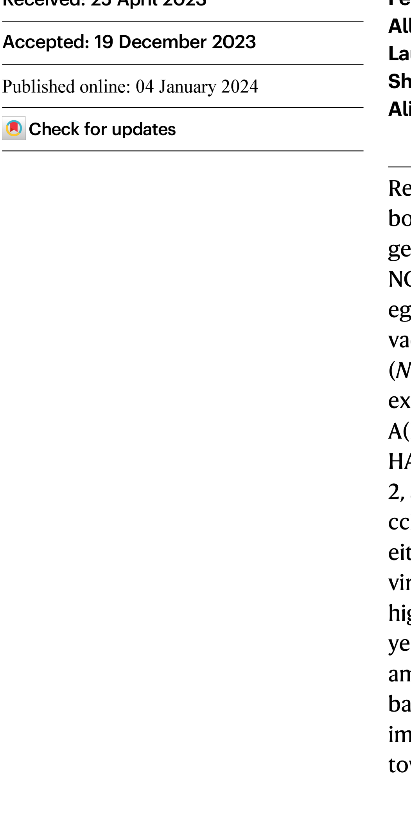
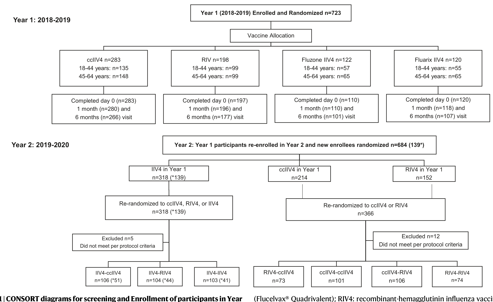
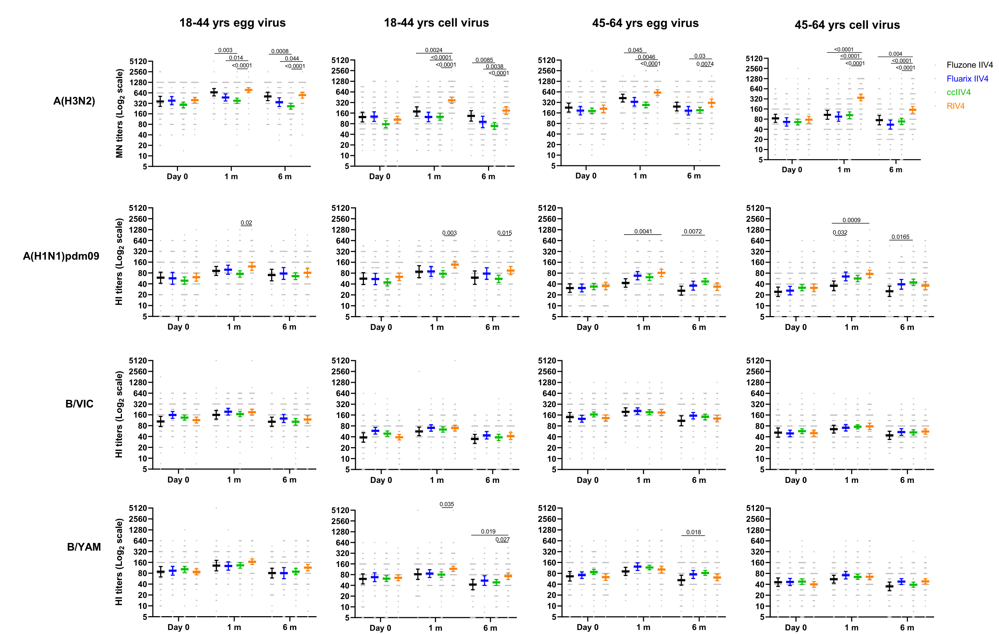
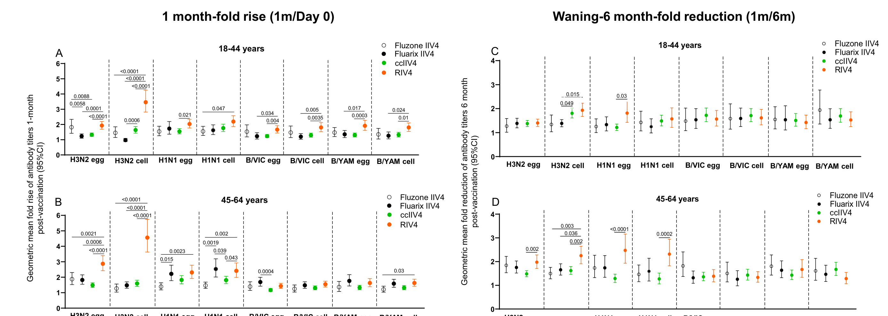
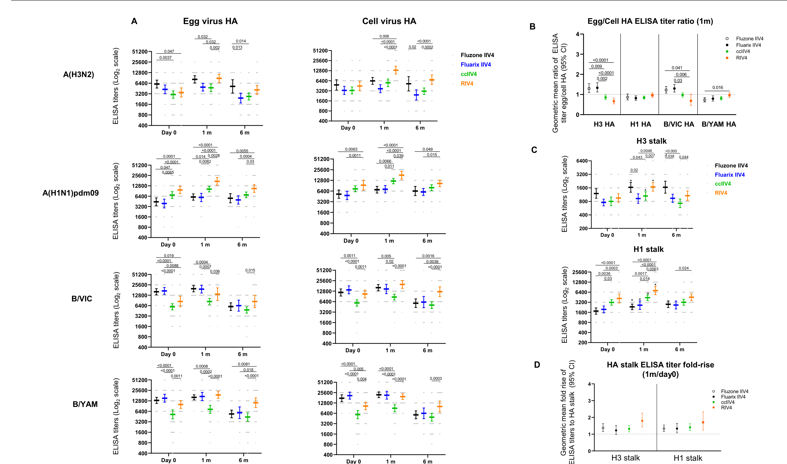
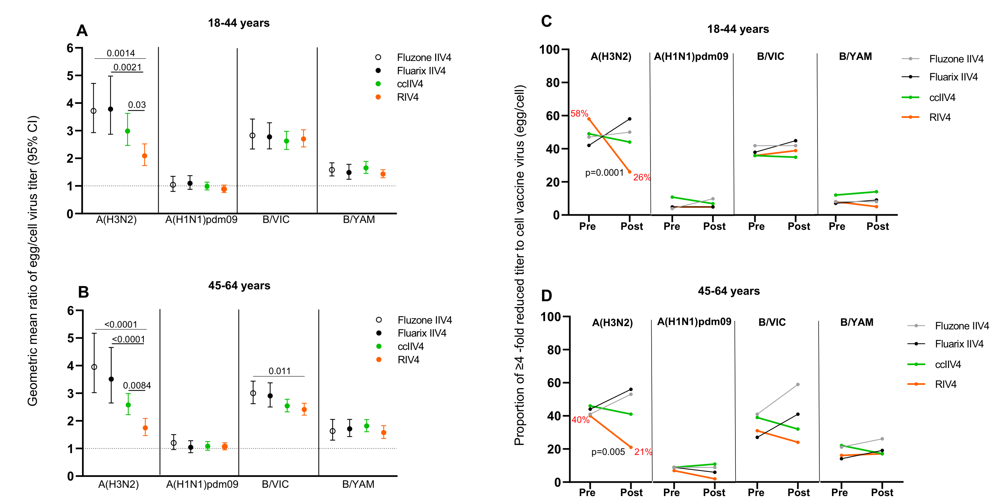
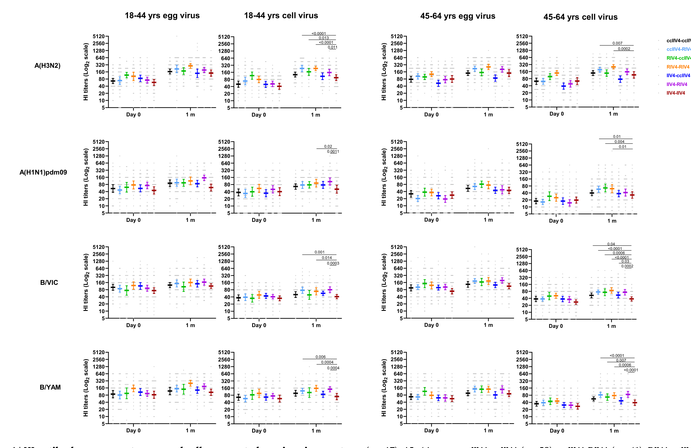
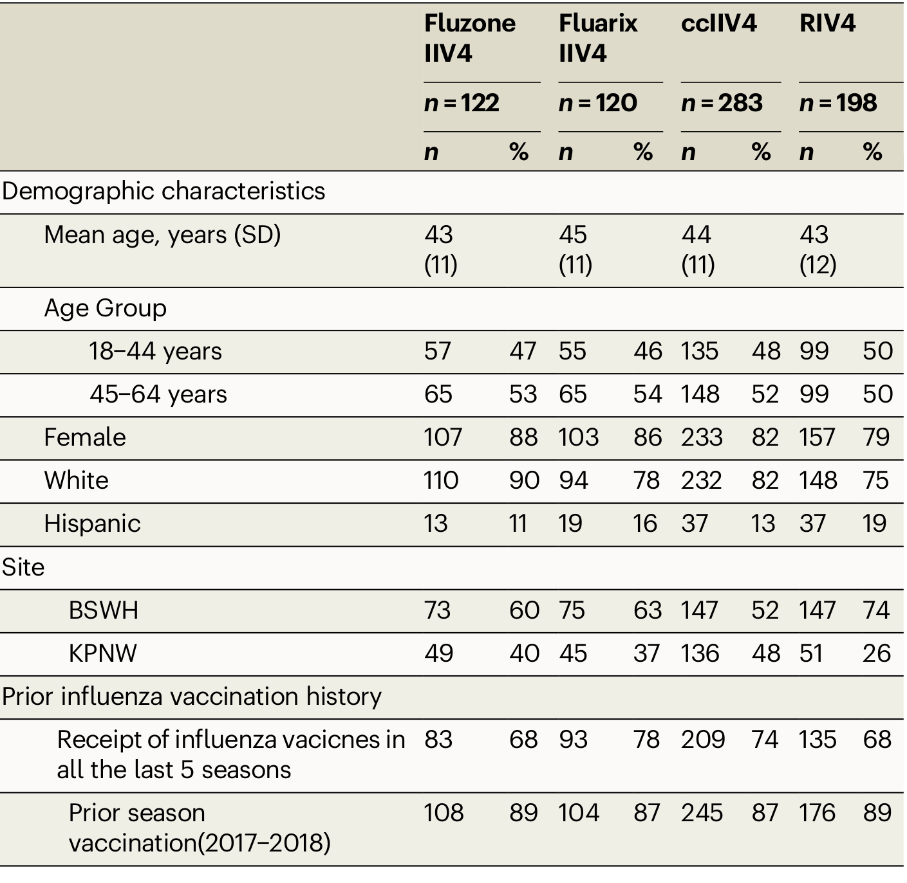

# Extracted Document

**Source:** data/clinical_files/Liu et al. (2024).pdf

**Pages:** 13

---

## Page 1

### United S cine seed

### year 1, but there was no significant difference in HA stalk antibody fold rise among vaccine groups in either year 1 or year 2. Multiple seasons of non-eg based vaccination may be needed to redirect antibody responses from immune memory to egg adapted epi to pes and re-focus the immune response towards epi to pes on the circulating viruses to improve vaccine effective nes Influenza viruses are a common cause of respiratory infections in humans, annual influenza vaccination has been recommended in the U i d S (US) f d d C ill i fl manufacturing process can lead to egg adapted mutations in themagglutinin (HA) protein in IIV, that could result in altered an ...iff i (VE) i h i l i

A (H3 N2) immunogen i city. In year 1, RIV4 induced higher neutralizing and total HA head binding antibodies to cell- A (H3 N2) virus than ccIIV4 and IIV4. In year 2, among the 7 repeat vaccination arms (IIV4-IIV4, IIV4-ccIIV4, IIV4-RIV4, RIV4ccIIV4, RIV4-RIV4, ccIIV4-ccIIV4 and ccIIV4-RIV4), repeat vaccination with either RIV4 or ccIIV4 further improved antibody responses to circulating .../ ll l h d

**[TABLE]**

(N = 723) and 2019 20 (N = 684) influenza seasons. We performed an

p g pm bin ant or cell culture based ed influenza vaccines Feng Liu 1, F. Lia in i Gross 1, Sneha Joshi 1, Man jus ha Gag la ni 2,3,4, Allison L. Naleway5, Kemp apura Mur thy 4, Holly C. Groom 5, Meredith G. Wesley 1 6 Laura J. Edwards 6, Lauren Grant 1, Sara S. Kim1, Surya prak ash Sambhara1, Shiv apr aka sh Gang app a 1, Terrence Tum pey 1, Mark G. Thompson 1, Alicia M. Fry1, Brendan Flannery 1, Fatimah S. Dawood1 & Min Z. Levine 1 Repeat vaccination with egg based influenza vaccines could preferentially boost antibodies targeting the egg adapted epi topes and reduce immunogen i city to circulating viruses. In this randomized trial (Clinical trials gov: NCT03722589), sera pre- and post vaccination with quad rival ent in activated egg based (IIV4), cell culture based (ccIIV4), and recombinant (RIV4) influenza

Article Redirecting antibody r

https://doi.org/10.1038/s41467-023-44551-xresponses from egg-

## Page 2

n=318 (*139) IIV4-ccIIV4 n=106 (*51) IIV4-RIV4 n=104 (*44) IIV4-IIV4 n=103 (*41) Excluded n=5 Did not meet per protocol criteria Fig. 1 | CONSORT diagrams for screening and Enrollment of participants in Year 1 (2018-2019 and Year 2 (2019-2020. Abbreviations: IIV4: In activated influenza vaccine (Flu zone or Fluarix® Quad rival ent; ccIIV4: Cell culture based IIV

during the preceding five seasons. Year 1 (2018-201 ccIIV4 n=283 18-44 years: n=135 45-64 years: n=148 Completed day 0 (n=283) 1 month (n=280) and 6 months (n=266) visit RIV n=198 18-44 years: n=99 45-64 years: n=99 Completed day 0 (n=197 1 month (n=196) and 6 months (n=177) visit Year 2: Year 1 participants IIV4 in Year 1 n=318 (*139) Re-randomized to ccIIV4, RIV4, or IIV4 n=318 (*139) Year 1: 2018-2019 Year 2: 2019-2020

**[FIGURE]**

vaccination (Fig. 1). The A (H1 N1) pd

ation reduced an ccine componen

othe HA antigens of ulture based and n 723) and 2019-2020 (Year 2, n 684) influ year 1 HCP were randomized to receive one

acell culture based influenza vaccine (Flu cel vax Quad rival ent by Seqirus, Inc., ccIIV4) and a recombinant influenza vaccine (Flublok Quad rival ent by SanofiPasteur, RIV4). RIV4 contains 3 times the i d 45 HA/d / ...d

RIV4-RIV4 n=74 ccIIV4-RIV4 n=106 ccIIV4-ccIIV4 n=101 RIV4-ccIIV4 n=73 Excluded n=12 Did not meet per protocol criteria (Flu cel vax Quad rival ent; RIV4: recombinant hemagglutinin influenza vaccine (Flublok® Quad rival ent. *Numbers in parenthesis are new enroll ees for Year 2.

### 

### 

sas/14/2017 (H3 N2) like virus respectively while the B/Victoria and B/ Yamagata components remained the same (Table 1). Enrolled and Randomized n=723 accine Allocation Flu zone IIV4 n=122 18-44 years: n=57 45-64 years: n=65 Completed day 0 (n=110) 1 month (n=110) and 6 months (n=101) visit Fluarix IIV4 n=120 18-44 years: n=55 45-64 years: n=65 Completed day 0 (n=120) 1 month (n=118) and 6 months (n=107) visit e-enrolled in Year 2 and new enroll ees randomized n=684 (139*) ccIIV4 in Year 1 n=214 RIV4 in Year 1 n=152

epi to pes could be preferentially boosted from repeat vaccination with egg based vaccines 3. The potential of non egg based vaccines to miti gate the impact of prior egg based a cci nation remains nclear In this

## Page 3

, g y ymotif at HA position 197; whereas egg based B/Yamagata vaccine had g y g (p ) pantibody responses to both egg- (GMT 122) and cell- (GMT 137

**[TABLE]**

Year 2 A/Kansas/14/2017 cell a, d N N A S G K N (CHO-) S K N A/Kansas/14/2017 egg b N N A S G K N (CHO-) S K N B/Victoria lineage 129 197 199 Year 1 & 2 B/Colorado/06/2017 cell G N T B/Colorado/06/2017 egg G T (CHO-) T B/Maryland/15/2016 BX-69 A egg CVV (EPI 1061863 b, c D N (CHO-) I

### egg CVV (EPI 1082512 A/Singapore/INFIMH-16-0019/2016 NIB-104 egg CVV (EPI 1151864 c S K T

| gg pthe study Viruses Amino acids difference A (H1 N1) pdm09 45 74 120 Year 1 A/Michigan/45/2015 cell a R S T A/Michigan/45/2015 egg R S T A/Michigan/45/2015 X-275 egg CVV (EPI 830246 b R S T A/Singapore/GP1908/2015 IVR-180 egg CVV (EPI 848715 c, d R S A Year 2 A/Idaho/07/2018 cell a, d R R T A/Brisbane/02/2018 egg b G R T A (H3 N2) 91 121 128 Year 1 A/Singapore/INFIMH-16-0019/2016 cell a S K T A/Singapore/INFIMH-16-0019/2016 egg S K T A/Singapore/INFIMH-16-0019/2016 IVR-186 egg CVV (EPI 1082512 b S K T

A G S N (CHO-) Y K K D F P G N H

### A G S N (CHO) Y T K D F L D N H A G S N (CHO-) Y K K D F P D/G¶ N H A G S N (CHO-) Y K K D F P G N H

gg g y yon the HA head domain 164 183 209 223 225 282 295 298 S S K Q G P I I S S K R G P I I S S M R G P I I S S K Q A P I I T P K Q G P V I T P K R G A V V 138 142 144 158 159 160 171 190 193 194 225 246 311 A G S N (CHO) Y T K D F L D N H

## Page 4

**[FIGURE]**

Day 0 1 m 6 m 5 10 H Day 0 1 m 6 m 5 10 Fig. 2 | MN or HI Antibody responses to egg- and cell propagated vaccine viruses at pre vaccination (Day 0), 1 month, and 6 months post vaccination in Year 1. Antibody titers from each of the four vaccine groups were presented as geometric mean titers (GMTs) with 95% confidence interval (CI) respectively for 18−44 years and 45−64 years age groups. Gray dots represented individual titers. Flu zone IIV4 18−44 years: Day 0 (n = 52), 1 m (n = 52), 6 m (n = 47); Flu zone IIV4 4564 years: Day 0 (n = 58), 1 m (n = 58), 6 m (n = 54); Fluarix IIV4 18−44 years: Day 0

B/VIC B/YAM Day 0 1 m 6 m 5 10 20 40 80 HI titers Day 0 1 m 6 m 5 10 20 40 80 Day 0 1 m 6 m 5 10 20 40 80 160 320 640 1280-2560 5120 HI titers (Log2 scale) Day 0 1 m 6 m 5 10 20 40 80 160 320 640 1280-2560 5120 40 80 160 320 640 1280-2560 5120 ers (Log2 scale) 40 80 160 320 640 1280-2560 5120 0.035 0.019 0.

A (H3 N2) A (H1 N1) pdm09 18-44 yrs egg virus 18-44 yrs cell virus Day 0 1 m 6 m 5 10 20 40 80 160 320 640 1280-2560 5120 MN titers (Log2 scale) 0.003 0.014 <0 0001 0 0008 0.044 <0 0001 Day 0 1 m 6 m 5 10 20 40 80 160 320 640 1280-2560 5120 0 0024 <0 0001 <0 0001 0.008 < 0 80 160 320 640 1280-2560 5120 rs (Log2 scale) 0.02 80 160 320 640 1280-2560 5120 0.003

Day 0 1 m 6 m Day 0 1 m 6 mccIIV4 45−64 years: Day 0 (n = 148), 1 m (n = 147), 6 m (n = 142); RIV4 18−44 years: Day 0 (n = 99), 1 m (n = 98), 6 m (n = 85); RIV4 45−64 years: Day 0 (n = 98), 1 m (n = 98), 6 m (n = 92); Micro neutralization titers (MN) were measured for A (H3 N2) virus, while hem agglutination inhibition (HI) titers were measured for A (H1 N1) pdm09, B/Victoria (B/VIC), and B/Yamagata (B/YAM) viruses. One way ANOVA corrected for multiple comparisons (Tukey’stest) was used to compare the GMTs of each time point among the 4 vaccine groups. Statistically significant differences

y y 80 160 320 640 1280-2560 5120 0.018 80 160 320 640 1280-2560 5120

45-64 yrs egg virus 45-64 yrs cell virus Day 0 1 m 6 m 5 10 20 40 80 160 320 640 1280-2560 5120 0.045 0 0046 <0 0001 0.03 0 0074 Day 0 1 m 6 m 5 10 20 40 80 160 320 640 1280-2560 5120 Flu zone IIV4 Fluarix IIV4 ccIIV4 RIV4 <0 0001 <0 0001 <0 0001 <0 0001 <0 0001 0.004 Day 0 1 m 6 m 5 10 20 40 80 160 320 640 1280-2560 5120 0 0041 0 0072 Day 0 1 m 6 m 5 10 20 40 80 160 320 640 1280-2560 5120 0.032 0 0009 0 0165 10 20 40 80 160 320 640 1280-2560 5120 10 20 40 80 160 320 640 1280-2560 5120

## Page 5

**[FIGURE]**

Antibody responses to egg adapted epi to pes measured by antibody GMT egg cell titer ratio in year 1 To assess the levels of antibody responses targeting the egg adapted epi to pes, we used the antibody “GMT egg cell titer ratio” as a proxy to quantify the extent of difference in antibody responses to egg- versus

year 1, a total of 26 breakthrough infection cases were identified with

Pre existing A (H3 N2) and A (H1 N1) pdm09 HA stalk antibodies were detected in participants at varies levels. Comparing HA stalk antibody titers at 1 month post vaccination versus day 0, vaccination significantly boosted A (H1 N1) pdm09 HA stalk antibodies in all 4 vaccine groups (p < 0.01), and significantly boosted A (H3 N2) HA stalk antibodies in 3 of the 4 vaccine groups (p < 0.001, Flu zone IIV4, ccIIV4, and RIV4) (Fig. 4 C). The RIV4 group had the highest A (H1 N1) pdm09 HA stalk and A (H3 N2) HA stalk antibodies at 1 month post vaccination, however the fold rises of HA stalk antibodies were low (<1.8) and similar among all 4 vaccine groups (Fig. 4 D). At 6 months post vaccination, waning of HA stalk antibodies were more notable in ccIIV4 and d ( )

(n = 98)) age groups respectively (A, B). Antibody waning was expressed as the GM fold reduction of titers from 1 month to 6 months (1 m/6 m) post vaccination for

### mean (GM) fold rise of antibody titers (1 m/Day 0) from each of the four vacc groups were calculated for egg- and cell propagated vaccine viruses, and for 18 years (Flu zone IIV4 (n = 52), Fluarix IIV4 (n = 55), ccIIV4 (n = 133), RIV4 (n = 98))

0 1 2 3 4 5 6 y 0 0058 0 0088 0 0001 <0 0001 <0 0001 <0 0001 <0 0001 0 0006 0.021 0.047 0.034 0.004 0.005 0 0035 0.017 0 0003 0.024 0.01 0 1 2 3 4 5 6 45-64 years Flu zone IIV4 Fluarix IIV4 ccIIV4 RIV4 Fluarix IIV4 ccIIV4 RIV4 0 0021 0 0006 <0 0001 <0 0001 <0 0001 <0 0001 0.015 0 0023 0 0019 0.002 0.039 0.043 0 0004 0.03 Geometric mean fold rise of antibody titers 1 month post vaccination (95%CI) H3 N2 egg H3 N2 cell H1 N1 egg H1 N1 cell B/VIC egg B/VIC cell B/YAM cell B/YAM egg H3 N2 egg H3 N2 cell H1 N1 egg H1 N1 cell B/VIC egg B/VIC cell B/YAM cell B/YAM egg A B Fig. 3 | Fold rise of MN or HI antibody titers at 1 month post vaccination and waning of antibody titers at 6 months post vaccination in Year 1. Geometric mean (GM) fold rise of antibody titers (1 m/Day 0) from each of the four vaccine

Flu zone IIV4 1 month fold rise (1 m/Day 0)

participants had GMT egg cell ratio ≥4 to A (H3 N2) and B/Victoria viruses, suggesting ahigh prevalence of pre existing neutralizing antibodies targeting HA egg adapted epi to pes in this highly vaccinated HCP population. After vaccination, in both age groups, the two egg based vaccines generally reinforced the neutralizing antibody responses to egg adapted epi to pes as evidenced by an increased trend in the proportion of participants with GMT egg cell titer ratio ≥4. In contrast, among RIV4 and ccIIV4 recipients, the proportion of parti-

RIV4 recipients from the 45−64 years group (Fig. 5 B). Next, to assess whether vaccination with non egg based vaccines can overcome the impact of egg adaptation and reduce the GMT egg/ cell ratio in the vaccine responses, we calculated the “proportion of the participants with egg cell ratio ≥4” in MN/HI titers at pre- and 1 month post vaccination (Fig. 5 C, D). At pre vaccination, there was no sig-

A (H1 N1) pdm09 and B/Yamagata, the post vaccination HI antibody GMT egg cell titer ratios were all <2 and similar (p > 0.05) among the vaccine groups (Fig. 5 A, B). For B/Victoria, the post vaccination HI GMT egg cell titer ratios were slightly elevated (range: 2−3) with the ratio in Flu zone IIV4 recipients significantly higher (p < 0.05) than those in 0 1 0 1 2 3 4 45-64 years 0.002 0.003 0.036 0.002 0 0002 <0 0001 Flu zone IIV4 Fluarix IIV4 ccIIV4 RIV4 Geometric mean fold reduction of antibody tit post vaccination (95%CI) H3 N2 egg H3 N2 cell H1 N1 egg H1 N1 cell B/VIC egg B/VIC cell B/YAM cell B/YAM egg B/YAM egg H3 N2 egg H3 N2 cell H1 N1 egg H1 N1 cell B/VIC egg B/VIC cell B/YAM cell D 18−44 years (Flu zone IIV4 (n = 47), Fluarix IIV4 (n = 48), ccIIV4 (n = 124), RIV4 (n = 85)) and 45−64 years (Flu zone IIV4 (n = 54), Fluarix IIV4 (n = 59), ccIIV4 (n = 142), RIV4 (n = 92)) respectively (C, D). MN titers were measured for A (H3 N2) virus, while HI titers were measured for A (H1 N1) pdm09, B/VIC, and B/YAM viruses. One way ANOVA corrected for multiple comparisons (Tukey’stest) was used to compare the GM fold rise or fold reduction of each time point among the 4 vaccine groups. Statistically significant differences between groups are indicated by pvalues on the horizontal bars.

2 3 4 18-44 years Flu zone IIV4 Fluarix IIV4 ccIIV4 RIV4 0.049 0.015 0.03 Waning 6 month fold reduction (1 m/6 m) ters 6 month C

## Page 6

**[FIGURE]**

(n = 24), 6 m (n = 23); ccIIV4: Day 0 (n = 56), 1 m (n = 54), 6 m (n = 51); RIV4: Day 0 (n = 40), 1 m (n = 40), 6 m (n = 38). A: HA (A (H1 N1) pdm 09 or HA head (A (H3 N2), B/ VIC B/YAM) bi di ib di B R i f / ll HA HA h dbi di

Fig. 4 | Total HA binding antibody and HA stalk antibody responses measured by ELISA at pre vaccination (Day 0), 1 month, and 6 months post vaccination in Year 1. Antibody titers from each of the four vaccine groups were presented as geometric mean titers (GMTs) with 95% confidence interval (CI) for combined 18−44 years and 45−64 years age groups. Gray dots represented individual titers. Flu zone IIV4: Day0 (n = 24), 1 m (n = 24), 6 m (n = 21); Fluarix IIV4: Day 0 (n = 24), 1 m

ELISA titers Day 0 1 m 6 m 400 800 1600-3200 Day 0 1 m 400 800 1600-3200

ELIS e) Day 0 1 m 6 m 400 800 Day 0 1 m 400 800 51200 <0 0001 <0 0001 0 0011 0 0008 0 0002 <0 0001 0 0081 0.018 <0 0001-51200 <0 0001 <0 0001 0.005 0.004 <0 0001 <0 0001 <0

### B/VIC ers (Log2 scale) 3200-6400 12800-25600 51200 0.036 1600-3200 6400-12800 25600

ELISA titer ) Day 0 1 m 6 m 400 800 1600-3200 Day 0 1 m 400 800 1600-51200 0.019 <0 0001 <0 0001 0 0088 0 0004 0 0007 0.036 0.015 51200 0 0011 <0 0001 0 0011 0.005 0.02 <0

A (H3 N2) A (H1 N1) pdm09 Egg virus HA Cell viru ELISA titers (Log2 scale) ters (Log2 scale) A Day 0 1 m 400 800 1600-3200 6400-12800 25600-51200 0.006 <0.000 <0.00 3200-6400 12800-25600 51200 0.047 0 0001 0 0065 <0 0001 0.014 <0 0001 0 0082 <0 0001 0 0028 0 0055 0 0004 0.03 1600-3200 6400-12800 25600-51200 0 0063 0 0011 0 0066 <0.00 0.011 <0.0 Day 0 1 m 6 m 400 800 1600-3200 6400-12800 25600-51200 0.047 0 0037 0.032 0.032 0.002 0.013 0.014

0 1 Geome ELISA tite H3 stalk H1 stalk 6 mcorrected for multiple comparisons (Tukey’stest) was used to compare the GMTs of each time point among the 4 vaccine groups (A, C). One way ANOVA non parametric Kruskal-Wallis test was used to compare the fold changes among the 4 vaccine groups (B, D). Statistically significant differences between groups are indicated by pvalues on the horizontal bars.*: In (C), paired ttest (two tailed was used for comparing the pre- and 1 mpost-vaccination stalk antibody titers within the same vaccine group: significantly higher HA stalk antibody titers were detected in 1 mpost-vaccination than pre vaccination for H3 stalk binding antibody in Flu zone IIV4 (p 0 0009) ccIIV4 (p 0 0004) RIV4 (p < 0 0001); and for H1 stalk

Day 0 1 m 6 m 200 400 800 1600-3200 6400 Flu zone IIV4 Fluarix IIV4 ccIIV4 RIV4 0.02 0.043 0 0046 0.007 0.038 <0.000 1 0.044 * * * Day 0 1 m 6 m 200 400 800 1600-3200 6400-12800 25600 0 0036 <0 0001 0.03 0 0003 0 0017 <0 0001 0.016 <0 0001 0 0063 0.024 * * * * 4 G C ELISA titers (Log2 scale) ELISA titers (Log2 scale) rise of (95% CI) H3 stalk H1 stalk D 6 m 6 m 0.049 0.015 6 m 0 0016 0 0039 <0 0001 0 0003 HA stalk ELISA titer fold rise (1 m/day0)

A Geometric mean ratio of ELISA titer egg cell HA (95% CI) B H3 HA H1 HA B/VIC HA B/YAM HA 6 m Flu zone IIV4 Fluarix IIV4 ccIIV4 RIV4 0.02 <0 0001 0 0002 0 1 2 3 4 Flu zone IIV4 Fluarix IIV4 ccIIV4 RIV4 0.009 <0 0001 <0 0001 0.002 0.041 0.03 0.006 0.016 Egg/Cell HA ELISA titer ratio (1 m)

## Page 7

**[FIGURE]**

g p 4 aeg pin egg od od Tot ana ind pt cng ced tha od

virus in the 45−64 years group, suggesting repeated boost to antibodies targeting egg adapted epi to pes in these participants after receiving consecutive egg based IIV4 vaccination. In contrast, among recipients of non egg based vaccines in just one study year (IIV4-ccIIV4 or IIV4-RIV4) or in both study years (ccIIV4-ccIIV4, ccIIV4-RIV4, RIV4IIV4 RIV4 RIV4) .../ ll i

A (H3 N2) and B/VIC in the 18−44 years group, B/VIC virus and B/YAM virus in the 45−64 years group suggesting repeated boost to anti each vaccine group. Proportions of participants who had ≥4 -fold reduced titer to

A (H3 N2) A (H1 N1) pdm09 B/VIC B/YAM g e f ooit ...mcirt e m o e G B 0 1 2 3 4 5 6 45-64 years Flu zone IIV4 Fluarix IIV4 ccIIV4 RIV4 <0 0001 <0 0001 0 0084 0.011 Fig. 5 | Difference in MN or HI antibody responses to egg adapted epi to pes stratified by age groups and vaccine type in Year 1. A, B: Geometric mean ratio of egg cell virus titers at 1 month post vaccination with 95% CI for each vaccine component among the 4 vaccine groups for 18-44 years (A Flu zone IIV4: n = 52, Fluarix IIV4: n = 55, ccIIV4: n = 133, RIV4: n = 98) and 45−64 years (B Flu zone IIV4: n = 58, Fluarix IIV4: n = 63, ccIIV4: n = 147, RIV4: n = 98) age groups. One way ANOVA non parametric Kruskal-Wallis test was used for comparison of geometric

A (H3 N2) A (H1 N1) pdm09 B/VIC B/YAM ) I C % 5 9 ( r etit s uriv lle c/ g g e f A 0 1 2 3 4 5 6 Flu zone IIV4 Fluarix IIV4 ccIIV4 RIV4 0 0014 0 0021 0.03

Comparing pre- and 1 month post vaccination, A (H3 N2) HA stalk binding antibodies were significantly boosted in ccIIV4-RIV4, RIV4-RIV4, IIV4-ccIIV4, and IIV4-RIV4 arms, while A (H1 N1) pdm09 HA stalk binding antibodies were also significantly boosted in ccIIV4-ccIIV4 and RIV4-ccIIV4 arms (Fig. 8 C). However, fold rise in both A (H1 N1) pdm09 HA stalk and A (H3 N2) HA stalk antibodies were low (GM fold rise <1.78) with no significant difference (p > 0 05) among all 7 repeat vaccination arms (Fig 8 D) tion (C, D).

cell vaccine virus (egg cell titer ratio) at pre- and 1 month post vaccination were presented for each vaccine component among the 4 vaccine groups for 18−44 years (C) and 45−64 years (D). Fisher’sexact test (two tailed was performed for comparing proportions of ≥4 -fold reduced titer to cell vaccine virus between pre and 1 month post vaccination in each vaccine group. MN titers were measured for A (H3 N2) virus, while HI titers were measured for A (H1 N1) pdm09, B/VIC, and B/ YAM viruses. Statistically significant differences between groups are indicated by p

### 0

0 Proportion of ≥4 -fold reduced titer to cell vac 20 40 60 80 100 40% 21% Flu zone IIV4 Fluarix IIV4 ccIIV4 RIV4 A (H3 N2) A (H1 N1) pdm09 B/VIC B/YAM Pre Post Pre Post Pre Post Pre Post 45-64 years D p=0.005

20 40 60 80 100 58% 26% Flu zone IIV4 Fluarix IIV4 ccIIV4 RIV4 accine virus (egg cell p=0.0001 A (H3 N2) A (H1 N1) pdm09 B/VIC B/YAM 18-44 years C

## Page 8

**[FIGURE]**

Fig. 6 | HI antibody responses to egg and cell propagated vaccine viruses at pre- and 1 month post vaccination in year 2 stratified by 7 repeat vaccination arms. HI antibody titers from each of the 7 repeat vaccine arms were presented as geometric mean titers (GMTs) with 95% confidence interval (CI) respectively for 18−44 years and 45−64 years age groups. Gray dots represented individual titers 18−44 years: ccIIV4-ccIIV4 (n = 42) ccIIV4-RIV4 (n = 45) RIV4-

B/VIC B/YAM Day 0 1 m 5 10 20 40 80 160 320 640 1280-2560 5120 HI titers (Log2 scale) Day 0 1 m 5 10 20 40 80 160 320 640 1280-2560 5120 0.001 0.014 0 0003 Day 0 1 m 5 10 20 40 80 160 320 640 1280-2560 5120 HI titers (Log2 scale) Day 0 1 m 5 10 20 40 80 160 320 640 1280-2560 5120 0.006 0 0004 0 0004

A (H3 N2) A (H1 N1) pdm09 18-44 yrs egg virus 18-44 yrs cell virus Day 0 1 m 5 10 20 40 80 160 320 640 1280-2560 5120 HI titers (Log2 scale) Day 0 1 m 5 10 20 40 80 160 320 640 1280-2560 5120 <0 0001 0.011 0.013 <0 0001 Day 0 1 m 5 10 20 40 80 160 320 640 1280-2560 5120 HI titers (Log2 scale) Day 0 1 m 5 10 20 40 80 160 320 640 1280-2560 5120 0.02 0 0011-2560 5120 e) 2560-5120 0.001

(n 45), RIV4 RIV4 (n 44), IIV4 ccIIV4 (n 57), IIV4 RIV4 (n 56), IIV4 IIV4 (n 56). Unpaired ttest (two tailed was used to compare the post vaccination GMTs to cell vaccine viruses between IIV4-IIV4 (Flu zone arm and each of the remaining 6 vaccine arms within the same age group. Statistically significant differences between groups are indicated by pvalues on the horizontal bars.

Day 0 1 m 5 10 20 40 80 160 320 640 1280-2560 5120 HI titers (Log2 scale) Day 0 1 m 5 10 20 40 80 160 320 640 1280-2560 5120 <0 0001 0.007 0 0006 <0 0001

Day 0 1 m 5 10 20 40 80 160 320 640 1280-2560 5120 HI titers (Log2 scale) Day 0 1 m 5 10 20 40 80 160 320 640 1280-2560 5120 0.01 0.004 0.01 Day 0 1 m 5 10 20 40 80 160 320 640 1280-2560 5120 HI titers (Log2 scale) Day 0 1 m 5 10 20 40 80 160 320 640 1280-2560 5120 0.04 <0 0001 0 0006 <0 0001 0.03 0 0002

45-64 yrs egg virus 45-64 yrs cell virus Day 0 1 m 5 10 20 40 80 160 320 640 1280-2560 5120 HI titers (Log2 scale) Day 0 1 m 5 10 20 40 80 160 320 640 1280-2560 5120 ccIIV4-ccIIV4 ccIIV4-RIV4 RIV4-ccIIV4 RIV4-RIV4 IIV4-ccIIV4 IIV4-RIV4 IIV4-IIV4 0.007 0 0002 0.01

## Page 9

**[FIGURE]**

g y ggg years, it also significantly increased the quantity of the total A (H3 N2) cell HA head binding antibodies (Fig. 4 A, Fig. S1 A). However, for A (H1 N1) pdm09 and B viruses, the difference in HI antibody versus the total HA head binding antibody levels among 4 vaccine groups was less consistent suggesting that the magnitude of improvement differ

IIV4 and ccIIV4 (15 µg HA/dose/strain). For A (H3 N2), RIV4 vaccination not only improved the quality of the functional neutralizing antibody Fig. 7 | Dynamics of proportion of participants with HI GMT egg cell ratio ≥4 fold among seven repeat vaccination arms in Year 2. Proportions of Year 2 participants who had ≥4 -fold reduced titer to cell vaccine virus (egg cell titer ratio) at pre- and 1 month post vaccination were presented for each vaccine component among the seven Year 1-Year 2 vaccine arms. A: 18-44 years age group and B: 45−64

have reported that Q223 R egg adapted change at the HA head domain of A (H1 N1) pdm09 virus can promote virus replication in eggs, alter antigen i city and influence immune response 37 42. In this study, 1 month post vaccination GMTs to both egg- and cell propagated A (H1 N1) pdm09 vaccine viruses in year 1 were similar among the 4 vaccine

The impact of egg adaptation was the least profound on the years age group. Fisher’sexact test (two tailed was performed for comparing proportions of ≥4 -fold reduced titer to cell vaccine virus between pre- and 1 month post vaccination in each vaccine group. P values noted on the corresponding trend lines indicate statistically significant difference of the proportions between pre- and post vaccination.

## Page 10

**[FIGURE]**

pre- and 1 month post vaccination in 7 repeat vaccination arms. Antibody titers from each of the 7 vaccine arms were presented as geometric mean titers (GMTs) with 95% confidence interval (CI) for combined 18−44 years and 45−64 years age groups. Gray dots represented individual titers. ccIIV4-ccIIV4 (n = 20), ccIIV4-RIV4 (n = 22), RIV4-ccIIV4 (n = 16), RIV4-RIV4 (n = 16), IIV4-ccIIV4 (n = 22), IIV4-RIV4

B/YAM Day 0 1 m 400 800 1600-3200 6400-12800 25600 ELISA titers (Log2 sca Day 0 1 m 400 800 1600-3200 6400-12800 25600 Fig. 8 | HA head and stalk binding antibody responses measured by ELISA at

A (H1 N1) pdm09 B/VIC Day 0 1 m 400 800 1600 ELISA tite Day 0 1 m 400 800 1600-3200 Day 0 1 m 400 800 1600-3200 6400-12800 25600-51200 ELISA titers (Log2 scale) Day 0 1 m 400 800 1600-3200 6400-12800 25600-51200 Day 0 1 m 400 800 1600-3200 6400-12800 25600-51200 ELISA titers (Log2 scale) Day 0 1 m 400 800 1600-3200 6400-12800 25600-51200 0.005

A (H3 N2) A Egg virus HA Cell virus HA 3200-6400 12800-25600 51200 ters (Log2 scale) 3200-6400 12800-25600 51200 0.039

0 1 2 RIV4-ccIIV4 RIV4-RIV4 IIV4-ccIIV4 IIV4-RIV4 IIV4-IIV4 H3 stalk H1 stalk Geometric mean fold titers to HA stalk within the same age group (A). One way ANOVA corrected for multiple com parsons (Tukey’stest) was used to compare the GMTs of stalk binding antibody at each time point among the 4 vaccine groups (C). One way ANOVA non parametric Kruskal-Wallis test was used to compare the fold changes among the 4 vaccine groups (B, D). Statistically significant differences between groups are indicated by pvalues on the horizontal bars (A, C). *In (C), paired ttest (two tailed was used fo

Day 0 1 m 200 400 800 1600-3200 6400 ELISA titers (Log2 scale) IIV4-ccIIV4 IIV4-RIV4 IIV4-IIV4 ccIIV4-ccIIV4 ccIIV4-RIV4 RIV4-ccIIV4 RIV4-RIV4 * * * * Day 0 1 m 200 400 800 1600-3200 6400-12800 25600 ELISA titers (Log2 scale) 0.037 0.037 0.017 * * H3 stalk H1 stalk A C D

B 0 1 2 3 4 ccIIV4-ccIIV4 ccIIV4-RIV4 RIV4-ccIIV4 RIV4-RIV4 IIV4-ccIIV4 IIV4-RIV4 IIV4-IIV4 H3 HA H1 HA B/VIC HA B/YAM HA Geometric mean ratio of ELISA titer egg cell HA (95% CI) ccIIV4-ccIIV4 ccIIV4-RIV4 RIV4-ccIIV4 RIV4-RIV4 IIV4-ccIIV4 IIV4-RIV4 IIV4-IIV4 Egg cell HA ELISA ter rao (1 m)

## Page 11

### p g y y y

**[TABLE]**

y p pblinding were previously described 27 29. Participant characterisitcs in year 1 are described in Table 2. During Year 1, HCP were stratified by two age groups (18−44 years and 45−64 years) and randomized at 4 4 2 2

### United States during the Norther 2019-2020 (Year 2) influenza s l i h dil d i i

findings from comparative immunogen i city studies and provide additional information to identify optimal vaccination strategies to prevent influenza. Materials and methods Study design The original study was a randomized, open label trial conducted in the U it d St t d ith N th H i h 2018-2019 (Y 1) d BSWH 73 60 75 63 147 52 147 74 KPNW 49 40 45 37 136 48 51 26 Prior influenza vaccination history Receipt of influenza vacicnes in all the last 5 seasons 83 68 93 78 209 74 135 68 Prior season vaccination (2017-2018 108 89 104 87 245 87 176 89

g, y ( ) (11) (11) (11) (12) Age Group 18−44 years 57 47 55 46 135 48 99 50 45−64 years 65 53 65 54 148 52 99 50 Female 107 88 103 86 233 82 157 79 White 110 90 94 78 232 82 148 75 Hispanic 13 11 19 16 37 13 37 19 Site BSWH 73 60 75 63 147 52 147 74

### n % n % n % n Demographic characteristics

| p y Flu zone IIV4 Fluarix IIV4 ccIIV4 RIV4 n = 122 n = 120 n = 283 n = 198

Statistical analyses Geometric mean titers (GMTs) at day 0, 1 month and 6 months, geometric mean fold rise (GMFR) of antibody titers at 1 month versus day 0, and geometric mean fold reduction of antibody titers at 6 months versus 1 month were calculated per vaccine group. “GMT egg cell titer ratio” (ratio = GMT to egg grown vaccine virus or rha gmt to cell grown vaccine virus or rHA) was calculated to quantify the difference in antibody response to egg- versus corresponding cell propagated vaccine virus for each vaccine group. The proportion of participants

(HRP) conjugated goat anti human pan immunoglobulin conjugate to detect total binding antibodies. ELISA was performed based on previously described procedures 46 47. The ELISA titers were determined as the reciprocal of the highest dilution of serum samples that achieved an optical density (OD) value of 0.2 or greater. Sequence analyses All the testing viruses used in this study were sequenced. Sequences were analyzed against the sequences of candidate vaccine viruses (CVV) of the study vaccines as deposited in Global Initiative on Sharing Avian Influenza Data (GISAID) database by BioEdit version 7 0 9 0 (Table 1).

### serial dilution. Antibodies were detected by hors

0019-2016 viruses were tested in MN as says in year 1 using MDCK-SIAT1 cells using methods as previously described 44. In Year 2, egg- and cell propagated A/Kansas/14/2017 viruses were tested by HI as says using 0.75% guinea pig erythrocytes in the presence of 20 nM oseltamivir. Enzyme linked immunosorbent assay (ELISA) Twenty percent of participants were selected by random sampling from each vaccine group and age strata (18−44 yrs and 45−64 yrs) in year 1 (n = 144) and year 2 (n = 140), the MN/HI antibody levels of the subset are representative of the whole study populations in year 1 (Fig. S3) and year 2 (Fig. S4). These serum samples were tested by ELISA to evaluate the total binding antibodies against 8 recombinant HA proteins (rHA from both egg and cell propagated viruses of each of the 4 vaccine antigens), and 2 rHA stalk proteins (A (H1 N1) pdm09 HA stalk, and A (H3 N2) HA stalk). rHA from egg- and cell A/Michigan/45/2015 (H1 N1) pdm09, rHA head from egg- and cell- A/Singapore/INFIMH-16-0019/2016 (H3 N2), B/ Colorado 06 2017 (B/Victoria), and B/Phuket/3073/2013 (B/Yamagata) were tested with year 1 sera; rHA from egg- A/Brisbane/02/2018 (H1 N1) pdm09 and cell-A/Idaho/7/2018 (H1 N1) pdm09, rHA head from egg- and cell- A/Kansas/14/2017 (H3 N2), egg- and cell- B/Colorado/06/2017 (B/ Victoria), egg- and cell-B/Phuket/3073/2013 (B/Yamagata) were tested with year 2 sera. The purified and trim eric recombinant HA proteins were expressed from the baculo virus system using the established procedures 45. For ELISA, rHA antigens were coated at 100 ng/well. Serum samples were tested at an initial dilution of 1:400 followed by 2 fold

### gg g MDCK cells with c

y p ( ) y yas says in year 1 (the cell grown vaccine antigen of the study year does not hemagglutinate in the HI as says, and HI as says in year 2. Egg grown A (H3 N2) viruses were propagated in 10 day old embryonated chicken eggs, cell grown A (H3 N2) viruses were propagated in stably trans fec ted

### were tested in year 2

p p g y ygg g A (H1 N1) pdm09 and influenza B viruses were propagated in MadinDarby canine kidney (MDCK) cells. Influenza B antigens were ether treated prior to use in the HI as says. Egg- and cell (MDCK)-propagated A/Michigan/45/2015 (H1 N1) pdm09, B/Colorado/06/2017 (B/Victoria), and B/Phuket/3073/2013 (B/Yamagata) viruses were tested in year 1, Egg propagated A/Brisbane/02/2018 (H1 N1) pdm09, cell propagated A/Idaho/7/2018 (H1 N1) pdm09, egg- and cell propagated B/Colorado/ 06 2017 (B/Victoria) and B/Phuket/3073/2013 (B/Yamagata) viruses ...h

## Page 12

8. Dunkle, L. M. et al. Randomized comparison of immunogen i city and safety of quad rival ent recombinant versus in activated influenza vaccine in healthy adults 18-49 years of age. J. Infect. Dis. 216, 1219-1226 (2017). 9. Dunkle, L. M. et al. Safety and immunogen i city of a recombinant influenza vaccine: a randomized trial. Ped i at rics 141, e20173021 (2018). 10. Nolan, T. et al. Efficacy of a cell culture derived quad rival ent influenza vaccine in children. N. Engl. J. Med. 385, 1485-1495 (2021). 11. Moehling, K. K. et al. A randomized controlled trial of antibody response to 2018-19 cell based vs. egg based quad rival ent in activated influenza vaccine in children. Vaccine 38, 5171-5177 (2020). 12. Hart vic ks on, R. et al. Non inferiority of mammalian cell derived quad rival ent subunit influenza virus vaccines compared to trivalent 28 29 30

### vaccine e

y g ygg adapted vaccine strains. Proc. Natl. Acad. Sci. USA 114, 12578-12583 (2017). 7. Barr, I. G. et al. Cell culture derived influenza vaccines in the severe 2017-2018 epidemic season: astep towards improved influenza

### 6. Zost, S. J. et al. Co

5. Wu, N. C.et al. Astructuralexplanationfor theloweffectivenesso seasonal influenza H3 N2 vaccine. PLoS Pathog. 13, e1006682 (2

### States During the 2

influenza season. J. Infect. Dis. 219, 1904-1912 (2019). 3. Liu, F. et al. Age specific effects of vaccine egg adaptation

### 2. Levine, M. Z

WHO. Recommendations for influenza vaccine composition. https://www.who.int/teams/global-influenza-programme/ vaccines who recommendations.

Skowronski, D. M. et al. A perfect storm: impact of genomic variation and serial vaccination on low influenza vaccine effectiveness during the 2014-2015 season. Clin. Infect. Dis. 63, 21-32 (2016).

p y ymaturation across different influenza vaccine platforms in humans. Nat. Com mun. 10, 3338 (2019). Keitel, W. A., Cate, T. R., Couch, R. B., Huggins, L. L. & Hess, K. R. Efficacy of repeated annual immunization with in activated influenza irus vaccines over a five year period. Vaccine 15, 1114-1122 (1997).

dults vaccinated with identical vaccine strains in consecutive years. J. Med. Virol. 79, 320-325 (2007). Leung, V. K. Y. et al. Influenza vaccination responses: evaluating mpact of repeat vaccination among health care workers. Vaccine 35, 2558-2568 (2017). Khurana, S. et al. Repeat vaccination reduces antibody affinity

Dis. 71, e665-e671 (2020). Thompson, M. G. et al. Effects of repeated annual in activated influenza vaccination among healthcare personnel on serum

subunit influenza virus vaccines in healthy children: a phase randomized, multi center, double blind clinical trial. Int. J. Inf Dis. 41, 65-72 (2015).

## Page 13

### Nature Co

### nfluenza Division, Centers for Disease Control and Prevention, Atlanta, GA, US emple, TX, USA. 4 Texas A & M University, College of Medicine, Temple, TX, U

California 7 09 (H1 N1) vaccines with high yield in embryonated chicken eggs. J. Virol. 84, 44-51 (2010). Caton, A. J., Brown lee, G. G., Yew dell, J. W. & Gerhard, W. The

nfluenza B/Victoria/2/87 lineage viruses in the 2000-2001 and 2001-2002 seasons. Virology 303, 1-8 (2002).

### 27-44 (2023).

G. Does repeated influenza vaccination attenuate effectiveness? A systematic review and meta analysis. Lancet Res pir. Med. 11,

A. 2 Baylor Scott & White Health, Temple, TX, USA. 3 Baylor College of Medicine, USA. 5 Kaiser Permanente Northwest Center for Health Research, Portland,

### © This is a U.S. Government wo

included in the article’s Creative Commons licence and your intended use is not permitted by statutory regulation or exceeds the permitted use, you will need to obtain permission directly from the copyright holder. To view acopy of this licence, visit http creative commons org licenses by 4 0.

### g garticle are included in the arti

adaptation, distribution and reproduction in any medium or format, as long as you give appropriate credit to the original author (s) and the source, provide alink to the Creative Commons licence, and indicate if changes were made. The images or other third party material in this

### Open Access This article is licens

isdictional claims in published maps and institutional affili

lisher’snote Springer Nature remains neu

Reprints and permissions information is available at http www nature com reprints

Peer review information Nature Communications thanks Sure nder Khurana and the other, anonymous, reviewer (s) for their contribution to the peer review of this work.

### Correspondence and requests for materials should b Z. Levine.

pp ysupplementary material available at https://doi.org/10.1038/s41467-023-44551-x.

p g , , , , , M. G. W., L. J. E., L. G., S. S. K., S. S., S. G., performed the studies and acquired the data. F. L. and S. J. analyzed the data. F. L. and M. Z. L. wrote the manuscript. M. Z. L. supervised the study. All co-authors were involved in manuscript preparation process for important intellectual content. Competing interests M. G.received funding from Pfizer for an unrelated educational grant and Janssen for an unrelated study. A. L. N. received research funding from Pfizer and Vir Biotechnology for unrelated studies. All other authors declared no conflict of interest. Additional information S l i f i Th li i i

### 

Author contributions

States During the 2018-2019 Influenza Season. Clin. Infect. Dis. 71, e368-e376 (2020). 32. Ramsay, L. C. et al. The impact of repeated vaccination on influenza vaccine effectiveness: a systematic review and meta analysis. BMC CDC for providing the recombinant HA proteins. We also thank Makeda Kay and Stacie Jefferson from influenza division of CDC for their assistance with the study. Funding: This study was funded by the US Centers for Disease Control and Prevention (contract 75 D30118 F02850). Dis-

---

## Extraction Metadata

- Text blocks: 128

- Figures/Tables: 11
